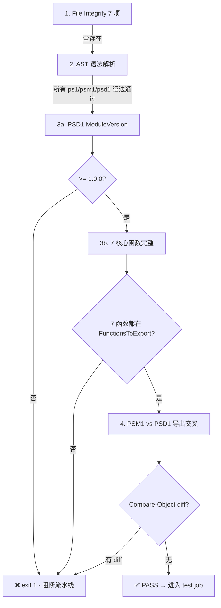

# Contributing Guide

> 本文档包含向 FinSightV9 贡献代码所需的所有规范。新成员请在第一次提交前完整阅读一遍。
>
> Last updated: 2026-08-09

---

## 目录

1. [项目结构概览](#1-项目结构概览)
2. [提交流程](#2-提交流程)
3. [PathTrace 模块专项](#3-pathtrace-模块专项)
   - [3.1 本地预检脚本 (push 前必须运行)](#31-本地预检脚本-push-前必须运行)
   - [3.2 版本号规范 (ModuleVersion >= 1.0.0)](#32-版本号规范-moduleversion--100)
   - [3.3 导出一致性规范](#33-导出一致性规范)
   - [3.4 推荐安装 Git pre-push Hook](#34-推荐安装-git-pre-push-hook)
4. [CI/CD 规范：PathTrace 流水线](#4-cicd-规范pathtrace-流水线)
   - [4.1 触发方式](#41-触发方式)
   - [4.2 validate Job 校验逻辑](#42-validate-job-校验逻辑)
   - [4.3 错误消息与修复对照表](#43-错误消息与修复对照表)
   - [4.4 Downstream Job 阻断规则](#44-downstream-job-阻断规则)
   - [4.5 流水线失败回滚 SOP](#45-流水线失败回滚-sop)
5. [本地提交前自检 (复制可用)](#5-本地提交前自检-复制可用)
6. [推荐提交流程](#6-推荐提交流程)

---

## 1. 项目结构概览

```
FinSightV9/
├── scripts/
│   ├── PathTrace.psm1                       # PathTrace 核心模块 (7 函数)
│   ├── PathTrace.psd1                       # PowerShell 模块清单
│   ├── PathTrace-README.md                  # PathTrace README
│   ├── PathTrace-Usage.md                   # 使用文档
│   ├── deploy-pathtrace-module.ps1          # 一键部署脚本
│   ├── test-pathtrace-global.ps1            # 16 项自动化测试
│   ├── pre-push-pathtrace-check.ps1         # ★ push 前本地预检 (本文重点)
│   ├── windows-deploy-verify.ps1            # Windows 部署验证
│   └── ...
├── .github/workflows/
│   ├── pathtrace-ci.yml                     # ★ PathTrace CI/CD 工作流
│   └── ci.yml                                # 主 CI/CD 工作流
├── docs/
│   └── guides/how-to/
│       ├── pathtrace-github-actions-deploy-guide.md
│       └── pathtrace-deployment-guide.md
└── src/  (frontend)
└── python/  (backend services)
```

---

## 2. 提交流程

所有提交遵循以下顺序：

```
1. 修改代码
2. 本地预检（项目有专项脚本，见下文 §3）
3. 提交: git commit -m "type(scope): message"  (Conventional Commits)
4. push 分支
5. 等待 CI Actions 全部 PASS
6. 合并或打 tag 发布
```

---

## 3. PathTrace 模块专项

> **若你修改了以下任何文件，本节内容 *必须* 完整执行：**
>
> - `scripts/PathTrace.ps*`
> - `scripts/deploy-pathtrace-module.ps1`
> - `scripts/test-pathtrace-global.ps1`
> - `.github/workflows/pathtrace-ci.yml`

### 3.1 本地预检脚本 (push 前必须运行)

**脚本**: [pre-push-pathtrace-check.ps1](file:///D:/FinSightV9/scripts/pre-push-pathtrace-check.ps1)

```powershell
# 完整预检 (7 项检查，推荐)
.\scripts\pre-push-pathtrace-check.ps1

# 跳过语法解析 (超高速，仅版本/导出门控)
.\scripts\pre-push-pathtrace-check.ps1 -SkipSyntax

# 追加运行 16 项测试套件 (慢，但最完整)
.\scripts\pre-push-pathtrace-check.ps1 -RunTests
```

检查项：

| 序号 | 检查项 | 通过条件 | 对应流水线 Job |
|------|--------|---------|---------------|
| 1 | 文件完整性 | 7 个必需文件全部存在 | validate step 1 |
| 2 | ModuleVersion 门控 | `>= 1.0.0` | validate step 3 |
| 3 | 7 核心函数声明 | FunctionsToExport 数组全包含 | validate step 3 |
| 4 | psm1/psd1 导出交叉 | 列表 Compare-Object diff = 0 | validate step 4 |
| 5 | PS AST 语法解析 | Parser::ParseFile 无 errors | validate step 2 |
| 6 | 流水线阻断模拟 | validate=FAIL 时下游 SKIPPED 逻辑 | 快速了解 CI 行为 |
| 7 | 测试套件 (可选) | exit 0 | test job (3 × matrix) |

**场景 A (正常)**：15 PASS / 0 FAIL → exit 0 → 可以安全 push

**场景 B (注入 2 个错误)**：
- 把 ModuleVersion 改成 `0.9.0` → FAIL：`ModuleVersion 0.9.0 >= 1.0.0`
- 删除 FunctionsToExport 中的 `Find-PythonExe`
  - FAIL：`All 7 core functions declared (missing: Find-PythonExe)`
  - FAIL：`Export lists match (diff: <=Find-PythonExe)`
- 12 PASS / 3 FAIL → **exit 1 → push 被阻断**
- 流水线模拟段正确输出：
  - validate job: **FAIL**
  - test job: **will SKIP**（对应 Actions UI ⏭️）
  - release job: **will SKIP**（对应 Actions UI ⏭️）
  - GH Release: **WILL NOT be created - protects existing assets** ✅

### 3.2 版本号规范 (ModuleVersion >= 1.0.0)

- PSD1 中的 `ModuleVersion` 必须为 **语义化版本 `'X.Y.Z'`（X>=1）**。
- 每次发布时，同步升级 PSD1 + 打 git tag `vX.Y.Z`，**保持两者完全一致**。
- 不允许出现 `0.0.x` / `0.x.y` 版本号，否则 validate 直接阻断。

正确：
```powershell
ModuleVersion = '1.1.0'   # 或更高
```

错误（必被阻断）：
```powershell
ModuleVersion = '0.9.0'
ModuleVersion = '0.0.1'
```

### 3.3 导出一致性规范

添加新函数时 **必须同时修改 3 处**，否则预检 FAIL：

| # | 文件 | 变更 |
|---|------|------|
| 1 | `scripts/PathTrace.psm1` | 函数实现 + 在 `Export-ModuleMember -Function a, b, c, NewFunction` 列表中加入 |
| 2 | `scripts/PathTrace.psd1` | `FunctionsToExport = @(...)` 数组中加入 |
| 3 | `scripts/pre-push-pathtrace-check.ps1` `$requiredFuncs` | 如果是 7 核心之一（对外使用），需加入 §3 检查数组 |

### 3.4 推荐安装 Git pre-push Hook

```powershell
# 安装为 Git pre-push 钩子。push PathTrace 相关文件时自动运行预检：
.\scripts\pre-push-pathtrace-check.ps1 -InstallHook

# 卸载：
.\scripts\pre-push-pathtrace-check.ps1 -UninstallHook
```

钩子行为：
- push 路径匹配 `scripts/PathTrace* | scripts/deploy-pathtrace* | scripts/test-pathtrace* | .github/workflows/pathtrace*` → 自动运行 pre-check
- pre-check exit 非 0 → push 被终止，给出修复提示
- 不匹配 → 快速跳过（对其他路径零影响）
- 紧急绕过（不推荐）：`git push --no-verify`

---

## 4. CI/CD 规范：PathTrace 流水线

**工作流**: [pathtrace-ci.yml](file:///D:/FinSightV9/.github/workflows/pathtrace-ci.yml)

### 4.1 触发方式

| 触发 | 说明 |
|------|------|
| push `main/develop/feat/**/fix/**` | 仅 PathTrace 路径变更时 |
| push tag `v*` | 触发完整 validate → test → release 链路 |
| PR 到 `main/develop` | 同 push（pre-merge 校验） |
| `workflow_dispatch` | UI 手动触发，可选 `version` 覆盖 / `create_release` 强制 |

### 4.2 validate Job 校验逻辑



### 4.3 错误消息与修复对照表

| 步骤 | 红色错误消息 | 根因 | 修复方案 |
|------|-------------|------|---------|
| 1 | `Missing required files: scripts/PathTrace.psm1` | 漏提交文件 | `git add` 缺失文件 → commit 重试 |
| 2 | `Syntax check FAILED: PathTrace.psm1: ...` | PS 语法错误 | 本地用 Parser::ParseFile 复现 → 修正 |
| 3a | `ModuleVersion 0.9.0 is < 1.0.0` | PSD1 版本号误填 | 改 `scripts/PathTrace.psd1` → `ModuleVersion = '1.X.Y'` |
| 3b | `Functions NOT declared in FunctionsToExport: Find-PythonExe` | FunctionsToExport 数组缺条目 | 在 PSD1 中补齐 |
| 4 | `Export mismatch: <=Find-PythonExe` | PSM1 导出和 PSD1 声明不同步 | 同步修改两处（上文 §3.3） |
| 超时 | `The job ... has exceeded the maximum execution time of 10 minutes` | Runner 网络/解析卡住 | Actions → Re-run failed jobs（偶发网络通常第二次 OK） |
| Runner 不可用 | `Unable to reach actions runner` | Runner 服务中断 | 等待恢复，或切 runner 标签 |

### 4.4 Downstream Job 阻断规则

GitHub Actions `needs:` 原生语义：**上游 job 失败，下游 job 自动 SKIPPED**，除非显式 `if: always()`。本流水线 release job 没有 `if: always()`，保证任何失败不会错误发布：

```
validate FAIL (exit ≠ 0 或 timeout)
  └─► test job:     needs: validate         → ⏭️ SKIPPED
  └─► release job:  needs: [validate, test] → ⏭️ SKIPPED
  └─► GitHub Release: 不会被创建，现有 Release 资产不变
```

本地验证：§3.1 场景 B 中 "Pipeline failure propagation simulation" 段正确模拟了此逻辑。

### 4.5 流水线失败回滚 SOP

| 场景 | SOP |
|------|-----|
| **ModuleVersion 写错 (被阻断)** | 改 PSD1 `ModuleVersion` → 本地 `Test-ModuleManifest` 确认 → 提交 → 重新 push |
| **tag 打错 (如 v1.0.0 → v1.1.0)，Release 未创建** | 本地删 `git tag -d v1.0.0`，远端删 `git push origin :refs/tags/v1.0.0` → 打正确 tag → 重新 push tag |
| **Release 已创建但包错误** | Releases → Delete / 标记 prerelease → 打补丁 tag vX.Y.Z+1 重发 |
| **validate 超时** | Actions → Re-run all jobs（Runner 偶发网络通常第二次 OK） |
| **release job 上传资产失败** | dispatch 重新跑 `create_release=true` version=X.Y.Z，或 UI Edit Release 拖 zip |

---

## 5. 本地提交前自检 (复制可用)

在 push PathTrace 前复制运行此 3 段：

```powershell
# ① PSD1 版本号 + 7 核心函数完整
$manifest = Test-ModuleManifest -Path scripts/PathTrace.psd1
if ([version]$manifest.Version -lt [version]'1.0.0') {
    throw "PRE-CHECK FAIL: ModuleVersion $($manifest.Version) < 1.0.0"
}
$required = @('Write-PathTrace','Test-PathChain','Find-PythonExe',
              'Enable-PathTraceLog','Disable-PathTraceLog',
              'Enable-PathTraceDebug','Disable-PathTraceDebug')
$missing = $required | Where-Object { $_ -notin $manifest.ExportedFunctions.Keys }
if ($missing) { throw "PRE-CHECK FAIL: missing in FunctionsToExport: $($missing -join ',')" }

# ② PSM1 / PSD1 导出一致性
$psm1Funcs = ((Get-Content scripts/PathTrace.psm1 -Raw |
    Select-String -Pattern 'Export-ModuleMember\s+-Function\s+(.+)').Matches.Groups[1].Value -split ','
  ).Trim() | Sort-Object
$psd1Funcs = @($manifest.ExportedFunctions.Keys) | Sort-Object
if (Compare-Object $psm1Funcs $psd1Funcs) {
    throw "PRE-CHECK FAIL: export mismatch"
}

# ③ 一键完整预检
.\scripts\pre-push-pathtrace-check.ps1
```

---

## 6. 推荐提交流程

```
# Step 1: 改代码
vim scripts/PathTrace.psm1
vim scripts/PathTrace.psd1     # 改版本号 / 导出声明

# Step 2: 本地预检（推荐已装 hook，自动在 push 时跑）
.\scripts\pre-push-pathtrace-check.ps1
# → 15/15 PASS

# Step 3: commit
git add scripts/PathTrace.psm1 scripts/PathTrace.psd1
git commit --only scripts/PathTrace.psm1 scripts/PathTrace.psd1 -m "feat(scripts): PathTrace add XYZ, bump to v1.2.0"

# Step 4: push 分支 → 让 CI 跑 validate + test
git push origin develop
# → 浏览器看 Actions：validate PASS, test (3 × matrix) PASS ✓

# Step 5: 打 tag 发布（仅在分支 PASS 之后）
git tag v1.2.0
git push origin v1.2.0
# → release job 开始，打包 zip + 创建 Release ✓
```

**关键原则**：先 push 分支确认 validate/test 通过 → 再 push tag。避免 tag 指向会失败的 commit。

---

## 7. 其他资源

- [PathTrace README](file:///D:/FinSightV9/scripts/PathTrace-README.md)
- [PathTrace Usage Doc](file:///D:/FinSightV9/scripts/PathTrace-Usage.md)
- [GitHub Actions Deploy Guide](file:///D:/FinSightV9/docs/guides/how-to/pathtrace-github-actions-deploy-guide.md)
- [Deployment & Config Guide](file:///D:/FinSightV9/docs/guides/how-to/pathtrace-deployment-guide.md)
- [Workflow File](file:///D:/FinSightV9/.github/workflows/pathtrace-ci.yml)
