# Mermaid 流程图集 — DEPLOY-OPS-MANUAL.md 故障排查与回滚

> **用途**: 将 `DEPLOY-OPS-MANUAL.md` 中的 ASCII 流程图转换为 Mermaid 代码,
> 方便插入 Markdown 文档 / Notion / Confluence 等支持 Mermaid 渲染的平台.
>
> **对应手册章节**: §8 常见问题排查 / §9 回滚策略

---

## §8.0 故障排查总览流程图

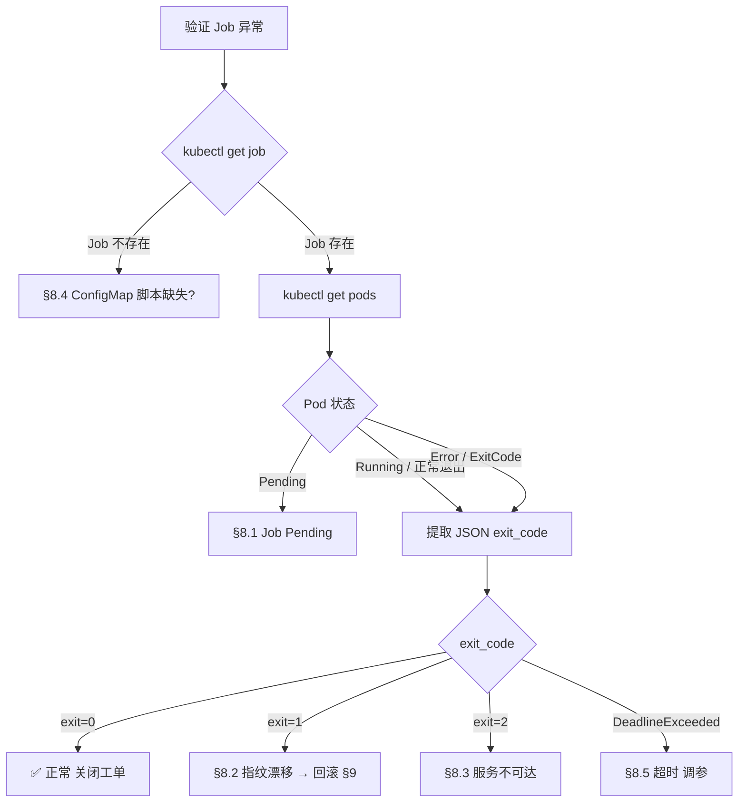

---

## §8.1 Job 一直 Pending

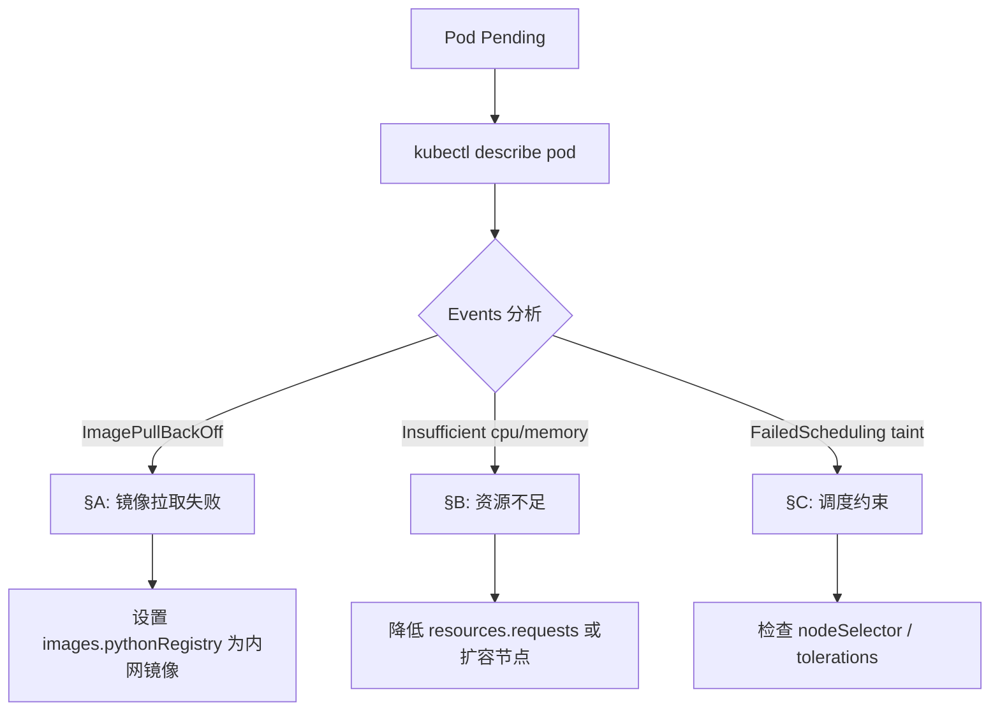

---

## §8.2 Check 2 指纹漂移

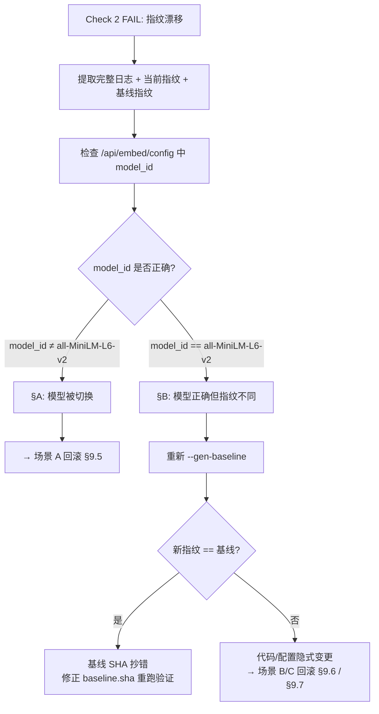

---

## §8.3 服务不可达 (exit code 2)

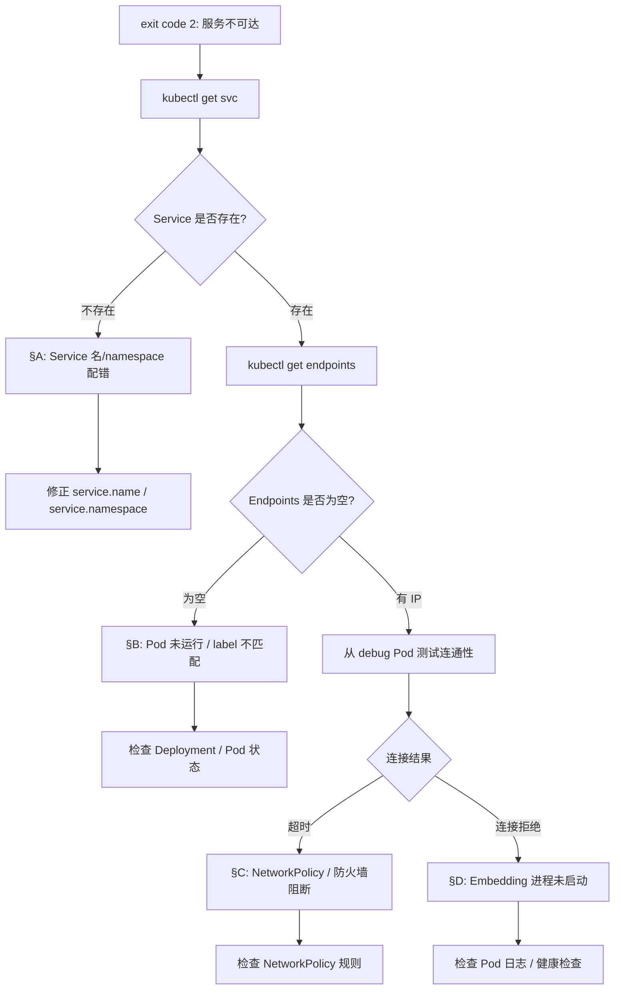

---

## §8.4 ConfigMap 脚本缺失

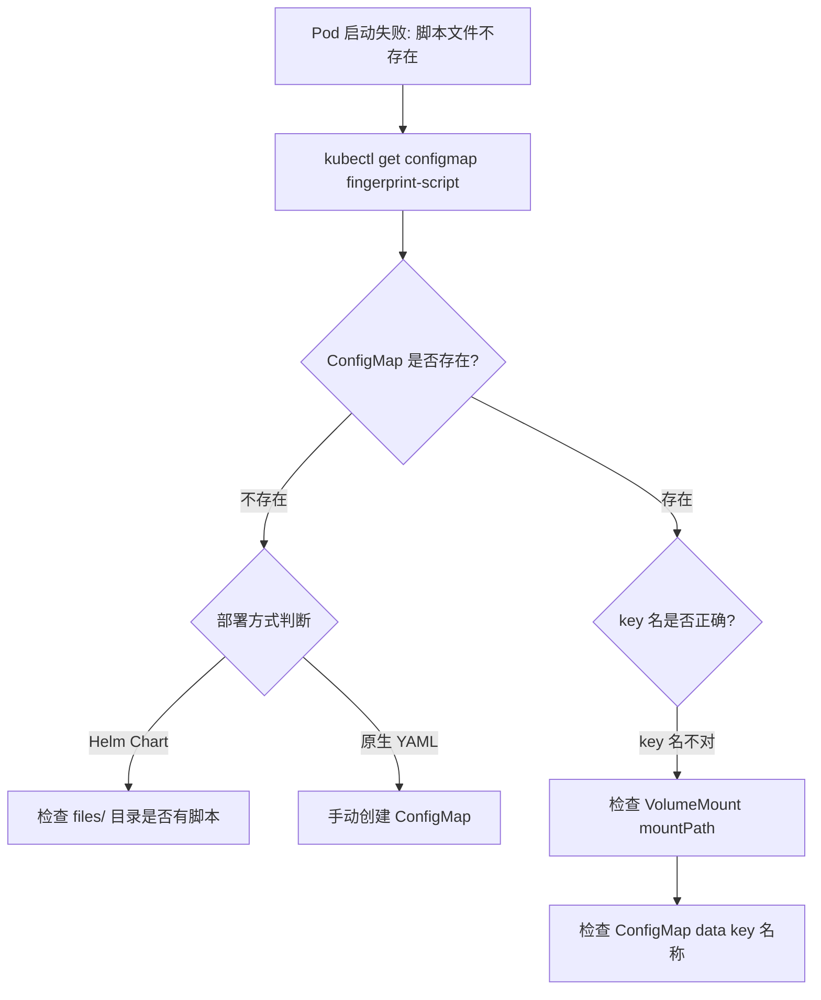

---

## §8.5 Job 超时 (activeDeadlineSeconds)

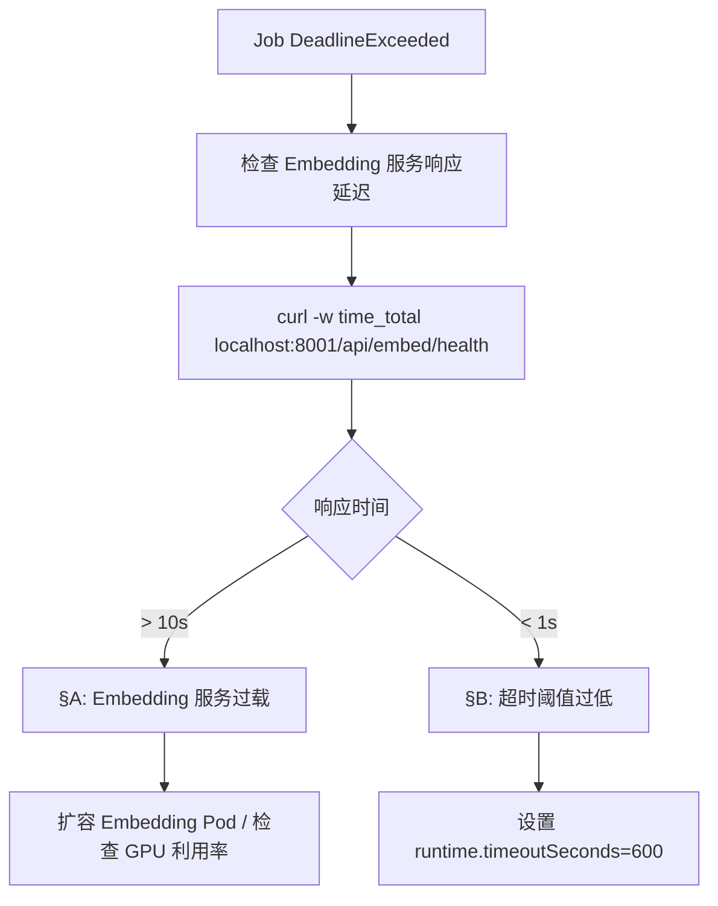

---

## §9.0 E2E 验证报告部署决策矩阵

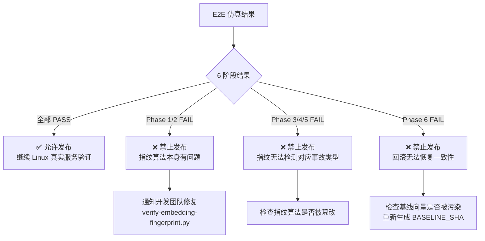

---

## §9.1 指纹验证失败后的回滚总流程

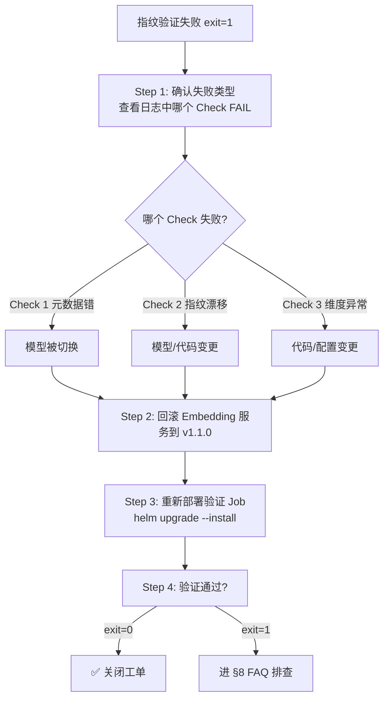

---

## §9.5 场景 A: 模型切换事故回滚

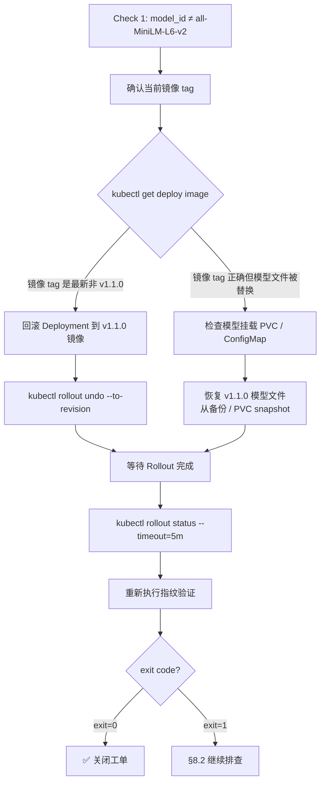

---

## §9.6 场景 B: 维度漂移事故回滚

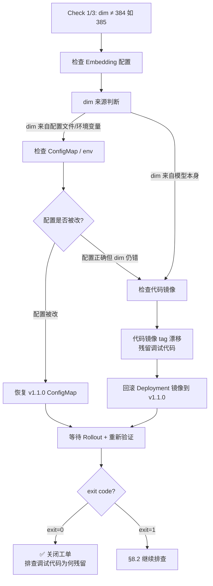

---

## §9.7 场景 C: 精度丢失事故回滚

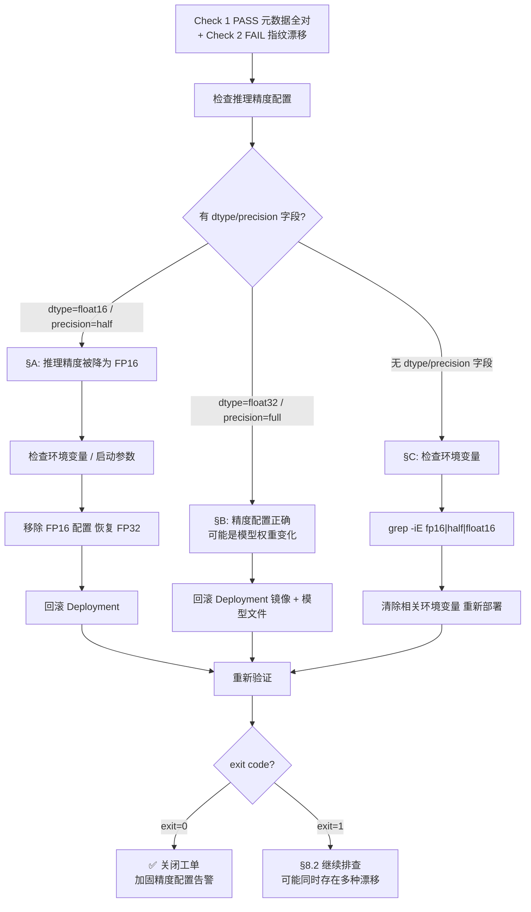

---

## 使用说明

1. **GitHub / GitLab**: 直接将上述 ` ```mermaid ` 代码块粘贴到 Markdown 文件中, 平台原生渲染.
2. **Notion**: 粘贴 Mermaid 代码到 `/mermaid` 块中.
3. **Confluence**: 安装 Mermaid Charts 插件后插入宏.
4. **VS Code**: 安装 Markdown Preview Mermaid Support 插件, 预览 Markdown 即可渲染.
5. **独立导出**: 将代码粘贴到 [mermaid.live](https://mermaid.live) 在线编辑器, 导出 SVG/PNG.
