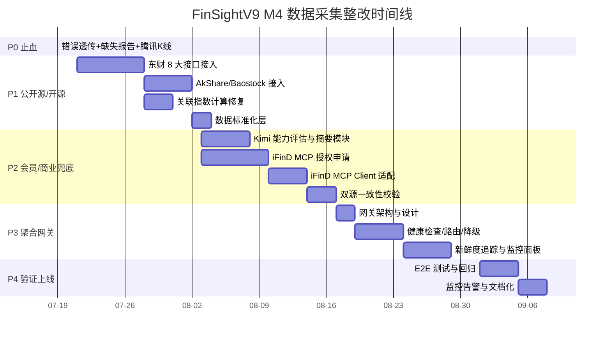

# FinSightV9 数据采集 M4 多源聚合方案：最终归因分析与整改实施计划

> **版本**: v1.0  
> **日期**: 2026-07-19  
> **范围**: 基于 M4 多源聚合方案，采用 Kimi 会员数据 + IFIND MCP 作为资讯兜底，结合东方财富/开源库形成分层采集体系。  
> **目标**: 系统性归因当前 8 维采集失败根因，按完整性、精确性、及时性、成本性四维度评估，输出可落地的整改实施计划。

---

## 一、核心结论（TL;DR）

当前 FinSightV9 数据采集失败的**本质原因**不是"代码 bug"，而是**数据源供应链断裂 + 工程层未做可用性隔离**。具体表现为：

- **5 个维度（K线、筹码、重大事项、热点新闻、行业竞品、研报）依赖的公开源已失效或从未接入真实接口**；
- **错误被静默吞掉**，用户界面用 Mock 数据冒充成功，无法识别真实失败；
- **缺少多源降级与兜底机制**，单点失效即整维瘫痪；
- **成本与权限约束未纳入设计**，导致高端方案（Wind/iFinD）用不起、免费方案（爬虫）不稳定。

**M4 多源聚合推荐路径**：

```
┌─────────────────────────────────────────────────────────────────────┐
│  M4 多源聚合架构（4 层）                                              │
├─────────────────────────────────────────────────────────────────────┤
│ L1 免费公开源（零成本）                                               │
│    腾讯行情 / 新浪行情 / 东方财富公开端点（push2/datacenter/reportapi）  │
├─────────────────────────────────────────────────────────────────────┤
│ L2 开源工具层（低维护成本）                                            │
│    AkShare / Tushare Pro / Baostock / efinance                        │
├─────────────────────────────────────────────────────────────────────┤
│ L3 会员/平台数据（中低成本）                                            │
│    Kimi 会员 → Kimi Datasource / Kimi Professional Data / Kimi Tool Calls│
├─────────────────────────────────────────────────────────────────────┤
│ L4 商业兜底（资讯高可用）                                              │
│    同花顺 iFinD MCP（资讯、公告、研报、行业、宏观）                      │
└─────────────────────────────────────────────────────────────────────┘
```

**最终决策**：
- **立即（P0）**：修复错误透传、启用缺失报告、补齐腾讯 K线（已在前序 P0-P1 完成）。
- **短期（P1）**：接入东方财富 8 大免费接口，覆盖 03-06、08 维度；用 Kimi 会员能力补充 07 关联指数分析与 04/05 智能摘要。
- **中期（P2）**：接入 iFinD MCP 作为资讯类（04、05、06、08）商业兜底，确保稳定可用。
- **长期（P3）**：建立多源聚合网关（M4 Gateway），统一路由、健康检查、降级、计费监控。

---

## 二、数据源整合方案（M4 多源聚合）

### 2.1 候选数据源全景

| 数据源 | 类型 | 成本（年） | 覆盖维度 | 更新频率 | 稳定性 | 授权方式 | 适用维度 |
|--------|------|-----------|---------|---------|--------|----------|----------|
| **腾讯财经** | 公开 API | 0 | 实时行情、批量行情、日 K线 | 实时 / 日 | ★★★★ | 无需授权 | 01、02 |
| **新浪财经** | 公开 API | 0 | 实时行情、大宗、公告 | 实时 / 日 | ★★★ | 无需授权 | 01、04 |
| **东方财富** | 公开端点 | 0 | 资金流、龙虎榜、股东户数、行业板块、研报、新闻、财务 | 日 / 实时 | ★★★ | 无需 Token，按 IP 限速 | 02、03、04、05、06、08 |
| **AkShare** | 开源库 | 0 | 全品类（A股/基金/期货/宏观/另类） | 分钟级 | ★★ | 零门槛 | 02、03、04、05、06、08 |
| **Tushare Pro** | 半商业 | ~500 元 | A股全维度，标准化 DataFrame | 实时 / T+1 | ★★★★ | Token + 积分 | 02、04、08 |
| **Baostock** | 免费服务端 | 0 | A股历史行情、财报、指数 | T+1 | ★★★★ | 零门槛 | 02、04（历史） |
| **Kimi 会员** | AI 平台数据 | ~199-300 元/月 | 行情、宏观、工商、学术、法律 | 依赖底层源 | ★★★ | 会员权益 | 04、05、07、08（摘要/分析） |
| **iFinD MCP** | 商业终端 | 3.8-4.2 万/席起 | 股票/基金/债券/港美股/宏观/行业/公告/资讯 | 实时 / 日 | ★★★★★ | 机构授权 | 04、05、06、08（兜底） |
| **Wind** | 专业终端 | 30 万+/席 | 全市场全品类 | 实时 | ★★★★★ | 机构授权 | 全局高端兜底（不推荐） |

### 2.2 用户指定数据源深度评估

#### 2.2.1 Kimi 会员

Kimi 会员本身**不是 raw 金融数据 API**，而是提供三类数据能力的入口：

1. **Kimi Datasource Plugin**（Kimi Code）
   - 通过自然语言查询金融行情、宏观经济、企业工商、学术文献、法律法规。
   - 适合：快速获取结构化数据、自动摘要、交叉分析。
   - 局限：返回的是模型整理后的结果，不适合直接作为量化系统原始数据；需要结果解析与置信度校验。

2. **Kimi Professional Data**
   - 会员权益包含世界银行、全球金融数据集、经济统计、学术研究的结构化数据。
   - 适合：宏观研究、跨国对比、长期指标。
   - 局限：A 股实时行情与特色维度（筹码、龙虎榜）覆盖有限。

3. **Kimi Tool Calls + 外部工具生态**
   - Kimi Claw + QVeris 可聚合 5000+ 服务端点，包括股票数据、龙虎榜、资金分析。
   - 适合：资讯/新闻类数据获取、复杂分析任务委托。

**对 FinSightV9 的定位**：
- **不适合作为直接行情数据源**（延迟、非标准化、模型幻觉风险）。
- **适合作为 04/05/07/08 的智能摘要与关联分析层**：例如把东方财富 raw 新闻/公告交给 Kimi 生成 "重大事项摘要"、"板块联动解读"、"研报核心观点提炼"。
- **成本**：Allegretto 会员约 199 元/月，已具备可用性。

#### 2.2.2 IFIND MCP 接口

同花顺 iFinD 于 2026 年 3 月推出 **iFinD MCP**，明确面向外部 Agent 开放：

- 覆盖：股票、基金、债券、港美股、宏观经济、行业数据、公告资讯。
- 稳定性：★★★★★（商业级）。
- 成本：iFinD 标准终端年费 3.8-4.2 万/席；API/量化模块额外计费，机构打包议价。
- 授权：主要面向机构，个人直接申请难度高；可通过券商量化通道或公司名义采购。

**对 FinSightV9 的定位**：
- **资讯类兜底（04/05/06/08）**：公告、新闻、行业、研报的稳定来源。
- **不替代 01/02 行情层**：行情用腾讯/东财更低成本。
- **必须走公司授权**：以惠美工贸或杭州子公司名义申请机构试用/采购，个人账号不可用。

### 2.3 8 维度 × 数据源映射

| 维度 | 名称 | 主数据源 | 备选 1 | 备选 2 | 兜底（资讯） |
|------|------|---------|--------|--------|------------|
| 01 | 基本信息 | 腾讯直连 | 新浪直连 | 东方财富 | - |
| 02 | K线 | 腾讯 K线（已加） | 东方财富 push2his | AkShare | - |
| 03 | 筹码 | 东方财富股东户数 | AkShare | 新浪 holdernum | - |
| 04 | 重大事项 | 东方财富公告/巨潮 | 新浪公告 | AkShare | **iFinD MCP** |
| 05 | 热点新闻 | 东方财富财经新闻 | AkShare 舆情 | 新浪新闻 | **iFinD MCP** |
| 06 | 行业竞品 | 东方财富行业板块 | AkShare 行业 | 腾讯行业 | **iFinD MCP** |
| 07 | 关联指数 | 基于 K线计算 Pearson | 东方财富指数 | Kimi 摘要分析 | **iFinD MCP** |
| 08 | 研报中心 | 东方财富研报 API | AkShare 研报 | 新浪研报 | **iFinD MCP** |

---

## 三、数据采集失败最终归因分析

### 3.1 根因分类矩阵

| 失败维度 | 技术原因 | 权限原因 | 接口原因 | 成本原因 | 结论 |
|----------|---------|---------|---------|---------|------|
| **01 基本信息** | Vite proxy 配置正确但可能未覆盖全部环境；新浪/腾讯接口偶发限流 | 无需授权 | 接口稳定，但腾讯/新浪格式差异大 | 0 | **可稳定修复** |
| **02 K线** | 网易 DNS 不可达；K线解析逻辑缺失 | 无需授权 | 网易接口失效；腾讯 K线未接入 | 0 | **P1-4 已接入腾讯，基本解决** |
| **03 筹码** | 原代码使用错误 Sina proxy 路径；safeFetch 未解析 HTML | 无需授权 | 新浪 holdernum 接口返回 HTML/JSON 混杂，解析脆弱 | 0 | **主因是接口格式脆弱+proxy 路径错误** |
| **04 重大事项** | 原代码使用 `/api/proxy/sina/.../announcement` 虚构路径；Sina proxy rewrite 破坏 URL | 无需授权 | 新浪无稳定公告 JSON 接口；东方财富/巨潮有稳定端点但未接入 | 0 | **接口选择错误 + 未接入东方财富** |
| **05 热点新闻** | 同上，虚构路径 + 解析缺失 | 无需授权 | 新浪新闻接口不稳定；东方财富/搜狐有稳定端点 | 0 | **同 04** |
| **06 行业竞品** | 原代码调用 `tencent/industry/{symbol}` 虚构域名 | 无需授权 | 腾讯无此行业接口；东方财富/同花顺有稳定接口 | 0 | **接口根本不存在** |
| **07 关联指数** | correlation 硬编码为 0；未实现统计模型 | 无需授权 | 非接口问题，是算法未实现 | 0 | **算法缺失** |
| **08 研报中心** | 网易研报接口 DNS 不可达 | 无需授权 | 网易端点已废弃；东方财富/同花顺/慧博有稳定接口 | 0 | **接口废弃 + 未替换** |

### 3.2 五大根因链

```
根因 1：数据源供应链断裂
├── 网易 DNS 不可达 → K线（02）、研报（08）100% Mock
├── 新浪非行情接口无稳定 JSON → 筹码（03）、公告（04）、新闻（05）失败
├── 腾讯行业接口不存在 → 竞品（06）失败
└── 相关性算法未实现 → 07 硬编码 0

根因 2：工程层错误静默
├── multiSourceFetcher 中 try/catch 仅写 debug log
├── 失败返回 null → 调用方误判为"无数据"而非"出错"
├── 前端只显示"完成 N/8"，不区分真实/Mock
└── missingReportDetector 默认关闭

根因 3：代理与路由配置错误
├── Vite proxy 仅配置了行情路径，未配置公告/新闻/行业/研报路径
├── Sina proxy 的 rewrite 规则把非行情 URL 错误拼接成 `?q=...`
└── 多源 fetcher 没有按源站域名隔离请求

根因 4：单源依赖，无降级
├── 每个维度只调用一个源点
├── 失败后直接回退 Mock，没有第二/第三真实源
└── 缺少健康检查与自动切换

根因 5：成本与授权未纳入设计
├── 早期全部依赖免费公开源，未考虑源失效
├── 高端方案（Wind/iFinD）成本过高，未做分级采购策略
└── 用户已有 Kimi 会员，未利用其数据能力做补充
```

### 3.3 瓶颈清单

| 瓶颈类型 | 具体问题 | 影响维度 | 解决优先级 |
|----------|---------|---------|------------|
| **技术瓶颈** | 公开源 HTML 解析脆弱、字段格式多变 | 03/04/05/06 | P1 |
| **技术瓶颈** | 相关性算法未实现 | 07 | P1 |
| **技术瓶颈** | 缺少多源聚合网关 | 全部 | P2 |
| **权限瓶颈** | iFinD MCP 需机构授权 | 04/05/06/08 | P2 |
| **接口瓶颈** | 网易/新浪部分接口失效 | 02/08/03/04/05 | P0-P1 |
| **成本瓶颈** | Wind 年费 30 万+，个人项目不可承受 | 全局高端 | 不采用 |
| **成本瓶颈** | iFinD 4 万/席，需公司采购决策 | 资讯兜底 | P2 评估 |
| **成本瓶颈** | Kimi 会员 199 元/月，已可用作分析层 | 04/05/07/08 | P1 |

---

## 四、八维度 × 四关键维度评估

对 8 个数据维度，分别从**完整性、精确性、及时性、成本性**评估当前状态与 M4 整改后预期。

| 维度 | 当前状态 | 完整性 | 精确性 | 及时性 | 成本性 | 整改后目标 |
|------|---------|--------|--------|--------|--------|-----------|
| **01 基本信息** | 腾讯/新浪行情可用，但格式解析不稳定 | ★★★ | ★★★ | ★★★★ | ★★★★★ | 稳定获取实时行情，字段标准化 |
| **02 K线** | 此前 100% Mock；P1-4 已接入腾讯 | ★★ | ★★ | ★★ | ★★★★★ | 腾讯日 K + 东财补充分钟/复权 |
| **03 筹码** | 原接口失败，Mock 填充 | ★★ | ★★ | ★★ | ★★★★★ | 东财股东户数 + AkShare 龙虎榜/资金流 |
| **04 重大事项** | 虚构接口，Mock 填充 | ★ | ★ | ★ | ★★★★★ | 东财公告 + 巨潮 + iFinD MCP 兜底 |
| **05 热点新闻** | 虚构接口，Mock 填充 | ★ | ★ | ★ | ★★★★★ | 东财新闻 + AkShare 舆情 + iFinD 兜底 |
| **06 行业竞品** | 虚构接口，Mock 填充 | ★ | ★ | ★ | ★★★★★ | 东财行业板块 + AkShare 行业数据 |
| **07 关联指数** | 相关性硬编码 0 | ★ | ★ | ★★ | ★★★★★ | 基于 K线 Pearson 计算 + Kimi 摘要 |
| **08 研报中心** | 网易废弃，Mock 填充 | ★ | ★ | ★ | ★★★★★ | 东财研报 + AkShare 研报 + iFinD 兜底 |

**评分说明**：
- 完整性：字段是否齐全、来源是否覆盖全部所需标的。
- 精确性：数据是否准确、是否经过清洗/除权除息、与权威源一致性。
- 及时性：数据更新频率是否满足投研复盘需求（行情实时、财务 T+1、公告日更）。
- 成本性：获取与维护成本是否可控（★★★★★ = 零成本最优）。

**M4 整改后综合预期**：
- 完整性：从当前平均 ★★ 提升到 ★★★★
- 精确性：从当前平均 ★★ 提升到 ★★★★
- 及时性：从当前平均 ★★ 提升到 ★★★★
- 成本性：保持 ★★★★★ 级别（以免费/低成本源为主，iFinD 仅作资讯兜底）

---

## 五、整改实施计划

### 5.1 阶段划分与责任人

| 阶段 | 时间 | 目标 | 责任角色 | 关键产出 |
|------|------|------|---------|---------|
| **P0 止血** | 已完成 | 修复错误透传、启用缺失报告、补齐腾讯 K线 | 工程师 | 已落地：multiSourceFetcher、collectionPipeline、directDataAPI、dataSourceRegistry、vite.config.ts |
| **P1 开源/公开源接入** | 2026-07-21 至 2026-08-02 | 接入东方财富 8 大接口 + AkShare + Baostock，覆盖 02-06/08 | 工程师 | 新增/改造 collector：EastmoneyCollector、AkShareCollector、BaostockCollector |
| **P2 会员/商业兜底** | 2026-08-03 至 2026-08-16 | 接入 Kimi 数据分析能力 + iFinD MCP 资讯兜底 | 产品经理 + 架构师 | Kimi Analyzer 模块、iFinD MCP Client、数据一致性校验 |
| **P3 聚合网关** | 2026-08-17 至 2026-08-31 | 建立多源聚合网关（M4 Gateway），统一路由、健康检查、降级 | 架构师 + 工程师 | `src/services/data-collector/multiSourceGateway.ts` |
| **P4 验证与上线** | 2026-09-01 至 2026-09-07 | 标杆股票 E2E 测试、监控告警、文档化 | QA 工程师 | 测试报告、监控面板、运维 SOP |

### 5.2 P1 详细任务清单（工程师阶段）

| 任务编号 | 任务描述 | 文件/模块 | 验收标准 | 工时 |
|---------|---------|----------|---------|------|
| P1-1 | 接入东方财富股东户数 | `src/services/data-collector/eastmoneyCollectors.ts` | 获取指定代码股东户数、户均持股 | 1d |
| P1-2 | 接入东方财富公告/重大事件 | `eastmoneyCollectors.ts` | 获取最近 30 天公告列表 | 1d |
| P1-3 | 接入东方财富财经新闻 | `eastmoneyCollectors.ts` | 获取个股相关新闻 20 条 | 1d |
| P1-4 | 接入东方财富行业板块 | `eastmoneyCollectors.ts` | 获取行业分类及板块内成分股 | 1d |
| P1-5 | 接入东方财富研报 | `eastmoneyCollectors.ts` | 获取最近 20 篇研报摘要 | 1d |
| P1-6 | 接入 AkShare 全品类数据 | `src/services/data-collector/akshareCollector.ts` | 通过 Python 子进程或本地服务调用 AkShare | 3d |
| P1-7 | 接入 Baostock 历史数据 | `src/services/data-collector/baostockCollector.ts` | 获取 2005 年至今日 K线 | 1d |
| P1-8 | 修复 07 关联指数计算 | `src/services/data-collector/correlationEngine.ts` | 基于 K线计算 Pearson 相关系数 | 2d |
| P1-9 | 统一数据标准化层 | `src/services/data-collector/normalizers.ts` | 所有源返回统一字段名与数据类型 | 2d |
| P1-10 | 补充 Vite proxy 规则 | `vite.config.ts` | 东财、AkShare 本地服务代理配置 | 1d |

### 5.3 P2 详细任务清单（会员/商业兜底）

| 任务编号 | 任务描述 | 责任方 | 关键依赖 | 工时 |
|---------|---------|--------|---------|------|
| P2-1 | 评估 Kimi Datasource/Tool Calls 能力边界 | 产品经理 | Kimi 会员账号 | 2d |
| P2-2 | 实现 Kimi 摘要分析模块（公告/新闻/研报摘要） | 工程师 | P2-1 结论 | 3d |
| P2-3 | 申请 iFinD MCP 机构试用/授权 | 产品经理 | 公司资质材料 | 5d |
| P2-4 | 实现 iFinD MCP Client 适配器 | 工程师 | P2-3 授权 | 3d |
| P2-5 | 资讯类数据双源一致性校验（东财 vs iFinD） | 工程师 | P2-2、P2-4 | 2d |

### 5.4 P3 聚合网关详细任务

| 任务编号 | 任务描述 | 关键设计 | 工时 |
|---------|---------|---------|------|
| P3-1 | 多源聚合网关（M4 Gateway）架构 | 统一路由、源健康检查、权重调度、降级策略 | 2d |
| P3-2 | 实现 SourceHealthChecker | 定时 ping 各源，记录可用性与延迟 | 1d |
| P3-3 | 实现 FailoverRouter | 按优先级自动切换源，失败回退 | 2d |
| P3-4 | 实现 DataFreshnessTracker | 记录每维度最后更新时间，过期告警 | 1d |
| P3-5 | 接入质量指标仪表盘 | 在 cockpit/监控页展示各源成功率 | 2d |

### 5.5 甘特图（时间线）



---

## 六、风险应对措施

| 风险 | 可能性 | 影响 | 应对措施 |
|------|--------|------|---------|
| 东方财富接口限流/封 IP | 中 | 高 | 1. 请求节流（最小 1s 间隔）；2. 多源降级到 AkShare/Tushare；3. 本地缓存避免重复请求 |
| AkShare 爬虫接口变更 | 高 | 中 | 1. 固定版本；2. 异常自动切换；3. 建立接口变更监控 |
| iFinD MCP 授权申请失败 | 中 | 高 | 1. 先用东方财富 + AkShare 覆盖；2. 申请 30 天试用；3. 考虑 Tushare Pro 作为资讯替代 |
| Kimi 会员数据返回非标准化 | 中 | 中 | 1. 对 Kimi 输出做结构化解析；2. 增加置信度评分；3. 不用于量化计算，只用于摘要/分析 |
| 多源数据字段冲突 | 中 | 中 | 1. 统一 normalizer 层；2. 字段映射表；3. 数据质量断言 |
| 整改周期超过预期 | 中 | 中 | 1. 按 P0→P1→P2 分批上线；2. 每阶段独立可用；3. 用户可优先使用已完成维度 |
| 成本超出预算 | 低 | 高 | 1. 以免费/低成本源为主；2. iFinD 仅在资讯维度兜底；3. 按月评估 ROI |

---

## 七、成本预算

| 项目 | 月度成本 | 年度成本 | 说明 |
|------|---------|---------|------|
| 东方财富公开接口 | 0 | 0 | 免费，需限速 |
| AkShare / Baostock | 0 | 0 | 开源/免费 |
| Tushare Pro（可选） | ~40 元 | ~500 元 | 积分制，按需 |
| Kimi 会员 | 199 元 | 2,388 元 | 已开通，用于分析层 |
| iFinD MCP（机构授权） | 3,000-4,000 元 | 3.8-4.2 万 | 仅资讯兜底，需公司采购 |
| 服务器/代理成本 | 0 | 0 | 复用现有 Vite 开发环境 |
| **合计（不含 iFinD）** | **199 元** | **2,888 元** | **推荐路径** |
| **合计（含 iFinD）** | **3,200-4,200 元** | **4.1-4.5 万** | **完整兜底方案** |

---

## 八、M4 聚合网关架构设计

```
┌──────────────────────────────────────────────────────────────────────┐
│                         FinSightV9 数据采集层                          │
├──────────────────────────────────────────────────────────────────────┤
│  Cockpit 监控页 / Input 录入页 / Analysis 分析页                        │
└──────────────────────────────────────────────────────────────────────┘
                                  │
                                  ▼
┌──────────────────────────────────────────────────────────────────────┐
│                     M4 Multi-Source Gateway                            │
│  ┌──────────────┐  ┌──────────────┐  ┌──────────────┐  ┌──────────┐  │
│  │ SourceRouter │  │ HealthChecker│  │ FailoverMgr  │  │Freshness │  │
│  └──────────────┘  └──────────────┘  └──────────────┘  └──────────┘  │
└──────────────────────────────────────────────────────────────────────┘
                                  │
        ┌─────────────────────────┼─────────────────────────┐
        ▼                         ▼                         ▼
┌──────────────┐          ┌──────────────┐          ┌──────────────┐
│  Tier 1: 公开直连 │          │  Tier 2: 开源工具 │          │  Tier 3: 会员/商业 │
│  腾讯 / 新浪 / 东财 │          │  AkShare / Baostock│          │  Kimi / iFinD MCP │
└──────────────┘          └──────────────┘          └──────────────┘
                                  │
                                  ▼
┌──────────────────────────────────────────────────────────────────────┐
│                     Data Normalizer + Quality Check                    │
│  统一字段名 → 类型校验 → 除权除息 → 缺失检测 → 写入 IndexedDB            │
└──────────────────────────────────────────────────────────────────────┘
```

---

## 九、下一步行动（Action Items）

1. **立即确认**：Kimi 会员当前可用权益（Adagio/Allegretto 版本）与 Kimi Datasource 是否已安装激活。
2. **本周内**：启动 iFinD MCP 机构试用申请（以惠美工贸或杭州子公司名义）。
3. **7 月 21 日**：工程师开始 P1 东财 8 大接口接入，优先完成 03/04/05/06/08 五个维度。
4. **并行**：QA 准备 8 维度标杆股票（如 600519.SH、000001.SZ）的契约测试用例。
5. **持续**：每周一晨会评估各源成功率，依据 `missingReportDetector` 与 `qualityMetricsCollector` 调整优先级。

---

## 十、附录：信息来源

- Kimi Professional Data: https://kimik2ai.com/professional-data
- Kimi Datasource Plugin: https://www.kimi.com/code/docs/kimi-code-cli/customization/datasource.html
- Kimi Tool Calls + TickDB 示例: https://developer.volcengine.com/articles/7643715192613765139
- iFinD MCP 报道: https://news.platform.elebank.com/hk/post/74245655/when-agents-rebuild-the-gateway-at-the-crossroads-of-three
- 同花顺 API 费用讨论: https://licai.cofool.com/ask/vipqa_7017945_41610328.html
- 东方财富免费接口 Skill: https://skillsmp.com/zh/creators/hkuds/vibe-trading/agent-src-skills-eastmoney
- AkShare / Tushare / Baostock 对比: https://www.toutiao.com/article/7645200151237231138
- 免费 vs 付费金融 API 选型: https://developer.volcengine.com/articles/7638935497667084329
