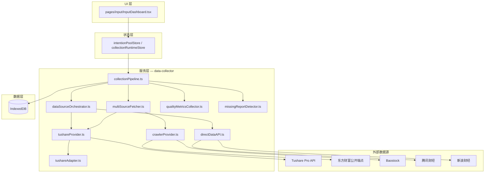
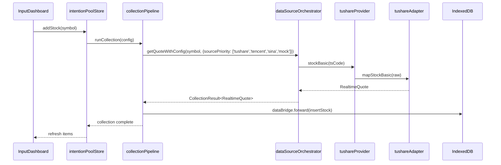
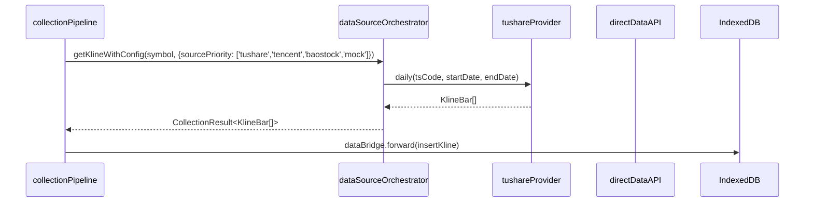
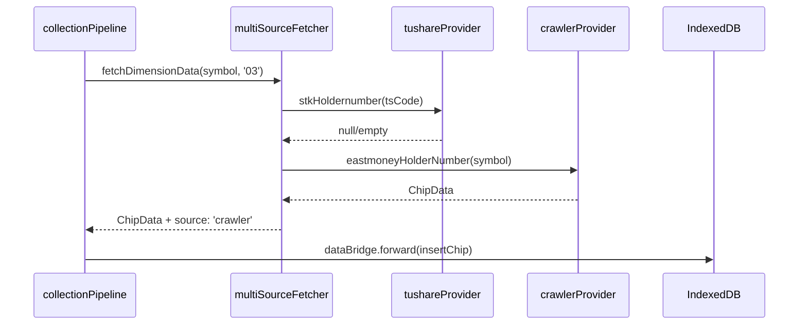

# FinSightV9 方案 B 架构设计：Tushare Pro + 爬虫补充接入层

## 总体架构



## 模块设计

| 文件 | 职责 | 类型 |
|------|------|------|
| `src/types/modules/collection.types.ts` | 扩展 `QuoteDataSourceId` 加入 `tushare` | 修改 |
| `src/config/dataSourceRegistry.ts` | 注册 Tushare 数据源元数据，配置默认优先级链 | 修改 |
| `src/config/marketDataEndpoints.ts` | 新增 `TUSHARE_API_BASE` 常量（默认指向 `/api/proxy/tushare`） | 修改 |
| `src/config/fetcherConfig.ts` | 新增 Tushare 配置读取（Token 不放在前端，由后端/代理持有） | 修改 |
| `src/services/data-collector/tushareProvider.ts` | 封装 Tushare HTTP 请求、Token 管理、错误分类 | 新增 |
| `src/services/data-collector/tushareAdapter.ts` | Tushare 字段 → 业务类型转换 | 新增 |
| `src/services/data-collector/crawlerProvider.ts` | 东财/Baostock 爬虫请求封装 | 新增 |
| `src/services/data-collector/dataSourceOrchestrator.ts` | 在 quote/kline 降级链中加入 `tushare` | 修改 |
| `src/services/data-collector/multiSourceFetcher.ts` | 维度 03-08 优先 Tushare，其次 crawler，最后 Mock | 修改 |
| `src/services/data-collector/collectionPipeline.ts` | 识别 `tushare` source 标签，失败登记缺失报告 | 修改 |
| `tests/tushareProvider.test.ts` | Tushare 请求/适配器单元测试 | 新增 |
| `tests/crawlerProvider.test.ts` | 爬虫层单元测试 | 新增 |

## 数据结构与接口

### 新增数据源枚举

```typescript
// src/types/modules/collection.types.ts
export type QuoteDataSourceId = 'tencent' | 'sina' | 'netease' | 'akshare' | 'tushare' | 'mock'
export type DataSourceType = 'akshare' | 'ifind' | 'tushare' | 'yahoo' | 'tianyancha' | 'scholar' | 'cache'
```

### Tushare 请求参数

```typescript
export interface TushareApiRequest {
  api_name: string
  token: string
  params: Record<string, string | number | string[]>
  fields?: string
}
```

### Tushare 通用响应

```typescript
export interface TushareApiResponse<T = Record<string, unknown>> {
  request_id: string
  code: number
  msg: string
  data: {
    fields: string[]
    items: unknown[]
  } | null
}
```

### 业务转换类型

转换后的字段与现有类型一致：
- `ChipData`（维度 03）
- `NewsItem`（维度 04/05）
- `CompetitorData`（维度 06）
- `IndexCorrelation`（维度 07）
- `ResearchReport`（维度 08）

## 时序图

### 01 基本信息采集



### 02 K 线采集



### 03 筹码采集（Tushare → 爬虫 → Mock）



## 任务列表

| 编号 | 任务 | 输出文件 | 依赖 | 工时 |
|------|------|---------|------|------|
| 1 | 扩展类型定义 | `src/types/modules/collection.types.ts` | 无 | 0.5h |
| 2 | 注册 Tushare 数据源 | `src/config/dataSourceRegistry.ts` | 1 | 0.5h |
| 3 | 新增 Tushare 端点常量 | `src/config/marketDataEndpoints.ts` | 1 | 0.5h |
| 4 | 实现 Tushare Provider | `src/services/data-collector/tushareProvider.ts` | 2,3 | 2h |
| 5 | 实现 Tushare Adapter | `src/services/data-collector/tushareAdapter.ts` | 4 | 1.5h |
| 6 | 实现爬虫 Provider | `src/services/data-collector/crawlerProvider.ts` | 2,3 | 2h |
| 7 | 改造行情/K线编排器 | `src/services/data-collector/dataSourceOrchestrator.ts` | 4,5,6 | 1.5h |
| 8 | 改造多源拉取器 | `src/services/data-collector/multiSourceFetcher.ts` | 5,6 | 2h |
| 9 | 更新采集流水线 | `src/services/data-collector/collectionPipeline.ts` | 7,8 | 1h |
| 10 | 编写测试 | `tests/tushareProvider.test.ts`, `tests/crawlerProvider.test.ts` | 4-9 | 2h |
| 11 | 运行门禁验证 | 全部门禁 | 10 | 1h |

**合计：约 14.5 小时**

## 依赖包

- 无新增 npm 包（使用原生 `fetch`）
- 可选 Python 依赖：
  - `akshare>=1.18.64`（已存在默认 venv）
  - `tushare>=1.4.0`（如用本地 Python 服务）

## 共享知识与约定

1. **Token 安全**：Tushare Token 不直接写前端，通过 Vite proxy 或后端 `/api/proxy/tushare` 持有
2. **缓存**：Tushare 结果按 symbol+api_name+trade_date 缓存，TTL 1 天
3. **字段命名**：Tushare 返回 snake_case，适配器统一转换为 camelCase
4. **错误分类**：
   - `TUSHARE_TOKEN_INVALID`：Token 问题
   - `TUSHARE_QUOTA_EXCEEDED`：积分不足
   - `TUSHARE_API_ERROR`：接口业务错误
   - `TUSHARE_NETWORK_ERROR`：网络超时
5. **爬虫节流**：东财请求间隔 ≥ 1.5s，失败 2 次后降级

## 待明确事项

1. Tushare Token 如何注入生产环境？（建议后端环境变量）
2. 是否启动本地 AkShare/Tushare Python 服务？
3. K线使用前复权还是后复权？（默认前复权）
