# DataBridge 数据链路全景分析报告

## 一、DataBridge 架构总览

### 1.1 核心定位

DataBridge 作为 V9 智能投研复盘系统的**统一数据桥接层**，承担四大核心职责：

| 职责 | 功能描述 | 关键文件 |
|------|---------|---------|
| **写操作入口** | `forward()` - ACL 校验 + 路由到 DB/Manager/Strategy | [databridge.ts](../src/core/databridge.ts) |
| **读操作入口** | `query()` - 缓存 + ACL 校验 + 审计日志 | [databridge.ts](../src/core/databridge.ts) |
| **频道订阅** | `subscribe()` - 跨模块通信机制 | [databridge.ts](../src/core/databridge.ts) |
| **降级重试** | `fallbackQueue` - ACL 拒绝时的市场数据重试机制 | [fallbackQueue.ts](../src/core/fallbackQueue.ts) |

### 1.2 模块拆分架构

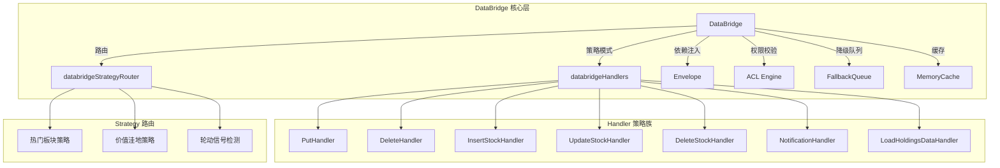
```mermaid
graph TB
    subgraph DataBridge 核心层
        DB[DataBridge] -->|策略模式| DH[databridgeHandlers]
        DB -->|路由| DS[databridgeStrategyRouter]
        DB -->|依赖注入| ENV[Envelope]
        DB -->|权限校验| ACL[ACL Engine]
        DB -->|降级队列| FB[FallbackQueue]
        DB -->|缓存| MC[MemoryCache]
    end
    
    subgraph Handler 策略族
        DH --> Put[PutHandler]
        DH --> Delete[DeleteHandler]
        DH --> InsertStock[InsertStockHandler]
        DH --> UpdateStock[UpdateStockHandler]
        DH --> DeleteStock[DeleteStockHandler]
        DH --> Notify[NotificationHandler]
        DH --> LoadHoldings[LoadHoldingsDataHandler]
    end
    
    subgraph Strategy 路由
        DS --> HotSector[热门板块策略]
        DS --> ValuePit[价值洼地策略]
        DS --> Rotation[轮动信号检测]
    end
```

### 1.3 三层路由架构

DataBridge.forward() 根据 action 类型分发到三个路由通道：

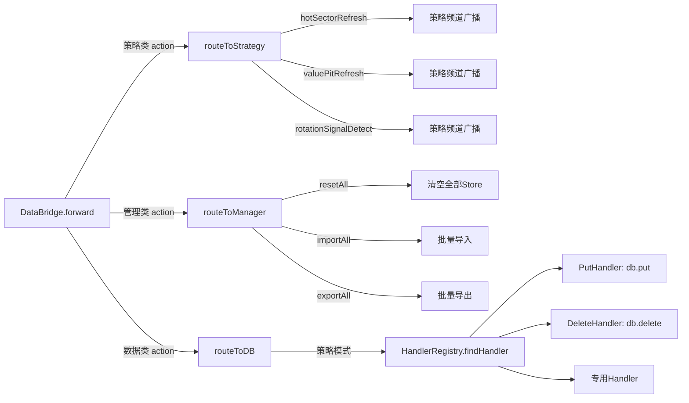
```mermaid
graph LR
    Forward[DataBridge.forward] -->|策略类 action| Strategy[routeToStrategy]
    Forward -->|管理类 action| Manager[routeToManager]
    Forward -->|数据类 action| DB[routeToDB]
    
    Strategy -->|hotSectorRefresh| HS[策略频道广播]
    Strategy -->|valuePitRefresh| VP[策略频道广播]
    Strategy -->|rotationSignalDetect| RS[策略频道广播]
    
    Manager -->|resetAll| Reset[清空全部Store]
    Manager -->|importAll| Import[批量导入]
    Manager -->|exportAll| Export[批量导出]
    
    DB -->|策略模式| Handler[HandlerRegistry.findHandler]
    Handler --> Put[PutHandler: db.put]
    Handler --> Delete[DeleteHandler: db.delete]
    Handler --> Special[专用Handler]
```

---

## 二、数据采集链路

### 2.1 采集流程全景

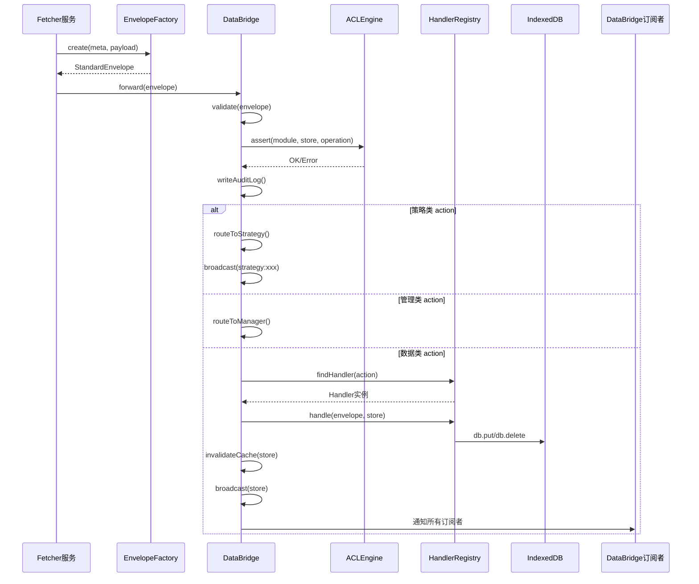
```mermaid
sequenceDiagram
    participant Fetcher as Fetcher服务
    participant Envelope as EnvelopeFactory
    participant DataBridge as DataBridge
    participant ACL as ACLEngine
    participant Handler as HandlerRegistry
    participant DB as IndexedDB
    participant Subscribers as DataBridge订阅者
    
    Fetcher->>Envelope: create(meta, payload)
    Envelope-->>Fetcher: StandardEnvelope
    
    Fetcher->>DataBridge: forward(envelope)
    DataBridge->>DataBridge: validate(envelope)
    
    DataBridge->>ACL: assert(module, store, operation)
    ACL-->>DataBridge: OK/Error
    
    DataBridge->>DataBridge: writeAuditLog()
    
    alt 策略类 action
        DataBridge->>DataBridge: routeToStrategy()
        DataBridge->>DataBridge: broadcast(strategy:xxx)
    else 管理类 action  
        DataBridge->>DataBridge: routeToManager()
    else 数据类 action
        DataBridge->>Handler: findHandler(action)
        Handler-->>DataBridge: Handler实例
        DataBridge->>Handler: handle(envelope, store)
        Handler->>DB: db.put/db.delete
        
        DataBridge->>DataBridge: invalidateCache(store)
        DataBridge->>DataBridge: broadcast(store)
        DataBridge->>Subscribers: 通知所有订阅者
    end
```

### 2.2 关键数据采集通道

| 数据类型 | EnvelopeAction | Store | Handler | 来源模块 |
|---------|---------------|-------|---------|---------|
| 股票基础数据 | `INSERT_STOCK` | stocks | InsertStockHandler | fetcher, stockpool |
| 每日行情 | `SAVE_DAILY_QUOTES` | daily_quotes | PutHandler | fetcher |
| 财务报告 | `SAVE_FINANCIAL_REPORT` | financial_reports | PutHandler | fetcher |
| 新闻资讯 | `SAVE_NEWS` | news | PutHandler | news |
| 舆情缓存 | `SAVE_SENTIMENT_CACHE` | sentiment_cache | PutHandler | news |

### 2.3 股票插入特殊处理

[InsertStockHandler](../src/core/databridgeHandlers.ts) 包含防御性校验：

```typescript
// stocks store 的 keyPath 为 'symbol'，缺失会导致 IndexedDB 报错
if (!stock.symbol || stock.symbol === '') {
  throw new EnvelopeError(`insertStock Rejected: missing or empty "symbol" field`)
}
```

### 2.4 股票删除级联处理

[DeleteStockHandler](../src/core/databridgeHandlers.ts) 执行三层级联删除：

```mermaid
graph TD
    DeleteStock[deleteStock: symbol] --> Step1[删除 stocks 主记录]
    
    Step1 --> Step2a[级联删除: v6Scores/dailyQuotes/hotSectorScores/valuePitScores]
    Step1 --> Step2b[级联删除: intelligentScores/scoreDocs/localDocs/newsStockMap]
    Step1 --> Step2c[级联删除: orders/signals/watchlists]
    
    Step2a -->|按主键 symbol| PK[db.delete(store, symbol)]
    Step2b -->|按索引 by-symbol| Index[db.getAllByIndex + db.delete]
    Step2c -->|全表扫描过滤| Scan[db.getAll + filter + db.delete]
```

---

## 三、数据聚合与分析链路

### 3.1 V6 评分引擎架构（L-1 ~ L8）

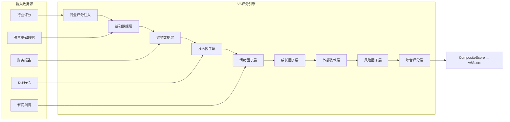
```mermaid
graph LR
    subgraph V6评分引擎
        L0[行业评分注入]
        L1[基础数据层]
        L2[财务数据层]
        L3[技术因子层]
        L4[情绪因子层]
        L5[成长因子层]
        L6[外部依赖层]
        L7[风险因子层]
        L8[综合评分层]
    end
    
    L0 --> L1
    L1 --> L2 --> L3 --> L4 --> L5 --> L6 --> L7 --> L8
    
    subgraph 输入数据源
        Stock[股票基础数据] --> L1
        Quotes[K线行情] --> L3
        Financial[财务报告] --> L2
        News[新闻舆情] --> L4
        Industry[行业评分] --> L0
    end
    
    L8 --> Output[CompositeScore → V6Score]
```

### 3.2 V6 评分执行流程

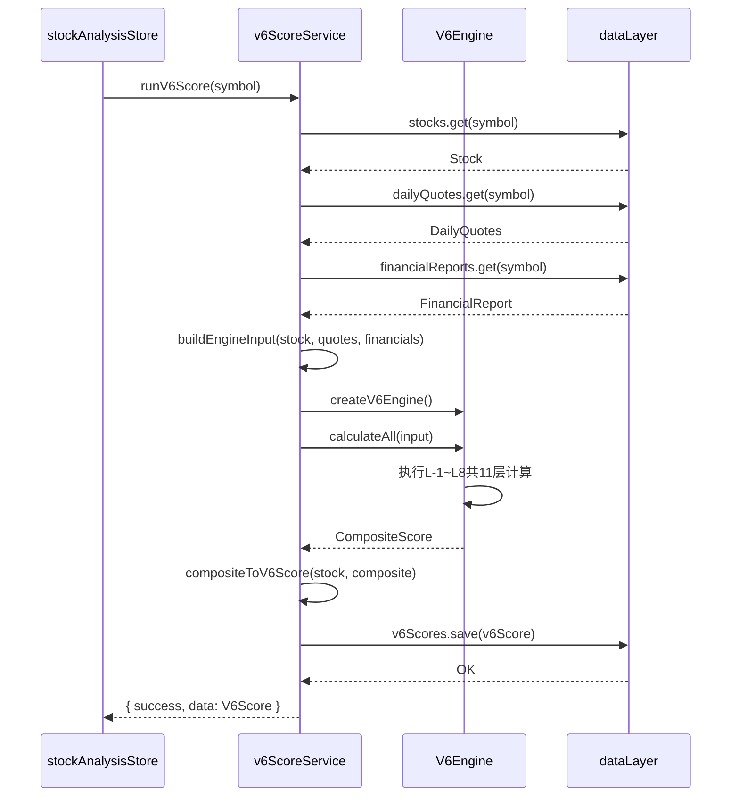
```mermaid
sequenceDiagram
    participant Store as stockAnalysisStore
    participant Service as v6ScoreService
    participant Engine as V6Engine
    participant DataLayer as dataLayer
    
    Store->>Service: runV6Score(symbol)
    Service->>DataLayer: stocks.get(symbol)
    DataLayer-->>Service: Stock
    
    Service->>DataLayer: dailyQuotes.get(symbol)
    DataLayer-->>Service: DailyQuotes
    
    Service->>DataLayer: financialReports.get(symbol)
    DataLayer-->>Service: FinancialReport
    
    Service->>Service: buildEngineInput(stock, quotes, financials)
    
    Service->>Engine: createV6Engine()
    Service->>Engine: calculateAll(input)
    Engine->>Engine: 执行L-1~L8共11层计算
    Engine-->>Service: CompositeScore
    
    Service->>Service: compositeToV6Score(stock, composite)
    
    Service->>DataLayer: v6Scores.save(v6Score)
    DataLayer-->>Service: OK
    
    Service-->>Store: { success, data: V6Score }
```

### 3.3 V6 评分质量保障

[v6ScoreService.ts](../src/services/scoring/v6ScoreService.ts) 包含完整的数据质量检查：

```typescript
// 数据完整度检查
const totalLayers = Object.keys(composite.layers).length
const scoredLayers = Object.values(composite.layers).filter((l) => l.score > 0).length
const dataCompleteness = totalLayers > 0 ? (scoredLayers / totalLayers) * 100 : 0

// 低于100%时添加质量警告
if (dataCompleteness < 100) {
  v6Score.qualityWarning = `数据完整度 ${dataCompleteness.toFixed(0)}%`
}
```

---

## 四、策略评分链路

### 4.1 三大策略引擎总览

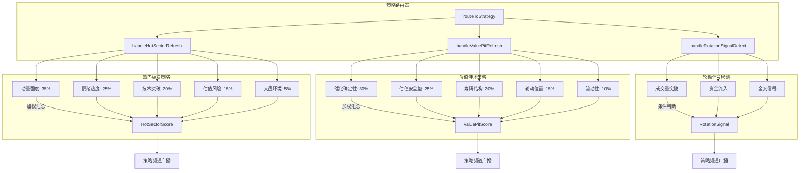
```mermaid
graph TB
    subgraph 策略路由器
        Route[routeToStrategy] --> HS[handleHotSectorRefresh]
        Route --> VP[handleValuePitRefresh]
        Route --> RS[handleRotationSignalDetect]
    end
    
    subgraph 热门板块策略
        HS --> Momentum[动量强度: 35%]
        HS --> Sentiment[情绪热度: 25%]
        HS --> Breakout[技术突破: 20%]
        HS --> Valuation[估值风险: 15%]
        HS --> MarketEnv[大盘环境: 5%]
        Momentum -->|加权汇总| HSScore[HotSectorScore]
        Sentiment --> HSScore
        Breakout --> HSScore
        Valuation --> HSScore
        MarketEnv --> HSScore
    end
    
    subgraph 价值洼地策略
        VP --> Catalyst[催化确定性: 30%]
        VP --> ValuationP[估值安全垫: 25%]
        VP --> Chip[筹码结构: 20%]
        VP --> RotationP[轮动位置: 15%]
        VP --> Liquidity[流动性: 10%]
        Catalyst -->|加权汇总| VPScore[ValuePitScore]
        ValuationP --> VPScore
        Chip --> VPScore
        RotationP --> VPScore
        Liquidity --> VPScore
    end
    
    subgraph 轮动信号检测
        RS --> Volume[成交量突破]
        RS --> Capital[资金流入]
        RS --> GoldenCross[金叉信号]
        Volume -->|条件判断| RSSignal[RotationSignal]
        Capital --> RSSignal
        GoldenCross --> RSSignal
    end
    
    HSScore --> Broadcast1[策略频道广播]
    VPScore --> Broadcast2[策略频道广播]
    RSSignal --> Broadcast3[策略频道广播]
```

### 4.2 热门板块五维评分详解

[hotSectorDimensions.ts](../src/services/scoring/hotSectorDimensions.ts) 实现了纯函数评分逻辑：

| 维度 | 权重 | 输入指标 | 评分范围 |
|------|------|---------|---------|
| 动量强度 | 35% | 板块强度分、涨跌幅排名、量比、资金流入天数、RS值 | 0-5 |
| 情绪热度 | 25% | 舆情排名、散户情绪、机构买入家数、涨停板数量 | 0-5 |
| 技术突破 | 20% | 突破形态、RSI信号、均线排列 | 0-5 |
| 估值风险 | 15% | PE、PB分位、市值、股息率 | 0-5 |
| 大盘环境 | 5% | 大盘趋势、系统性风险等级 | 0-5 |

**综合评分公式**：
```
overallScore = momentum * 0.35 + sentiment * 0.25 + breakout * 0.20 + valuation * 0.15 + marketEnv * 0.05
```

**行动建议阈值**：
- `immediate`：评分 ≥ 4.0（立即行动）
- `probe`：评分 ≥ 2.5（试探建仓）
- `ignore`：评分 < 2.5（忽略）

### 4.3 价值洼地五维评分详解

[valuePitAnalyzer.ts](../src/services/scoring/valuePitAnalyzer.ts) 实现了价值洼地策略的五维评分：

| 维度 | 权重 | 输入指标 | 评分逻辑 |
|------|------|---------|---------|
| 催化确定性 | 30% | 政策催化、周期拐点、技术突破、订单爆发 | 取四类信号最大值，双确认加分 |
| 估值安全垫 | 25% | PE/PB分位、股息率、PEG值 | PE/PB分位映射，股息率/PEG调整 |
| 筹码结构 | 20% | 北向资金变化、基金持仓变化、股东户数变化 | 资金增持加分，筹码集中加分 |
| 轮动位置 | 15% | 板块成交量分位、资金流入强度、金叉信号 | 底部区域高分，金叉加分 |
| 流动性 | 10% | 日均成交额、换手率、市值规模 | 成交额映射，换手率/市值调整 |

**综合评分公式**：
```
overallScore = catalyst * 0.30 + valuationMargin * 0.25 + chipStructure * 0.20 + rotationPosition * 0.15 + liquidity * 0.10
```

**行动建议阈值**（与热门板块不同）：
- `immediate`：评分 ≥ 4.0（立即行动）
- `probe`：评分 ≥ 3.5（试探建仓）
- `wait`：评分 ≥ 3.0（等待信号）
- `ignore`：评分 < 3.0（忽略）

### 4.4 轮动信号检测详解

[rotationSignalDetector.ts](../src/services/scoring/rotationSignalDetector.ts) 实现了三项检测条件：

| 条件 | 检测逻辑 |
|------|---------|
| 成交量突破 | 近5日均量突破20%历史分位 |
| 资金流入 | 连续N日净流入（默认3日） |
| 金叉信号 | 短期均线上穿长期均线，且价格在短期均线之上 |

**信号触发**：三项条件全部满足时触发 `buy_rotation` 信号

**信号强度**：由成交量突破幅度决定（weak/medium/strong）

### 4.5 策略路由执行流程

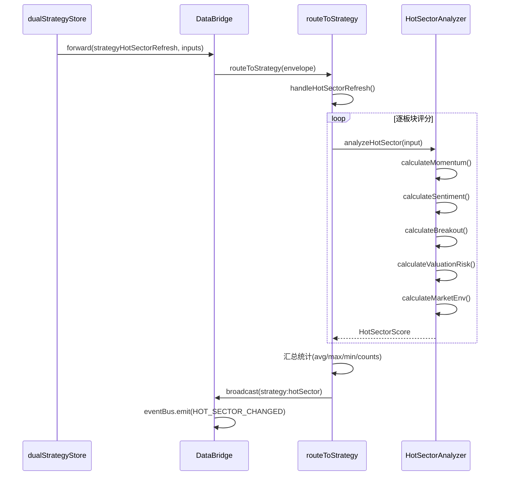
```mermaid
sequenceDiagram
    participant Store as dualStrategyStore
    participant DataBridge as DataBridge
    participant Router as routeToStrategy
    participant Analyzer as HotSectorAnalyzer
    
    Store->>DataBridge: forward(strategyHotSectorRefresh, inputs)
    DataBridge->>Router: routeToStrategy(envelope)
    Router->>Router: handleHotSectorRefresh()
    
    loop 逐板块评分
        Router->>Analyzer: analyzeHotSector(input)
        Analyzer->>Analyzer: calculateMomentum()
        Analyzer->>Analyzer: calculateSentiment()
        Analyzer->>Analyzer: calculateBreakout()
        Analyzer->>Analyzer: calculateValuationRisk()
        Analyzer->>Analyzer: calculateMarketEnv()
        Analyzer-->>Router: HotSectorScore
    end
    
    Router->>Router: 汇总统计(avg/max/min/counts)
    Router->>DataBridge: broadcast(strategy:hotSector)
    DataBridge->>DataBridge: eventBus.emit(HOT_SECTOR_CHANGED)
```

---

## 五、选股策略链路

### 5.1 选股策略全景

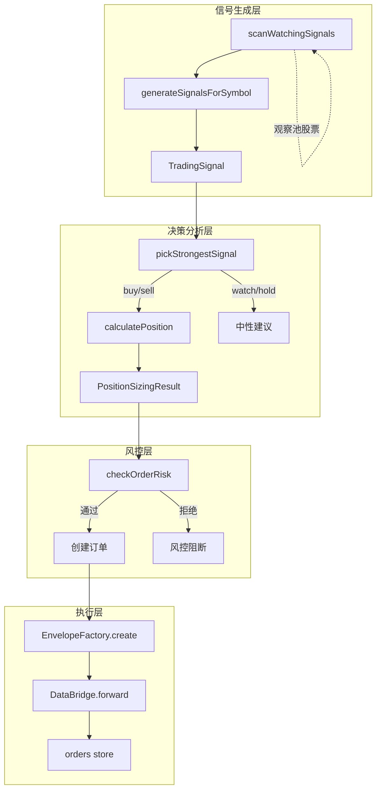
```mermaid
graph TB
    subgraph 信号生成层
        Scan[scanWatchingSignals] --> Generate[generateSignalsForSymbol]
        Generate --> Signal[TradingSignal]
    end
    
    subgraph 决策分析层
        Signal --> Pick[pickStrongestSignal]
        Pick -->|buy/sell| Sizing[calculatePosition]
        Pick -->|watch/hold| Hold[中性建议]
        Sizing --> Position[PositionSizingResult]
    end
    
    subgraph 风控层
        Position --> Risk[checkOrderRisk]
        Risk -->|通过| Order[创建订单]
        Risk -->|拒绝| Block[风控阻断]
    end
    
    subgraph 执行层
        Order --> Envelope[EnvelopeFactory.create]
        Envelope --> Forward[DataBridge.forward]
        Forward --> DB[orders store]
    end
    
    Scan -.->|观察池股票| Scan
```

### 5.2 交易建议生成流程

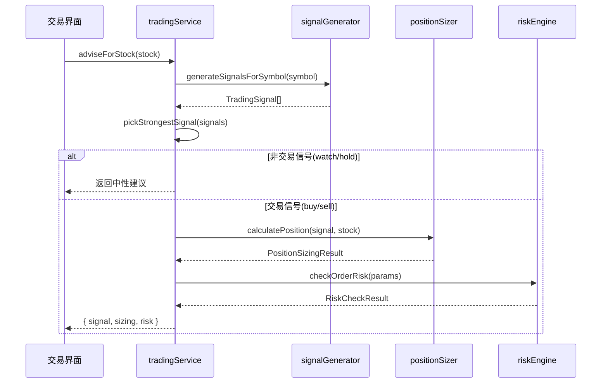
```mermaid
sequenceDiagram
    participant UI as 交易界面
    participant Service as tradingService
    participant Signal as signalGenerator
    participant Sizing as positionSizer
    participant Risk as riskEngine
    
    UI->>Service: adviseForStock(stock)
    Service->>Signal: generateSignalsForSymbol(symbol)
    Signal-->>Service: TradingSignal[]
    
    Service->>Service: pickStrongestSignal(signals)
    
    alt 非交易信号(watch/hold)
        Service-->>UI: 返回中性建议
    else 交易信号(buy/sell)
        Service->>Sizing: calculatePosition(signal, stock)
        Sizing-->>Service: PositionSizingResult
        
        Service->>Risk: checkOrderRisk(params)
        Risk-->>Service: RiskCheckResult
        
        Service-->>UI: { signal, sizing, risk }
    end
```

### 5.3 信号生成器详解

[signalGenerator.ts](../src/services/trading/signalGenerator.ts) 实现5种交易信号：

**买入信号**：
| 信号类型 | 触发条件 | 置信度 |
|---------|---------|-------|
| `buy_dip` | 价格低于MA20 8% 且 RSI < 30 | 0.55 |
| `buy_pivot` | 突破MA20 + 放量 + MACD红柱 | 0.65 |
| `buy_safety_margin` | PE/PB低于配置阈值 | 0.50 |

**卖出信号**：
| 信号类型 | 触发条件 | 置信度 |
|---------|---------|-------|
| `sell_profit_taking` | 价格高于MA20 15% 且 RSI > 70 | 0.55 |
| `sell_trailing_stop` | 从近期高点回撤10% | 0.70 |

**综合共振**：同方向多个独立信号时生成 `composite_buy`/`composite_sell`，置信度叠加

### 5.4 仓位计算详解

[positionSizer.ts](../src/services/trading/positionSizer.ts) 使用 **Kelly 公式半凯利** 计算仓位：

```
Kelly % = W - (1 - W) / R
其中：W = 胜率, R = 盈亏比
```

**约束规则**：
1. 单笔仓位上限（默认 10%）
2. 总仓位上限（默认 80%）
3. 最小仓位阈值（低于则归零）
4. 按整手取整

### 5.5 风控引擎详解

[riskEngine.ts](../src/services/trading/riskEngine.ts) 执行5项风控检查：

| 检查项 | 阻塞条件 | 警告条件 |
|--------|---------|---------|
| 数据新鲜度 | 行情超过配置小时数未更新 | - |
| 同标的冷却期 | 同标的交易在冷却期内 | - |
| 当日交易次数 | 达到每日上限 | 接近上限 |
| 单笔仓位上限 | 买入后超出单笔上限 | 接近上限 |
| 总仓位上限 | 买入后超出总仓位上限 | 接近上限 |
| 卖出持仓检查 | 卖出数量超过当前持仓 | - |

### 5.6 筛选引擎详解

[screeningEngine.ts](../src/services/analysis/screeningEngine.ts) 实现两级晋升：

**candidate → screened**：
- 数据质量满足 basic/kline 要求
- V6 评分 ≥ 阈值

**screened → deepDive**：
- 数据质量满足 basic/kline/finance 要求
- V6 评分 ≥ 阈值 或 智能评分 ≥ 阈值

### 5.7 订单创建流程

[tradingService.ts](../src/services/trading/tradingService.ts) 实现完整的风控+下单流程：

```typescript
async function createOrderWithRiskCheck(input: CreateOrderInput) {
  // 1. 参数校验
  if (price <= 0 || input.quantity <= 0) return { success: false }
  
  // 2. 风控检查
  const risk = await checkOrderRisk({ symbol, direction, quantity, price, portfolioValue })
  if (!risk.ok) return { success: false, error: `风控未通过` }
  
  // 3. 构建订单
  const order = buildOrder(input)
  
  // 4. 通过 DataBridge 写入（ACL校验 + 审计日志）
  const envelope = EnvelopeFactory.create({
    source: MODULE_ID.tradinghub,
    target: ENVELOPE_TARGET.db,
    action: ENVELOPE_ACTION.insertOrder,
    traceId: `trading-${nanoid(8)}-${input.symbol}`,
  }, order)
  
  await dataBridge.forward(envelope)
}
```

---

## 六、交易复盘链路

### 6.1 复盘系统架构

```mermaid
graph TB
    subgraph 复盘引擎
        Review[generateTradeReviewUseCase] --> Profile[generatePsychologicalProfile]
        Review --> Dimensions[SKILL_DIMENSIONS]
        Review --> LLM[LLM增强分析]
    end
    
    subgraph 数据输入
        Orders[历史订单] --> Review
        Signals[交易信号] --> Review
        Portfolios[投资组合] --> Review
        Scores[评分数据] --> Review
    end
    
    subgraph 分析维度
        Profile --> Discipline[纪律评分]
        Dimensions --> Psychology[心理画像]
        LLM --> Insights[AI洞察]
    end
    
    Discipline --> Report[TradeReviewRecord]
    Psychology --> Report
    Insights --> Report
    
    Report --> Save[DataBridge.forward(saveTradeReview)]
    Save --> Store[trade_reviews]
```

### 6.2 复盘数据流向

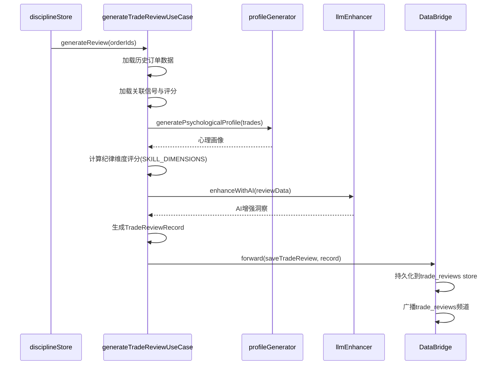
```mermaid
sequenceDiagram
    participant Store as disciplineStore
    participant UseCase as generateTradeReviewUseCase
    participant Profile as profileGenerator
    participant LLM as llmEnhancer
    participant DataBridge as DataBridge
    
    Store->>UseCase: generateReview(orderIds)
    UseCase->>UseCase: 加载历史订单数据
    UseCase->>UseCase: 加载关联信号与评分
    
    UseCase->>Profile: generatePsychologicalProfile(trades)
    Profile-->>UseCase: 心理画像
    
    UseCase->>UseCase: 计算纪律维度评分(SKILL_DIMENSIONS)
    
    UseCase->>LLM: enhanceWithAI(reviewData)
    LLM-->>UseCase: AI增强洞察
    
    UseCase->>UseCase: 生成TradeReviewRecord
    
    UseCase->>DataBridge: forward(saveTradeReview, record)
    DataBridge->>DataBridge: 持久化到trade_reviews store
    DataBridge->>DataBridge: 广播trade_reviews频道
```

---

## 七、分布式循环机制设计

### 7.0 实际实现文件

分布式循环机制已在 [pipelineScheduler.ts](../src/core/pipelineScheduler.ts) 中实现，包含：

- **PipelineScheduler**：循环调度器，管理多个独立循环的生命周期
- **PipelineCycle**：单个循环单元，包含状态机、指数退避重试、健康检查
- **DataIntegrityGuard**：数据完整性保障，包含自动修复逻辑

### 7.1 当前系统循环模式

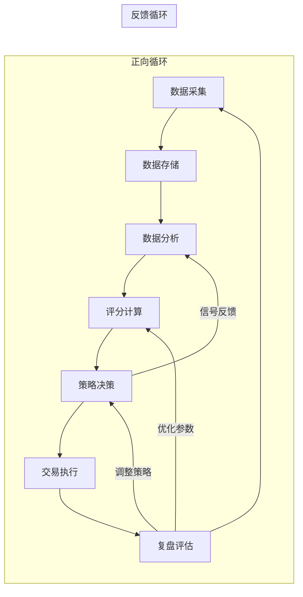
```mermaid
graph LR
    subgraph 正向循环
        Fetch[数据采集] --> Store[数据存储]
        Store --> Analyze[数据分析]
        Analyze --> Score[评分计算]
        Score --> Strategy[策略决策]
        Strategy --> Trade[交易执行]
        Trade --> Review[复盘评估]
        Review --> Fetch
    end
    
    subgraph 反馈循环
        Review -->|优化参数| Score
        Review -->|调整策略| Strategy
        Strategy -->|信号反馈| Analyze
    end
```

### 7.2 分布式循环机制实现方案

#### 7.2.1 循环调度器设计

```typescript
/**
 * 分布式循环调度器
 * 确保数据处理管道高效可靠执行
 */
class PipelineScheduler {
  private cycles: Map<string, PipelineCycle> = new Map()
  private running: boolean = false
  
  /**
   * 注册数据处理循环
   */
  registerCycle(name: string, config: CycleConfig): void {
    this.cycles.set(name, new PipelineCycle(name, config))
  }
  
  /**
   * 启动所有循环
   */
  start(): void {
    if (this.running) return
    this.running = true
    for (const cycle of this.cycles.values()) {
      cycle.start()
    }
  }
  
  /**
   * 停止所有循环
   */
  stop(): void {
    this.running = false
    for (const cycle of this.cycles.values()) {
      cycle.stop()
    }
  }
  
  /**
   * 获取循环状态
   */
  getStatus(): CycleStatus[] {
    return Array.from(this.cycles.values()).map(c => c.getStatus())
  }
}
```

#### 7.2.2 循环配置

```typescript
interface CycleConfig {
  /** 循环名称 */
  name: string
  /** 执行间隔（毫秒） */
  interval: number
  /** 是否启用 */
  enabled: boolean
  /** 最大重试次数 */
  maxRetries: number
  /** 指数退避因子 */
  backoffFactor: number
  /** 健康检查阈值 */
  healthThreshold: number
  /** 数据完整性校验函数 */
  integrityCheck?: () => Promise<boolean>
  /** 执行函数 */
  executor: () => Promise<void>
}
```

#### 7.2.3 数据处理循环状态机

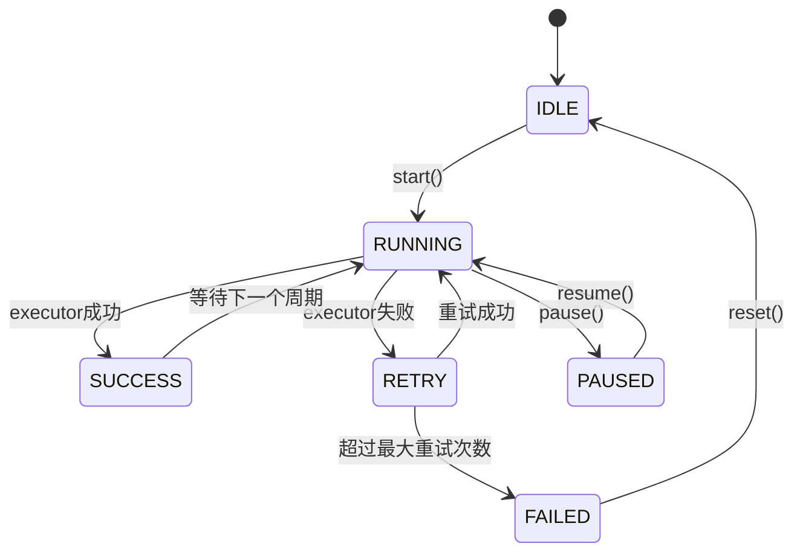
```mermaid
stateDiagram-v2
    [*] --> IDLE
    IDLE --> RUNNING: start()
    RUNNING --> SUCCESS: executor成功
    RUNNING --> RETRY: executor失败
    RETRY --> RUNNING: 重试成功
    RETRY --> FAILED: 超过最大重试次数
    FAILED --> IDLE: reset()
    SUCCESS --> RUNNING: 等待下一个周期
    RUNNING --> PAUSED: pause()
    PAUSED --> RUNNING: resume()
```

#### 7.2.4 数据完整性保障

```typescript
/**
 * 数据完整性校验器
 */
class DataIntegrityGuard {
  /**
   * 校验股票池数据完整性
   */
  async checkStockPool(): Promise<IntegrityResult> {
    const stocks = await dataBridge.query({ action: 'QUERY_LIST', store: 'stocks' })
    const scores = await dataBridge.query({ action: 'QUERY_LIST', store: 'v6_scores' })
    
    const missingScores = stocks.data?.filter(
      s => !scores.data?.some(score => score.symbol === s.symbol)
    ) ?? []
    
    return {
      status: missingScores.length === 0 ? 'healthy' : 'degraded',
      missingCount: missingScores.length,
      details: { missingScores: missingScores.map(s => s.symbol) }
    }
  }
  
  /**
   * 自动修复缺失数据
   */
  async repairMissingScores(): Promise<void> {
    const result = await this.checkStockPool()
    if (result.status === 'healthy') return
    
    for (const symbol of result.details?.missingScores ?? []) {
      await runV6Score(symbol)
    }
  }
}
```

#### 7.2.5 执行效率优化策略

| 优化策略 | 实现方式 | 预期效果 |
|---------|---------|---------|
| **增量更新** | 基于时间戳的差分同步 | 减少全量扫描开销 |
| **批处理** | 批量Envelope合并写入 | 降低DB事务开销 |
| **优先级调度** | 高频低延迟任务优先 | 保障实时性要求 |
| **缓存分层** | L1内存缓存 + L2 IndexedDB | 提升读取效率 |
| **并行处理** | Promise.all 并行计算 | 充分利用CPU多核 |

---

## 八、数据链路关系图

### 8.1 模块依赖关系图

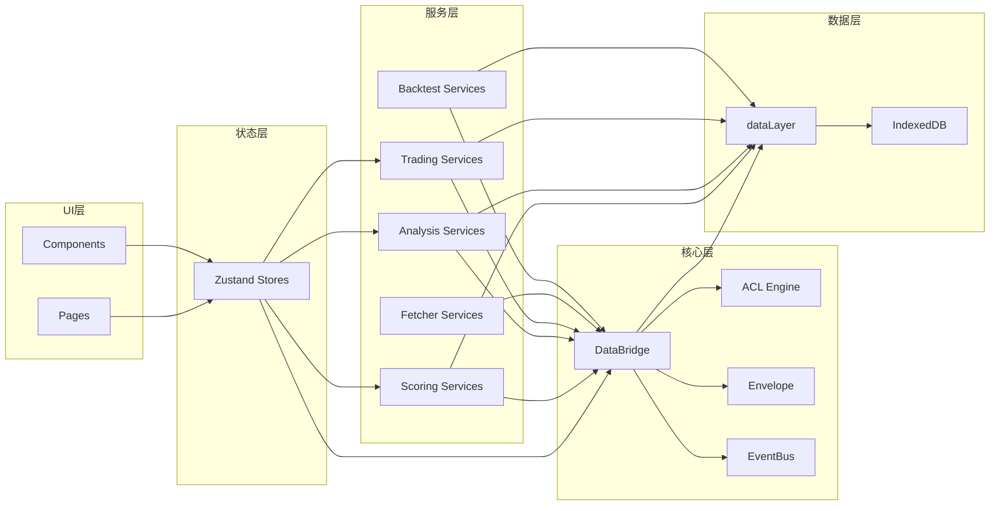
```mermaid
graph LR
    subgraph UI层
        Pages[Pages]
        Components[Components]
    end
    
    subgraph 状态层
        Stores[Zustand Stores]
    end
    
    subgraph 服务层
        Scoring[Scoring Services]
        Analysis[Analysis Services]
        Trading[Trading Services]
        Fetcher[Fetcher Services]
        Backtest[Backtest Services]
    end
    
    subgraph 核心层
        DB[DataBridge]
        ACL[ACL Engine]
        Envelope[Envelope]
        EventBus[EventBus]
    end
    
    subgraph 数据层
        DataLayer[dataLayer]
        DBIndexed[IndexedDB]
    end
    
    Pages --> Stores
    Components --> Stores
    Stores --> DB
    Stores --> Scoring
    Stores --> Analysis
    Stores --> Trading
    
    Scoring --> DB
    Scoring --> DataLayer
    
    Analysis --> DB
    Analysis --> DataLayer
    
    Trading --> DB
    Trading --> DataLayer
    
    Fetcher --> DB
    
    Backtest --> DB
    Backtest --> DataLayer
    
    DB --> ACL
    DB --> Envelope
    DB --> EventBus
    DB --> DataLayer
    
    DataLayer --> DBIndexed
```

### 8.2 数据流向全景图

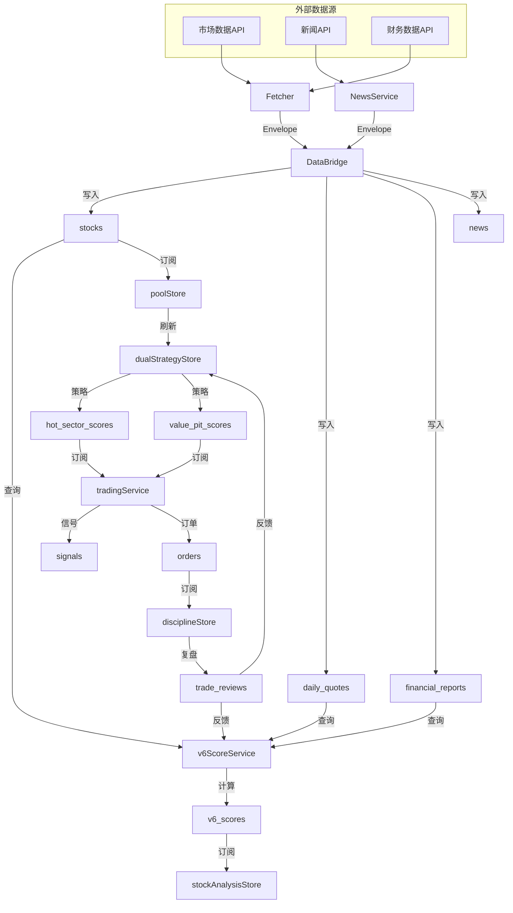
```mermaid
graph TB
    subgraph 外部数据源
        Market[市场数据API]
        NewsAPI[新闻API]
        Financial[财务数据API]
    end
    
    Market --> Fetcher[Fetcher]
    NewsAPI --> NewsService[NewsService]
    Financial --> Fetcher
    
    Fetcher -->|Envelope| DB[DataBridge]
    NewsService -->|Envelope| DB
    
    DB -->|写入| Stocks[stocks]
    DB -->|写入| Quotes[daily_quotes]
    DB -->|写入| Financials[financial_reports]
    DB -->|写入| News[news]
    
    Stocks -->|查询| ScoreEngine[v6ScoreService]
    Quotes -->|查询| ScoreEngine
    Financials -->|查询| ScoreEngine
    
    ScoreEngine -->|计算| V6Scores[v6_scores]
    
    V6Scores -->|订阅| AnalysisStore[stockAnalysisStore]
    Stocks -->|订阅| PoolStore[poolStore]
    
    PoolStore -->|刷新| StrategyStore[dualStrategyStore]
    
    StrategyStore -->|策略| HotSector[hot_sector_scores]
    StrategyStore -->|策略| ValuePit[value_pit_scores]
    
    HotSector -->|订阅| TradingService[tradingService]
    ValuePit -->|订阅| TradingService
    
    TradingService -->|信号| Signals[signals]
    TradingService -->|订单| Orders[orders]
    
    Orders -->|订阅| DisciplineStore[disciplineStore]
    
    DisciplineStore -->|复盘| TradeReviews[trade_reviews]
    
    TradeReviews -->|反馈| ScoreEngine
    TradeReviews -->|反馈| StrategyStore
```

---

## 九、关键时序图

### 9.1 DataBridge Forward 完整时序

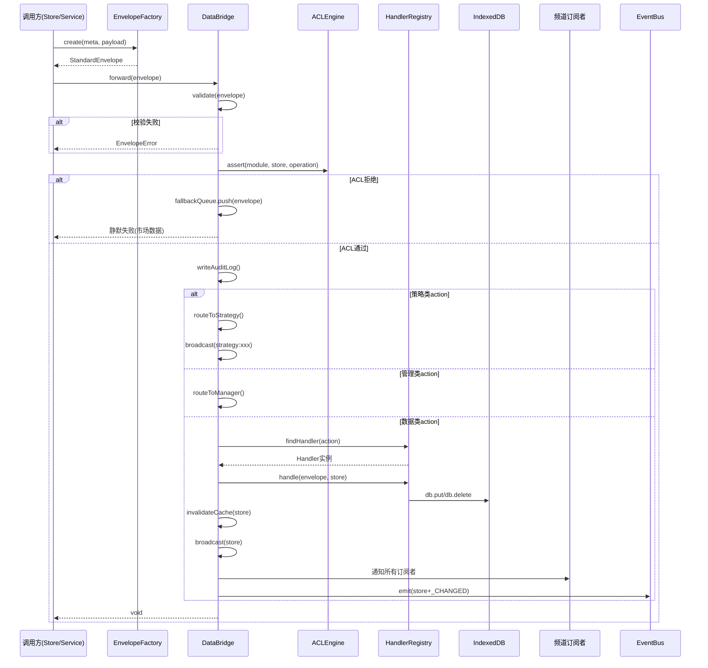
```mermaid
sequenceDiagram
    participant Client as 调用方(Store/Service)
    participant Envelope as EnvelopeFactory
    participant DB as DataBridge
    participant ACL as ACLEngine
    participant Handler as HandlerRegistry
    participant IndexedDB as IndexedDB
    participant Subscribers as 频道订阅者
    participant EventBus as EventBus
    
    Client->>Envelope: create(meta, payload)
    Envelope-->>Client: StandardEnvelope
    
    Client->>DB: forward(envelope)
    
    DB->>DB: validate(envelope)
    alt 校验失败
        DB-->>Client: EnvelopeError
    end
    
    DB->>ACL: assert(module, store, operation)
    alt ACL拒绝
        DB->>DB: fallbackQueue.push(envelope)
        DB-->>Client: 静默失败(市场数据)
    else ACL通过
        DB->>DB: writeAuditLog()
        
        alt 策略类action
            DB->>DB: routeToStrategy()
            DB->>DB: broadcast(strategy:xxx)
        else 管理类action
            DB->>DB: routeToManager()
        else 数据类action
            DB->>Handler: findHandler(action)
            Handler-->>DB: Handler实例
            DB->>Handler: handle(envelope, store)
            Handler->>IndexedDB: db.put/db.delete
            
            DB->>DB: invalidateCache(store)
            DB->>DB: broadcast(store)
            
            DB->>Subscribers: 通知所有订阅者
            DB->>EventBus: emit(store+_CHANGED)
        end
        
        DB-->>Client: void
    end
```

### 9.2 DataBridge Query 完整时序

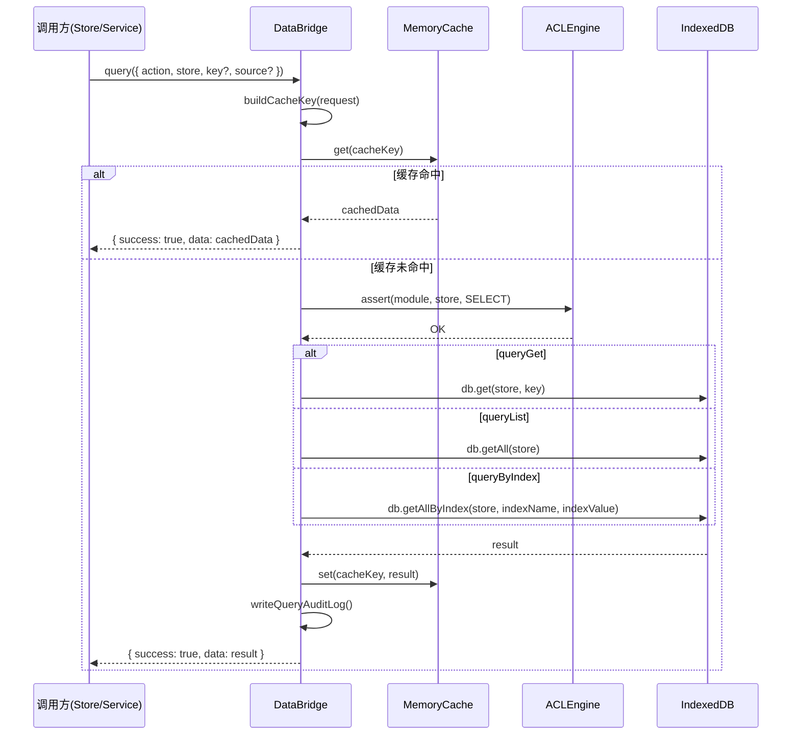
```mermaid
sequenceDiagram
    participant Client as 调用方(Store/Service)
    participant DB as DataBridge
    participant Cache as MemoryCache
    participant ACL as ACLEngine
    participant IndexedDB as IndexedDB
    
    Client->>DB: query({ action, store, key?, source? })
    
    DB->>DB: buildCacheKey(request)
    DB->>Cache: get(cacheKey)
    
    alt 缓存命中
        Cache-->>DB: cachedData
        DB-->>Client: { success: true, data: cachedData }
    else 缓存未命中
        DB->>ACL: assert(module, store, SELECT)
        ACL-->>DB: OK
        
        alt queryGet
            DB->>IndexedDB: db.get(store, key)
        else queryList
            DB->>IndexedDB: db.getAll(store)
        else queryByIndex
            DB->>IndexedDB: db.getAllByIndex(store, indexName, indexValue)
        end
        
        IndexedDB-->>DB: result
        
        DB->>Cache: set(cacheKey, result)
        DB->>DB: writeQueryAuditLog()
        
        DB-->>Client: { success: true, data: result }
    end
```

---

## 十、系统可扩展性设计

### 10.1 水平扩展架构

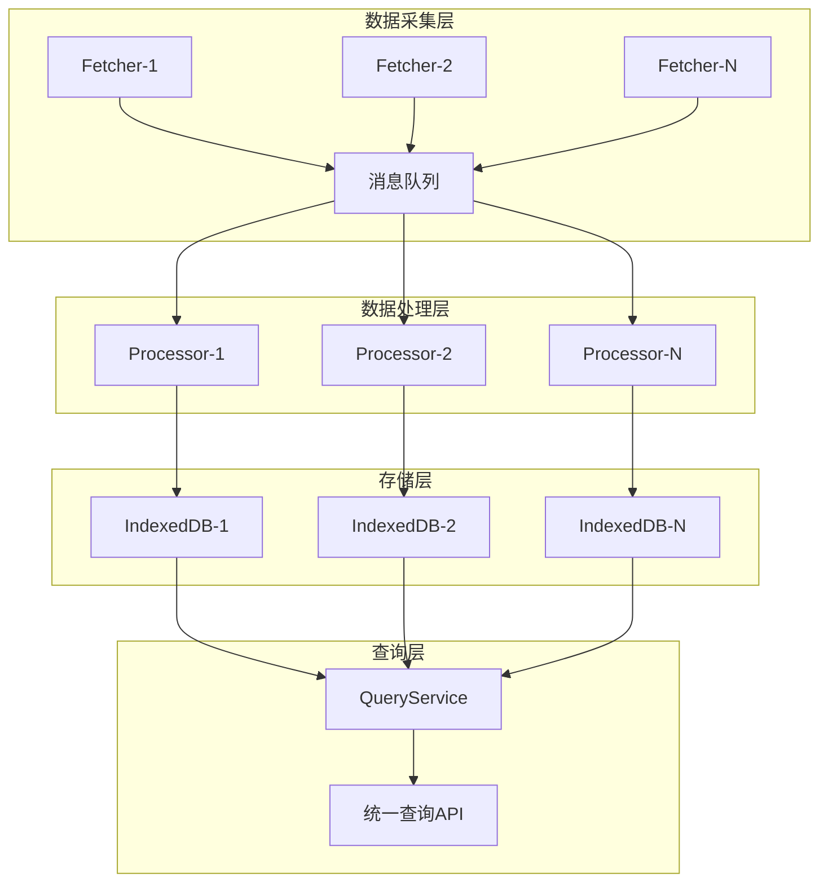
```mermaid
graph TB
    subgraph 数据采集层
        F1[Fetcher-1] --> MQ[消息队列]
        F2[Fetcher-2] --> MQ
        F3[Fetcher-N] --> MQ
    end
    
    subgraph 数据处理层
        MQ --> P1[Processor-1]
        MQ --> P2[Processor-2]
        MQ --> P3[Processor-N]
    end
    
    subgraph 存储层
        P1 --> DB1[IndexedDB-1]
        P2 --> DB2[IndexedDB-2]
        P3 --> DB3[IndexedDB-N]
    end
    
    subgraph 查询层
        DB1 --> Q[QueryService]
        DB2 --> Q
        DB3 --> Q
        Q --> API[统一查询API]
    end
```

### 10.2 模块化扩展接口

```typescript
/**
 * 数据处理器插件接口
 */
interface DataProcessorPlugin {
  /** 插件名称 */
  name: string
  /** 支持的数据源 */
  supportedSources: string[]
  /** 处理优先级 */
  priority: number
  /** 处理函数 */
  process(data: unknown): Promise<unknown>
  /** 数据校验 */
  validate(data: unknown): boolean
}

/**
 * 策略引擎插件接口
 */
interface StrategyEnginePlugin {
  /** 策略名称 */
  name: string
  /** 策略频道 */
  channel: string
  /** 评分维度 */
  dimensions: string[]
  /** 执行评分 */
  evaluate(input: unknown): Promise<unknown>
  /** 信号生成 */
  generateSignals(scores: unknown[]): unknown[]
}
```

---

## 十一、结论与建议

### 11.1 当前架构优势

| 优势 | 说明 |
|------|------|
| **统一入口** | DataBridge 作为唯一数据通道，确保 ACL 校验与审计日志覆盖 |
| **策略模式** | HandlerRegistry 支持灵活扩展新的 action 处理器 |
| **订阅机制** | 跨模块数据同步通过频道订阅实现，解耦模块依赖 |
| **降级队列** | 市场数据 ACL 拒绝时自动重试，保证数据完整性 |
| **缓存层** | MemoryCache 减少重复查询，提升读取性能 |

### 11.2 改进建议

| 优先级 | 建议 | 说明 |
|--------|------|------|
| P0 | 批量操作支持 | 当前所有 forward 均为单条写入，增加 BULK_* 系列 Action |
| P0 | 细粒度订阅 | 当前按 Store 全量广播，增加 `stocks:{symbol}` 级别订阅 |
| P1 | 事件型频道独立 | 事件型动作混在 DB 路由中，分离事件路由建立 `event:*` 频道体系 |
| P1 | 查询型 forward | 评估是否需要 QUERY_* 系列 Action 统一走 DataBridge |
| P2 | 分布式调度器 | ✅ 已实现：[pipelineScheduler.ts](../src/core/pipelineScheduler.ts) |

### 11.3 数据完整性保障措施

1. **写入前校验**：EnvelopeFactory.validate() 确保数据格式正确
2. **写入后广播**：所有写操作完成后广播变更通知，订阅者自动刷新
3. **缓存失效**：写操作后调用 invalidateCache()，保证读一致性
4. **审计日志**：所有操作自动写入 researchLogs，支持追溯
5. **级联删除**：DeleteStockHandler 确保关联数据完整清理

---

> **文档结束**
> 
> 本文档基于 `src/core/databridge.ts`、`src/core/databridgeHandlers.ts`、`src/core/databridgeStrategyRouter.ts`、`src/services/scoring/`、`src/services/trading/`、`src/store/` 等核心模块综合梳理生成。