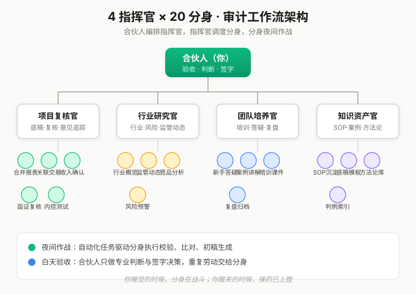
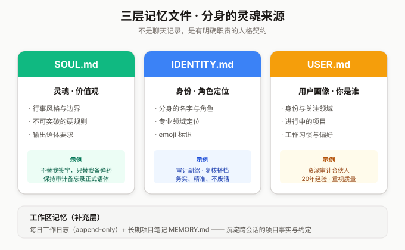
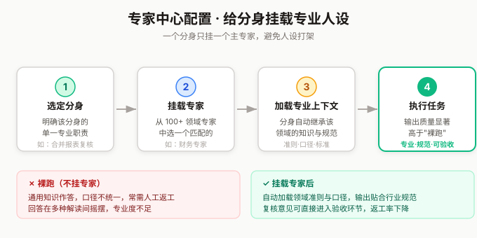
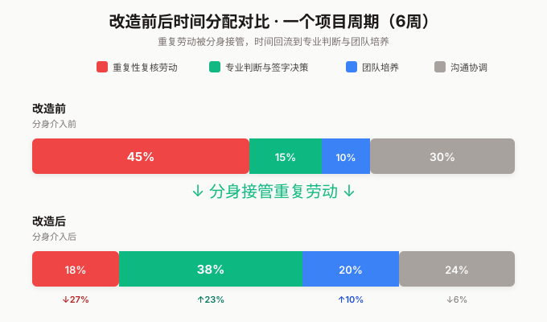

# 我用 WorkBuddy 给审计团队搭了 20 个"分身"：一个审计合伙人的 AI 工作流改造实录 #WorkBuddy

> 作者身份：资深审计合伙人，20 年审计从业经验。本文记录我用 WorkBuddy 把"一人复核"改造成"一支分身部队"的完整过程，含架构设计、分步实操、效果对比与避坑指南。

## 一、先说痛点：审计合伙人为什么需要"分身"

做审计这一行越久，越能体会一种撕裂感：**专业判断需要沉淀，但项目节奏不允许你停下来**。

我日常面对的是这样的局面——

- 同时在手的 3-5 个项目，每个都要合伙人级别复核；
- 底稿堆积如山，复核意见要逐条回应，重复性劳动占掉六成精力；
- 团队小朋友的成长靠"师傅带徒弟"，但带人本身极其耗能；
- 行业研究、风险评估、内控测试的方法论，全靠老员工的脑子，人走知识就走。

传统 AI 对话工具我试过不少，它们的共同问题是：**只给建议，不动手**。你问它"这份底稿的实质性程序是否充分"，它给你一段方法论文字，然后你还得自己回去对照底稿。这不是放大器，这是又一个需要我伺候的工具。

WorkBuddy 吸引我的点是它把"理解—规划—执行—交付"打通了：你说一句话，它真的去读文件、跑分析、出文档。这才是一个审计合伙人需要的——**一个能接活儿、能干活儿、能交活儿的副驾，而不是一个只会嘴上谈兵的顾问**。

## 二、架构设计：4 个指挥官 × 20 个分身

我没有把 WorkBuddy 当成"一个更聪明的对话框"来用，而是把它当成一个**可以编排的小型组织**。我的设计是"4 个指挥官 × 20 个分身"：

- **4 个指挥官**（对应我的四类核心战场）：项目复核官、行业研究官、团队培养官、知识资产官。每个指挥官是一个专家配置 + 一套 Skills 的组合，负责一个领域。
- **20 个分身**：每个指挥官下辖 4-5 个分身，分身是"预设好人格与工具"的工作单元。比如项目复核官下面有"合并报表复核分身""关联交易核查分身""收入确认复核分身"等。

核心理念只有一句：**你睡觉的时候，分身在战斗。你醒来的时候，弹药已上膛。**

这不是噱头。审计行业的特点是"白天对内沟通、夜间数据处理"——很多批量校验、底稿交叉比对、报告初稿生成，完全可以放到夜间由自动化任务驱动分身完成。我第二天早上打开电脑看到的不是空白文档，而是分身已经跑完的复核备忘录草稿。

## 三、分步实操：从零搭起这套工作流

### Step 1：用记忆层固化"我是谁"——这是所有分身的灵魂

WorkBuddy 的记忆层是我认为最被低估的能力。它不是简单的"聊天记录"，而是三个有明确职责的文件：

- **SOUL.md**：定义"分身的灵魂"——价值观、边界、行事风格。我写的是"务实、精准、不废话；对审计质量有敬畏，对 AI 有清醒；不替我签字，只替我备弹药"。
- **IDENTITY.md**：定义"分身是谁"——名字、角色定位、emoji。
- **USER.md**：定义"我是谁"——我的身份、关注领域、正在进行的项目、工作习惯。

**为什么这一步最重要？** 因为没有这三份文件，你的分身每次都是"失忆的新人"。有了它们，分身一启动就知道在和谁对话、用什么风格、守住什么底线。我团队里有人把 SOUL.md 写成"你是一个乐于助人的 AI 助手"——这种废话说不如不说。记忆层要写的是**你独有的判断标准和工作偏好**，越具体越值钱。

### Step 2：用 Skills 把审计 SOP 固化成"可调用的能力包"

Skills 是 WorkBuddy 的技能系统，可以理解为"封装好的标准操作流程"。审计行业最缺的就是 SOP 的固化——老员工脑子里的经验，怎么变成可复用的资产？

我的做法是把高频审计场景做成 Skills。举两个真实的例子：

- **"风险评估底稿生成"Skill**：触发词是"风险评估/识别重大错报风险"。它会引导分身按"了解被审计单位→行业环境→内部控制初步评价→重大错报风险识别"的标准流程，读取项目文件，输出一份结构化底稿。
- **"复核意见追踪"Skill**：触发词是"复核意见/清点回复"。它扫描底稿目录里所有标注了"复核意见"的条目，生成一张"意见—是否回应—回应是否充分"的追踪表。

关键经验：**Skills 不要写得太"技术"，要写成审计师能看懂的语言**。我团队一开始把 Skill 写得像代码文档，结果非技术同事根本不敢触发。后来改成"审计场景描述 + 操作步骤 + 输出格式"的三段式，使用率立刻上来。

### Step 3：用专家中心给每个分身配"专业人设"

WorkBuddy 的专家中心有 100+ 领域专家。我给每个分身都挂了一个对应的专家配置：

比如"行业研究官"挂的是行业分析专家，"合并报表复核分身"挂的是财务专家。挂载专家的好处是：分身在执行任务时，会自动加载该领域的专业上下文，输出质量明显比"裸跑"高。

实操上要注意：**一个分身只挂一个主专家，避免人设打架**。我早期给一个分身同时挂了"财务专家"和"法律专家"，结果它回答关联交易问题时在会计处理和法律合规之间反复横跳，反而不如单挂一个清晰。

### Step 4：用自动化任务让分身"夜间作战"

这一步是整个工作流收益最大的一环。WorkBuddy 支持定时任务（recurring 周期执行 + once 一次性执行），我把耗时不耗脑的批量工作全部排进了夜间档：

- 每天凌晨 2 点：跑各项目底稿目录的"完整性校验"——检查必备程序是否都执行、底稿索引是否连续、交叉引用是否有效。
- 每周一早 6 点：汇总上周所有复核意见的回应状态，生成"合伙人晨会简报"。
- 每月 1 号：扫描行业新闻与监管动态，生成"本月审计风险提示清单"。

第二天我到办公室时，这些成果已经躺在结果区等我验收。**这才是"一个人 = 一支军队"的真正含义——不是你更忙了，而是你的时间被释放给了真正需要专业判断的事。**

## 四、效果对比：改造前后，我的时间花在哪了

我追踪了一个完整项目周期（6 周）的时间分配，对比如下：

最大变化是"重复性复核劳动"从 45% 降到 18%，释放出来的时间流向了"专业判断与签字决策"（从 15% 升到 38%）和"团队培养"（从 10% 升到 20%）。换句话说，**分身替我干掉了重复活儿，让我重新回到了合伙人的核心位置上**。

## 五、三个避坑提醒

1. **记忆层不是日记本，是契约。** 别往 SOUL.md 里堆碎碎念，它应该写的是"分身必须遵守的硬规则"。我有一条是"所有涉及审计结论的输出必须标注'仅供参考，非正式审计意见'"——这种底线类规则必须写死。

2. **Skills 要先跑通一个再批量做。** 我一开始贪多，一次性写了 8 个 Skill，结果 5 个触发不稳定，反而拖垮团队信任。正确姿势是：先做一个高频场景的 Skill，打磨到"谁用都稳定触发"再加第二个。

3. **自动化任务要先小后大。** 夜间任务第一次跑一定要选低风险场景（比如只做校验、不做修改），确认输出可靠后再逐步放到"生成初稿"这类有产出物的任务上。我踩过的坑是让分身夜间直接改底稿，第二天发现改错文件，差点出事。

## 结语

审计这个行业的本质是"专业判断 + 严格程序"。AI 替代不了专业判断，但它能把"严格程序"这部分自动化到极致，把你从程序性劳动里解放出来，去做只有你能做的判断。

WorkBuddy 给我的不是"一个更快的工具"，而是"一支可以编排的队伍"。20 个分身不会让我变成更忙的合伙人，只会让我变成更专注的合伙人。

如果你也是专业服务行业的从业者，强烈建议从"记忆层 + 一个 Skill + 一个夜间任务"这三件小事开始，亲手搭一个属于自己的分身。你会发现，**真正贵的不是 AI 的能力，是你愿不愿意把自己的经验沉淀成可以被复用的资产**。

---

*本文所有功能描述基于 WorkBuddy 官方能力，工作流为作者实际搭建经验。文中涉及的审计工作流仅为个人效率实践，不代表任何机构立场。*
