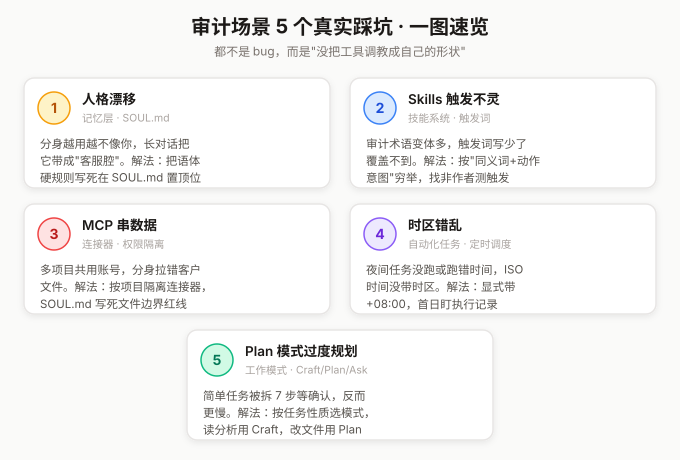
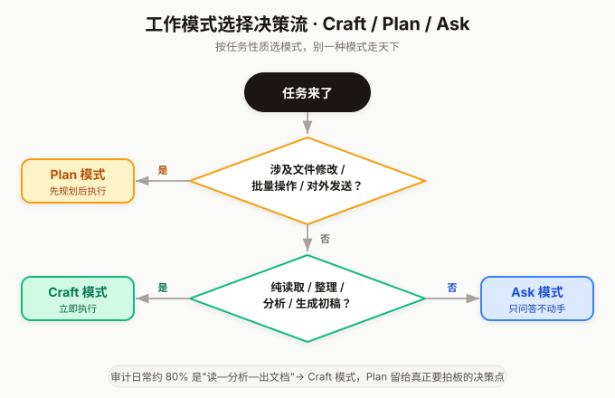

# 审计场景下 WorkBuddy 的 5 个真实踩坑与解法 #WorkBuddy

> 用 WorkBuddy 改造审计工作流三个月，我踩过不少坑。这篇文章挑 5 个最典型的，每个都给出现象、根因和解法。如果你也在专业服务场景用 WorkBuddy，这些坑大概率你会撞上。

## 坑一：记忆层"人格漂移"――分身越用越不像你

**现象**：刚配好分身时，输出风格很贴合我的审计习惯――简洁、带专业判断、不堆废话。用了一两周后，分身开始变得��嗦，回答里出现"好的呢~""希望能帮到你"这类客服腔，甚至有一次给复核意见时加了一句"加油哦"。

**根因**：记忆层的 SOUL.md 是分身的人格来源，但长对话会让分身被"带跑"――你某次语气随意，它就跟着随意；你某次让它"详细点"，它就默认变��嗦。记忆文件没变，但对话惯性盖过了设定。

**解法**：把 SOUL.md 当成"宪法"而不是"开场白"。我在 SOUL.md 里加了一条硬规则并置顶：`任何输出不得出现客套话、表情符号、鼓励性语句；保持审计备忘录的正式语体`。同时养成习惯――每隔两周把最近的对话风格问题回写进 USER.md 的"工作习惯"栏，让分身重新校准。**记忆层是要维护的，不是写一次就一劳永逸。**

## 坑二：Skills 触发不灵敏――审计术语识别不到

**现象**：我做了个"函证程序复核"的 Skill，触发词写的是"函证/银行询证"。结果团队成员说"帮我查下询证函的回函情况"，分身没触发 Skill，而是用通用知识瞎答了一通。

**根因**：Skills 的触发靠关键词匹配，但审计行业的术语变体极多――"函证"可以叫"询证""银行函证""往来款函证""询证函回函"。触发词只写了两个，覆盖不了真实表达。

**解法**：触发词要按"同义词 + 动作意图"两个维度穷举。我后来把触发词扩成：`函证、询证、银行函证、往来函证、询证函、回函、未回函、函证控制表、函证差异`。更关键的一条经验――**做完 Skill 一定要找非作者的人测触发**，作者写触发词时天然会"按自己的话术写"，但用户不会用你的话术。让我团队里最不会用 AI 的实习生测了一遍，补出了 6 个我没写到的说法。

## 坑三：MCP 连接器权限混乱――多项目串数据

**现象**：我同时挂着两个项目的腾讯文档连接器。一次让分身读取项目 A 的底稿清单，结果它把项目 B 的文件也拉了进来，生成的复核意见里混进了另一个客户的数据。审计行业这是大忌――客户信息隔离是红线。

**根因**：MCP 连接器是账号级的，一旦授权，分身能访问该账号下所有文件。我给两个项目用了同一个腾讯文档账号，分身没法区分哪个文件属于哪个项目。

**解法**：**按项目隔离连接器，不靠提示词靠配置**。我的做法是每个项目单独建一个腾讯文档账号（或用文件夹权限隔离），连接器只授权该项目的根文件夹。更稳的做法是在 SOUL.md 里写死边界：`当前工作区仅处理【项目代号】，禁止检索工作区外的任何文件；若检索结果含其他项目标识，立即停止并提示`。提示词不是万能的，但配上配置隔离，双保险。

## 坑四：自动化任务时区错乱――夜间任务没跑

**现象**：我设了个"每天凌晨 2 点跑底稿校验"的自动化任务，结果连续三天没跑。去查任务历史，发现它在"下午 2 点"跑了――也就是说任务执行了，但时区对不上。

**根因**：自动化任务的时间调度用 ISO 8601 格式，我填了 `T02:00` 却没带时区。系统默认按 UTC 解释――UTC 凌晨 2 点其实是北京时间上午 10 点，任务全错档，没在我预期的夜间执行，而是跑到了白天。8 小时时差，夜间任务白天空跑。

**解法**：定时任务的时间**必须显式带时区**。中国用户应该用带 `+08:00` 的完整 ISO 时间，或者直接用本地时间的明确表达。我现在设任务时统一用"北京时间凌晨 2 点"这样的自然语言让 WorkBuddy 自己换算，并在任务名里注明"北京时间"，执行后第一件事是核对任务历史的时间戳对不对。**自动化任务上线第一天，务必盯一次执行记录。**

## 坑五：Plan 模式过度规划――简单任务被拆太碎

**现象**：有一次我让分身"把这份底稿里的复核意见整理成追踪表"，本来 5 分钟能搞定的事，它进入 Plan 模式后给我列了个 7 步规划，等我确认。我确认完它又花时间拆解，最后搞了 20 分钟。

**根因**：WorkBuddy 有三种工作模式――Craft（立即执行）、Plan（先规划后执行）、Ask（只问答不动手）。我默认开了 Plan 模式想求稳，但 Plan 模式适合"复杂、多步、有风险"的任务，简单任务用它反而拖慢。

**解法**：**按任务性质选模式，别一种模式走天下**。我的判断标准是――

涉及文件修改、批量操作、对外发送的用 Plan；纯读取、整理、分析、生成初稿的用 Craft；只是问问题要判断的用 Ask。审计场景里 80% 的日常是"读―分析―出文档"，Craft 模式就够了，把 Plan 留给真正需要你拍板的决策点。

## 小结

这五个坑的共同点是：**它们都不是 WorkBuddy 的 bug，而是"用工具的人没把工具调教成自己的形状"**。审计这个行业的价值在于专业判断的精准，而精准的前提是把流程、边界、风格都配置到位。WorkBuddy 给了你配置的权力，但用不用、用得好不好，全看你愿不愿意像对待一个新员工那样，认真地"带"你的分身。

带好了，它是你夜里的军队；带不好，它是你白天的负担。

---

*本文为 WorkBuddy 使用心得分享，所涉审计场景为作者个人实践，不代表任何机构立场。*
