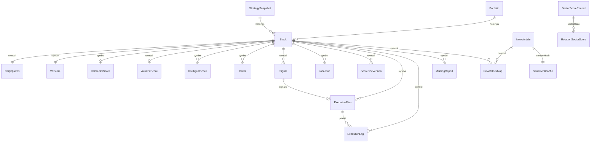

# V9 数据库实体关系蓝图 (ER)

> **Status**: Current  
> **Version**: v1.1.0  
> **Last Updated**: 2026-06-30  
> **DB_VERSION**: 16（以 `src/config/dbConfig.ts` 实际导出为准）
>
> 本文档以 `src/data/types.ts` 中的类型定义与 `src/data/db.ts` 中的 24 个 IndexedDB ObjectStore 为锚点，绘制 V9 系统核心数据实体关系，作为开发、测试与数据治理的比对基线。

---

## 1. Store 清单

| Store | 主键 | 自增 | 索引 | 核心实体 | 写入模块 |
|-------|------|------|------|---------|---------|
| `stocks` | `symbol` | 否 | `by-status`, `by-group` | `Stock` | `stockpool`, `fetcher` |
| `daily_quotes` | `symbol` | 否 | - | `DailyQuotes` | `fetcher` |
| `v6_scores` | `symbol` | 否 | - | `V6Score` | `analyzer` |
| `intelligent_scores` | `id` | 是 | `by-symbol` | `IntelligentScore` | `analyzer` |
| `industry_scores` | `id` | 是 | `by-code` | `IndustryScore` | `analyzer` |
| `hot_sector_scores` | `symbol` | 否 | `by-calculated-at` | `HotSectorScore` | `analyzer` |
| `value_pit_scores` | `symbol` | 否 | `by-calculated-at` | `ValuePitScore` | `analyzer` |
| `rotation_scores` | `id` | 否 | `by-sector-date`(唯一), `by-sector`, `by-total`, `by-resonance` | `RotationSectorScore` | `rotation` |
| `sector_scores` | `id` | 否 | `by-sector`, `by-composite`, `by-is-core` | `SectorScoreRecord` | `sector` |
| `score_docs` | `docId` | 否 | `by-symbol`, `by-symbol-version`(唯一), `by-composite` | `ScoreDocVersion` | `analyzer` |
| `strategy_snapshots` | `id` | 否 | `by-version`(唯一), `by-date`, `by-timestamp` | `StrategySnapshot` | `tradinghub` |
| `local_docs` | `id` | 否 | `by-symbol`, `by-category`, `by-added-at` | `LocalDoc` | `system` |
| `news` | `id` | 否 | `by-source`, `by-category`, `by-publish-time`, `by-hash`(唯一) | `NewsArticle` | `news` |
| `news_stock_map` | `id` | 否 | `by-symbol`, `by-news` | `NewsStockMap` | `news` |
| `sentiment_cache` | `id` | 否 | `by-content-hash`(唯一), `by-analyzed-at` | `SentimentCache` | `news` |
| `news_bookmarks` | `id` | 否 | `by-bookmarked-at` | `NewsBookmark` | `news` |
| `orders` | `id` | 否 | - | `Order` | `tradinghub` |
| `signals` | `id` | 否 | - | `Signal` | `tradinghub`, `strategy` |
| `watchlists` | `id` | 否 | - | `Watchlist` | `user` |
| `research_logs` | `id` | 是 | - | `ResearchLog` | `system` |
| `execution_logs` | `id` | 是 | `by-plan`, `by-symbol`, `by-timestamp` | `ExecutionLog` | `execution` |
| `missing_reports` | `id` | 是 | `by-symbol`, `by-severity`, `by-detected-at` | `MissingReport` | `data-collector` |
| `executionPlans` | `id` | 否 | `by-signal`, `by-symbol`, `by-phase`, `by-created-at` | `ExecutionPlan` | `execution` |
| `portfolios` | `id` | 否 | `by-theme`, `by-updated-at` | `Portfolio` | `portfolio` |

---

## 2. 实体关系

| 主体实体 | 关系 | 客体实体 | 关联字段 | 说明 |
|---------|------|---------|---------|------|
| `Stock` (symbol) | 1:1 | `DailyQuotes` (symbol) | `symbol` | 一只股票对应一条最新 K 线记录 |
| `Stock` (symbol) | 1:1 | `V6Score` (symbol) | `symbol` | 一只股票对应一条最新综合评分 |
| `Stock` (symbol) | 1:N | `IntelligentScore` (symbol) | `symbol` | 一只股票可有多条历史智能评分 |
| `IndustryScore` (code) | 1:N | `Stock` (industryCode) | `industryCode` | 一个行业包含多只股票 |
| `Stock` (symbol) | 1:1 | `HotSectorScore` (symbol) | `symbol` | 双策略热门评分 |
| `Stock` (symbol) | 1:1 | `ValuePitScore` (symbol) | `symbol` | 双策略洼地评分 |
| `NewsArticle` (id) | N:M | `Stock` (symbol) | `news_stock_map.newsId` / `symbol` | 文章与股票的关联映射 |
| `NewsArticle` (hash) | 1:1 | `SentimentCache` (contentHash) | `hash` / `contentHash` | 文章情绪缓存 |
| `Stock` (symbol) | 1:N | `Order` (symbol) | `symbol` | 订单引用股票 |
| `Stock` (symbol) | 1:N | `Signal` (symbol) | `symbol` | 信号引用股票 |
| `SectorScoreRecord` (sectorCode) | 1:N | `RotationSectorScore` (sectorCode) | `sectorCode` | 板块评分与轮动评分可互补 |
| `Stock` (symbol) | 1:N | `LocalDoc` (symbol) | `symbol` | 一只股票可有多份本地文档 |
| `Stock` (symbol) | 1:N | `ScoreDocVersion` (symbol) | `symbol` | 一只股票可有多份评分文档版本 |
| `StrategySnapshot` | N:M | `Stock` / `Score` / `Signal` | `holdings.scores.symbols` | 快照聚合多实体 |
| `ExecutionPlan` (id) | 1:N | `ExecutionLog` (planId) | `planId` | 一个执行计划对应多条执行日志 |
| `Signal` (id) | 1:N | `ExecutionPlan` (signalId) | `signalId` | 一个信号可派生一个执行计划 |
| `Stock` (symbol) | 1:N | `MissingReport` (symbol) | `symbol` | 一只股票可能存在多条缺失报告 |
| `Portfolio` (theme) | N:M | `Stock` (symbol) | `holdings.symbol` | 投资组合持仓与股票关联 |

---

## 3. ER 图

---

## 4. 中心枢纽说明

`Stock` 是 V9 数据关系的核心枢纽：

- **1:1 依赖**：`DailyQuotes`、`V6Score`、`HotSectorScore`、`ValuePitScore` 均以 `symbol` 为主键，与股票一一对应
- **1:N 依赖**：`IntelligentScore`、`Order`、`Signal`、`LocalDoc`、`ScoreDocVersion` 通过 `symbol` 外键关联，支持历史版本与多记录
- **N:M 关联**：`NewsArticle` 通过 `news_stock_map` 与 `Stock` 建立多对多映射，实现资讯与个股的动态关联

---

## 5. 治理基线

- 新增 Store 必须同步更新 `src/config/dbConfig.ts`、`src/data/db.ts`、`src/data/types.ts` 与本蓝图
- 修改主键或索引必须递增 `DB_VERSION`
- 每个 Store 必须存在对应的 TypeScript 接口
