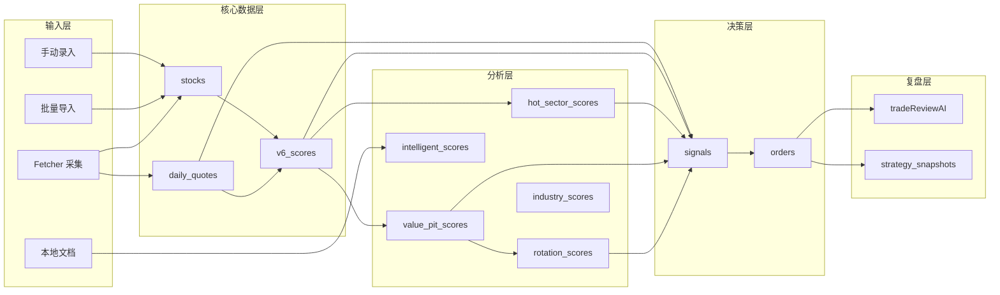

# V9 数据时间关系与生命周期蓝图

> **Status**: Current  
> **Version**: v1.1.0  
> **Last Updated**: 2026-06-30  
> **DB_VERSION**: 16（与 `src/config/dbConfig.ts` 导出值一致）
>
> 本文档定义 V9 系统数据产生、刷新、消费的全链路时序，以及各 Store 之间的 freshness 依赖关系，作为数据管线开发、调度与故障排查的比对基线。

---

## 1. 数据管线主时序

数据从采集到最终消费按以下 15 个阶段推进：

| 阶段 | 触发条件 | 输入 | 输出 Store | 关键时间字段 | 负责模块 |
|------|---------|------|-----------|-------------|---------|
| **P1 采集** | 手动 / 定时 / 事件 | 外部 API / 用户输入 | `stocks`, `daily_quotes` | `ingestedAt`, `updatedAt` | `fetcherService`, `TaskScheduler` |
| **P2 清洗** | 采集完成后 | `RawMarketData` | 标准化 `MarketData` | - | `MarketDataAdapter` |
| **P3 V6 评分** | 数据就绪 / 用户触发 | `stocks` + `daily_quotes` | `v6_scores` | `calculatedAt` | `v6ScoreService` |
| **P4 双策略评分** | P3 完成后 | `stocks` + `daily_quotes` + `v6_scores` | `hot_sector_scores`, `value_pit_scores` | `calculatedAt` | `hotSectorAnalyzer`, `valuePitAnalyzer` |
| **P5 板块轮动** | P4 后 / 日终定时 | `value_pit_scores` + sector 数据 | `rotation_scores` | `scoreDate`, `createdAt` | `rotationScoreService` |
| **P6 交易信号** | P4 后 / 数据变化 | `stocks` + `daily_quotes` + scores | `signals` | `createdAt` | `signalGenerator`, `dualStrategyEngine` |
| **P7 交易订单** | 信号 / 用户决策 | `stocks` + `signals` | `orders` | `createdAt` | `tradingService` |
| **P8 交易复盘** | 收盘后 / 手动 | `orders` + `daily_quotes` | `TradeReviewReport`（运行时输出） | `generatedAt` | `tradeReviewAI` |
| **P9 资讯处理** | 定时 / 事件 | 外部资讯源 | `news`, `sentiment_cache`, `news_stock_map` | `publishTime`, `fetchTime`, `analyzedAt` | `newsService` |
| **P10 智能评分** | 用户触发 | `stocks` + `local_docs` | `intelligent_scores` | `scoredAt` | `intelligentScoreService` |
| **P11 行业评分** | 用户触发 | sector 数据 | `industry_scores` | `scoredAt` | `industryScoreService` |
| **P12 缺失报告登记** | v15：采集/计算过程中 | 实际输入数据 | `missing_reports` | `detectedAt` | `data-collector`（自检） |
| **P13 执行计划** | v16：信号产生后 | `signals` + `stocks` | `executionPlans` | `createdAt` | `execution`（`executionPlanService`） |
| **P14 投资组合再平衡** | v16：执行完成后 | `executionPlans` + `orders` | `portfolios` | `updatedAt` | `portfolio`（`portfolioService`） |
| **P15 执行日志** | v15：执行计划/订单操作 | `executionPlans` + `orders` | `execution_logs` | `timestamp` | `execution`（`executionLogService`） |

---

## 2. 工作主线

---

## 3. 数据刷新频率与 Freshness 规则

### 3.1 刷新频率

| Store | 数据源 | 理想频率 | 可接受最大滞后 | 下游影响 |
|-------|--------|---------|---------------|---------|
| `stocks` | fetcher / 手动 | 日终 1 次 | 1 交易日 | 所有评分、交易、信号 |
| `daily_quotes` | fetcher | 日终 1 次 / 实时 15min | 1 交易日 | `v6_scores`, `signals`, 策略评分 |
| `v6_scores` | 规则引擎 | `daily_quotes` 更新后 | 与 `daily_quotes` 同步 | `hot_sector_scores`, `value_pit_scores` |
| `hot_sector_scores` | 策略引擎 | `v6_scores` 更新后 | 与 `v6_scores` 同步 | `dualStrategyEngine`, `signals` |
| `value_pit_scores` | 策略引擎 | `v6_scores` 更新后 | 与 `v6_scores` 同步 | `dualStrategyEngine`, `signals` |
| `rotation_scores` | 轮动引擎 | 日终 1 次 | 1 交易日 | 策略信号 |
| `signals` | 信号引擎 | 数据变化 / 5min | 5 分钟 | `tradingService`, UI |
| `orders` | 用户 | 实时 | 实时 | 持仓、复盘 |
| `news` | 资讯源 | 15min / 事件 | 30min | 情绪、个股关联 |
| `sentiment_cache` | 情绪分析器 | 首次分析后缓存 | 无过期（需手动刷新） | `news` |
| `missing_reports` | data-collector 自检 | 采集/计算异常时实时 | 实时 | 缺口告警 UI |
| `executionPlans` | execution | 信号产生后 | 实时 | `signals` |
| `portfolios` | portfolio | 执行完成后 / 用户调整 | 实时 | 持仓视图、再平衡 |
| `execution_logs` | execution | 计划/订单操作时 | 实时 | 审计、回溯 |

### 3.2 时间一致性规则

所有计算类输出必须满足以下 freshness 约束。已实现运行时校验的规则在「运行时校验」列标注调用位置。

| # | 规则 | 时间约束 | 运行时校验 |
|---|------|---------|-----------|
| 1 | V6 评分必须基于最新行情 | `v6_scores.calculatedAt >= daily_quotes.updatedAt` | ✅ `v6ScoreService.runV6Score` 调用 `checkV6ScoreFreshness` |
| 2 | 策略评分必须基于最新 V6 评分 | `hot_sector_scores.calculatedAt >= v6_scores.calculatedAt` | ✅ `hotSectorAnalyzer.analyzeBySymbol` 调用 `checkStrategyScoreFreshness` |
| 2 | 策略评分必须基于最新 V6 评分 | `value_pit_scores.calculatedAt >= v6_scores.calculatedAt` | ✅ `valuePitAnalyzer.analyzeBySymbol` 调用 `checkStrategyScoreFreshness` |
| 3 | 交易信号必须基于最新行情 | `signals.createdAt >= daily_quotes.updatedAt` | ✅ `signalGenerator.generateSignalsForSymbol` 调用 `checkSignalFreshness` |
| 4 | 订单价格应来自最新 `stock.price` | `orders.createdAt >= stock.updatedAt`（价格拉取后） | ✅ `tradingService.createOrderWithRiskCheck` 调用 `checkOrderPriceFreshness` |
| 5 | 复盘必须覆盖到最新订单 | `tradeReviewReport.generatedAt >= max(orders.createdAt)` | ✅ `tradeReviewAI.generateReview` / `generateReviewAsync` 调用 `checkReviewFreshness` |
| 6 | 资讯情绪缓存分析时间必须晚于文章发布 | `sentiment_cache.analyzedAt >= news.publishTime` | ✅ `newsService.saveNewsArticle` 调用 `checkSentimentCacheFreshness` |

> **说明**：当前实现采用「非阻塞校验」模式。`dataFreshnessGuard` 发现违规时记录 `warn` 日志并返回 `valid: false`，但不会中断计算流程，以免影响演示与测试场景。未来可根据需要在关键路径切换为阻塞模式。

---

## 4. 个股定性数据流

个股定性标签（核心赛道、价值洼地、热门板块）在 V9 中通过以下 Store 承载：

| 定性标签 | 来源 Store | 判断逻辑 | 消费方 |
|---------|-----------|---------|--------|
| 核心赛道 | `sector_scores` / `industry_scores` | `isCore === true` 或行业评分高且属于十五五规划核心行业 | 选股策略、组合构建 |
| 价值洼地 | `value_pit_scores` | `action === 'immediate'` 或 `'probe'`，且估值/催化维度得分高 | `dualStrategyEngine`, `signals` |
| 热门板块 | `hot_sector_scores` | `action === 'immediate'`，动量/情绪/技术维度得分高 | `dualStrategyEngine`, `signals` |

---

## 5. 交易筹码分布与波动复盘

### 5.1 筹码分布计算

交易筹码分布由 V6 引擎 L8 层计算，存储于 `v6_scores.factors`（未来可扩展独立 `chip_scores` Store）。

计算输入来自 `daily_quotes.history`：

- **SCD**（股东人数变化度代理）：20 日收益率 + 波动率综合
- **PCH**（筹码集中度代理）：近 20 日平均换手率反比
- **MATRIX**（筹码-动量矩阵）：价格与均线位置
- **RSI**、**CCS**、**DIV**、**CSR** 等指标综合

### 5.2 筹码波动复盘

复盘链路：

1. `orders` 提供买卖时点、价格、数量
2. `daily_quotes` 提供复盘期间的 K 线走势
3. `tradeReviewAI` 结合筹码指标（L8）与订单数据生成六维复盘报告
4. 输出包含纪律评分、错误分类、技能发展建议、行动计划

---

## 6. 异常场景与处理原则

| 异常 | 影响 | 处理原则 |
|------|------|---------|
| `daily_quotes` 缺失 | V6 评分、信号、策略均降级 | 记录 `qualityWarning`，允许使用基础数据或模拟分降级 |
| `v6_scores` 过期 | 策略评分基于旧数据 | 触发重新计算，UI 显示数据过期警告 |
| `orders` 与 `daily_quotes` 时间错位 | 复盘结果不准确 | 复盘时过滤时间窗口，缺失行情跳过该订单 |
| `news` 重复 | 存储膨胀、情绪重复计算 | 基于 `hash` 去重，缓存命中直接复用 |

---

## 7. 治理基线

- 所有计算输出必须携带时间戳字段，便于 freshness 校验
- 新增数据管线阶段必须同步更新本蓝图与 `docs/blueprints/v9-pipeline-sequence.mmd`
- 调度器 `TaskScheduler` 配置频率必须与本蓝图第 3 章一致
