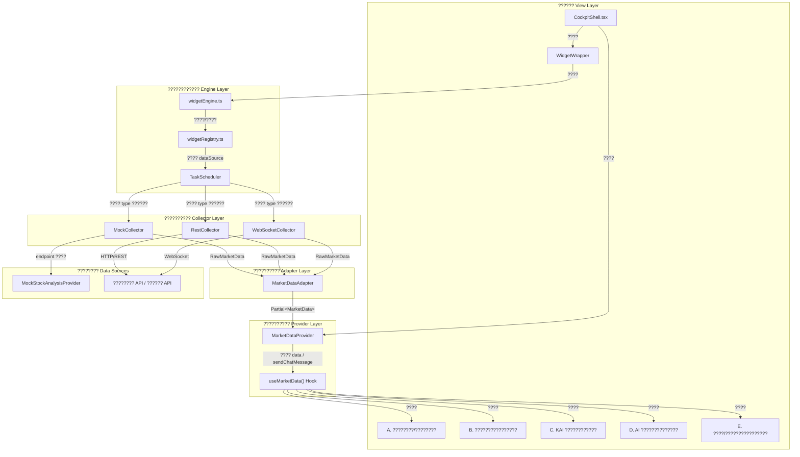
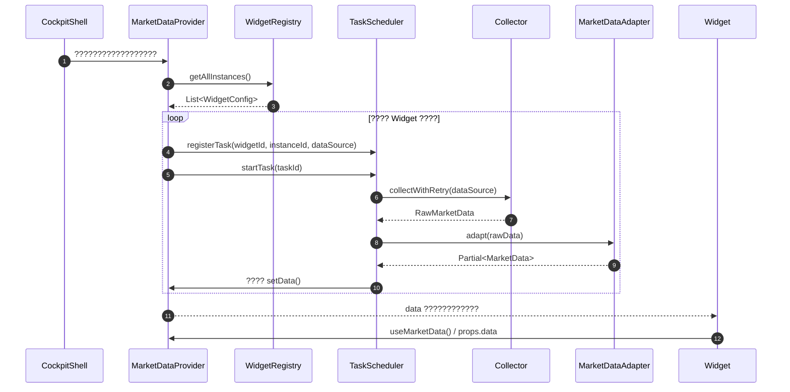
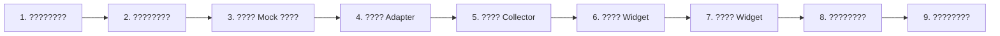
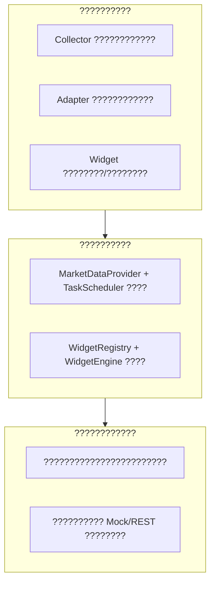

# ???????????????? V9 ?? ?????? Widget ????????

> ???????????????????? AI ??????????????????????????????Cockpit??Widget ???????????????????????????????????????????????? Widget ????????????????SOP????
> ???????????????????????????????????????????????????????????????????????? Widget??

---

## 1. ????????

???????? **React 19 + TypeScript + Vite** ???????????????????? **React-Grid-Layout** ???????????????????? Widget ?????????????????????????????????? `MarketData` ?????????? `MarketDataProvider` ?????????????????????????? `TaskScheduler` + `Collector` ?????????? Mock / REST / WebSocket ????????????????????

### 1.1 ????????????

| ???? | ???? |
|------|------|
| **????????** | ???????????????????????????????????????????? `src/constants/cockpit.constants.ts` |
| **????????** | Widget ???????????????????????????????????? `src/cockpit/core/widgetRegistry.ts` |
| **????????????** | ?????????????? `MarketData`???????????????? API |
| **??????????** | ???????????? `VITE_DATA_SOURCE_TYPE` ???? Mock / REST / WebSocket?????????????? |
| **??????????** | `MarketDataAdapter` ???????????????? JSON ?????????? `MarketData` ???? |

### 1.2 ??????



### 1.3 ????????????



---

## 2. ??????????????????

### 2.1 ???????????? `RawMarketData.dataType`

| ?????? | ???? | ???? MarketData ???? | ???????? |
|--------|------|----------------------|----------|
| `indices` | ???????? | `MarketData.indices` | `/market/indices` |
| `sectors` | ?????????? | `MarketData.sectors` | `/market/sectors` |
| `fundFlow` | ???????? | `MarketData.fundFlows` | `/market/fund-flow` |
| `sentiment` | ???????? | `MarketData.sentiment` | `/market/sentiment` |
| `watchlist` | ?????? | `MarketData.watchlist` | `/user/watchlist` |
| `portfolio` | ???????? | `MarketData.portfolio` | `/user/portfolio` |
| `tradeReview` | AI ???????? | `MarketData.tradeReview` | `/ai/trade-review` |
| `analysisScores` | ???????? / KAI ???? | `MarketData.analysisScores` | `/stock-analysis/profile` `/stock-analysis/kai` |
| `modelComparison` | AI ?????????? | `MarketData.modelComparison` | `/stock-analysis/compare` |
| `stockPool` | ?????????? | `MarketData.stockPool` | `/stock-analysis/pool` |
| `chatHistory` | ???????? | `MarketData.chatHistory` | `/stock-analysis/chat` |

### 2.2 ?????????? `DataSourceType`

| ?????? | ???? | ???????? |
|--------|------|----------|
| `mock` | ???????????????? | ?????????????????? |
| `rest` | HTTP/REST ???? | ???????????????????? API |
| `websocket` | WebSocket ?????? | ???????????????? |

### 2.3 ???????? `CollectionMode`

| ?????? | ???? | ???? Widget |
|--------|------|-------------|
| `polling` | ???????? | ?????? Widget??????????KAI ?????? |
| `once` | ?????????? | ??????/?????? Widget??AI ?????????????????????? |
| `streaming` | ???????? | WebSocket ???????????????? |

### 2.4 ??????????????????????

| ?????? | ???? | ?????? |
|--------|------|--------|
| `STOCK_COLOR_TOKENS` | A ?????????????? | `UP` / `DOWN` / `UP_CLASS` / `DOWN_CLASS` |
| `SCORE_LEVELS` | ??????????????/????/????/????/???? | `EXCELLENT` / `GOOD` / `AVERAGE` / `POOR` / `BAD` |
| `KAI_DIMENSION_NAMES` | KAI ???????????? | `COMPETITIVENESS` / `TECHNICAL` / `FUNDAMENTAL` ?? |
| `LLM_MODEL_VERSIONS` | ?????????????????? | `KAILLM_V2_1` / `BASELINE_V1_5` ?? |
| `INVESTMENT_PROFILE_METRICS` | ???????????????? | `ABILITY` / `STYLE` / `RISK_CONTROL` ?? |
| `STOCK_POOL_STATUS_COLORS` | ??????????/?????????? | `ACTIVE` / `WARM` / `COOL` / `COLD` |

---

## 3. ????????

```text
src/
?????? cockpit/                          # ??????????
??   ?????? CockpitShell.tsx              # ???????????????? MarketDataProvider ?? GridLayout
??   ?????? core/
??   ??   ?????? widgetEngine.ts           # Widget ??????????????????
??   ??   ?????? widgetRegistry.ts         # Widget ??????????????????
??   ?????? data/
??   ??   ?????? mockDataProvider.ts       # ???????? Mock ????
??   ?????? providers/
??   ??   ?????? MarketDataProvider.tsx    # ????????????????????????????
??   ?????? widgets/                      # Widget ??????
??       ?????? InvestmentProfileWidget.tsx   # A. ????????/????????
??       ?????? StockPoolWidget.tsx           # B. ????????????????
??       ?????? KaiScoreWidget.tsx            # C. KAI ????????????
??       ?????? ModelCompareWidget.tsx        # D. AI ??????????????
??       ?????? StockChatWidget.tsx           # E. ????/????????????????
??       ?????? ...                           # ???????? Widget
?????? components/ui/                    # ???? UI ??????Button/Card/Table/Select ????
?????? constants/
??   ?????? cockpit.constants.ts          # ??????????????????????????????????????????????????
?????? services/
??   ?????? data-collector/
??   ??   ?????? MarketDataAdapter.ts      # ????????????????????
??   ??   ?????? TaskScheduler.ts          # ??????????????????????????????
??   ??   ?????? collectors/
??   ??       ?????? BaseCollector.ts      # ????????????????/????/??????
??   ??       ?????? MockCollector.ts      # Mock ??????????
??   ??       ?????? RestCollector.ts      # REST ??????
??   ??       ?????? WebSocketCollector.ts # WebSocket ??????
??   ?????? stock-analysis/
??       ?????? mockStockAnalysisProvider.ts  # ???????????? Mock ????????
?????? types/
??   ?????? modules/
??       ?????? widget.types.ts           # Widget ??????????????????????
?????? lib/
    ?????? logger.ts                     # ????????
    ?????? eventBus.ts                   # ????????
    ?????? utils.ts                      # ??????????cn ????

tests/                                # ????????????
?????? setup.ts                          # Vitest ????????
?????? services/
??   ?????? MockCollector.test.ts         # MockCollector ????????????????
??   ?????? MarketDataAdapter.test.ts     # Adapter ????????????
?????? ...                               # ????????
```

---

## 4. ?????????????? Widget ?? SOP

### 4.1 ????????



### 4.2 ????????

#### Step 1 ?? ?? `src/types/modules/widget.types.ts` ??????????

1. ???? `RawMarketData.dataType` ???????????????????????????? `'myDimension'`??
2. ???? `MarketData` ???????????????????? `myDimension: MyDimensionData`??
3. ???? `MyDimensionData` ????????????

> ??????????????????????????????????????????????????????????

#### Step 2 ?? ?? `src/constants/cockpit.constants.ts` ??????????

1. ??????????/????/??????????????????????????????????
2. ?? `WIDGET_DEFAULT_DATA_SOURCE` ?????? Widget ????????????
   - `type: ACTIVE_DATA_SOURCE`
   - `mode: 'polling' | 'once' | 'streaming'`
   - `endpoint: '/my-service/my-dimension'`
   - `interval: COLLECTOR_DEFAULT_CONFIG.DEFAULT_POLLING_INTERVAL`
3. ?? `DEFAULT_WIDGET_CONFIG` ??????????????????????

#### Step 3 ?? ?? `src/services/stock-analysis/mockStockAnalysisProvider.ts` ???? Mock ????

1. ???????????????????? `generateMyDimension()`????
2. ?? `MockStockAnalysisProvider` ?????????????????? `getMyDimension()`????
3. ?????????????????????????????? API ????????

#### Step 4 ?? ???? `src/services/data-collector/MarketDataAdapter.ts`

1. ?? `adapt()` ?? `switch` ?????? `case 'myDimension':`??
2. ???????? `adaptMyDimension(payload: unknown): MyDimensionData` ??????
3. ???????????????????????????????????????? JSON ??????
4. ?? `merge()` ?????? `getDefaultMyDimension()` ????????

#### Step 5 ?? ???? `src/services/data-collector/collectors/MockCollector.ts`

1. ?? `collect()` ?? endpoint ????????????????
   ```ts
   if (endpoint.includes('my-dimension')) {
     const data = await MockStockAnalysisProvider.getMyDimension()
     return this.wrapData('myDimension', data, 'mock')
   }
   ```

#### Step 6 ?? ???? Widget ????

1. ?? `src/cockpit/widgets/` ???? `MyDimensionWidget.tsx`??
2. ???? Props ??????
   ```ts
   interface MyDimensionWidgetProps {
     config: WidgetConfig
     data?: MarketData
   }
   ```
3. ???? `const marketData = useMarketData()`?????? `data ?? marketData.data` ??????????
4. ???????????????????????????? `cockpit.constants.ts` ??????
5. ????????????????????????????????????/???? API??

#### Step 7 ?? ?? `src/cockpit/core/widgetRegistry.ts` ?????? Widget

1. ?? `registerDefaultWidgets()` ?????????? `WidgetTemplate`??
   ```ts
   {
     meta: {
       id: 'myDimension',
       name: DEFAULT_WIDGET_CONFIG.myDimension.title,
       category: DEFAULT_WIDGET_CONFIG.myDimension.category,
       description: '...',
       defaultSize: DEFAULT_WIDGET_CONFIG.myDimension.size,
       defaultDataSource: WIDGET_DEFAULT_DATA_SOURCE.myDimension,
     },
     component: () => import('@/cockpit/widgets/MyDimensionWidget'),
   }
   ```
2. ?? `createDefaultInstances()` ????????????????????

#### Step 8 ?? ????????????

1. ?? `tests/services/MockCollector.test.ts` ?????????????????? endpoint ?????? `RawMarketData` ??????
2. ?? `tests/services/MarketDataAdapter.test.ts` ???????????????????? payload ????????????????????????

#### Step 9 ?? ????????

```bash
npm run tsc:prod
npm run test
npm run build
```

---

## 5. ????????????

### 5.1 ????????



### 5.2 ??????????????

| ???? | ?????? | ???? |
|------|--------|------|
| ???????? | Mock ??????????????Adapter ?????????????????? | Vitest |
| ???????? | Provider ??????????TaskScheduler ???????? | Vitest + @testing-library/react |
| E2E ???? | ??????????Widget ?????????????? Mock | Playwright |

### 5.3 ????????????

- `npm run lint`??ESLint ??????
- `npm run tsc:prod`??TypeScript ??????????????
- `npm run test`???????????????? 100%??
- `npm run build`????????????????

---

## 6. ????????????

| ?????? | ???? | ?????? | ?????? |
|--------|------|--------|--------|
| `VITE_DATA_SOURCE_TYPE` | ?????????? | `mock` | `mock` / `rest` / `websocket` |
| `VITE_API_BASE_URL` | REST API ???????? | `/api` | `https://api.example.com` |
| `VITE_WS_URL` | WebSocket ???? | `ws://localhost:8080/ws` | `wss://ws.example.com` |
| `VITE_LLM_BASE_URL` | ?????? API ???? | ?? | `https://api.deepseek.com/v1` |
| `VITE_LLM_API_KEY` | ?????? API ???? | ?? | `sk-...` |
| `VITE_LLM_MODEL` | ???????????? | ?? | `deepseek-chat` |

---

## 7. ????????

1. **????????????????????**?????????????? `useMarketData()` ?? `data` props ??????
2. **????????????**??????????????????????????????????????????????????????
3. **Adapter ????**??????????????????Adapter ??????????????????????????????????
4. **??????????????**?????? Mock ???????????????????????????? ???????????????? API?? ????????
5. **???? Widget ???? SOP**??????????????????????????Mock??Adapter??Collector??????????????????
