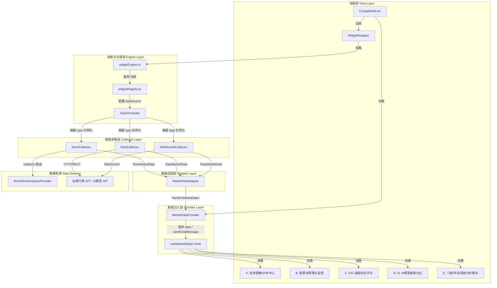
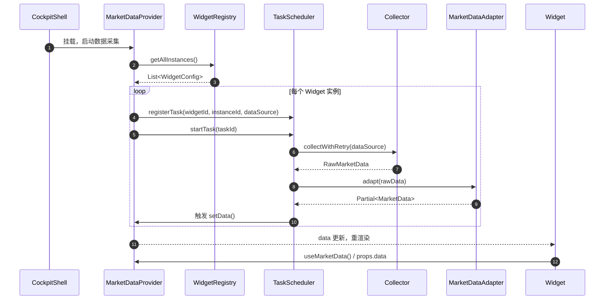
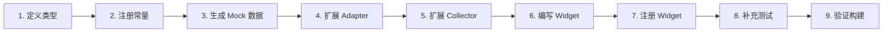
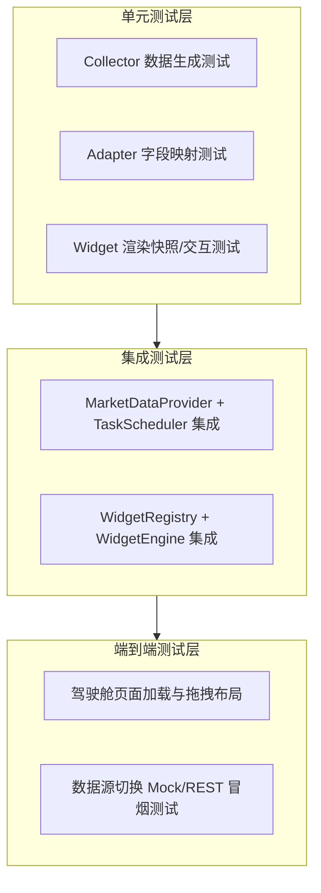

covers_code:
  - src/constants/cockpit.constants.ts
  - src/cockpit/core/widgetRegistry.ts
  - src/types/modules/widget.types.ts
  - src/services/stock-analysis/mockStockAnalysisProvider.ts


# 智能投研复盘系统 V9 — 驾驶舱 Widget 架构说明

> 本文档面向后续接入的 AI 智能体与研发人员，说明驾驶舱（Cockpit）Widget 化框架的整体架构、核心数据流转、枚举映射以及新增 Widget 的标准作业程序（SOP）。
> 阅读本文档后，应能在不深入业务代码细节的前提下，理解如何扩展新的金融维度 Widget。

---

## 1. 架构总览

系统采用 **React 19 + TypeScript + Vite** 构建，驾驶舱模块基于 **React-Grid-Layout** 实现可拖拽、可缩放的 Widget 化布局。所有金融业务数据统一收敛到 `MarketData` 接口，通过 `MarketDataProvider` 注入视图层；底层采集逻辑由 `TaskScheduler` + `Collector` 负责，支持 Mock / REST / WebSocket 三种数据源无缝切换。

### 1.1 核心设计原则

| 原则 | 说明 |
|------|------|
| **无硬编码** | 所有数值、颜色、维度名称、模型版本号均定义在 `src/constants/cockpit.constants.ts` |
| **注册中心** | Widget 的元数据、默认尺寸、数据源策略集中在 `src/cockpit/core/widgetRegistry.ts` |
| **统一数据接口** | 视图组件只消费 `MarketData`，不直接调用后端 API |
| **数据源隔离** | 通过环境变量 `VITE_DATA_SOURCE_TYPE` 切换 Mock / REST / WebSocket，视图层零侵入 |
| **数据适配器** | `MarketDataAdapter` 将不同来源的原始 JSON 映射为标准 `MarketData` 结构 |

### 1.2 架构图



### 1.3 数据流转时序



---

## 2. 核心抽象与枚举映射

### 2.1 数据类型枚举 `RawMarketData.dataType`

| 枚举值 | 含义 | 对应 MarketData 字段 | 典型端点 |
|--------|------|----------------------|----------|
| `indices` | 大盘指数 | `MarketData.indices` | `/market/indices` |
| `sectors` | 板块热力图 | `MarketData.sectors` | `/market/sectors` |
| `fundFlow` | 资金流向 | `MarketData.fundFlows` | `/market/fund-flow` |
| `sentiment` | 市场情绪 | `MarketData.sentiment` | `/market/sentiment` |
| `watchlist` | 自选股 | `MarketData.watchlist` | `/user/watchlist` |
| `portfolio` | 持仓概览 | `MarketData.portfolio` | `/user/portfolio` |
| `tradeReview` | AI 交易复盘 | `MarketData.tradeReview` | `/ai/trade-review` |
| `analysisScores` | 投资画像 / KAI 评分 | `MarketData.analysisScores` | `/stock-analysis/profile` `/stock-analysis/kai` |
| `modelComparison` | AI 大模型对比 | `MarketData.modelComparison` | `/stock-analysis/compare` |
| `stockPool` | 股票池列表 | `MarketData.stockPool` | `/stock-analysis/pool` |
| `chatHistory` | 聊天历史 | `MarketData.chatHistory` | `/stock-analysis/chat` |

### 2.2 数据源类型 `DataSourceType`

| 枚举值 | 说明 | 使用场景 |
|--------|------|----------|
| `mock` | 本地随机模拟数据 | 开发环境、单元测试 |
| `rest` | HTTP/REST 请求 | 生产环境调用证券行情 API |
| `websocket` | WebSocket 长连接 | 生产环境实时推送 |

### 2.3 采集模式 `CollectionMode`

| 枚举值 | 说明 | 典型 Widget |
|--------|------|-------------|
| `polling` | 定时轮询 | 行情类 Widget（股票池、KAI 评分） |
| `once` | 只采集一次 | 配置类/复盘类 Widget（AI 交易复盘、聊天初始化） |
| `streaming` | 流式推送 | WebSocket 实时行情（预留） |

### 2.4 新增业务颜色与维度常量

| 常量名 | 用途 | 关键键 |
|--------|------|--------|
| `STOCK_COLOR_TOKENS` | A 股红涨绿跌颜色 | `UP` / `DOWN` / `UP_CLASS` / `DOWN_CLASS` |
| `SCORE_LEVELS` | 评分等级（优秀/良好/一般/较弱/差） | `EXCELLENT` / `GOOD` / `AVERAGE` / `POOR` / `BAD` |
| `KAI_DIMENSION_NAMES` | KAI 六大维度名称 | `COMPETITIVENESS` / `TECHNICAL` / `FUNDAMENTAL` 等 |
| `LLM_MODEL_VERSIONS` | 大模型版本下拉选项 | `KAILLM_V2_1` / `BASELINE_V1_5` 等 |
| `INVESTMENT_PROFILE_METRICS` | 投资画像指标名称 | `ABILITY` / `STYLE` / `RISK_CONTROL` 等 |
| `STOCK_POOL_STATUS_COLORS` | 股票池资金/筹码活跃度 | `ACTIVE` / `WARM` / `COOL` / `COLD` |

---

## 3. 目录结构

```text
src/
├── cockpit/                          # 驾驶舱核心
│   ├── CockpitShell.tsx              # 驾驶舱外壳，整合 MarketDataProvider 与 GridLayout
│   ├── core/
│   │   ├── widgetEngine.ts           # Widget 组件动态加载与缓存
│   │   └── widgetRegistry.ts         # Widget 注册中心与默认实例
│   ├── data/
│   │   └── mockDataProvider.ts       # 原有市场 Mock 数据
│   ├── providers/
│   │   └── MarketDataProvider.tsx    # 统一数据上下文与采集任务调度
│   └── widgets/                      # Widget 组件库
│       ├── InvestmentProfileWidget.tsx   # A. 投资画像/分析中心
│       ├── StockPoolWidget.tsx           # B. 股票池管理与监控
│       ├── KaiScoreWidget.tsx            # C. KAI 选股综合评分
│       ├── ModelCompareWidget.tsx        # D. AI 大模型智能对比
│       ├── StockChatWidget.tsx           # E. 个股/市场深度分析聊天
│       └── ...                           # 其他已有 Widget
├── components/ui/                    # 通用 UI 组件（Button/Card/Table/Select 等）
├── constants/
│   └── cockpit.constants.ts          # 驾驶舱全部常量（颜色、维度、模型版本、数据源配置）
├── services/
│   ├── data-collector/
│   │   ├── MarketDataAdapter.ts      # 原始数据标准化适配器
│   │   ├── TaskScheduler.ts          # 采集任务注册、启动、停止、轮询
│   │   └── collectors/
│   │       ├── BaseCollector.ts      # 采集器基类（超时/重试/取消）
│   │       ├── MockCollector.ts      # Mock 数据采集器
│   │       ├── RestCollector.ts      # REST 采集器
│   │       └── WebSocketCollector.ts # WebSocket 采集器
│   └── stock-analysis/
│       └── mockStockAnalysisProvider.ts  # 新增金融业务 Mock 数据生成
├── types/
│   └── modules/
│       └── widget.types.ts           # Widget 框架与金融业务数据类型
└── lib/
    ├── logger.ts                     # 日志工具
    ├── eventBus.ts                   # 事件总线
    └── utils.ts                      # 工具函数（cn 等）

tests/                                # 单元测试目录
├── setup.ts                          # Vitest 全局配置
├── services/
│   ├── MockCollector.test.ts         # MockCollector 随机数据生成测试
│   └── MarketDataAdapter.test.ts     # Adapter 字段映射测试
└── ...                               # 其他测试
```

---

## 4. 添加新金融维度 Widget 的 SOP

### 4.1 步骤概览



### 4.2 详细步骤

#### Step 1 — 在 `src/types/modules/widget.types.ts` 中定义类型

1. 扩展 `RawMarketData.dataType` 联合类型，新增业务标识，例如 `'myDimension'`。
2. 扩展 `MarketData` 接口，新增字段，例如 `myDimension: MyDimensionData`。
3. 新增 `MyDimensionData` 及其子类型。

> 禁止在视图组件中内联定义业务类型；所有类型必须来自此文件。

#### Step 2 — 在 `src/constants/cockpit.constants.ts` 中注册常量

1. 如新增维度/颜色/模型版本，在文件顶部追加映射常量。
2. 在 `WIDGET_DEFAULT_DATA_SOURCE` 中为新 Widget 注册数据源：
   - `type: ACTIVE_DATA_SOURCE`
   - `mode: 'polling' | 'once' | 'streaming'`
   - `endpoint: '/my-service/my-dimension'`
   - `interval: COLLECTOR_DEFAULT_CONFIG.DEFAULT_POLLING_INTERVAL`
3. 在 `DEFAULT_WIDGET_CONFIG` 中注册默认尺寸与标题。

#### Step 3 — 在 `src/services/stock-analysis/mockStockAnalysisProvider.ts` 生成 Mock 数据

1. 添加数据生成函数（如 `generateMyDimension()`）。
2. 在 `MockStockAnalysisProvider` 上暴露静态方法（如 `getMyDimension()`）。
3. 添加清晰注释说明未来替换为真实 API 的端点。

#### Step 4 — 扩展 `src/services/data-collector/MarketDataAdapter.ts`

1. 在 `adapt()` 的 `switch` 中新增 `case 'myDimension':`。
2. 实现私有 `adaptMyDimension(payload: unknown): MyDimensionData` 方法。
3. 支持字段别名映射，便于接入不同后端返回的 JSON 结构。
4. 在 `merge()` 中提供 `getDefaultMyDimension()` 默认值。

#### Step 5 — 扩展 `src/services/data-collector/collectors/MockCollector.ts`

1. 在 `collect()` 的 endpoint 路由中新增分支：
   ```ts
   if (endpoint.includes('my-dimension')) {
     const data = await MockStockAnalysisProvider.getMyDimension()
     return this.wrapData('myDimension', data, 'mock')
   }
   ```

#### Step 6 — 编写 Widget 组件

1. 在 `src/cockpit/widgets/` 新建 `MyDimensionWidget.tsx`。
2. 组件 Props 类型：
   ```ts
   interface MyDimensionWidgetProps {
     config: WidgetConfig
     data?: MarketData
   }
   ```
3. 使用 `const marketData = useMarketData()`，并用 `data ?? marketData.data` 获取数据。
4. 所有颜色、维度名称、数值均从 `cockpit.constants.ts` 读取。
5. 在注释中标注哪些数据待替换为真实证券/量化 API。

#### Step 7 — 在 `src/cockpit/core/widgetRegistry.ts` 中注册 Widget

1. 在 `registerDefaultWidgets()` 数组中新增 `WidgetTemplate`：
   ```ts
   {
     meta: {
       id: 'myDimension',
       name: DEFAULT_WIDGET_CONFIG.myDimension.title,
       category: DEFAULT_WIDGET_CONFIG.myDimension.category,
       description: '...',
       defaultSize: DEFAULT_WIDGET_CONFIG.myDimension.size,
       defaultDataSource: WIDGET_DEFAULT_DATA_SOURCE.myDimension,
     },
     component: () => import('@/cockpit/widgets/MyDimensionWidget'),
   }
   ```
2. 在 `createDefaultInstances()` 中追加默认布局位置。

#### Step 8 — 补充单元测试

1. 在 `tests/services/MockCollector.test.ts` 中新增测试：验证新 endpoint 返回的 `RawMarketData` 结构。
2. 在 `tests/services/MarketDataAdapter.test.ts` 中新增测试：验证原始 payload 能正确映射为标准化类型。

#### Step 9 — 验证构建

```bash
npm run tsc:prod
npm run test
npm run build
```

---

## 5. 质量保障体系

### 5.1 测试分层



### 5.2 关键测试关注点

| 层级 | 关注点 | 工具 |
|------|--------|------|
| 单元测试 | Mock 数据生成范围、Adapter 字段映射、常量引用 | Vitest |
| 集成测试 | Provider 数据注入、TaskScheduler 生命周期 | Vitest + @testing-library/react |
| E2E 测试 | 页面渲染、Widget 拖拽、网络请求 Mock | Playwright |

### 5.3 代码质量门禁

- `npm run lint`：ESLint 通过。
- `npm run tsc:prod`：TypeScript 类型检查通过。
- `npm run test`：单元测试通过率 100%。
- `npm run build`：生产构建成功。

---

## 6. 环境变量说明

| 变量名 | 说明 | 默认值 | 典型值 |
|--------|------|--------|--------|
| `VITE_DATA_SOURCE_TYPE` | 数据源类型 | `mock` | `mock` / `rest` / `websocket` |
| `VITE_API_BASE_URL` | REST API 基础地址 | `/api` | `https://api.example.com` |
| `VITE_WS_URL` | WebSocket 地址 | `ws://localhost:8080/ws` | `wss://ws.example.com` |
| `VITE_LLM_BASE_URL` | 大模型 API 地址 | — | `https://api.deepseek.com/v1` |
| `VITE_LLM_API_KEY` | 大模型 API 密钥 | — | `sk-...` |
| `VITE_LLM_MODEL` | 大模型模型名 | — | `deepseek-chat` |

---

## 7. 关键约定

1. **视图层不直接调用后端**：所有数据通过 `useMarketData()` 或 `data` props 获取。
2. **常量集中管理**：禁止在组件中硬编码颜色、维度名、模型版本、端点路径。
3. **Adapter 兜底**：任何字段缺失时，Adapter 必须返回合法默认值，避免组件崩溃。
4. **注释标注替换点**：所有 Mock 数据生成器和临时端点必须包含 “未来替换为真实 API” 的注释。
5. **新增 Widget 遵循 SOP**：必须同步更新类型、常量、Mock、Adapter、Collector、注册中心和测试。
