# DataBridge ??????????????????????????????

## ??????DataBridge ????????????

### 1.1 ????????????

DataBridge ?????? V9 ?????????????????????????*???????????????????*??????????????????????????????

| ?????? | ???????????? | ???????????? |
|------|---------|---------|
| **?????????????* | `forward()` - ACL ?????? + ???????DB/Manager/Strategy | [databridge.ts](../../../src/core/databridge.ts) |
| **?????????????* | `query()` - ?????? + ACL ?????? + ???????????? | [databridge.ts](../../../src/core/databridge.ts) |
| **????????????** | `subscribe()` - ????????????????????? | [databridge.ts](../../../src/core/databridge.ts) |
| **????????????** | `fallbackQueue` - ACL ???????????????????????????????????? | [fallbackQueue.ts](../../../src/core/fallbackQueue.ts) |

### 1.2 ??????????????????

```mermaid
graph TB
    subgraph DataBridge ???????        DB[DataBridge] -->|????????????| DH[databridgeHandlers]
        DB -->|??????| DS[databridgeStrategyRouter]
        DB -->|????????????| ENV[Envelope]
        DB -->|????????????| ACL[ACL Engine]
        DB -->|????????????| FB[FallbackQueue]
        DB -->|??????| MC[MemoryCache]
    end
    
    subgraph Handler ???????        DH --> Put[PutHandler]
        DH --> Delete[DeleteHandler]
        DH --> InsertStock[InsertStockHandler]
        DH --> UpdateStock[UpdateStockHandler]
        DH --> DeleteStock[DeleteStockHandler]
        DH --> Notify[NotificationHandler]
        DH --> LoadHoldings[LoadHoldingsDataHandler]
    end
    
    subgraph Strategy ??????
        DS --> HotSector[??????????????????]
        DS --> ValuePit[??????????????????]
        DS --> Rotation[??????????????????]
    end
```

### 1.3 ??????????????????

DataBridge.forward() ?????? action ??????????????????????????????????
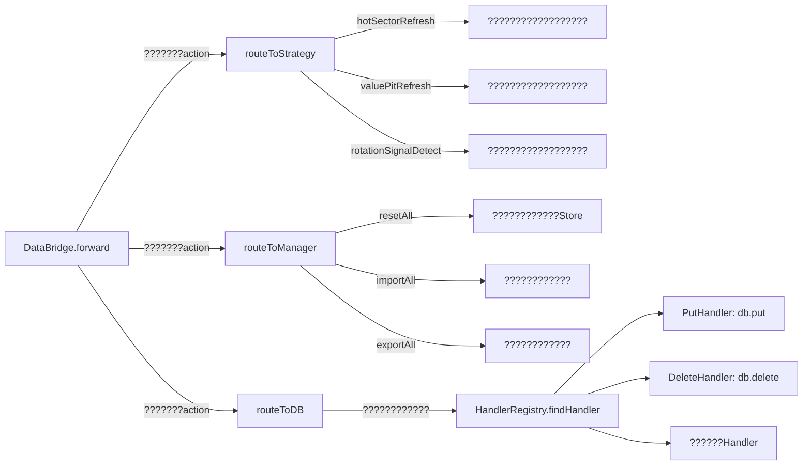

---

## ??????????????????????
### 2.1 ??????????????????

```mermaid
sequenceDiagram
    participant Fetcher as Fetcher??????
    participant Envelope as EnvelopeFactory
    participant DataBridge as DataBridge
    participant ACL as ACLEngine
    participant Handler as HandlerRegistry
    participant DB as IndexedDB
    participant Subscribers as DataBridge???????    
    Fetcher->>Envelope: create(meta, payload)
    Envelope-->>Fetcher: StandardEnvelope
    
    Fetcher->>DataBridge: forward(envelope)
    DataBridge->>DataBridge: validate(envelope)
    
    DataBridge->>ACL: assert(module, store, operation)
    ACL-->>DataBridge: OK/Error
    
    DataBridge->>DataBridge: writeAuditLog()
    
    alt ???????action
        DataBridge->>DataBridge: routeToStrategy()
        DataBridge->>DataBridge: broadcast(strategy:xxx)
    else ???????action  
        DataBridge->>DataBridge: routeToManager()
    else ???????action
        DataBridge->>Handler: findHandler(action)
        Handler-->>DataBridge: Handler??????
        DataBridge->>Handler: handle(envelope, store)
        Handler->>DB: db.put/db.delete
        
        DataBridge->>DataBridge: invalidateCache(store)
        DataBridge->>DataBridge: broadcast(store)
        DataBridge->>Subscribers: ???????????????????    end
```

### 2.2 ????????????????????????

| ???????????? | EnvelopeAction | Store | Handler | ???????????? |
|---------|---------------|-------|---------|---------|
| ?????????????????? | `INSERT_STOCK` | stocks | InsertStockHandler | fetcher, stockpool |
| ???????????? | `SAVE_DAILY_QUOTES` | daily_quotes | PutHandler | fetcher |
| ???????????? | `SAVE_FINANCIAL_REPORT` | financial_reports | PutHandler | fetcher |
| ???????????? | `SAVE_NEWS` | news | PutHandler | news |
| ???????????? | `SAVE_SENTIMENT_CACHE` | sentiment_cache | PutHandler | news |

### 2.3 ????????????????????????

[InsertStockHandler](../../../src/core/databridgeHandlers.ts) ????????????????????????

```typescript
// stocks store ?keyPath ?'symbol'?????????????????? IndexedDB ??????
if (!stock.symbol || stock.symbol === '') {
  throw new EnvelopeError(`insertStock Rejected: missing or empty "symbol" field`)
}
```

### 2.4 ????????????????????????

[DeleteStockHandler](../../../src/core/databridgeHandlers.ts) ?????????????????????????
```mermaid
graph TD
    DeleteStock[deleteStock: symbol] --> Step1[?????? stocks ?????????]
    
    Step1 --> Step2a[????????????: v6Scores/dailyQuotes/hotSectorScores/valuePitScores]
    Step1 --> Step2b[????????????: intelligentScores/scoreDocs/localDocs/newsStockMap]
    Step1 --> Step2c[????????????: orders/signals/watchlists]
    
    Step2a -->|???????symbol| PK[db.delete(store, symbol)]
    Step2b -->|???????by-symbol| Index[db.getAllByIndex + db.delete]
    Step2c -->|??????????????????| Scan[db.getAll + filter + db.delete]
```

---

## ?????????????????????????????????

### 3.1 V6 ?????????????????????L-1 ~ L8?
```mermaid
graph LR
    subgraph V6????????????
        L0[??????????????????]
        L1[???????????????]
        L2[???????????????]
        L3[???????????????]
        L4[???????????????]
        L5[???????????????]
        L6[???????????????]
        L7[???????????????]
        L8[???????????????]
    end
    
    L0 --> L1
    L1 --> L2 --> L3 --> L4 --> L5 --> L6 --> L7 --> L8
    
    subgraph ?????????????        Stock[??????????????????] --> L1
        Quotes[K?????????] --> L3
        Financial[????????????] --> L2
        News[????????????] --> L4
        Industry[????????????] --> L0
    end
    
    L8 --> Output[CompositeScore ?V6Score]
```

### 3.2 V6 ??????????????????

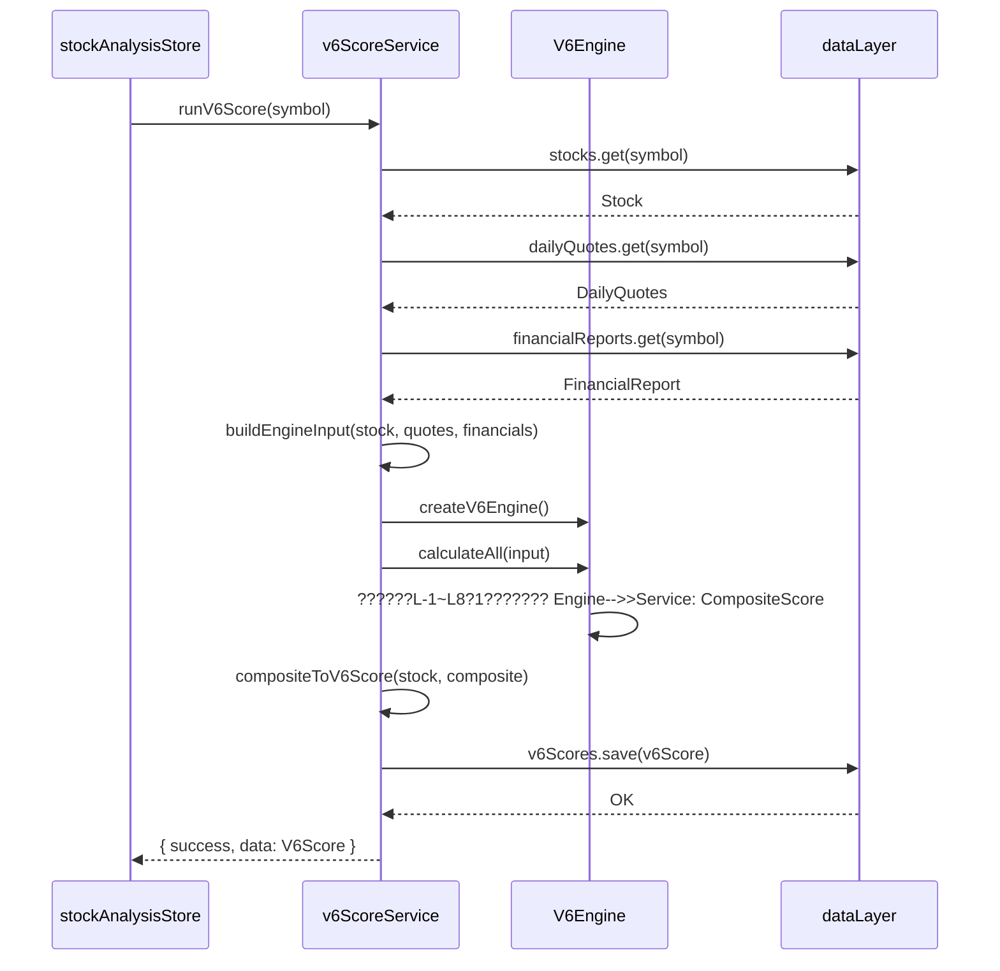

### 3.3 V6 ??????????????????

[v6ScoreService.ts](../../../src/services/scoring/v6ScoreService.ts) ????????????????????????????????????

```typescript
// ???????????????????const totalLayers = Object.keys(composite.layers).length
const scoredLayers = Object.values(composite.layers).filter((l) => l.score > 0).length
const dataCompleteness = totalLayers > 0 ? (scoredLayers / totalLayers) * 100 : 0

// ??????100%???????????????????if (dataCompleteness < 100) {
  v6Score.qualityWarning = `?????????????${dataCompleteness.toFixed(0)}%`
}
```

---

## ??????????????????????
### 4.1 ????????????????????????

```mermaid
graph TB
    subgraph ?????????????        Route[routeToStrategy] --> HS[handleHotSectorRefresh]
        Route --> VP[handleValuePitRefresh]
        Route --> RS[handleRotationSignalDetect]
    end
    
    subgraph ??????????????????
        HS --> Momentum[????????????: 35%]
        HS --> Sentiment[????????????: 25%]
        HS --> Breakout[?????????? 20%]
        HS --> Valuation[?????????? 15%]
        HS --> MarketEnv[????????????: 5%]
        Momentum -->|????????????| HSScore[HotSectorScore]
        Sentiment --> HSScore
        Breakout --> HSScore
        Valuation --> HSScore
        MarketEnv --> HSScore
    end
    
    subgraph ????????????????        VP --> Catalyst[????????????? 30%]
        VP --> ValuationP[???????????????: 25%]
        VP --> Chip[????????????: 20%]
        VP --> RotationP[????????????: 15%]
        VP --> Liquidity[??????? 10%]
        Catalyst -->|????????????| VPScore[ValuePitScore]
        ValuationP --> VPScore
        Chip --> VPScore
        RotationP --> VPScore
        Liquidity --> VPScore
    end
    
    subgraph ????????????????        RS --> Volume[???????????????]
        RS --> Capital[????????????]
        RS --> GoldenCross[????????????]
        Volume -->|????????????| RSSignal[RotationSignal]
        Capital --> RSSignal
        GoldenCross --> RSSignal
    end
    
    HSScore --> Broadcast1[??????????????????]
    VPScore --> Broadcast2[??????????????????]
    RSSignal --> Broadcast3[??????????????????]
```

### 4.2 ??????????????????????????????

[hotSectorDimensions.ts](../../../src/services/scoring/hotSectorDimensions.ts) ???????????????????????????????
| ?????? | ?????? | ???????????? | ???????????? |
|------|------|---------|---------|
| ???????????? | 35% | ??????????????????????????????????????????????????????????????????RS?| 0-5 |
| ???????????? | 25% | ?????????????????????????????????????????????????????????????????? | 0-5 |
| ??????????| 20% | ???????????????RSI???????????????????| 0-5 |
| ??????????| 15% | PE???PB??????????????????????????? | 0-5 |
| ???????????? | 5% | ??????????????????????????????????| 0-5 |

**??????????????????**?```
overallScore = momentum * 0.35 + sentiment * 0.25 + breakout * 0.20 + valuation * 0.15 + marketEnv * 0.05
```

**????????????????*?- `immediate`????????4.0??????????????????
- `probe`????????2.5??????????????????
- `ignore`???????< 2.5????????????

### 4.3 ????????????????????????????
[valuePitAnalyzer.ts](../../../src/services/scoring/valuePitAnalyzer.ts) ???????????????????????????????????????????
| ?????? | ?????? | ???????????? | ???????????? |
|------|------|---------|---------|
| ?????????????| 30% | ???????????????????????????????????????????????????????| ????????????????????????????????????????|
| ??????????????? | 25% | PE/PB?????????????????????PEG?| PE/PB????????????????????????/PEG?????? |
| ???????????? | 20% | ??????????????????????????????????????????????????????????| ?????????????????????????????????????|
| ???????????? | 15% | ???????????????????????????????????????????????????????| ???????????????????????????????|
| ???????| 10% | ????????????????????????????????????????| ???????????????????????????????????|

**??????????????????**?```
overallScore = catalyst * 0.30 + valuationMargin * 0.25 + chipStructure * 0.20 + rotationPosition * 0.15 + liquidity * 0.10
```

**????????????????*??????????????????????????????
- `immediate`????????4.0??????????????????
- `probe`????????3.5??????????????????
- `wait`????????3.0??????????????????
- `ignore`???????< 3.0????????????

### 4.4 ??????????????????????
[rotationSignalDetector.ts](../../../src/services/scoring/rotationSignalDetector.ts) ??????????????????????????????

| ?????? | ???????????? |
|------|---------|
| ?????????????| ??????????????0%???????????? |
| ???????????? | ??????N????????????????????????? |
| ???????????? | ?????????????????????????????????????????????????????????????|

**????????????**???????????????????????????????????? `buy_rotation` ??????

**????????????**????????????????????????????????????weak/medium/strong?
### 4.5 ????????????????????????

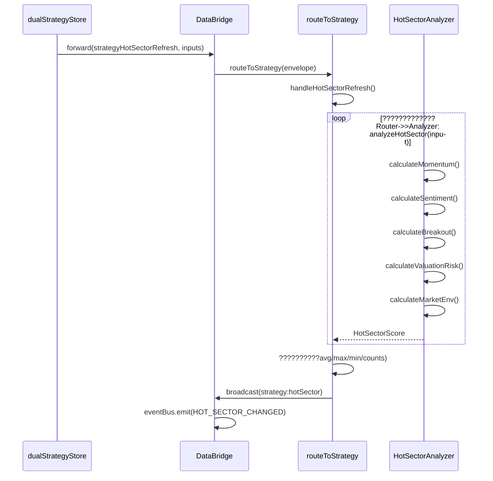

---

## ????????????????????????

### 5.1 ??????????????????

```mermaid
graph TB
    subgraph ?????????????        Scan[scanWatchingSignals] --> Generate[generateSignalsForSymbol]
        Generate --> Signal[TradingSignal]
    end
    
    subgraph ?????????????        Signal --> Pick[pickStrongestSignal]
        Pick -->|buy/sell| Sizing[calculatePosition]
        Pick -->|watch/hold| Hold[????????????]
        Sizing --> Position[PositionSizingResult]
    end
    
    subgraph ???????        Position --> Risk[checkOrderRisk]
        Risk -->|??????| Order[????????????]
        Risk -->|??????| Block[????????????]
    end
    
    subgraph ???????        Order --> Envelope[EnvelopeFactory.create]
        Envelope --> Forward[DataBridge.forward]
        Forward --> DB[orders store]
    end
    
    Scan -.->|???????????????| Scan
```

### 5.2 ????????????????????????

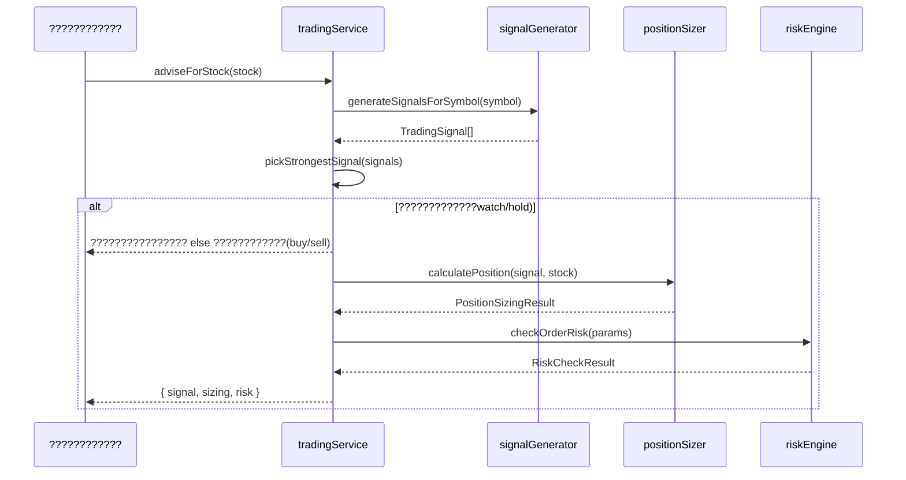

### 5.3 ???????????????????
[signalGenerator.ts](../../../src/services/trading/signalGenerator.ts) ??????5??????????????????

**????????????**?| ???????????? | ???????????? | ???????|
|---------|---------|-------|
| `buy_dip` | ????????????MA20 8% ?RSI < 30 | 0.55 |
| `buy_pivot` | ??????MA20 + ?????? + MACD?????? | 0.65 |
| `buy_safety_margin` | PE/PB????????????????| 0.50 |

**????????????**?| ???????????? | ???????????? | ???????|
|---------|---------|-------|
| `sell_profit_taking` | ????????????MA20 15% ?RSI > 70 | 0.55 |
| `sell_trailing_stop` | ???????????????????0% | 0.70 |

**????????????**?????????????????????????????????????`composite_buy`/`composite_sell`??????????????????

### 5.4 ??????????????????

[positionSizer.ts](../../../src/services/trading/positionSizer.ts) ?????? **Kelly ?????????????* ?????????????
```
Kelly % = W - (1 - W) / R
?????????W = ??????, R = ???????```

**????????????**?1. ?????????????????????????10%?2. ???????????????????????? 80%?3. ???????????????????????????????????????
4. ?????????????
### 5.5 ??????????????????

[riskEngine.ts](../../../src/services/trading/riskEngine.ts) ??????5??????????????????

| ????????? | ???????????? | ???????????? |
|--------|---------|---------|
| ?????????????| ???????????????????????????????????? | - |
| ?????????????????? | ?????????????????????????????? | - |
| ?????????????????? | ?????????????????? | ???????????? |
| ?????????????????? | ?????????????????????????| ???????????? |
| ?????????????| ????????????????????????????| ???????????? |
| ????????????????| ?????????????????????????????? | - |

### 5.6 ????????????????
[screeningEngine.ts](../../../src/services/analysis/screeningEngine.ts) ???????????????????
**candidate ?screened**?- ?????????????????? basic/kline ??????
- V6 ?????? ?????
**screened ?deepDive**?- ?????????????????? basic/kline/finance ??????
- V6 ?????? ?????????????????? ?????
### 5.7 ??????????????????

[tradingService.ts](../../../src/services/trading/tradingService.ts) ????????????????????????????????
```typescript
async function createOrderWithRiskCheck(input: CreateOrderInput) {
  // 1. ????????????
  if (price <= 0 || input.quantity <= 0) return { success: false }
  
  // 2. ??????????  const risk = await checkOrderRisk({ symbol, direction, quantity, price, portfolioValue })
  if (!risk.ok) return { success: false, error: `???????????????` }
  
  // 3. ????????????
  const order = buildOrder(input)
  
  // 4. ?????? DataBridge ?????????ACL?????? + ?????????????  const envelope = EnvelopeFactory.create({
    source: MODULE_ID.tradinghub,
    target: ENVELOPE_TARGET.db,
    action: ENVELOPE_ACTION.insertOrder,
    traceId: `trading-${nanoid(8)}-${input.symbol}`,
  }, order)
  
  await dataBridge.forward(envelope)
}
```

---

## ??????????????????????
### 6.1 ??????????????????

```mermaid
graph TB
    subgraph ????????????
        Review[generateTradeReviewUseCase] --> Profile[generatePsychologicalProfile]
        Review --> Dimensions[SKILL_DIMENSIONS]
        Review --> LLM[LLM????????????]
    end
    
    subgraph ????????????
        Orders[????????????] --> Review
        Signals[????????????] --> Review
        Portfolios[????????????] --> Review
        Scores[????????????] --> Review
    end
    
    subgraph ????????????
        Profile --> Discipline[????????????]
        Dimensions --> Psychology[????????????]
        LLM --> Insights[AI??????]
    end
    
    Discipline --> Report[TradeReviewRecord]
    Psychology --> Report
    Insights --> Report
    
    Report --> Save[DataBridge.forward(saveTradeReview)]
    Save --> Store[trade_reviews]
```

### 6.2 ??????????????????

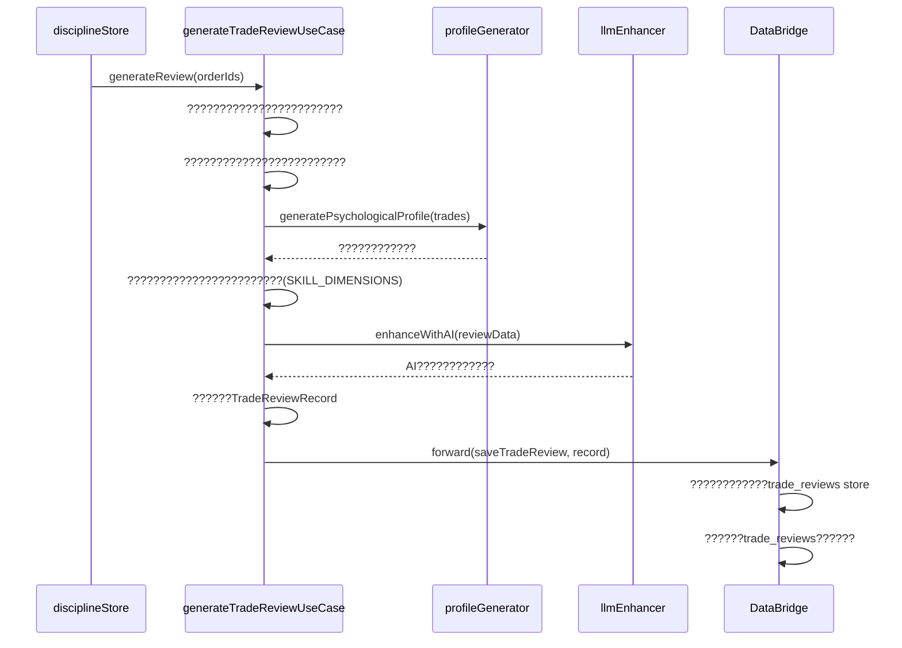

---

## ?????????????????????????????????

### 7.0 ??????????????????

?????????????????????????[pipelineScheduler.ts](../../../src/core/pipelineScheduler.ts) ???????????????????
- **PipelineScheduler**????????????????????????????????????????????????????????????
- **PipelineCycle**?????????????????????????????????????????????????????????????????????????- **DataIntegrityGuard**???????????????????????????????????????????????????

### 7.1 ????????????????????????

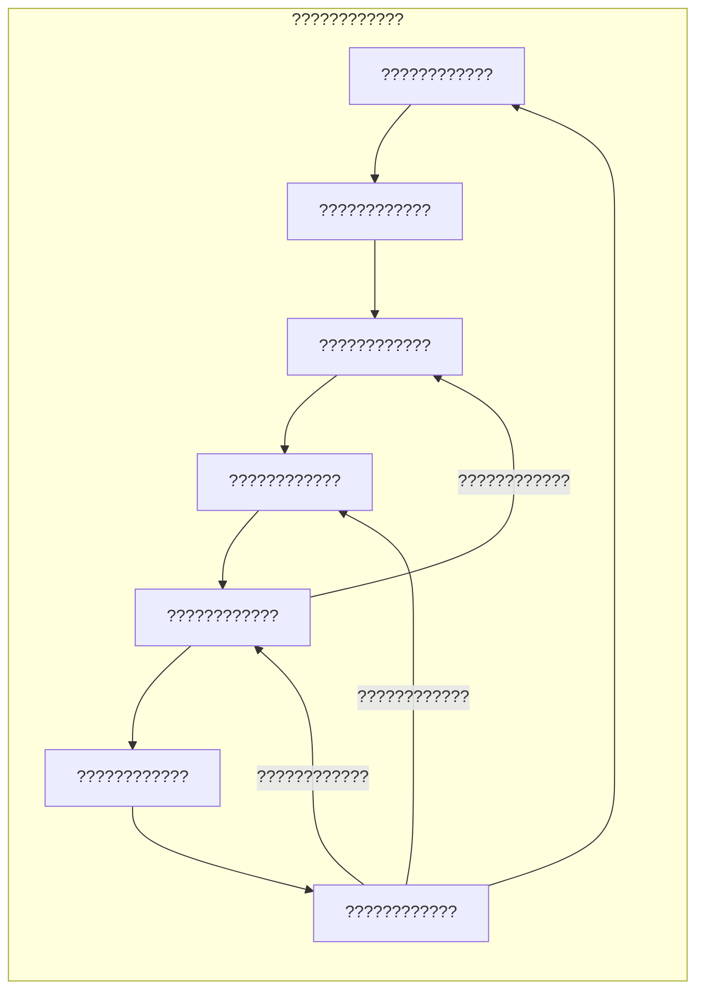

### 7.2 ???????????????????????????????
#### 7.2.1 ???????????????????
```typescript
/**
 * ????????????????????????
 * ??????????????????????????????????????????
 */
class PipelineScheduler {
  private cycles: Map<string, PipelineCycle> = new Map()
  private running: boolean = false
  
  /**
   * ????????????????????????
   */
  registerCycle(name: string, config: CycleConfig): void {
    this.cycles.set(name, new PipelineCycle(name, config))
  }
  
  /**
   * ????????????????   */
  start(): void {
    if (this.running) return
    this.running = true
    for (const cycle of this.cycles.values()) {
      cycle.start()
    }
  }
  
  /**
   * ????????????????   */
  stop(): void {
    this.running = false
    for (const cycle of this.cycles.values()) {
      cycle.stop()
    }
  }
  
  /**
   * ????????????????   */
  getStatus(): CycleStatus[] {
    return Array.from(this.cycles.values()).map(c => c.getStatus())
  }
}
```

#### 7.2.2 ????????????

```typescript
interface CycleConfig {
  /** ???????????? */
  name: string
  /** ???????????????????????? */
  interval: number
  /** ???????????? */
  enabled: boolean
  /** ????????????????*/
  maxRetries: number
  /** ????????????????*/
  backoffFactor: number
  /** ????????????????*/
  healthThreshold: number
  /** ?????????????????????????*/
  integrityCheck?: () => Promise<boolean>
  /** ???????????? */
  executor: () => Promise<void>
}
```

#### 7.2.3 ???????????????????????????

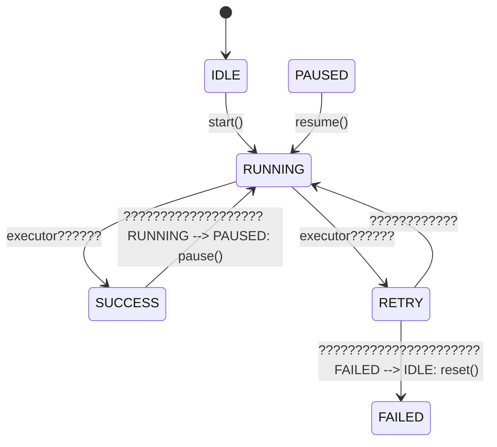

#### 7.2.4 ???????????????????
```typescript
/**
 * ????????????????????????
 */
class DataIntegrityGuard {
  /**
   * ????????????????????????????   */
  async checkStockPool(): Promise<IntegrityResult> {
    const stocks = await dataBridge.query({ action: 'QUERY_LIST', store: 'stocks' })
    const scores = await dataBridge.query({ action: 'QUERY_LIST', store: 'v6_scores' })
    
    const missingScores = stocks.data?.filter(
      s => !scores.data?.some(score => score.symbol === s.symbol)
    ) ?? []
    
    return {
      status: missingScores.length === 0 ? 'healthy' : 'degraded',
      missingCount: missingScores.length,
      details: { missingScores: missingScores.map(s => s.symbol) }
    }
  }
  
  /**
   * ????????????????????????
   */
  async repairMissingScores(): Promise<void> {
    const result = await this.checkStockPool()
    if (result.status === 'healthy') return
    
    for (const symbol of result.details?.missingScores ?? []) {
      await runV6Score(symbol)
    }
  }
}
```

#### 7.2.5 ????????????????????????

| ???????????? | ???????????? | ???????????? |
|---------|---------|---------|
| **????????????** | ?????????????????????????????? | ???????????????????????? |
| **???????* | ??????Envelope???????????? | ??????DB???????????? |
| **?????????????* | ?????????????????????????| ???????????????????|
| **????????????** | L1???????????? + L2 IndexedDB | ?????????????????? |
| **????????????** | Promise.all ???????????? | ????????????CPU?????? |

---

## ???????????????????????????

### 8.1 ???????????????????
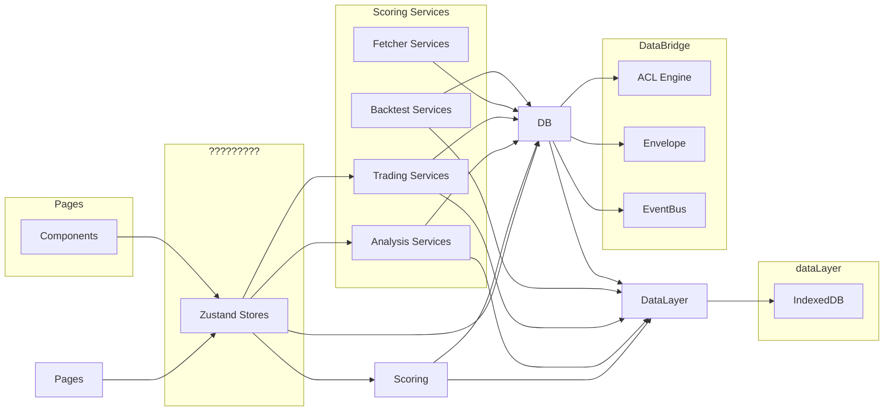

### 8.2 ???????????????????
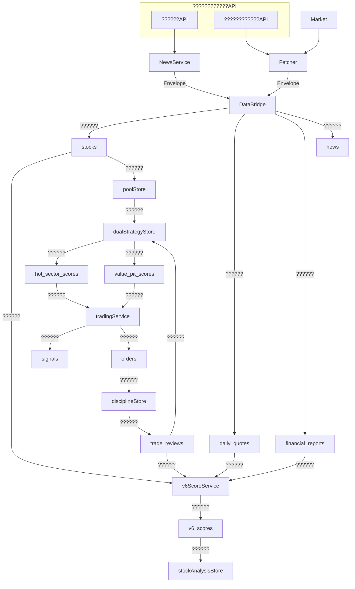

---

## ?????????????????????

### 9.1 DataBridge Forward ????????????

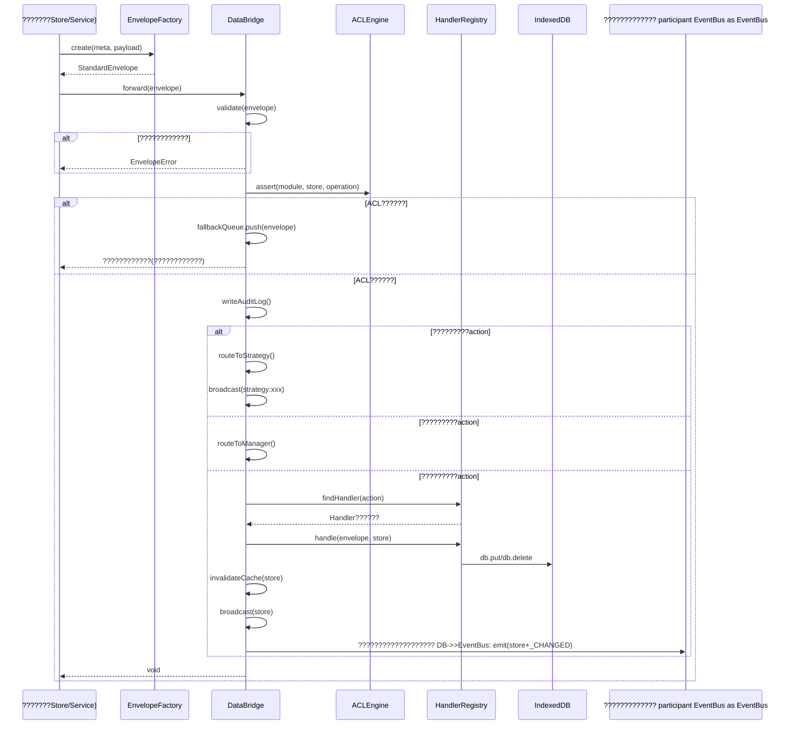

### 9.2 DataBridge Query ????????????

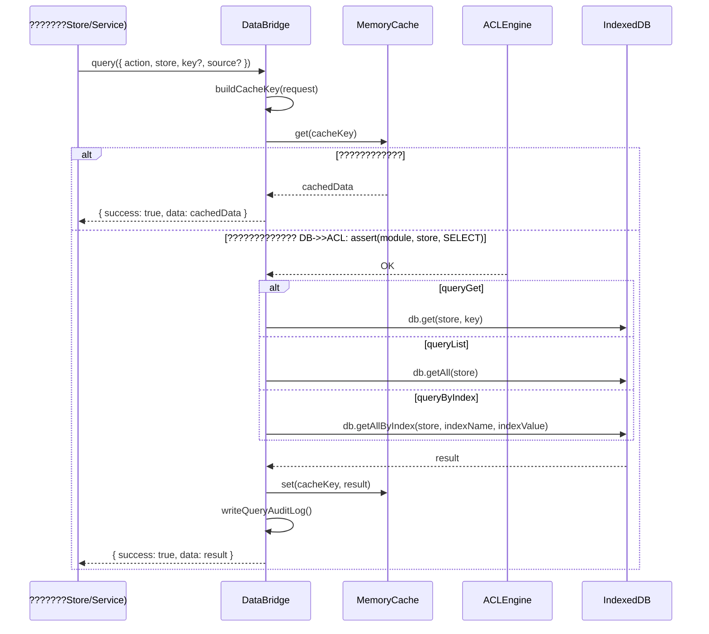

---

## ????????????????????????????
### 10.1 ??????????????????

```mermaid
graph TB
    subgraph ?????????????        F1[Fetcher-1] --> MQ[????????????]
        F2[Fetcher-2] --> MQ
        F3[Fetcher-N] --> MQ
    end
    
    subgraph ?????????????        MQ --> P1[Processor-1]
        MQ --> P2[Processor-2]
        MQ --> P3[Processor-N]
    end
    
    subgraph ???????        P1 --> DB1[IndexedDB-1]
        P2 --> DB2[IndexedDB-2]
        P3 --> DB3[IndexedDB-N]
    end
    
    subgraph ???????        DB1 --> Q[QueryService]
        DB2 --> Q
        DB3 --> Q
        Q --> API[????????????API]
    end
```

### 10.2 ???????????????????
```typescript
/**
 * ????????????????????????? */
interface DataProcessorPlugin {
  /** ???????????? */
  name: string
  /** ?????????????????? */
  supportedSources: string[]
  /** ?????????????*/
  priority: number
  /** ???????????? */
  process(data: unknown): Promise<unknown>
  /** ???????????? */
  validate(data: unknown): boolean
}

/**
 * ????????????????????????
 */
interface StrategyEnginePlugin {
  /** ???????????? */
  name: string
  /** ???????????? */
  channel: string
  /** ???????????? */
  dimensions: string[]
  /** ???????????? */
  evaluate(input: unknown): Promise<unknown>
  /** ???????????? */
  generateSignals(scores: unknown[]): unknown[]
}
```

---

## ????????????????????????

### 11.1 ??????????????????

| ?????? | ?????? |
|------|------|
| **????????????** | DataBridge ???????????????????????????????ACL ?????????????????????????|
| **????????????** | HandlerRegistry ???????????????????????? action ???????|
| **????????????** | ????????????????????????????????????????????????????????????????|
| **????????????** | ???????????? ACL ???????????????????????????????????????????|
| **???????* | MemoryCache ??????????????????????????????????????? |

### 11.2 ????????????

| ???????| ?????? | ?????? |
|--------|------|------|
| P0 | ?????????????????? | ??????????forward ?????????????????????????BULK_* ?????? Action |
| P0 | ?????????????| ???????Store ???????????????????`stocks:{symbol}` ???????????? |
| P1 | ???????????????????| ???????????????????DB ???????????????????????????????????? `event:*` ???????????? |
| P1 | ???????forward | ????????????????QUERY_* ?????? Action ???????DataBridge |
| P2 | ?????????????????? | ?????????????[pipelineScheduler.ts](../../../src/core/pipelineScheduler.ts) |

### 11.3 ?????????????????????????
1. **?????????????*???EnvelopeFactory.validate() ????????????????????????
2. **?????????????*???????????????????????????????????????????????????????????????????3. **????????????**???????????????????invalidateCache()???????????????????4. **????????????**?????????????????????????researchLogs?????????????5. **????????????**???DeleteStockHandler ??????????????????????????????

---

> **????????????**
> 
> ?????????????`src/core/databridge.ts`???`src/core/databridgeHandlers.ts`???`src/core/databridgeStrategyRouter.ts`???`src/services/scoring/`???`src/services/trading/`???`src/store/` ?????????????????????????????????