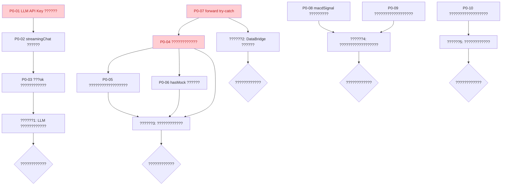

# V9 P0 ????????????????????????

> **????????????**???v1.0
> **Date**???026-07-02
> **????????????**???[v9 ??????????????????????????????????????????](./audit-summary-report.md)
> **????????????**???P0 ???P1 ???P2 ??????????????????????????????????????????????????????????????????> **??????????????????**????????????????????????????????????????????????????????????

---

## ??????

- [P0-01 LLM API Key ???????????????Bundle](#p0-01-llm-api-key-???????????????bundle)
- [P0-02 streamingChat ???????????????AbortController](#p0-02-streamingchat-???????????????abortcontroller)
- [P0-03 streamingChat ???ok ????????????????????????](#p0-03-streamingchat-???ok-????????????????????????)
- [P0-04 dataSourceOrchestrator.ts ?????? 1267 ???????????????](#p0-04-datasourceorchestratorts-??????-1267-???????????????
- [P0-05 Phase 2/3 ?????????????????????????????????](#p0-05-phase-23-?????????????????????????????????
- [P0-06 hasMock ?????? K ???Mock ??????](#p0-06-hasmock-??????-k-???mock-??????
- [P0-07 DataBridge.forward() ???????????? try-catch](#p0-07-databridgeforward-????????????-try-catch)
- [P0-08 macdSignal ??????????????????](#p0-08-macdsignal-??????????????????)
- [P0-09 rotationSignalDetector ?????????????????????](#p0-09-rotationsignaldetector-?????????????????????
- [P0-10 SectorRotationHeatmap.test.tsx ????????????](#p0-10-sectorrotationheatmaptesttsx-????????????)
- [???????????????????????????](#???????????????????????????
- [??????????????????](#??????????????????)

---

## P0-01 LLM API Key ???????????????Bundle

### ????????????

| ?????? | ?????? |
|:---|:---|
| **????????????** | `src/config/fetcherConfig.ts`???`src/config/llmConfig.ts`???`src/services/llm/llmClient.ts`???`.env.example`???`.env.local.example` |
| **????????????** | fetcherConfig.ts:310???llmConfig.ts:153-159???llmClient.ts:143,244???env.example:13???env.local.example:13 |
| **????????????** | ??????????????????"LLM API Key must be stored using encrypted localStorage (via localStorageManager's setEncrypted/getEncrypted methods)" |
| **????????????** | ???? ???????????? ??????????????????????????????devtools ?????? API Key |

### ????????????

???????????????```
.env.local (VITE_LLM_API_KEY=sk-xxx)
  ???Vite ???????????????????????? bundle
  ???llmConfig.ts ?????? import.meta.env.VITE_LLM_API_KEY
  ???llmClient.ts ?????? Authorization: Bearer ${apiKey} ??????  ????????????Network ?????????????????? Key
```

`VITE_` ???????????????????????????Vite ????????????????????????JS ????????????????????????????????????????????????devtools ???????????????
### ???????????????????????????+ ????????????????????????

#### ?????? A??????????????????????????????????????????

**??????**???API Key ??????????????????????????????????????????????????? LLM???
**????????????**???
1. **???????????? LLM ????????????**???`python/data_service/llm_proxy_endpoints.py`???   - ?????? `POST /api/llm/chat` ??????
   - ?????????????????????`LLM_API_KEY`?????? VITE_ ???????????????Key
   - ?????????????????? `{ messages, model, temperature, maxTokens }`
   - ?????????DeepSeek API???????????????   - ?????? `slowapi` ?????????????????? 30 ???IP???
2. **?????? `src/config/llmConfig.ts`**
   - ?????? `import.meta.env.VITE_LLM_API_KEY` ??????
   - `getDefaultLlmConfig()` ???`apiKey` ????????????????????????
   - ?????? `llmProxyEndpoint: '/api/llm/chat'` ?????????   - `isLlmConfigured()` ????????????`llmProxyEndpoint` ????????????

3. **?????? `src/services/llm/llmClient.ts`**
   - `chat()` ???????????? `apiKey` ???????????????????????????`fetch(llmProxyEndpoint, ...)` ???????????? DeepSeek
   - ?????? `Authorization: Bearer` ????????????????????????????????????
   - ???????????????`{ messages, model, temperature, maxTokens }`

4. **?????? `.env.example` ???`.env.local.example`**
   - ?????? `VITE_LLM_API_KEY` ?????????   - ?????? `VITE_LLM_PROXY_ENDPOINT=/api/llm/chat` ?????????   - ??????????????????"API Key ?????????????????????????????????

5. **?????? `src/config/fetcherConfig.ts:310-322`**
   - ?????? `const llmApiKey = import.meta.env.VITE_LLM_API_KEY ?? ''`
   - ??????????????????`configured: !!llmProxyEndpoint`?????????????????? Key ??????

#### ?????? B?????????localStorage??????????????????

**??????**???????????? UI ???????????????Key????????????????????????????????????
**????????????**???
1. **?????? `src/config/llmConfig.ts`**
   - `getDefaultLlmConfig()` ???`apiKey` ?????? `localStorageManager.getEncrypted('llm_api_key') ?? ''`
   - ?????? `setLlmApiKey(key: string)` ???????????????`localStorageManager.setEncrypted('llm_api_key', key)`

2. **?????? `.env.example` ???`.env.local.example`**
   - ?????? `VITE_LLM_API_KEY` ?????????   - ???????????????API Key ?????? UI ?????????????????????????????????localStorage"

3. **?????? `src/config/fetcherConfig.ts:310-322`**
   - ????????????????????????
   - ??????????????????`configured: !!localStorageManager.getEncrypted('llm_api_key')`

### ????????????

| ?????? | ?????????| ?????????|
|:---|:---|:---|
| API Key ?????????| ?????? bundle + Network ?????? | ???????????? A???/ ?????? localStorage?????????B???|
| ???????????????| ???| ???|
| Key ???????????? | ?????????????????????| ??????????????????????????????????????? |

### ????????????

1. ?????????devtools ???Sources ?????? `sk-`???????????????2. Network ???????????? LLM ???????????????`Authorization: Bearer` ???3. `localStorage` ?????? `llm_api_key`?????????????????????????????????B???
---

## P0-02 streamingChat ???????????????AbortController

### ????????????

| ?????? | ?????? |
|:---|:---|
| **????????????** | `src/services/llm/llmClient.ts` |
| **????????????** | 219-302?????????239-246???|
| **????????????** | ??????????????????"Agent tasks must have timeout control with AbortController for parallel execution" |
| **????????????** | ???? ???????????? ???Promise ??????????????????????????????UI ?????? loading |

### ????????????

`chat()` ???????????? 117 ?????????????????? `AbortController` + `setTimeout` ?????????????????? 135-136 ???????????? `streamingChat`?????? 219-302 ??????**????????????????????????**?????????LLM API ??????????????????????????????????????????????????????????????????`reader.read()`?????? 265 ????????????????????????
### ????????????

**????????????**???
1. **???`streamingChat` ?????????????????????AbortController**
   ```typescript
   const controller = new AbortController()
   ```

2. **????????????????????????**
   ```typescript
   const totalTimeoutId = config.timeout
     ? setTimeout(() => controller.abort(), config.timeout)
     : null
   ```

3. **???????????????????????????????????????chunk ?????????*
   ```typescript
   const IDLE_TIMEOUT_MS = 30000
   let idleTimer: ReturnType<typeof setTimeout> | null = null
   const resetIdleTimer = () => {
     if (idleTimer) clearTimeout(idleTimer)
     idleTimer = setTimeout(() => controller.abort(), IDLE_TIMEOUT_MS)
   }
   resetIdleTimer() // ?????????   ```

4. **???`controller.signal` ?????? fetch**
   ```typescript
   const response = await fetch(endpoint, {
     method: 'POST',
     headers,
     body: JSON.stringify(requestBody),
     signal: controller.signal,
   })
   ```

5. **???`while (true)` ???????????????`reader.read()` ????????????????????????**
   ```typescript
   const { done, value } = await reader.read()
   resetIdleTimer()
   ```

6. **???`finally` ????????????????????????????????????abort**
   ```typescript
   finally {
     if (totalTimeoutId) clearTimeout(totalTimeoutId)
     if (idleTimer) clearTimeout(idleTimer)
     controller.abort()
     reader.releaseLock()
   }
   ```

7. **???catch ?????????AbortError ????????????????????????**
   ```typescript
   catch (err) {
     if (err instanceof DOMException && err.name === 'AbortError') {
       throw new LlmApiError('LLM ??????????????????????????????')
     }
     throw err
   }
   ```

8. **?????? `IDLE_TIMEOUT_MS` ?????????*????????????????????????
   ```typescript
   const STREAM_IDLE_TIMEOUT_MS = 30000
   ```

### ????????????

| ?????? | ?????????| ?????????|
|:---|:---|:---|
| ???????????????| ???| `config.timeout` ???abort |
| ?????????????????? | ???| 30s ???????????? abort |
| Promise ???????????? | ???| ???|
| ?????????????????? | ???| ??????finally ?????? abort + releaseLock???|
| UI loading ?????? | ?????? | ???????????????LlmApiError???UI ?????????|

### ????????????

1. Mock ????????????????????? LLM ???????????????30s ?????????`LlmApiError`
2. Mock ????????????????????????????????? 35s ?????????chunk??????????????????????????????
3. ?????????????????????????????????
---

## P0-03 streamingChat ???ok ????????????????????????

### ????????????

| ?????? | ?????? |
|:---|:---|
| **????????????** | `src/services/llm/llmClient.ts` |
| **????????????** | 248-252???streamingChat??????51???chat ???????????????|
| **????????????** | C.???????????? ???"??????????????????????????????????????????????????? |
| **????????????** | ???? ?????????????????? ??????????????? "Unexpected token <" ???????????? HTTP ?????? |

### ????????????

???????????????```typescript
if (!response.ok) {
  const raw = (await response.json()) as RawResponse  // ???body ???JSON ?????? SyntaxError
  throw new LlmApiError(`LLM ????????????: ${raw.error?.message ?? '????????????'}`)
}
```

?????? LLM API ?????? 4xx/5xx ???body ?????? JSON?????? nginx 502 ?????? HTML???Cloudflare 5xx ?????????????????????`response.json()` ?????????`SyntaxError`???????????????HTTP ??????????????????
### ????????????

**????????????**???
1. **?????? `streamingChat` ?????????????????????248-252 ??????**
   ```typescript
   if (!response.ok) {
     let message = `HTTP ${response.status} ${response.statusText}`
     try {
       const raw = (await response.json()) as RawResponse
       if (raw.error?.message) {
         message = raw.error.message
       }
     } catch {
       // ???????????? JSON???????????????HTTP ????????????       logger.warn('[llmClient] LLM ???????????????JSON ??????', {
         status: response.status,
         contentType: response.headers.get('content-type'),
       })
     }
     throw new LlmApiError(`LLM ????????????: ${message}`)
   }
   ```

2. **???????????? `chat` ???????????????????????????151 ????????????**
   - ?????????`response.ok`???????????? body
   - ???try/catch ?????? `response.json()`

3. **???`LlmApiError` ?????????HTTP ?????????**??????????????????
   ```typescript
   export class LlmApiError extends Error {
     readonly statusCode?: number
     constructor(message: string, statusCode?: number) {
       super(message)
       this.name = 'LlmApiError'
       this.statusCode = statusCode
     }
   }
   ```

### ????????????

| ?????? | ?????????| ?????????|
|:---|:---|:---|
| ???JSON ???????????? | ???SyntaxError "Unexpected token <" | ???LlmApiError "LLM ????????????: HTTP 502 Bad Gateway" |
| ?????????????????????| ???| ???|
| ???????????? | ??????????????? Network ???????????????| ?????????????????????????????????|

### ????????????

1. Mock ????????????HTML 502 ???????????????????????? `LlmApiError` ?????? `SyntaxError`
2. Mock ????????????JSON 401 ???????????????????????????????????? `Authentication Fails`

---

## P0-04 dataSourceOrchestrator.ts ?????? 1267 ???????????????
### ????????????

| ?????? | ?????? |
|:---|:---|
| **????????????** | `src/services/fetcher/dataSourceOrchestrator.ts` |
| **????????????** | 1-1267???????????????|
| **????????????** | A.??????????????????"?????????????????????400 ??? |
| **????????????** | ???? ????????????????????????????????? 3 ?????? |

### ????????????

???????????????????????? 6 ????????????
1. ????????????????????????/K??????
2. ??????????????? ?????????3. Mock ????????????
4. DataBridge ??????
5. Phase 1-4 ??????????????????
6. ????????????

### ?????????????????????????????????6 ???????????????
**??????????????????**???```
src/services/fetcher/
????????? dataSourceOrchestrator.ts       (??????????????????????????????<100 ???
????????? orchestrator/
???  ????????? quoteFallback.ts            (???????????????
???  ????????? klineFallback.ts            (K????????????)
???  ????????? dimensionCollector.ts       (8 ????????????)
???  ????????? mockGenerator.ts            (Mock ????????????)
???  ????????? storageWriter.ts            (DataBridge ??????)
???  ????????? sessionOrchestrator.ts      (Phase 1-4 ????????????)
????????? utils/
    ????????? shared.ts                   (isAbortError, hashString, round2)
```

**????????????**???
1. **?????? `orchestrator/quoteFallback.ts`**
   - ??????????????????????????????????????? 100-160 ????????????
   - ?????? `fetchQuoteWithFallback(code: string): Promise<StockQuote | null>`
   - ?????? `QUOTE_FALLBACK_CHAIN` ?????????`fetchQuoteBySource` ??????

2. **?????? `orchestrator/klineFallback.ts`**
   - ?????? K ?????????????????????????????? 220-290 ????????????
   - ?????? `fetchKlineWithFallback(code: string, days: number): Promise<KlineItem[] | null>`
   - ?????? `KLINE_FALLBACK_CHAIN` ?????????`fetchKlineBySource` ??????

3. **?????? `orchestrator/dimensionCollector.ts`**
   - ?????? 8 ?????????????????????????????? 368-607 ??????
   - ?????? `collectDimension(code: string, dimension: string): Promise<CollectedItem>`
   - ???????????????????????????
4. **?????? `orchestrator/mockGenerator.ts`**
   - ?????? Mock ???????????????????????? 614-666 ??????
   - ?????? `mockQuote(code: string): StockQuote`???`mockKline(code: string, days: number): KlineItem[]`
   - ??????????????????????????????MOCK_BASE_PRICE_MIN ??????

5. **?????? `orchestrator/storageWriter.ts`**
   - ?????? DataBridge ???????????????????????? 678-821 ??????
   - ?????? `writeToStorage(item: CollectedItem): Promise<void>`???`writeKlineToStorage(...)`
   - ?????? dataQuality ?????????????????????P1 ?????????
6. **?????? `orchestrator/sessionOrchestrator.ts`**
   - ?????? Phase 1-4 ???????????????????????? 858-1260 ??????
   - ?????? `collectAllDimensions(codes: string[]): Promise<CollectSessionResult>`
   - ?????? Phase ??????????????????

7. **?????? `utils/shared.ts`**
   - ?????? `isAbortError`???`hashString`???`round2` ???????????????   - ?????????`directDataAPI.ts` ???????????????
8. **?????? `dataSourceOrchestrator.ts` ???????????????*
   - ???re-export ????????????????????????
   - ?????? `CollectResult`???`CollectedItem` ???????????????   - ???????????? < 100 ???
### ????????????

| ?????? | ?????????| ?????????|
|:---|:---|:---|
| ???????????????| 1267 | < 100 |
| ????????????????????? | ???| < 400 |
| ???????????? | 6 | 1?????????????????????????????????|
| ????????????| ?????? | ?????? |
| ????????????| ???????????????????????????| ???????????????????????????????????????|

### ????????????

1. `tsc --noEmit` ????????????????????????
2. ??????????????????????????????????????????
3. ????????????????????????400

---

## P0-05 Phase 2/3 ?????????????????????????????????
### ????????????

| ?????? | ?????? |
|:---|:---|
| **????????????** | `src/services/fetcher/dataSourceOrchestrator.ts`???????????????`orchestrator/dimensionCollector.ts`???|
| **????????????** | 444-491 |
| **????????????** | B.?????????????????????"??????????????????????????????" |
| **????????????** | ???? ???????????? ??????????????????????????????????????????????????? |

### ????????????

5 ????????????`03_chip`???`06_industry`???`08_research`???`04_events`???`05_news`???????????????????????????stub???- ?????????`collectBasic(code)` ??????????????????
- `collected.push({ code })` ???????????????????????????- ???Phase 4 ???????????????`result.success.push(item.code)` ??????????????????

### ????????????

**????????????**???
1. **???`CollectedItem` ???????????????`isStub?: boolean` ??????**
   ```typescript
   interface CollectedItem {
     code: string
     quote?: StockQuote
     kline?: KlineItem[]
     // ... ??????????????????
     isStub?: boolean  // ??????????????????????????????
   }
   ```

2. **?????????????????????????????????**
   - ???`03_chip`/`06_industry`/`08_research`/`04_events`/`05_news` ??????????????????
   - ?????? `collected.isStub = true`
   - ?????? `logger.warn('[dimensionCollector] ?????? X ???????????????, { code, dimension })`

3. **?????? Phase 4 ??????????????????**
   ```typescript
   if (item.isStub) {
     result.partial = true
     result.stubDimensions = result.stubDimensions ?? []
     result.stubDimensions.push(item.dimension)
     // ???push ???success
   } else {
     result.success.push(item.code)
   }
   ```

4. **???`CollectResult` ???????????????`stubDimensions?: string[]` ??????**
   - ?????????UI ??????"?????????????????????????????????

5. **?????????UI ?????????partial ??????*
   - ???`result.partial === true` ??????Toast ??????"???????????????????????????????????????????????????

### ????????????

| ?????? | ?????????| ?????????|
|:---|:---|:---|
| ???????????????| ???????????????????????????| ?????????????????????????????????????????? |
| ???????????? | ??????"??????????????? | ??????"????????????????????? |
| ???????????????| ???| ??????Toast ?????????|

### ????????????

1. ?????? `collectAllDimensions`?????????`result.partial === true`
2. ?????? `result.stubDimensions` ?????? 5 ???????????????3. ?????? `result.success` ???????????????????????? code

---

## P0-06 hasMock ?????? K ???Mock ??????
### ????????????

| ?????? | ?????? |
|:---|:---|
| **????????????** | `src/services/fetcher/dataSourceOrchestrator.ts`???????????????`orchestrator/sessionOrchestrator.ts`???|
| **????????????** | 590 |
| **????????????** | B.??????????????????+ C.???????????? ???"?????????fallback ?????????????????? undefined ????????????" |
| **????????????** | ???? ????????????????????????UI ???????????? K ???????????? Mock |

### ????????????

```typescript
const hasMock = collected.some((c) => c.quote?.source === 'mock')
```

?????????`quote.source`?????? `KlineItem` ?????????`source` ?????????`mockKline()` ?????????????????????????????????????????????
### ????????????

**????????????**???
1. **???`KlineItem` ???????????????`source?: string` ??????**
   ```typescript
   // src/services/fetcher/directDataAPI.ts
   export interface KlineItem {
     date: string
     open: number
     high: number
     low: number
     close: number
     volume: number
     amount?: number
     source?: string  // ???????????????????????????   }
   ```

2. **???`mockKline()` ?????????`source: 'mock'`**
   ```typescript
   // orchestrator/mockGenerator.ts
   export function mockKline(code: string, days: number): KlineItem[] {
     return Array.from({ length: days }, (_, i) => ({
       // ... ????????????
       source: 'mock',
     }))
   }
   ```

3. **???????????????????????????`source`**
   - `tencentKline` ???????????????`source: 'tencent'`
   - `neteaseKline` ???????????????`source: 'netease'`
   - `fetcherClient.collectKline` ???????????????`source: 'akshare'`

4. **?????? `hasMock` ????????????**
   ```typescript
   const hasMock = collected.some(
     (c) => c.quote?.source === 'mock' || c.kline?.some((k) => k.source === 'mock')
   )
   ```

5. **???`CollectedItem` ?????????`klineSource?: string` ??????**?????????????????????????????????????????????   ```typescript
   collected.klineSource = klineData[0]?.source
   ```

### ????????????

| ?????? | ?????????| ?????????|
|:---|:---|:---|
| K ???Mock ??????| ?????? | ????????????|
| `result.stale` ?????????| ?????????K???Mock ?????? false???| ?????????K???Mock ?????? true???|
| UI ?????????????????? | ?????? | ?????? |

### ????????????

1. ?????? K ???????????? Mock?????????`result.stale === true`
2. ?????? K ?????????????????? `result.stale === false`

---

## P0-07 DataBridge.forward() ???????????? try-catch

### ????????????

| ?????? | ?????? |
|:---|:---|
| **????????????** | `src/core/databridge.ts` |
| **????????????** | 75-143???forward ????????????62???broadcast ???eventBus.emit???|
| **????????????** | ??????????????????"??????DataBridge.forward() ???????????????try-catch ??????" |
| **????????????** | ???? ??????????????????broadcast ?????????????????????forward ?????? |

### ????????????

`forward()` ???????????????5-143 ?????????????????? try-catch???`broadcast()` ???`eventBus.emit`???62 ???????????????????????????emit ???????????????????????????????????????
### ????????????

**????????????**???
1. **???`forward()` ???????????????????????? try-catch**
   ```typescript
   async forward(envelope: StandardEnvelope): Promise<void> {
     const startTs = Date.now()
     logger.info(`[DataBridge] forward() called: ...`)
     try {
       // ... ????????????????????????????????????????????????
     } catch (err) {
       logger.error(`[DataBridge] forward() ??????`, {
         action: envelope.meta.action,
         traceId: envelope.meta.traceId,
         error: err instanceof Error ? err.message : String(err),
       })
       throw err  // ?????????????????????????????????     } finally {
       const duration = Date.now() - startTs
       if (duration > FORWARD_SLOW_THRESHOLD_MS) {
         logger.warn(`[DataBridge] forward() took ${duration}ms`)
       }
       logger.info(`[DataBridge] forward() completed: duration=${duration}ms`)
     }
   }
   ```

2. **???`broadcast()` ?????????`eventBus.emit`**
   ```typescript
   private broadcast(channel: string, envelope: StandardEnvelope): void {
     // ... subscriber ?????????????????????try-catch ?????????     try {
       eventBus.emit(`${channel}:changed`, envelope)
     } catch (err) {
       logger.warn(`[DataBridge] eventBus.emit ??????`, {
         channel,
         error: err instanceof Error ? err.message : String(err),
       })
     }
   }
   ```

3. **???????????????????????????*????????????????????????
   ```typescript
   const FORWARD_SLOW_THRESHOLD_MS = 50
   const BROADCAST_SLOW_THRESHOLD_MS = 10
   ```

4. **?????? `writeAuditLog` ????????????**?????? 109-111 ??????
   ```typescript
   // ?????????   this.writeAuditLog(envelope, targetStore).catch((err) => {
     logger.warn('Audit log failed', { err })
   })
   // ?????????   this.writeAuditLog(envelope, targetStore).catch((err) => {
     logger.error('[DataBridge] Audit log failed', {
       error: err,
       action: envelope.meta.action,
       traceId: envelope.meta.traceId,
     })
   })
   ```

### ????????????

| ?????? | ?????????| ?????????|
|:---|:---|:---|
| forward ???????????? | ???????????? ACL ???try-catch???| ???????????????try-catch???|
| broadcast emit ?????? | ?????? forward ?????? | ???warn ?????????????????? |
| ???????????????????????? | warn | error |
| ???????????????| ????????? | ???action + traceId |

### ????????????

1. Mock `eventBus.emit` ???????????????forward ???????????????2. Mock `EnvelopeFactory.validate` ???????????????forward ?????????????????? traceId
3. ?????????????????????????????????error ??????

---

## P0-08 macdSignal ??????????????????

### ????????????

| ?????? | ?????? |
|:---|:---|
| **????????????** | `src/services/scoring/hotSectorAnalyzer.ts` |
| **????????????** | 541-546 |
| **????????????** | ?????????????????????????????????????????????????????? |
| **????????????** | ???? ?????????????????? ????????????????????????????????????MACD |

### ????????????

`macdSignal` ???????????? 541 ???????????? RSI ???????????????
```typescript
macdSignal: (rsi ?? RSI_DEFAULT) > MACD_BULLISH_THRESHOLD
```
?????????????????????59 ????????????"MACD ????????????"???`calculateBreakout` ?????? MACD ??????/???????????????????????? RSI ???????????????
### ???????????????????????????????????????A???
#### ?????? A??????????????????????????????????????????

**????????????**???
1. **???`BreakoutInput` ????????????????????????**?????? 59 ????????????
   ```typescript
   // ?????????   macdSignal: boolean  // MACD ????????????
   // ?????????   rsiSignal: boolean  // RSI ??????????????????????????????   ```

2. **???`calculateBreakout` ???????????????*?????? 541 ????????????
   ```typescript
   // ?????????   macdSignal: (rsi ?? RSI_DEFAULT) > MACD_BULLISH_THRESHOLD,
   // ?????????   rsiSignal: (rsi ?? RSI_DEFAULT) > RSI_BULLISH_THRESHOLD,
   ```

3. **?????????????????????*
   ```typescript
   // ?????????   const MACD_BULLISH_THRESHOLD = 55
   // ?????????   const RSI_BULLISH_THRESHOLD = 55
   ```

4. **?????? `calculateBreakout` ??????????????????**
   ```typescript
   // ?????????   if (data.macdSignal) { ... }
   // ?????????   if (data.rsiSignal) { ... }
   ```

5. **????????????????????????**???????????????`macdSignal`???
#### ?????? B?????????????????? MACD???????????????
????????????DIF?????????EMA12 - ?????? EMA26??????DEA???DIF ???EMA9??????MACD ??????2*(DIF-DEA)???????????????????????????????????????????????????????????????????????????K ??????????????????
### ????????????

| ?????? | ?????????| ?????????|
|:---|:---|:---|
| ???????????????| ???????????????MACD ?????? RSI???| ???????????????RSISignal ?????? RSI???|
| ?????????????????????| ???| ???|
| ?????????????????????| ???????????????????????????????????? | ???????????????????????????|

### ????????????

1. `tsc --noEmit` ??????
2. ?????????????????????????????????????????????????????????3. grep ?????????`macdSignal` ????????????

---

## P0-09 rotationSignalDetector ?????????????????????
### ????????????

| ?????? | ?????? |
|:---|:---|
| **????????????** | `src/services/scoring/rotationSignalDetector.ts` |
| **????????????** | 264-276 |
| **????????????** | ?????????????????????????????????????????????????????? |
| **????????????** | ???? ?????????????????? ??????????????????????????????????????????|

### ????????????

`detectBySector` ???????????????????????????????????????????????????????????????```typescript
for (let i = 0; i < recentHistory.length; i++) {
  sectorVolumes[i] += history[i]!.volume
  sectorFlows[i] += (history[i]!.close - history[i]!.open) * history[i]!.volume
  closes[i].push(history[i]!.close)
}
```
???????????????`quotes.history.length` ???????????????`slice(-60)` ???????????????60 ???????????????????????????????????????`i` ????????????????????????????????????
### ????????????

**????????????**???
1. **????????????????????????????????????**
   ```typescript
   // 1. ???????????????????????????????????????
   const allDates = new Set<string>()
   for (const stock of sectorStocks) {
     const quotes = await dataLayer.dailyQuotes.get(stock.symbol).catch(() => null)
     quotes?.history.slice(-60).forEach((bar) => allDates.add(bar.date))
   }
   const sortedDates = Array.from(allDates).sort()

   // 2. ?????????????????????date -> bar ?????????   const stockBarMaps = new Map<string, Map<string, KlineBar>>()
   for (const stock of sectorStocks) {
     const quotes = await dataLayer.dailyQuotes.get(stock.symbol).catch(() => null)
     const barMap = new Map<string, KlineBar>()
     quotes?.history.slice(-60).forEach((bar) => barMap.set(bar.date, bar))
     stockBarMaps.set(stock.symbol, barMap)
   }

   // 3. ???sortedDates ??????????????????????????????????????????????????????
   const sectorVolumes: number[] = new Array(sortedDates.length).fill(0)
   const sectorFlows: number[] = new Array(sortedDates.length).fill(0)
   const closes: number[][] = new Array(sortedDates.length).map(() => [])

   for (let i = 0; i < sortedDates.length; i++) {
     const date = sortedDates[i]!
     for (const [, barMap] of stockBarMaps) {
       const bar = barMap.get(date)
       if (bar) {
         sectorVolumes[i] += bar.volume
         sectorFlows[i] += (bar.close - bar.open) * bar.volume
         closes[i]!.push(bar.close)
       }
     }
   }
   ```

2. **?????????????????? 60 ??????????????????**
   ```typescript
   const MIN_HISTORY_DAYS = 20
   for (const stock of sectorStocks) {
     const quotes = await dataLayer.dailyQuotes.get(stock.symbol).catch(() => null)
     if (!quotes || quotes.history.length < MIN_HISTORY_DAYS) {
       logger.warn('[rotationSignalDetector] ?????????????????????????????????, {
         symbol: stock.symbol,
         historyLength: quotes?.history.length ?? 0,
         minLength: MIN_HISTORY_DAYS,
       })
       continue
     }
     // ... ????????????
   }
   ```

3. **???????????????????????????*
   ```typescript
   const RECENT_DATA_WINDOW_DAYS = 60
   const MIN_HISTORY_DAYS = 20
   ```

### ????????????

| ?????? | ?????????| ?????????|
|:---|:---|:---|
| ?????????????????? | ???????????????????????????| ???????????????????????????|
| ?????????????????????| ???????????? | ?????????warn |
| ???????????????| ???????????? | ?????? |

### ????????????

1. ??????2 ????????????A ???60 ????????????B ???40 ???????????????????????????????????????2. ??????1 ?????????????????????20 ???????????????????????? warn ??????

---

## P0-10 SectorRotationHeatmap.test.tsx ????????????

### ????????????

| ?????? | ?????? |
|:---|:---|
| **????????????** | `src/components/organisms/analysis/sector/SectorRotationHeatmap.tsx` |
| **????????????** | 1-139???????????????|
| **????????????** | ???????????? ???DRY ?????? |
| **????????????** | ???? ????????????????????????????????????????????????|

### ????????????

??????????????????????????????????????????
- `tests/SectorRotationHeatmap.test.tsx`???84 ???????????????????????????- `src/components/organisms/analysis/sector/SectorRotationHeatmap.tsx`???39 ???????????????????????????

### ????????????

**????????????**???
1. **???????????????????????????????????????*
   - `tests/` ???????????????loading/error/empty ?????????adaptHeatmapData???getMetricValue???????????????????????????????????????cell ??????????????????????????????
   - `src/components/` ????????????????????????adaptHeatmapData???cell ?????????????????????????????????????????????   - `src/components/` ???????????????`MemoryRouter` ??????????????????

2. **???`src/components/` ?????????????????????????????? `tests/` ??????**
   - ?????? `tests/` ?????????????????????????????? cell ?????????????????????????????????
   - ?????? `src/components/` ?????????`MemoryRouter` ?????????????????????????????????`tests/` ??????

3. **?????? `src/components/organisms/analysis/sector/SectorRotationHeatmap.tsx`**
   ```bash
   # ?????? DeleteFile ????????????
   ```

4. **??????????????????**
   ```bash
   npx vitest run tests/SectorRotationHeatmap.test.tsx
   ```
   - ????????????????????????
   - ???????????????????????????
### ????????????

| ?????? | ?????????| ?????????|
|:---|:---|:---|
| ?????????????????? | 2 | 1 |
| ???????????? | ?????????????????????| ???|
| ???????????? | ??????| ??????|
| ???????????? | ?????? | ???????????????????????????????????????????????? |

### ????????????

1. ?????????`npx vitest run` ????????????
2. ????????????????????????
3. grep ?????????????????????????????????????????????
---

## ???????????????????????????


### ??????????????????

| ?????? | ???????????? | ???????????? | ?????????????????????|
|:---|:---|:---|:---|
| **?????? 1** | P0-01???P0-02???P0-03???LLM ?????????| ???????????????????????????| 5-6 ???|
| **?????? 2** | P0-07???DataBridge ?????????| ?????????| 1 ???|
| **?????? 3** | P0-04???P0-05???P0-06??????????????????????????? | P0-04 ?????????P0-05/P0-06 ?????????????????????| 1??? ???????????????|
| **?????? 4** | P0-08???P0-09??????????????????| ?????????| 2 ???|
| **?????? 5** | P0-10?????????????????? | ?????????| ?????? 1 ???|

**?????????????????????????????????????????????????????????*

---

## ??????????????????

### ?????????vs ???????????????
| ?????? | ?????????| ?????????|
|:---|:---|:---|
| **?????????* | API Key ???????????????bundle | Key ???????????????????????? A???????????????????????????B???|
| **????????????** | streamingChat ?????????????????? | ?????????+ ???????????????????????? |
| **????????????** | forward ?????????try-catch???emit ???????????? forward ?????? | ?????? try-catch???emit ?????????warn |
| **????????????** | 1 ?????????1267 ???| ?????????7 ?????????????????? < 400 ???|
| **???????????????* | 5 ?????????????????????| ???????????? partial???UI ???????????? |
| **??????????????????** | K ???Mock ?????????| hasMock ????????????K ???Mock |
| **???????????????* | macdSignal ???????????????????????????????????? | ??????????????????????????????????????? |
| **????????????** | 2 ?????????????????????| 1 ????????????????????? |
| **????????????** | "Unexpected token <" | "LLM ????????????: HTTP 502 Bad Gateway" |

### ??????????????????

| ?????? | ?????????|
|:---|:---|
| P0 ???????????????| 12/12???00%???|
| `tsc --noEmit` ?????????| 0 |
| ?????????????????????| 100% |
| ?????????????????????| 0??????????????????400 ?????? |
| API Key ?????????| 0???????????? Key???|
| `any` ???????????????| 0 |
| `console.log` ?????????| 0 |

---

## ???????????????????????????
????????????????????????????????????????????????
- [V9 ??????????????????????????????????????????](./audit-summary-report.md)
- ???????????????026-07-02
- ???????????????V9 Quality Inspector + TRAE-code-review SKILL
- ???????????????7 ????????????6 ???????????????
---

**????????????**
