# V9 P0 严�问题修�方案

> **文档版本**：v1.0
> **Date**ï¼?026-07-02
> **审查��**：[v9 数�交互模�综�代�审查报告](./audit-summary-report.md)
> **执行�则**：P0 �P1 �P2 分批执行；�批完��等待用户确认�进入下一�> **代�冻结约定**：本方案仅�述修改步骤，���际代�改动

---

## 目录

- [P0-01 LLM API Key 暴露到��Bundle](#p0-01-llm-api-key-暴露到��bundle)
- [P0-02 streamingChat 缺少超时�AbortController](#p0-02-streamingchat-缺少超时�abortcontroller)
- [P0-03 streamingChat �ok �应解�二次异常](#p0-03-streamingchat-�ok-�应解�二次异常)
- [P0-04 dataSourceOrchestrator.ts 文件 1267 行严�超标](#p0-04-datasourceorchestratorts-文件-1267-行严�超�
- [P0-05 Phase 2/3 维度采集��但误报�功](#p0-05-phase-23-维度采集��但误报��
- [P0-06 hasMock �� K �Mock 检测](#p0-06-hasmock-��-k-�mock-检�
- [P0-07 DataBridge.forward() 缺少顶层 try-catch](#p0-07-databridgeforward-缺少顶层-try-catch)
- [P0-08 macdSignal 字段语义错误](#p0-08-macdsignal-字段语义错误)
- [P0-09 rotationSignalDetector 时间�列未对�](#p0-09-rotationsignaldetector-时间�列未对�
- [P0-10 SectorRotationHeatmap.test.tsx ��文件](#p0-10-sectorrotationheatmaptesttsx-��文件)
- [执行顺���赖关系](#执行顺���赖关�
- [预期总体效�](#预期总体效�)

---

## P0-01 LLM API Key 暴露到��Bundle

### 问题定�

| 项目 | 内容 |
|:---|:---|
| **涉�文件** | `src/config/fetcherConfig.ts`�`src/config/llmConfig.ts`�`src/services/llm/llmClient.ts`�`.env.example`�`.env.local.example` |
| **问题行�** | fetcherConfig.ts:310�llmConfig.ts:153-159�llmClient.ts:143,244�env.example:13�env.local.example:13 |
| **��规范** | 项目硬约�："LLM API Key must be stored using encrypted localStorage (via localStorageManager's setEncrypted/getEncrypted methods)" |
| **�险等级** | 🔴 安全�� �任何用户���览�devtools �� API Key |

### 问题分�

当�链路�```
.env.local (VITE_LLM_API_KEY=sk-xxx)
  �Vite 编译时内�到�端 bundle
  �llmConfig.ts 读� import.meta.env.VITE_LLM_API_KEY
  �llmClient.ts 通过 Authorization: Bearer ${apiKey} ��  ��览�Network ����完整 Key
```

`VITE_` �缀的�境��会�Vite ��替�到客户�JS 中，部署�任何访问者都能����devtools ��密钥�
### 修�方案（�端代�+ 加密存储�方案）

#### 方案 A：�端代�（��，长期方案）

**目标**：API Key 仅存在��端，�端通过内部��调用 LLM�
**修改步骤**�
1. **新建�端 LLM 代�端点**（`python/data_service/llm_proxy_endpoints.py`�   - 新� `POST /api/llm/chat` 端点
   - ��端�境��`LLM_API_KEY`（无 VITE_ �缀）读�Key
   - �收�端请求 `{ messages, model, temperature, maxTokens }`
   - 转��DeepSeek API，返���   - �加 `slowapi` ��（�分钟 30 �IP�
2. **修改 `src/config/llmConfig.ts`**
   - 移除 `import.meta.env.VITE_LLM_API_KEY` 读�
   - `getDefaultLlmConfig()` �`apiKey` 字段改为空字符串
   - 新� `llmProxyEndpoint: '/api/llm/chat'` �置�   - `isLlmConfigured()` 改为检�`llmProxyEndpoint` 是��置

3. **修改 `src/services/llm/llmClient.ts`**
   - `chat()` 方法：当 `apiKey` 为空时，走代�端�`fetch(llmProxyEndpoint, ...)` 而�直� DeepSeek
   - 移除 `Authorization: Bearer` 头（代�端点由�端鉴�）
   - 请求体改�`{ messages, model, temperature, maxTokens }`

4. **修改 `.env.example` �`.env.local.example`**
   - 移除 `VITE_LLM_API_KEY` �置�   - 新� `VITE_LLM_PROXY_ENDPOINT=/api/llm/chat` �置�   - 新�注释说�"API Key 由�端管�，�端���

5. **修改 `src/config/fetcherConfig.ts:310-322`**
   - 移除 `const llmApiKey = import.meta.env.VITE_LLM_API_KEY ?? ''`
   - �康检查改�`configured: !!llmProxyEndpoint`，�暴露任何 Key 片段

#### 方案 B：加�localStorage（短期过渡）

**目标**：用户在 UI �置页输�Key，加密存储在�览器本地�
**修改步骤**�
1. **修改 `src/config/llmConfig.ts`**
   - `getDefaultLlmConfig()` �`apiKey` 改为 `localStorageManager.getEncrypted('llm_api_key') ?? ''`
   - 新� `setLlmApiKey(key: string)` 方法，调�`localStorageManager.setEncrypted('llm_api_key', key)`

2. **修改 `.env.example` �`.env.local.example`**
   - 移除 `VITE_LLM_API_KEY` �置�   - 新�注释�API Key 通过 UI �置页输入，加密存储�localStorage"

3. **修改 `src/config/fetcherConfig.ts:310-322`**
   - 移除�境��读�
   - �康检查改�`configured: !!localStorageManager.getEncrypted('llm_api_key')`

### 预期效�

| 指标 | 修��| 修��|
|:---|:---|:---|
| API Key 暴露�| �端 bundle + Network �� | 无（方案 A�/ 加密 localStorage（方�B�|
| ��硬约�| �| �|
| Key 泄露�险 | 任何用户���| 需�用户主动输入且加密存储 |

### 验�方法

1. �览�devtools �Sources �索 `sk-`，应无结�2. Network ��查看 LLM 请求，应�`Authorization: Bearer` �3. `localStorage` 查看 `llm_api_key`，应为加密字符串（方�B�
---

## P0-02 streamingChat 缺少超时�AbortController

### 问题定�

| 项目 | 内容 |
|:---|:---|
| **涉�文件** | `src/services/llm/llmClient.ts` |
| **问题行�** | 219-302（��239-246�|
| **��规范** | 项目硬约�："Agent tasks must have timeout control with AbortController for parallel execution" |
| **�险等级** | 🔴 资�泄� �Promise 永久挂起�内存泄��UI 永久 loading |

### 问题分�

`chat()` 方法（第 117 行）有完整的 `AbortController` + `setTimeout` 超时机制（第 135-136 行），但 `streamingChat`（第 219-302 行）**完全没有超时�制**。如�LLM API 异常（�务端�关闭���网络中间代�挂起），`reader.read()`（第 265 行）会无�等待�
### 修�方案

**修改步骤**�
1. **�`streamingChat` 函数体开头创�AbortController**
   ```typescript
   const controller = new AbortController()
   ```

2. **设置总超时定时器**
   ```typescript
   const totalTimeoutId = config.timeout
     ? setTimeout(() => controller.abort(), config.timeout)
     : null
   ```

3. **设置空闲超时定时器（�收�chunk �置�*
   ```typescript
   const IDLE_TIMEOUT_MS = 30000
   let idleTimer: ReturnType<typeof setTimeout> | null = null
   const resetIdleTimer = () => {
     if (idleTimer) clearTimeout(idleTimer)
     idleTimer = setTimeout(() => controller.abort(), IDLE_TIMEOUT_MS)
   }
   resetIdleTimer() // �始�   ```

4. **å°?`controller.signal` ä¼ å…¥ fetch**
   ```typescript
   const response = await fetch(endpoint, {
     method: 'POST',
     headers,
     body: JSON.stringify(requestBody),
     signal: controller.signal,
   })
   ```

5. **�`while (true)` 循�中��`reader.read()` ��置空闲定时器**
   ```typescript
   const { done, value } = await reader.read()
   resetIdleTimer()
   ```

6. **�`finally` �中清�所有定时器并主�abort**
   ```typescript
   finally {
     if (totalTimeoutId) clearTimeout(totalTimeoutId)
     if (idleTimer) clearTimeout(idleTimer)
     controller.abort()
     reader.releaseLock()
   }
   ```

7. **�catch 中识�AbortError 并转�为业务错误**
   ```typescript
   catch (err) {
     if (err instanceof DOMException && err.name === 'AbortError') {
       throw new LlmApiError('LLM ��请求超时或被中止')
     }
     throw err
   }
   ```

8. **�� `IDLE_TIMEOUT_MS` 为常�*（放在文件顶部）
   ```typescript
   const STREAM_IDLE_TIMEOUT_MS = 30000
   ```

### 预期效�

| 指标 | 修��| 修��|
|:---|:---|:---|
| 总超时��| �| `config.timeout` �abort |
| 空闲超时�制 | �| 30s 无数�� abort |
| Promise 挂起�险 | �| �|
| 内存泄��险 | �| 无（finally 主动 abort + releaseLock�|
| UI loading 永久 | �能 | 超时�抛�LlmApiError，UI ���|

### 验�方法

1. Mock 一个永��应的 LLM 端点，验�30s �抛�`LlmApiError`
2. Mock 一个�应�慢的端点（� 35s �一�chunk），验�空闲超时触�
3. 正常��调用应��影�
---

## P0-03 streamingChat �ok �应解�二次异常

### 问题定�

| 项目 | 内容 |
|:---|:---|
| **涉�文件** | `src/services/llm/llmClient.ts` |
| **问题行�** | 248-252（streamingChat）�51（chat �样问题�|
| **��规范** | C.错误处� �"�应对外部�务�应格���想化�� |
| **�险等级** | 🔴 错误信�丢失 �用户看到 "Unexpected token <" 而�真� HTTP 错误 |

### 问题分�

当�代��```typescript
if (!response.ok) {
  const raw = (await response.json()) as RawResponse  // �body �JSON 会抛 SyntaxError
  throw new LlmApiError(`LLM 请求失败: ${raw.error?.message ?? '未知错误'}`)
}
```

如� LLM API 返� 4xx/5xx �body �是 JSON（如 nginx 502 返� HTML�Cloudflare 5xx 返�纯文本），`response.json()` 会抛�`SyntaxError`，丢失��HTTP 状��信��
### 修�方案

**修改步骤**�
1. **修改 `streamingChat` 的错误处�（�248-252 行）**
   ```typescript
   if (!response.ok) {
     let message = `HTTP ${response.status} ${response.statusText}`
     try {
       const raw = (await response.json()) as RawResponse
       if (raw.error?.message) {
         message = raw.error.message
       }
     } catch {
       // �应体� JSON，�留默�HTTP 状�消�       logger.warn('[llmClient] LLM 错误�应�JSON 格�', {
         status: response.status,
         contentType: response.headers.get('content-type'),
       })
     }
     throw new LlmApiError(`LLM 请求失败: ${message}`)
   }
   ```

2. **�样修改 `chat` 方法的错误处�（�151 行附近）**
   - 先检�`response.ok`，�解� body
   - �try/catch 包裹 `response.json()`

3. **�`LlmApiError` 中��HTTP 状��**（�选�强）
   ```typescript
   export class LlmApiError extends Error {
     readonly statusCode?: number
     constructor(message: string, statusCode?: number) {
       super(message)
       this.name = 'LlmApiError'
       this.statusCode = statusCode
     }
   }
   ```

### 预期效�

| 指标 | 修��| 修��|
|:---|:---|:---|
| �JSON 错误�应 | �SyntaxError "Unexpected token <" | �LlmApiError "LLM 请求失败: HTTP 502 Bad Gateway" |
| 错误信��读�| �| �|
| 调试效� | �（需查看 Network �能定��| 高（错误消��状���|

### 验�方法

1. Mock 一个返�HTML 502 的端点，验�抛出 `LlmApiError` 而� `SyntaxError`
2. Mock 一个返�JSON 401 的端点，验�错误消�包� `Authentication Fails`

---

## P0-04 dataSourceOrchestrator.ts 文件 1267 行严�超�
### 问题定�

| 项目 | 内容 |
|:---|:---|
| **涉�文件** | `src/services/fetcher/dataSourceOrchestrator.ts` |
| **问题行�** | 1-1267（全文件�|
| **��规范** | A.���规��"�个文件�超�400 � |
| **�险等级** | 🔴 �维护性���是�制的 3 �多 |

### 问题分�

当�文件�时承载 6 大�责：
1. �级链编�（行情/K线）
2. 维度采集� 维度�3. Mock 数�生�
4. DataBridge 写入
5. Phase 1-4 全�会�编�
6. 日志埋点

### 修�方案（按�责拆分�6 个�模��
**目标文件结�**�```
src/services/fetcher/
├── dataSourceOrchestrator.ts       (�留，作为入���，<100 �
├── orchestrator/
�  ├── quoteFallback.ts            (行情�级�
�  ├── klineFallback.ts            (K线�级链)
�  ├── dimensionCollector.ts       (8 维度采集)
�  ├── mockGenerator.ts            (Mock 数�生�)
�  ├── storageWriter.ts            (DataBridge 写入)
�  └── sessionOrchestrator.ts      (Phase 1-4 会�编�)
└── utils/
    └── shared.ts                   (isAbortError, hashString, round2)
```

**修改步骤**�
1. **创建 `orchestrator/quoteFallback.ts`**
   - �移行情�级链逻辑（当�第 100-160 行附近）
   - 导出 `fetchQuoteWithFallback(code: string): Promise<StockQuote | null>`
   - 包� `QUOTE_FALLBACK_CHAIN` 常��`fetchQuoteBySource` 函数

2. **创建 `orchestrator/klineFallback.ts`**
   - �移 K 线�级链逻辑（当�第 220-290 行附近）
   - 导出 `fetchKlineWithFallback(code: string, days: number): Promise<KlineItem[] | null>`
   - 包� `KLINE_FALLBACK_CHAIN` 常��`fetchKlineBySource` 函数

3. **创建 `orchestrator/dimensionCollector.ts`**
   - �移 8 维度采集逻辑（当�第 368-607 行）
   - 导出 `collectDimension(code: string, dimension: string): Promise<CollectedItem>`
   - 包��维度采集函�
4. **创建 `orchestrator/mockGenerator.ts`**
   - �移 Mock 数�生�（当�第 614-666 行）
   - 导出 `mockQuote(code: string): StockQuote`�`mockKline(code: string, days: number): KlineItem[]`
   - ��魔法数字为常�（MOCK_BASE_PRICE_MIN 等）

5. **创建 `orchestrator/storageWriter.ts`**
   - �移 DataBridge 写入逻辑（当�第 678-821 行）
   - 导出 `writeToStorage(item: CollectedItem): Promise<void>`�`writeKlineToStorage(...)`
   - 修� dataQuality 浅�并问题（�P1 问题�
6. **创建 `orchestrator/sessionOrchestrator.ts`**
   - �移 Phase 1-4 会�编�（当�第 858-1260 行）
   - 导出 `collectAllDimensions(codes: string[]): Promise<CollectSessionResult>`
   - 包� Phase �障�步逻辑

7. **创建 `utils/shared.ts`**
   - �� `isAbortError`�`hashString`�`round2` 等工具函�   - 消除�`directDataAPI.ts` 的��定�
8. **精简 `dataSourceOrchestrator.ts` 为入���*
   - �re-export �模�的公共��
   - �留 `CollectResult`�`CollectedItem` 等类�定�   - 目标行数 < 100 �
### 预期效�

| 指标 | 修��| 修��|
|:---|:---|:---|
| 主文件行�| 1267 | < 100 |
| 最大�文件行数 | �| < 400 |
| �责数� | 6 | 1（�个�模��一�责�|
| �维护�| �差 | 良好 |
| �测试�| 差（难以�独测试�| 好（�个�模��独立测试�|

### 验�方法

1. `tsc --noEmit` 通过，无类�错误
2. �有测试全部通过（行为��）
3. �个�文件行��400

---

## P0-05 Phase 2/3 维度采集��但误报��
### 问题定�

| 项目 | 内容 |
|:---|:---|
| **涉�文件** | `src/services/fetcher/dataSourceOrchestrator.ts`（拆分��`orchestrator/dimensionCollector.ts`�|
| **问题行�** | 444-491 |
| **��规范** | B.数��完整��"数�修改必须�际写入" |
| **�险等级** | 🔴 数�失真 �采集�功�统计错误，上层决策误判 |

### 问题分�

5 个维度（`03_chip`�`06_industry`�`08_research`�`04_events`�`05_news`）的采集��是��stub�- 仅调�`collectBasic(code)` 返�基础信�
- `collected.push({ code })` ��带任何业务数�- �Phase 4 写入循��`result.success.push(item.code)` �标记为�功

### 修�方案

**修改步骤**�
1. **�`CollectedItem` 类�中��`isStub?: boolean` 字段**
   ```typescript
   interface CollectedItem {
     code: string
     quote?: StockQuote
     kline?: KlineItem[]
     // ... 其他维度字段
     isStub?: boolean  // 标记此维度为����
   }
   ```

2. **修改��维度的采集逻辑**
   - �`03_chip`/`06_industry`/`08_research`/`04_events`/`05_news` 的采集分支中
   - 设置 `collected.isStub = true`
   - 添加 `logger.warn('[dimensionCollector] 维度 X 为����, { code, dimension })`

3. **修改 Phase 4 �功统计逻辑**
   ```typescript
   if (item.isStub) {
     result.partial = true
     result.stubDimensions = result.stubDimensions ?? []
     result.stubDimensions.push(item.dimension)
     // �push �success
   } else {
     result.success.push(item.code)
   }
   ```

4. **�`CollectResult` 类�中��`stubDimensions?: string[]` 字段**
   - 供上�UI 展示"以下维度为�����示

5. **在上�UI 中展�partial 状�*
   - �`result.partial === true` 时，Toast �示"部分维度为����，数��能�完�

### 预期效�

| 指标 | 修��| 修��|
|:---|:---|:---|
| 采集�功�| 虚高（���维度�| 真�（仅�际采集的计入�功） |
| 上层决策 | 误判"数�已就� | 感知"部分维度为�� |
| 用户知情�| �| 有（Toast �示�|

### 验�方法

1. �行 `collectAllDimensions`，验�`result.partial === true`
2. 验� `result.stubDimensions` 包� 5 个��维�3. 验� `result.success` �包���维度的 code

---

## P0-06 hasMock �� K �Mock 检�
### 问题定�

| 项目 | 内容 |
|:---|:---|
| **涉�文件** | `src/services/fetcher/dataSourceOrchestrator.ts`（拆分��`orchestrator/sessionOrchestrator.ts`�|
| **问题行�** | 590 |
| **��规范** | B.数��完整�+ C.错误处� �"是��fallback 默认值，�� undefined 导致白�" |
| **�险等级** | 🔴 数�陈旧无感��UI 无法感知 K 线数�为 Mock |

### 问题分�

```typescript
const hasMock = collected.some((c) => c.quote?.source === 'mock')
```

仅检�`quote.source`，但 `KlineItem` ���`source` 字段，`mockKline()` 生�的数��真�数�无法区分�
### 修�方案

**修改步骤**�
1. **�`KlineItem` ��中��`source?: string` 字段**
   ```typescript
   // src/services/fetcher/directDataAPI.ts
   export interface KlineItem {
     date: string
     open: number
     high: number
     low: number
     close: number
     volume: number
     amount?: number
     source?: string  // 新�：标记数���   }
   ```

2. **�`mockKline()` 中设�`source: 'mock'`**
   ```typescript
   // orchestrator/mockGenerator.ts
   export function mockKline(code: string, days: number): KlineItem[] {
     return Array.from({ length: days }, (_, i) => ({
       // ... �有字段
       source: 'mock',
     }))
   }
   ```

3. **在真�数��中设�`source`**
   - `tencentKline` 返�时设�`source: 'tencent'`
   - `neteaseKline` 返�时设�`source: 'netease'`
   - `fetcherClient.collectKline` 返�时设�`source: 'akshare'`

4. **修改 `hasMock` 检测逻辑**
   ```typescript
   const hasMock = collected.some(
     (c) => c.quote?.source === 'mock' || c.kline?.some((k) => k.source === 'mock')
   )
   ```

5. **�`CollectedItem` 中��`klineSource?: string` 字段**（�选，用�更精细的��追踪�   ```typescript
   collected.klineSource = klineData[0]?.source
   ```

### 预期效�

| 指标 | 修��| 修��|
|:---|:---|:---|
| K �Mock 检�| �� | 正确检�|
| `result.stale` 准确�| �准（K�Mock 时为 false�| 准确（K�Mock 时为 true�|
| UI 数�陈旧�示 | 缺失 | 显示 |

### 验�方法

1. 触� K 线�级到 Mock，验�`result.stale === true`
2. 正常 K 线采集，验� `result.stale === false`

---

## P0-07 DataBridge.forward() 缺少顶层 try-catch

### 问题定�

| 项目 | 内容 |
|:---|:---|
| **涉�文件** | `src/core/databridge.ts` |
| **问题行�** | 75-143（forward 方法）�62（broadcast �eventBus.emit�|
| **��规范** | 项目硬约�："所�DataBridge.forward() 调用必须�try-catch 包裹" |
| **�险等级** | 🔴 错误未���broadcast 失败会导致整�forward 失败 |

### 问题分�

`forward()` 方法主体�5-143 行）缺少顶层 try-catch。`broadcast()` �`eventBus.emit`�62 行）未包裹�护，�emit 抛错，错误会传播给调用方�
### 修�方案

**修改步骤**�
1. **�`forward()` 方法主体外层添加 try-catch**
   ```typescript
   async forward(envelope: StandardEnvelope): Promise<void> {
     const startTs = Date.now()
     logger.info(`[DataBridge] forward() called: ...`)
     try {
       // ... �有主体逻辑（验��路由�广播）
     } catch (err) {
       logger.error(`[DataBridge] forward() 失败`, {
         action: envelope.meta.action,
         traceId: envelope.meta.traceId,
         error: err instanceof Error ? err.message : String(err),
       })
       throw err  // �新抛出，让调用方感�     } finally {
       const duration = Date.now() - startTs
       if (duration > FORWARD_SLOW_THRESHOLD_MS) {
         logger.warn(`[DataBridge] forward() took ${duration}ms`)
       }
       logger.info(`[DataBridge] forward() completed: duration=${duration}ms`)
     }
   }
   ```

2. **�`broadcast()` 中包�`eventBus.emit`**
   ```typescript
   private broadcast(channel: string, envelope: StandardEnvelope): void {
     // ... subscriber �调��（已�try-catch �护�     try {
       eventBus.emit(`${channel}:changed`, envelope)
     } catch (err) {
       logger.warn(`[DataBridge] eventBus.emit 失败`, {
         channel,
         error: err instanceof Error ? err.message : String(err),
       })
     }
   }
   ```

3. **��魔法数字为常�*（放在文件顶部）
   ```typescript
   const FORWARD_SLOW_THRESHOLD_MS = 50
   const BROADCAST_SLOW_THRESHOLD_MS = 10
   ```

4. **修正 `writeAuditLog` 错误级别**（第 109-111 行）
   ```typescript
   // 修改�   this.writeAuditLog(envelope, targetStore).catch((err) => {
     logger.warn('Audit log failed', { err })
   })
   // 修改�   this.writeAuditLog(envelope, targetStore).catch((err) => {
     logger.error('[DataBridge] Audit log failed', {
       error: err,
       action: envelope.meta.action,
       traceId: envelope.meta.traceId,
     })
   })
   ```

### 预期效�

| 指标 | 修��| 修��|
|:---|:---|:---|
| forward 错误�� | 部分（仅 ACL �try-catch�| 完整（顶�try-catch�|
| broadcast emit 失败 | 导致 forward 失败 | �warn 日志，�中断 |
| 审计日志失败级别 | warn | error |
| 错误上下�| �统一 | �action + traceId |

### 验�方法

1. Mock `eventBus.emit` 抛错，验�forward ��功返�2. Mock `EnvelopeFactory.validate` 抛错，验�forward 抛出且日志� traceId
3. 验�审计日志失败时记�error 级别

---

## P0-08 macdSignal 字段语义错误

### 问题定�

| 项目 | 内容 |
|:---|:---|
| **涉�文件** | `src/services/scoring/hotSectorAnalyzer.ts` |
| **问题行�** | 541-546 |
| **��规范** | 评分逻辑准确��字段����语义�符 |
| **�险等级** | 🔴 评分语义错误 �误导使用者认为评分基�MACD |

### 问题分�

`macdSignal` 字段（第 541 行）使用 RSI 阈值�导：
```typescript
macdSignal: (rsi ?? RSI_DEFAULT) > MACD_BULLISH_THRESHOLD
```
但��注释（�59 行）说�"MACD 信�方�"，`calculateBreakout` 中的 MACD 金�/死�判断�质上是 RSI 高�判断�
### 修�方案（�选项，��方�A�
#### 方案 A：�命�字段（��，��本）

**修改步骤**�
1. **�`BreakoutInput` ��中�命�字段**（第 59 行附近）
   ```typescript
   // 修改�   macdSignal: boolean  // MACD 信�方�
   // 修改�   rsiSignal: boolean  // RSI 信�方�（多�空头�   ```

2. **�`calculateBreakout` 中更新引�*（第 541 行附近）
   ```typescript
   // 修改�   macdSignal: (rsi ?? RSI_DEFAULT) > MACD_BULLISH_THRESHOLD,
   // 修改�   rsiSignal: (rsi ?? RSI_DEFAULT) > RSI_BULLISH_THRESHOLD,
   ```

3. **�命�阈值常�*
   ```typescript
   // 修改�   const MACD_BULLISH_THRESHOLD = 55
   // 修改�   const RSI_BULLISH_THRESHOLD = 55
   ```

4. **更新 `calculateBreakout` 中的判断逻辑**
   ```typescript
   // 修改�   if (data.macdSignal) { ... }
   // 修改�   if (data.rsiSignal) { ... }
   ```

5. **更新相关测试文件**（若有引�`macdSignal`�
#### 方案 B：��真正的 MACD（高�本�
需���DIF（快�EMA12 - 慢线 EMA26）�DEA（DIF �EMA9）�MACD 柱（2*(DIF-DEA)）计算，并基�金�死�判断信�方�。此方案需���K 线数�输入�
### 预期效�

| 指标 | 修��| 修��|
|:---|:---|:---|
| 字段�语�| 错误（��MACD �为 RSI�| 准确（��RSISignal �为 RSI�|
| 使用者误导��| �| �|
| 评分逻辑准确�| 逻辑本身正确，仅命�错误 | 逻辑正确且命�准�|

### 验�方法

1. `tsc --noEmit` 通过
2. �有测试全部通过（行为��，仅�命��3. grep 确认�`macdSignal` 残留引用

---

## P0-09 rotationSignalDetector 时间�列未对�
### 问题定�

| 项目 | 内容 |
|:---|:---|
| **涉�文件** | `src/services/scoring/rotationSignalDetector.ts` |
| **问题行�** | 264-276 |
| **��规范** | 评分逻辑准确��跨股票按索引��错误 |
| **�险等级** | 🔴 评分结�错误 ���长度��数�按索引��|

### 问题分�

`detectBySector` 的数���循��设所有股票的时间�列对��```typescript
for (let i = 0; i < recentHistory.length; i++) {
  sectorVolumes[i] += history[i]!.volume
  sectorFlows[i] += (history[i]!.close - history[i]!.open) * history[i]!.volume
  closes[i].push(history[i]!.close)
}
```
��股票�`quotes.history.length` �能��，`slice(-60)` 对����60 天的股票返�全部数�，索�`i` 对��股票代表��日期�
### 修�方案

**修改步骤**�
1. **在���按时间戳对�数�**
   ```typescript
   // 1. 收集所有股票共�的日期集�
   const allDates = new Set<string>()
   for (const stock of sectorStocks) {
     const quotes = await dataLayer.dailyQuotes.get(stock.symbol).catch(() => null)
     quotes?.history.slice(-60).forEach((bar) => allDates.add(bar.date))
   }
   const sortedDates = Array.from(allDates).sort()

   // 2. 为��股票建�date -> bar 的映�   const stockBarMaps = new Map<string, Map<string, KlineBar>>()
   for (const stock of sectorStocks) {
     const quotes = await dataLayer.dailyQuotes.get(stock.symbol).catch(() => null)
     const barMap = new Map<string, KlineBar>()
     quotes?.history.slice(-60).forEach((bar) => barMap.set(bar.date, bar))
     stockBarMaps.set(stock.symbol, barMap)
   }

   // 3. �sortedDates ��，��股票在�个日期无数�时跳过
   const sectorVolumes: number[] = new Array(sortedDates.length).fill(0)
   const sectorFlows: number[] = new Array(sortedDates.length).fill(0)
   const closes: number[][] = new Array(sortedDates.length).map(() => [])

   for (let i = 0; i < sortedDates.length; i++) {
     const date = sortedDates[i]!
     for (const [, barMap] of stockBarMaps) {
       const bar = barMap.get(date)
       if (bar) {
         sectorVolumes[i] += bar.volume
         sectorFlows[i] += (bar.close - bar.open) * bar.volume
         closes[i]!.push(bar.close)
       }
     }
   }
   ```

2. **�加���足 60 天的跳过逻辑**
   ```typescript
   const MIN_HISTORY_DAYS = 20
   for (const stock of sectorStocks) {
     const quotes = await dataLayer.dailyQuotes.get(stock.symbol).catch(() => null)
     if (!quotes || quotes.history.length < MIN_HISTORY_DAYS) {
       logger.warn('[rotationSignalDetector] 股票��数��足，跳�, {
         symbol: stock.symbol,
         historyLength: quotes?.history.length ?? 0,
         minLength: MIN_HISTORY_DAYS,
       })
       continue
     }
     // ... 加入��
   }
   ```

3. **��魔法数字为常�*
   ```typescript
   const RECENT_DATA_WINDOW_DAYS = 60
   const MIN_HISTORY_DAYS = 20
   ```

### 预期效�

| 指标 | 修��| 修��|
|:---|:---|:---|
| 时间�列对� | 错误（按索引���| 正确（按日期对��|
| 短��股票处�| 错误�� | 跳过�warn |
| 评分准确�| �能错误 | 准确 |

### 验�方法

1. ��2 �股票，A �60 天��，B �40 天��，验�按日期对���2. ��1 �股票����20 天，验�被跳过且 warn 日志

---

## P0-10 SectorRotationHeatmap.test.tsx ��文件

### 问题定�

| 项目 | 内容 |
|:---|:---|
| **涉�文件** | `src/components/organisms/analysis/sector/SectorRotationHeatmap.tsx` |
| **问题行�** | 1-139（全文件�|
| **��规范** | 代�质� �DRY �则 |
| **�险等级** | 🟡 维护�本翻���一组件被测试两�|

### 问题分�

存在两份测试�一组件的文件：
- `tests/SectorRotationHeatmap.test.tsx`�84 行，新版，更全��- `src/components/organisms/analysis/sector/SectorRotationHeatmap.tsx`�39 行，旧版，更简�）

### 修�方案

**修改步骤**�
1. **对比两份文件的测试覆盖范�*
   - `tests/` 版本覆盖：loading/error/empty 三��adaptHeatmapData�getMetricValue�指标切��时间窗�切��cell 点击导航��行榜��
   - `src/components/` 版本覆盖：三��adaptHeatmapData�cell 点击�时间窗�切�（功能���   - `src/components/` 版本独有：`MemoryRouter` 路由集�测试

2. **�`src/components/` 版本的独有测试�移到 `tests/` 版本**
   - 如� `tests/` 版本已有等价测试（如 cell 点击导航），则无需�移
   - 如� `src/components/` 版本�`MemoryRouter` 测试有独特价值，�移�`tests/` 版本

3. **删除 `src/components/organisms/analysis/sector/SectorRotationHeatmap.tsx`**
   ```bash
   # 使用 DeleteFile 工具删除
   ```

4. **�行测试验�**
   ```bash
   npx vitest run tests/SectorRotationHeatmap.test.tsx
   ```
   - 确认所有测试通过
   - 确认无测试用例丢�
### 预期效�

| 指标 | 修��| 修��|
|:---|:---|:---|
| 测试文件数� | 2 | 1 |
| 测试冗余 | 有（功能���| �|
| 维护�本 | ��| ��|
| 测试覆盖 | �� | ��（或�强，若�移了独有测试） |

### 验�方法

1. 删除�`npx vitest run` 全部通过
2. 测试覆盖��下�
3. grep 确认无其他文件引用被删除的测�
---

## 执行顺���赖关�

```mermaid
flowchart TD
    P001[P0-01 LLM API Key 暴露] --> P002[P0-02 streamingChat 超时]
    P002 --> P003[P0-03 �ok �应解�]
    
    P004[P0-04 文件拆分] --> P005[P0-05 维度采集误报]
    P004 --> P006[P0-06 hasMock ��]
    
    P007[P0-07 forward try-catch] --> P004
    
    P008[P0-08 macdSignal �命�]
    P009[P0-09 时间�列对�]
    P010[P0-10 删除��测试]
    
    P003 --> BATCH1[批次1: LLM 链路修�]
    P007 --> BATCH2[批次2: DataBridge 修�]
    P004 --> BATCH3[批次3: 文件拆分]
    P005 --> BATCH3
    P006 --> BATCH3
    P008 --> BATCH4[批次4: 评分逻辑修�]
    P009 --> BATCH4
    P010 --> BATCH5[批次5: 测试清�]
    
    BATCH1 --> CONFIRM1{用户确认}
    BATCH2 --> CONFIRM2{用户确认}
    BATCH3 --> CONFIRM3{用户确认}
    BATCH4 --> CONFIRM4{用户确认}
    BATCH5 --> CONFIRM5{用户确认}
    
    style P001 fill:#ffcdd2,color:#b71c1c
    style P004 fill:#ffcdd2,color:#b71c1c
    style P007 fill:#ffcdd2,color:#b71c1c
```


### ��执行批次

| 批次 | 包�问题 | �赖关系 | 预计修改文件�|
|:---|:---|:---|:---|
| **批次 1** | P0-01�P0-02�P0-03（LLM 链路�| 无�赖，�独立执�| 5-6 �|
| **批次 2** | P0-07（DataBridge 修��| 无��| 1 �|
| **批次 3** | P0-04�P0-05�P0-06（文件拆�数��） | P0-04 完��P0-05/P0-06 在新文件中修�| 1� 个（拆分�|
| **批次 4** | P0-08�P0-09（评分逻辑�| 无��| 2 �|
| **批次 5** | P0-10（测试清�） | 无��| 删除 1 �|

**�批完��需等待用户确认�进入下一批�*

---

## 预期总体效�

### 修��vs 修��对�
| 维度 | 修��| 修��|
|:---|:---|:---|
| **安全�* | API Key 暴露到��bundle | Key 由�端管�（方案 A）或加密存储（方�B�|
| **资�泄�** | streamingChat �能无�挂起 | 总超�+ 空闲超时���护 |
| **错误处�** | forward 无顶�try-catch，emit 失败导致 forward 失败 | 完整 try-catch，emit 失败�warn |
| **���规** | 1 个文�1267 �| 拆分�7 个文件，�个 < 400 �|
| **数�真��* | 5 个维度误报��| 正确标记 partial，UI �示用户 |
| **数�陈旧感知** | K �Mock 未检�| hasMock 正确检�K �Mock |
| **评分准确�* | macdSignal 语义错误�时间�列未对� | 字段�命��按日期对��� |
| **测试维护** | 2 份��测试文�| 1 份统一测试文件 |
| **错误信�** | "Unexpected token <" | "LLM 请求失败: HTTP 502 Bad Gateway" |

### �化指标目标

| 指标 | 目标�|
|:---|:---|
| P0 问题修��| 12/12�00%�|
| `tsc --noEmit` 错误�| 0 |
| �有测试通过�| 100% |
| 文件行数超标�| 0（所有文��400 行） |
| API Key 暴露�| 0（�端无 Key�|
| `any` 类�使用�| 0 |
| `console.log` 残留�| 0 |

---

## 附录：审查报告引�
本修�方案基�以下审查报告生�：
- [V9 数�交互模�综�代�审查报告](./audit-summary-report.md)
- 审查日期�026-07-02
- 审查工具：V9 Quality Inspector + TRAE-code-review SKILL
- 审查范围�7 个文件，6 类审查清�
---

**文档结�**
