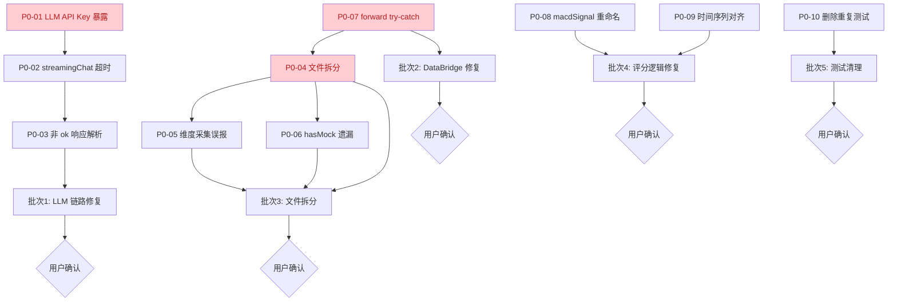

---
tier: reference
code_version: 2.0.0
---

# V9 P0 严重问题修复方案

> **文档版本**：v1.0
> **生成日期**：2026-07-02
> **审查来源**：[v9 数据交互模块综合代码审查报告](./audit-summary-report.md)
> **执行原则**：P0 → P1 → P2 分批执行；每批完成后等待用户确认再进入下一批
> **代码冻结约定**：本方案仅描述修改步骤，不含实际代码改动

---

## 目录

- [P0-01 LLM API Key 暴露到前端 Bundle](#p0-01-llm-api-key-暴露到前端-bundle)
- [P0-02 streamingChat 缺少超时和 AbortController](#p0-02-streamingchat-缺少超时和-abortcontroller)
- [P0-03 streamingChat 非 ok 响应解析二次异常](#p0-03-streamingchat-非-ok-响应解析二次异常)
- [P0-04 dataSourceOrchestrator.ts 文件 1267 行严重超标](#p0-04-datasourceorchestratorts-文件-1267-行严重超标)
- [P0-05 Phase 2/3 维度采集占位但误报成功](#p0-05-phase-23-维度采集占位但误报成功)
- [P0-06 hasMock 遗漏 K 线 Mock 检测](#p0-06-hasmock-遗漏-k-线-mock-检测)
- [P0-07 DataBridge.forward() 缺少顶层 try-catch](#p0-07-databridgeforward-缺少顶层-try-catch)
- [P0-08 macdSignal 字段语义错误](#p0-08-macdsignal-字段语义错误)
- [P0-09 rotationSignalDetector 时间序列未对齐](#p0-09-rotationsignaldetector-时间序列未对齐)
- [P0-10 SectorRotationHeatmap.test.tsx 重复文件](#p0-10-sectorrotationheatmaptesttsx-重复文件)
- [执行顺序与依赖关系](#执行顺序与依赖关系)
- [预期总体效果](#预期总体效果)

---

## P0-01 LLM API Key 暴露到前端 Bundle

### 问题定位

| 项目 | 内容 |
|:---|:---|
| **涉及文件** | `src/config/fetcherConfig.ts`、`src/config/llmConfig.ts`、`src/services/llm/llmClient.ts`、`.env.example`、`.env.local.example` |
| **问题行号** | fetcherConfig.ts:310、llmConfig.ts:153-159、llmClient.ts:143,244、.env.example:13、.env.local.example:13 |
| **违反规范** | 项目硬约束："LLM API Key must be stored using encrypted localStorage (via localStorageManager's setEncrypted/getEncrypted methods)" |
| **风险等级** | 🔴 安全漏洞 — 任何用户可从浏览器 devtools 提取 API Key |

### 问题分析

当前链路：
```
.env.local (VITE_LLM_API_KEY=sk-xxx)
  → Vite 编译时内联到前端 bundle
  → llmConfig.ts 读取 import.meta.env.VITE_LLM_API_KEY
  → llmClient.ts 通过 Authorization: Bearer ${apiKey} 发送
  → 浏览器 Network 面板可见完整 Key
```

`VITE_` 前缀的环境变量会被 Vite 静态替换到客户端 JS 中，部署后任何访问者都能从源码或 devtools 提取密钥。

### 修复方案（后端代理 + 加密存储双方案）

#### 方案 A：后端代理（推荐，长期方案）

**目标**：API Key 仅存在于后端，前端通过内部接口调用 LLM。

**修改步骤**：

1. **新建后端 LLM 代理端点**（`python/data_service/llm_proxy_endpoints.py`）
   - 新增 `POST /api/llm/chat` 端点
   - 从后端环境变量 `LLM_API_KEY`（无 VITE_ 前缀）读取 Key
   - 接收前端请求 `{ messages, model, temperature, maxTokens }`
   - 转发到 DeepSeek API，返回响应
   - 增加 `slowapi` 限流（每分钟 30 次/IP）

2. **修改 `src/config/llmConfig.ts`**
   - 移除 `import.meta.env.VITE_LLM_API_KEY` 读取
   - `getDefaultLlmConfig()` 中 `apiKey` 字段改为空字符串
   - 新增 `llmProxyEndpoint: '/api/llm/chat'` 配置项
   - `isLlmConfigured()` 改为检查 `llmProxyEndpoint` 是否配置

3. **修改 `src/services/llm/llmClient.ts`**
   - `chat()` 方法：当 `apiKey` 为空时，走代理端点 `fetch(llmProxyEndpoint, ...)` 而非直连 DeepSeek
   - 移除 `Authorization: Bearer` 头（代理端点由后端鉴权）
   - 请求体改为 `{ messages, model, temperature, maxTokens }`

4. **修改 `.env.example` 和 `.env.local.example`**
   - 移除 `VITE_LLM_API_KEY` 配置项
   - 新增 `VITE_LLM_PROXY_ENDPOINT=/api/llm/chat` 配置项
   - 新增注释说明"API Key 由后端管理，前端不持有"

5. **修改 `src/config/fetcherConfig.ts:310-322`**
   - 移除 `const llmApiKey = import.meta.env.VITE_LLM_API_KEY ?? ''`
   - 健康检查改为 `configured: !!llmProxyEndpoint`，不暴露任何 Key 片段

#### 方案 B：加密 localStorage（短期过渡）

**目标**：用户在 UI 配置页输入 Key，加密存储在浏览器本地。

**修改步骤**：

1. **修改 `src/config/llmConfig.ts`**
   - `getDefaultLlmConfig()` 中 `apiKey` 改为 `localStorageManager.getEncrypted('llm_api_key') ?? ''`
   - 新增 `setLlmApiKey(key: string)` 方法，调用 `localStorageManager.setEncrypted('llm_api_key', key)`

2. **修改 `.env.example` 和 `.env.local.example`**
   - 移除 `VITE_LLM_API_KEY` 配置项
   - 新增注释："API Key 通过 UI 配置页输入，加密存储在 localStorage"

3. **修改 `src/config/fetcherConfig.ts:310-322`**
   - 移除环境变量读取
   - 健康检查改为 `configured: !!localStorageManager.getEncrypted('llm_api_key')`

### 预期效果

| 指标 | 修复前 | 修复后 |
|:---|:---|:---|
| API Key 暴露面 | 前端 bundle + Network 面板 | 无（方案 A） / 加密 localStorage（方案 B） |
| 违反硬约束 | 是 | 否 |
| Key 泄露风险 | 任何用户可提取 | 需要用户主动输入且加密存储 |

### 验证方法

1. 浏览器 devtools → Sources 搜索 `sk-`，应无结果
2. Network 面板查看 LLM 请求，应无 `Authorization: Bearer` 头
3. `localStorage` 查看 `llm_api_key`，应为加密字符串（方案 B）

---

## P0-02 streamingChat 缺少超时和 AbortController

### 问题定位

| 项目 | 内容 |
|:---|:---|
| **涉及文件** | `src/services/llm/llmClient.ts` |
| **问题行号** | 219-302（重点 239-246） |
| **违反规范** | 项目硬约束："Agent tasks must have timeout control with AbortController for parallel execution" |
| **风险等级** | 🔴 资源泄漏 — Promise 永久挂起、内存泄漏、UI 永久 loading |

### 问题分析

`chat()` 方法（第 117 行）有完整的 `AbortController` + `setTimeout` 超时机制（第 135-136 行），但 `streamingChat`（第 219-302 行）**完全没有超时控制**。如果 LLM API 异常（服务端不关闭连接、网络中间代理挂起），`reader.read()`（第 265 行）会无限等待。

### 修复方案

**修改步骤**：

1. **在 `streamingChat` 函数体开头创建 AbortController**
   ```typescript
   const controller = new AbortController()
   ```

2. **设置总超时定时器**
   ```typescript
   const totalTimeoutId = config.timeout
     ? setTimeout(() => controller.abort(), config.timeout)
     : null
   ```

3. **设置空闲超时定时器（每收到 chunk 重置）**
   ```typescript
   const IDLE_TIMEOUT_MS = 30000
   let idleTimer: ReturnType<typeof setTimeout> | null = null
   const resetIdleTimer = () => {
     if (idleTimer) clearTimeout(idleTimer)
     idleTimer = setTimeout(() => controller.abort(), IDLE_TIMEOUT_MS)
   }
   resetIdleTimer() // 初始化
   ```

4. **将 `controller.signal` 传入 fetch**
   ```typescript
   const response = await fetch(endpoint, {
     method: 'POST',
     headers,
     body: JSON.stringify(requestBody),
     signal: controller.signal,
   })
   ```

5. **在 `while (true)` 循环中每次 `reader.read()` 后重置空闲定时器**
   ```typescript
   const { done, value } = await reader.read()
   resetIdleTimer()
   ```

6. **在 `finally` 块中清理所有定时器并主动 abort**
   ```typescript
   finally {
     if (totalTimeoutId) clearTimeout(totalTimeoutId)
     if (idleTimer) clearTimeout(idleTimer)
     controller.abort()
     reader.releaseLock()
   }
   ```

7. **在 catch 中识别 AbortError 并转换为业务错误**
   ```typescript
   catch (err) {
     if (err instanceof DOMException && err.name === 'AbortError') {
       throw new LlmApiError('LLM 流式请求超时或被中止')
     }
     throw err
   }
   ```

8. **提取 `IDLE_TIMEOUT_MS` 为常量**（放在文件顶部）
   ```typescript
   const STREAM_IDLE_TIMEOUT_MS = 30000
   ```

### 预期效果

| 指标 | 修复前 | 修复后 |
|:---|:---|:---|
| 总超时控制 | 无 | `config.timeout` 后 abort |
| 空闲超时控制 | 无 | 30s 无数据后 abort |
| Promise 挂起风险 | 高 | 无 |
| 内存泄漏风险 | 高 | 无（finally 主动 abort + releaseLock） |
| UI loading 永久 | 可能 | 超时后抛出 LlmApiError，UI 可捕获 |

### 验证方法

1. Mock 一个永不响应的 LLM 端点，验证 30s 后抛出 `LlmApiError`
2. Mock 一个响应极慢的端点（每 35s 发一个 chunk），验证空闲超时触发
3. 正常流式调用应不受影响

---

## P0-03 streamingChat 非 ok 响应解析二次异常

### 问题定位

| 项目 | 内容 |
|:---|:---|
| **涉及文件** | `src/services/llm/llmClient.ts` |
| **问题行号** | 248-252（streamingChat）、151（chat 同样问题） |
| **违反规范** | C.错误处理 — "不应对外部服务响应格式做理想化假设" |
| **风险等级** | 🔴 错误信息丢失 — 用户看到 "Unexpected token <" 而非真实 HTTP 错误 |

### 问题分析

当前代码：
```typescript
if (!response.ok) {
  const raw = (await response.json()) as RawResponse  // 若 body 非 JSON 会抛 SyntaxError
  throw new LlmApiError(`LLM 请求失败: ${raw.error?.message ?? '未知错误'}`)
}
```

如果 LLM API 返回 4xx/5xx 但 body 不是 JSON（如 nginx 502 返回 HTML、Cloudflare 5xx 返回纯文本），`response.json()` 会抛出 `SyntaxError`，丢失原始 HTTP 状态码信息。

### 修复方案

**修改步骤**：

1. **修改 `streamingChat` 的错误处理（第 248-252 行）**
   ```typescript
   if (!response.ok) {
     let message = `HTTP ${response.status} ${response.statusText}`
     try {
       const raw = (await response.json()) as RawResponse
       if (raw.error?.message) {
         message = raw.error.message
       }
     } catch {
       // 响应体非 JSON，保留默认 HTTP 状态消息
       logger.warn('[llmClient] LLM 错误响应非 JSON 格式', {
         status: response.status,
         contentType: response.headers.get('content-type'),
       })
     }
     throw new LlmApiError(`LLM 请求失败: ${message}`)
   }
   ```

2. **同样修改 `chat` 方法的错误处理（第 151 行附近）**
   - 先检查 `response.ok`，再解析 body
   - 用 try/catch 包裹 `response.json()`

3. **在 `LlmApiError` 中保留 HTTP 状态码**（可选增强）
   ```typescript
   export class LlmApiError extends Error {
     readonly statusCode?: number
     constructor(message: string, statusCode?: number) {
       super(message)
       this.name = 'LlmApiError'
       this.statusCode = statusCode
     }
   }
   ```

### 预期效果

| 指标 | 修复前 | 修复后 |
|:---|:---|:---|
| 非 JSON 错误响应 | 抛 SyntaxError "Unexpected token <" | 抛 LlmApiError "LLM 请求失败: HTTP 502 Bad Gateway" |
| 错误信息可读性 | 差 | 好 |
| 调试效率 | 低（需查看 Network 才能定位） | 高（错误消息含状态码） |

### 验证方法

1. Mock 一个返回 HTML 502 的端点，验证抛出 `LlmApiError` 而非 `SyntaxError`
2. Mock 一个返回 JSON 401 的端点，验证错误消息包含 `Authentication Fails`

---

## P0-04 dataSourceOrchestrator.ts 文件 1267 行严重超标

### 问题定位

| 项目 | 内容 |
|:---|:---|
| **涉及文件** | `src/services/fetcher/dataSourceOrchestrator.ts` |
| **问题行号** | 1-1267（全文件） |
| **违反规范** | A.架构合规性 — "单个文件不超过 400 行" |
| **风险等级** | 🔴 可维护性极差 — 是限制的 3 倍多 |

### 问题分析

当前文件同时承载 6 大职责：
1. 降级链编排（行情/K线）
2. 维度采集（8 维度）
3. Mock 数据生成
4. DataBridge 写入
5. Phase 1-4 全量会话编排
6. 日志埋点

### 修复方案（按职责拆分为 6 个子模块）

**目标文件结构**：
```
src/services/fetcher/
├── dataSourceOrchestrator.ts       (保留，作为入口聚合，<100 行)
├── orchestrator/
│   ├── quoteFallback.ts            (行情降级链)
│   ├── klineFallback.ts            (K线降级链)
│   ├── dimensionCollector.ts       (8 维度采集)
│   ├── mockGenerator.ts            (Mock 数据生成)
│   ├── storageWriter.ts            (DataBridge 写入)
│   └── sessionOrchestrator.ts      (Phase 1-4 会话编排)
└── utils/
    └── shared.ts                   (isAbortError, hashString, round2)
```

**修改步骤**：

1. **创建 `orchestrator/quoteFallback.ts`**
   - 迁移行情降级链逻辑（当前第 100-160 行附近）
   - 导出 `fetchQuoteWithFallback(code: string): Promise<StockQuote | null>`
   - 包含 `QUOTE_FALLBACK_CHAIN` 常量和 `fetchQuoteBySource` 函数

2. **创建 `orchestrator/klineFallback.ts`**
   - 迁移 K 线降级链逻辑（当前第 220-290 行附近）
   - 导出 `fetchKlineWithFallback(code: string, days: number): Promise<KlineItem[] | null>`
   - 包含 `KLINE_FALLBACK_CHAIN` 常量和 `fetchKlineBySource` 函数

3. **创建 `orchestrator/dimensionCollector.ts`**
   - 迁移 8 维度采集逻辑（当前第 368-607 行）
   - 导出 `collectDimension(code: string, dimension: string): Promise<CollectedItem>`
   - 包含各维度采集函数

4. **创建 `orchestrator/mockGenerator.ts`**
   - 迁移 Mock 数据生成（当前第 614-666 行）
   - 导出 `mockQuote(code: string): StockQuote`、`mockKline(code: string, days: number): KlineItem[]`
   - 提取魔法数字为常量（MOCK_BASE_PRICE_MIN 等）

5. **创建 `orchestrator/storageWriter.ts`**
   - 迁移 DataBridge 写入逻辑（当前第 678-821 行）
   - 导出 `writeToStorage(item: CollectedItem): Promise<void>`、`writeKlineToStorage(...)`
   - 修复 dataQuality 浅合并问题（见 P1 问题）

6. **创建 `orchestrator/sessionOrchestrator.ts`**
   - 迁移 Phase 1-4 会话编排（当前第 858-1260 行）
   - 导出 `collectAllDimensions(codes: string[]): Promise<CollectSessionResult>`
   - 包含 Phase 屏障同步逻辑

7. **创建 `utils/shared.ts`**
   - 提取 `isAbortError`、`hashString`、`round2` 等工具函数
   - 消除与 `directDataAPI.ts` 的重复定义

8. **精简 `dataSourceOrchestrator.ts` 为入口聚合**
   - 仅 re-export 子模块的公共接口
   - 保留 `CollectResult`、`CollectedItem` 等类型定义
   - 目标行数 < 100 行

### 预期效果

| 指标 | 修复前 | 修复后 |
|:---|:---|:---|
| 主文件行数 | 1267 | < 100 |
| 最大子文件行数 | — | < 400 |
| 职责数量 | 6 | 1（每个子模块单一职责） |
| 可维护性 | 极差 | 良好 |
| 可测试性 | 差（难以单独测试） | 好（每个子模块可独立测试） |

### 验证方法

1. `tsc --noEmit` 通过，无类型错误
2. 现有测试全部通过（行为不变）
3. 每个子文件行数 ≤ 400

---

## P0-05 Phase 2/3 维度采集占位但误报成功

### 问题定位

| 项目 | 内容 |
|:---|:---|
| **涉及文件** | `src/services/fetcher/dataSourceOrchestrator.ts`（拆分后为 `orchestrator/dimensionCollector.ts`） |
| **问题行号** | 444-491 |
| **违反规范** | B.数据流完整性 — "数据修改必须实际写入" |
| **风险等级** | 🔴 数据失真 — 采集成功率统计错误，上层决策误判 |

### 问题分析

5 个维度（`03_chip`、`06_industry`、`08_research`、`04_events`、`05_news`）的采集实现是占位 stub：
- 仅调用 `collectBasic(code)` 返回基础信息
- `collected.push({ code })` 不携带任何业务数据
- 但 Phase 4 写入循环中 `result.success.push(item.code)` 仍标记为成功

### 修复方案

**修改步骤**：

1. **在 `CollectedItem` 类型中增加 `isStub?: boolean` 字段**
   ```typescript
   interface CollectedItem {
     code: string
     quote?: StockQuote
     kline?: KlineItem[]
     // ... 其他维度字段
     isStub?: boolean  // 标记此维度为占位实现
   }
   ```

2. **修改占位维度的采集逻辑**
   - 在 `03_chip`/`06_industry`/`08_research`/`04_events`/`05_news` 的采集分支中
   - 设置 `collected.isStub = true`
   - 添加 `logger.warn('[dimensionCollector] 维度 X 为占位实现', { code, dimension })`

3. **修改 Phase 4 成功统计逻辑**
   ```typescript
   if (item.isStub) {
     result.partial = true
     result.stubDimensions = result.stubDimensions ?? []
     result.stubDimensions.push(item.dimension)
     // 不 push 到 success
   } else {
     result.success.push(item.code)
   }
   ```

4. **在 `CollectResult` 类型中增加 `stubDimensions?: string[]` 字段**
   - 供上层 UI 展示"以下维度为占位实现"提示

5. **在上层 UI 中展示 partial 状态**
   - 当 `result.partial === true` 时，Toast 提示"部分维度为占位实现，数据可能不完整"

### 预期效果

| 指标 | 修复前 | 修复后 |
|:---|:---|:---|
| 采集成功率 | 虚高（含占位维度） | 真实（仅实际采集的计入成功） |
| 上层决策 | 误判"数据已就绪" | 感知"部分维度为占位" |
| 用户知情权 | 无 | 有（Toast 提示） |

### 验证方法

1. 运行 `collectAllDimensions`，验证 `result.partial === true`
2. 验证 `result.stubDimensions` 包含 5 个占位维度
3. 验证 `result.success` 不包含占位维度的 code

---

## P0-06 hasMock 遗漏 K 线 Mock 检测

### 问题定位

| 项目 | 内容 |
|:---|:---|
| **涉及文件** | `src/services/fetcher/dataSourceOrchestrator.ts`（拆分后为 `orchestrator/sessionOrchestrator.ts`） |
| **问题行号** | 590 |
| **违反规范** | B.数据流完整性 + C.错误处理 — "是否有 fallback 默认值，避免 undefined 导致白屏" |
| **风险等级** | 🔴 数据陈旧无感知 — UI 无法感知 K 线数据为 Mock |

### 问题分析

```typescript
const hasMock = collected.some((c) => c.quote?.source === 'mock')
```

仅检查 `quote.source`，但 `KlineItem` 接口无 `source` 字段，`mockKline()` 生成的数据与真实数据无法区分。

### 修复方案

**修改步骤**：

1. **在 `KlineItem` 接口中增加 `source?: string` 字段**
   ```typescript
   // src/services/fetcher/directDataAPI.ts
   export interface KlineItem {
     date: string
     open: number
     high: number
     low: number
     close: number
     volume: number
     amount?: number
     source?: string  // 新增：标记数据来源
   }
   ```

2. **在 `mockKline()` 中设置 `source: 'mock'`**
   ```typescript
   // orchestrator/mockGenerator.ts
   export function mockKline(code: string, days: number): KlineItem[] {
     return Array.from({ length: days }, (_, i) => ({
       // ... 原有字段
       source: 'mock',
     }))
   }
   ```

3. **在真实数据源中设置 `source`**
   - `tencentKline` 返回时设置 `source: 'tencent'`
   - `neteaseKline` 返回时设置 `source: 'netease'`
   - `fetcherClient.collectKline` 返回时设置 `source: 'akshare'`

4. **修改 `hasMock` 检测逻辑**
   ```typescript
   const hasMock = collected.some(
     (c) => c.quote?.source === 'mock' || c.kline?.some((k) => k.source === 'mock')
   )
   ```

5. **在 `CollectedItem` 中增加 `klineSource?: string` 字段**（可选，用于更精细的来源追踪）
   ```typescript
   collected.klineSource = klineData[0]?.source
   ```

### 预期效果

| 指标 | 修复前 | 修复后 |
|:---|:---|:---|
| K 线 Mock 检测 | 遗漏 | 正确检测 |
| `result.stale` 准确性 | 不准（K线 Mock 时为 false） | 准确（K线 Mock 时为 true） |
| UI 数据陈旧提示 | 缺失 | 显示 |

### 验证方法

1. 触发 K 线降级到 Mock，验证 `result.stale === true`
2. 正常 K 线采集，验证 `result.stale === false`

---

## P0-07 DataBridge.forward() 缺少顶层 try-catch

### 问题定位

| 项目 | 内容 |
|:---|:---|
| **涉及文件** | `src/core/databridge.ts` |
| **问题行号** | 75-143（forward 方法）、662（broadcast 中 eventBus.emit） |
| **违反规范** | 项目硬约束："所有 DataBridge.forward() 调用必须用 try-catch 包裹" |
| **风险等级** | 🔴 错误未捕获 — broadcast 失败会导致整个 forward 失败 |

### 问题分析

`forward()` 方法主体（75-143 行）缺少顶层 try-catch。`broadcast()` 中 `eventBus.emit`（662 行）未包裹保护，若 emit 抛错，错误会传播给调用方。

### 修复方案

**修改步骤**：

1. **在 `forward()` 方法主体外层添加 try-catch**
   ```typescript
   async forward(envelope: StandardEnvelope): Promise<void> {
     const startTs = Date.now()
     logger.info(`[DataBridge] forward() called: ...`)
     try {
       // ... 原有主体逻辑（验证、路由、广播）
     } catch (err) {
       logger.error(`[DataBridge] forward() 失败`, {
         action: envelope.meta.action,
         traceId: envelope.meta.traceId,
         error: err instanceof Error ? err.message : String(err),
       })
       throw err  // 重新抛出，让调用方感知
     } finally {
       const duration = Date.now() - startTs
       if (duration > FORWARD_SLOW_THRESHOLD_MS) {
         logger.warn(`[DataBridge] forward() took ${duration}ms`)
       }
       logger.info(`[DataBridge] forward() completed: duration=${duration}ms`)
     }
   }
   ```

2. **在 `broadcast()` 中包裹 `eventBus.emit`**
   ```typescript
   private broadcast(channel: string, envelope: StandardEnvelope): void {
     // ... subscriber 回调遍历（已有 try-catch 保护）
     try {
       eventBus.emit(`${channel}:changed`, envelope)
     } catch (err) {
       logger.warn(`[DataBridge] eventBus.emit 失败`, {
         channel,
         error: err instanceof Error ? err.message : String(err),
       })
     }
   }
   ```

3. **提取魔法数字为常量**（放在文件顶部）
   ```typescript
   const FORWARD_SLOW_THRESHOLD_MS = 50
   const BROADCAST_SLOW_THRESHOLD_MS = 10
   ```

4. **修正 `writeAuditLog` 错误级别**（第 109-111 行）
   ```typescript
   // 修改前
   this.writeAuditLog(envelope, targetStore).catch((err) => {
     logger.warn('Audit log failed', { err })
   })
   // 修改后
   this.writeAuditLog(envelope, targetStore).catch((err) => {
     logger.error('[DataBridge] Audit log failed', {
       error: err,
       action: envelope.meta.action,
       traceId: envelope.meta.traceId,
     })
   })
   ```

### 预期效果

| 指标 | 修复前 | 修复后 |
|:---|:---|:---|
| forward 错误捕获 | 部分（仅 ACL 有 try-catch） | 完整（顶层 try-catch） |
| broadcast emit 失败 | 导致 forward 失败 | 仅 warn 日志，不中断 |
| 审计日志失败级别 | warn | error |
| 错误上下文 | 不统一 | 含 action + traceId |

### 验证方法

1. Mock `eventBus.emit` 抛错，验证 forward 仍成功返回
2. Mock `EnvelopeFactory.validate` 抛错，验证 forward 抛出且日志含 traceId
3. 验证审计日志失败时记录 error 级别

---

## P0-08 macdSignal 字段语义错误

### 问题定位

| 项目 | 内容 |
|:---|:---|
| **涉及文件** | `src/services/scoring/hotSectorAnalyzer.ts` |
| **问题行号** | 541-546 |
| **违反规范** | 评分逻辑准确性 — 字段名与实现语义不符 |
| **风险等级** | 🔴 评分语义错误 — 误导使用者认为评分基于 MACD |

### 问题分析

`macdSignal` 字段（第 541 行）使用 RSI 阈值推导：
```typescript
macdSignal: (rsi ?? RSI_DEFAULT) > MACD_BULLISH_THRESHOLD
```
但接口注释（第 59 行）说明"MACD 信号方向"，`calculateBreakout` 中的 MACD 金叉/死叉判断实质上是 RSI 高低判断。

### 修复方案（双选项，推荐方案 A）

#### 方案 A：重命名字段（推荐，低成本）

**修改步骤**：

1. **在 `BreakoutInput` 接口中重命名字段**（第 59 行附近）
   ```typescript
   // 修改前
   macdSignal: boolean  // MACD 信号方向
   // 修改后
   rsiSignal: boolean  // RSI 信号方向（多头/空头）
   ```

2. **在 `calculateBreakout` 中更新引用**（第 541 行附近）
   ```typescript
   // 修改前
   macdSignal: (rsi ?? RSI_DEFAULT) > MACD_BULLISH_THRESHOLD,
   // 修改后
   rsiSignal: (rsi ?? RSI_DEFAULT) > RSI_BULLISH_THRESHOLD,
   ```

3. **重命名阈值常量**
   ```typescript
   // 修改前
   const MACD_BULLISH_THRESHOLD = 55
   // 修改后
   const RSI_BULLISH_THRESHOLD = 55
   ```

4. **更新 `calculateBreakout` 中的判断逻辑**
   ```typescript
   // 修改前
   if (data.macdSignal) { ... }
   // 修改后
   if (data.rsiSignal) { ... }
   ```

5. **更新相关测试文件**（若有引用 `macdSignal`）

#### 方案 B：实现真正的 MACD（高成本）

需要实现 DIF（快线 EMA12 - 慢线 EMA26）、DEA（DIF 的 EMA9）、MACD 柱（2*(DIF-DEA)）计算，并基于金叉/死叉判断信号方向。此方案需要历史 K 线数据输入。

### 预期效果

| 指标 | 修复前 | 修复后 |
|:---|:---|:---|
| 字段名语义 | 错误（名为 MACD 实为 RSI） | 准确（名为 RSISignal 实为 RSI） |
| 使用者误导风险 | 高 | 无 |
| 评分逻辑准确性 | 逻辑本身正确，仅命名错误 | 逻辑正确且命名准确 |

### 验证方法

1. `tsc --noEmit` 通过
2. 现有测试全部通过（行为不变，仅重命名）
3. grep 确认无 `macdSignal` 残留引用

---

## P0-09 rotationSignalDetector 时间序列未对齐

### 问题定位

| 项目 | 内容 |
|:---|:---|
| **涉及文件** | `src/services/scoring/rotationSignalDetector.ts` |
| **问题行号** | 264-276 |
| **违反规范** | 评分逻辑准确性 — 跨股票按索引聚合错误 |
| **风险等级** | 🔴 评分结果错误 — 不同长度历史数据按索引聚合 |

### 问题分析

`detectBySector` 的数据聚合循环假设所有股票的时间序列对齐：
```typescript
for (let i = 0; i < recentHistory.length; i++) {
  sectorVolumes[i] += history[i]!.volume
  sectorFlows[i] += (history[i]!.close - history[i]!.open) * history[i]!.volume
  closes[i].push(history[i]!.close)
}
```
不同股票的 `quotes.history.length` 可能不同，`slice(-60)` 对历史不足 60 天的股票返回全部数据，索引 `i` 对不同股票代表不同日期。

### 修复方案

**修改步骤**：

1. **在聚合前按时间戳对齐数据**
   ```typescript
   // 1. 收集所有股票共同的日期集合
   const allDates = new Set<string>()
   for (const stock of sectorStocks) {
     const quotes = await dataLayer.dailyQuotes.get(stock.symbol).catch(() => null)
     quotes?.history.slice(-60).forEach((bar) => allDates.add(bar.date))
   }
   const sortedDates = Array.from(allDates).sort()

   // 2. 为每只股票建立 date -> bar 的映射
   const stockBarMaps = new Map<string, Map<string, KlineBar>>()
   for (const stock of sectorStocks) {
     const quotes = await dataLayer.dailyQuotes.get(stock.symbol).catch(() => null)
     const barMap = new Map<string, KlineBar>()
     quotes?.history.slice(-60).forEach((bar) => barMap.set(bar.date, bar))
     stockBarMaps.set(stock.symbol, barMap)
   }

   // 3. 按 sortedDates 聚合，每只股票在某个日期无数据时跳过
   const sectorVolumes: number[] = new Array(sortedDates.length).fill(0)
   const sectorFlows: number[] = new Array(sortedDates.length).fill(0)
   const closes: number[][] = new Array(sortedDates.length).map(() => [])

   for (let i = 0; i < sortedDates.length; i++) {
     const date = sortedDates[i]!
     for (const [, barMap] of stockBarMaps) {
       const bar = barMap.get(date)
       if (bar) {
         sectorVolumes[i] += bar.volume
         sectorFlows[i] += (bar.close - bar.open) * bar.volume
         closes[i]!.push(bar.close)
       }
     }
   }
   ```

2. **增加历史不足 60 天的跳过逻辑**
   ```typescript
   const MIN_HISTORY_DAYS = 20
   for (const stock of sectorStocks) {
     const quotes = await dataLayer.dailyQuotes.get(stock.symbol).catch(() => null)
     if (!quotes || quotes.history.length < MIN_HISTORY_DAYS) {
       logger.warn('[rotationSignalDetector] 股票历史数据不足，跳过', {
         symbol: stock.symbol,
         historyLength: quotes?.history.length ?? 0,
         minLength: MIN_HISTORY_DAYS,
       })
       continue
     }
     // ... 加入聚合
   }
   ```

3. **提取魔法数字为常量**
   ```typescript
   const RECENT_DATA_WINDOW_DAYS = 60
   const MIN_HISTORY_DAYS = 20
   ```

### 预期效果

| 指标 | 修复前 | 修复后 |
|:---|:---|:---|
| 时间序列对齐 | 错误（按索引聚合） | 正确（按日期对齐） |
| 短历史股票处理 | 错误聚合 | 跳过并 warn |
| 评分准确性 | 可能错误 | 准确 |

### 验证方法

1. 构造 2 只股票，A 有 60 天历史，B 有 40 天历史，验证按日期对齐聚合
2. 构造 1 只股票历史不足 20 天，验证被跳过且 warn 日志

---

## P0-10 SectorRotationHeatmap.test.tsx 重复文件

### 问题定位

| 项目 | 内容 |
|:---|:---|
| **涉及文件** | `src/components/analysis/sector/SectorRotationHeatmap.test.tsx` |
| **问题行号** | 1-139（全文件） |
| **违反规范** | 代码质量 — DRY 原则 |
| **风险等级** | 🟡 维护成本翻倍 — 同一组件被测试两次 |

### 问题分析

存在两份测试同一组件的文件：
- `tests/SectorRotationHeatmap.test.tsx`（284 行，新版，更全面）
- `src/components/analysis/sector/SectorRotationHeatmap.test.tsx`（139 行，旧版，更简单）

### 修复方案

**修改步骤**：

1. **对比两份文件的测试覆盖范围**
   - `tests/` 版本覆盖：loading/error/empty 三态、adaptHeatmapData、getMetricValue、指标切换、时间窗口切换、cell 点击导航、排行榜排序
   - `src/components/` 版本覆盖：三态、adaptHeatmapData、cell 点击、时间窗口切换（功能重叠）
   - `src/components/` 版本独有：`MemoryRouter` 路由集成测试

2. **将 `src/components/` 版本的独有测试迁移到 `tests/` 版本**
   - 如果 `tests/` 版本已有等价测试（如 cell 点击导航），则无需迁移
   - 如果 `src/components/` 版本的 `MemoryRouter` 测试有独特价值，迁移到 `tests/` 版本

3. **删除 `src/components/analysis/sector/SectorRotationHeatmap.test.tsx`**
   ```bash
   # 使用 DeleteFile 工具删除
   ```

4. **运行测试验证**
   ```bash
   npx vitest run tests/SectorRotationHeatmap.test.tsx
   ```
   - 确认所有测试通过
   - 确认无测试用例丢失

### 预期效果

| 指标 | 修复前 | 修复后 |
|:---|:---|:---|
| 测试文件数量 | 2 | 1 |
| 测试冗余 | 有（功能重叠） | 无 |
| 维护成本 | 双倍 | 单倍 |
| 测试覆盖 | 不变 | 不变（或增强，若迁移了独有测试） |

### 验证方法

1. 删除后 `npx vitest run` 全部通过
2. 测试覆盖率不下降
3. grep 确认无其他文件引用被删除的测试

---

## 执行顺序与依赖关系



### 推荐执行批次

| 批次 | 包含问题 | 依赖关系 | 预计修改文件数 |
|:---|:---|:---|:---|
| **批次 1** | P0-01、P0-02、P0-03（LLM 链路） | 无依赖，可独立执行 | 5-6 个 |
| **批次 2** | P0-07（DataBridge 修复） | 无依赖 | 1 个 |
| **批次 3** | P0-04、P0-05、P0-06（文件拆分+数据流） | P0-04 完成后 P0-05/P0-06 在新文件中修改 | 1→7 个（拆分） |
| **批次 4** | P0-08、P0-09（评分逻辑） | 无依赖 | 2 个 |
| **批次 5** | P0-10（测试清理） | 无依赖 | 删除 1 个 |

**每批完成后需等待用户确认再进入下一批。**

---

## 预期总体效果

### 修复前 vs 修复后对比

| 维度 | 修复前 | 修复后 |
|:---|:---|:---|
| **安全性** | API Key 暴露到前端 bundle | Key 由后端管理（方案 A）或加密存储（方案 B） |
| **资源泄漏** | streamingChat 可能无限挂起 | 总超时 + 空闲超时双重保护 |
| **错误处理** | forward 无顶层 try-catch，emit 失败导致 forward 失败 | 完整 try-catch，emit 失败仅 warn |
| **架构合规** | 1 个文件 1267 行 | 拆分为 7 个文件，每个 < 400 行 |
| **数据真实性** | 5 个维度误报成功 | 正确标记 partial，UI 提示用户 |
| **数据陈旧感知** | K 线 Mock 未检测 | hasMock 正确检测 K 线 Mock |
| **评分准确性** | macdSignal 语义错误、时间序列未对齐 | 字段重命名、按日期对齐聚合 |
| **测试维护** | 2 份重复测试文件 | 1 份统一测试文件 |
| **错误信息** | "Unexpected token <" | "LLM 请求失败: HTTP 502 Bad Gateway" |

### 量化指标目标

| 指标 | 目标值 |
|:---|:---|
| P0 问题修复数 | 12/12（100%） |
| `tsc --noEmit` 错误数 | 0 |
| 现有测试通过率 | 100% |
| 文件行数超标数 | 0（所有文件 ≤ 400 行） |
| API Key 暴露面 | 0（前端无 Key） |
| `any` 类型使用数 | 0 |
| `console.log` 残留数 | 0 |

---

## 附录：审查报告引用

本修复方案基于以下审查报告生成：
- [V9 数据交互模块综合代码审查报告](./audit-summary-report.md)
- 审查日期：2026-07-02
- 审查工具：V9 Quality Inspector + TRAE-code-review SKILL
- 审查范围：17 个文件，6 类审查清单

---

**文档结束**
