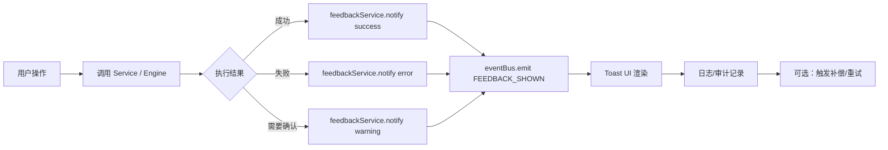

# V9 操作反馈闭环规格

> **对应蓝图**：`../reference/v9-system-blueprint.md` §5.3 事件总线规范、§7.2 UI/UX 反馈规范、§10 偏差项 D18「缺少操作反馈闭环」。
> **依赖文档**：`../reference/04-ui-ux-specs.md`（Toast 组件规范）、`../reference/widget-error-handling.md`（错误状态的上报与降级展示）。

---

## 1. 目标与范围

本文档规定 V9 系统中所有用户操作的反馈机制，包括 Toast 轻提示体系、持久化反馈服务 `FeedbackService`、操作状态闭环流程以及与 `EventBus` 的集成方式。不覆盖图表渲染性能与 Widget 错误边界（分别见 `../reference/chart-integration.md` 与 `../reference/widget-error-handling.md`）。

---

## 2. Toast 反馈体系

### 2.1 四种状态与持续时间

| 状态（variant） | 语义 | 默认持续时间 | 使用场景 |
|---|---|---|---|
| `success` | 操作成功 | 3000 ms | 保存、提交、导入完成、流转成功 |
| `error` | 操作失败 | 8000 ms | API 失败、校验不通过、异常崩溃 |
| `warning` | 警告/需关注 | 5000 ms | 数据缺失、降级、部分成功 |
| `info` | 中性提示 | 4000 ms | 开始加载、状态变更、帮助说明 |

> 当前基础组件实现见 `src/components/atoms/Toast.tsx` 与 `src/hooks/useToast.tsx`。

### 2.2 优先级与去重规则

```ts
// src/constants/feedback.constants.ts
export const TOAST_DURATION: Record<ToastVariant, number> = {
  success: 3000,
  error: 8000,
  warning: 5000,
  info: 4000,
}

export const TOAST_DEDUPLICATION_WINDOW_MS = 2000
```

- 同一 `title` + `variant` 在 2 秒内重复触发时，仅更新时间戳，不新增实例。
- `error` 类 Toast 强制显示关闭按钮，不允许自动消失（`duration: 0` 时可配置）。

---

## 3. FeedbackService 接口定义

`FeedbackService` 是应用层（L4）与引擎层（L3）统一调用反馈能力的入口，避免页面组件直接操作 Toast Context。

```ts
// src/services/feedback/feedbackService.ts
import type { ToastVariant } from '@/hooks/useToast'

export type FeedbackScope = 'global' | 'widget' | 'form' | 'route'

export interface FeedbackItem {
  id: string
  scope: FeedbackScope
  variant: ToastVariant
  title: string
  description?: string
  duration?: number
  action?: {
    label: string
    onClick: () => void
  }
  metadata?: {
    traceId?: string
    moduleId?: string
    timestamp: number
  }
}

export interface FeedbackService {
  notify(item: Omit<FeedbackItem, 'id' | 'metadata'>): void
  notifyAsync<T>(
    promise: Promise<T>,
    messages: {
      loading: string
      success: string
      error: string
    },
  ): Promise<T>
  dismiss(id: string): void
  dismissByScope(scope: FeedbackScope): void
  getHistory(): FeedbackItem[]
}

export const feedbackService: FeedbackService = {
  notify: (item) => { /* 通过 EventBus 转发 */ },
  notifyAsync: async (promise, messages) => { /* 自动切换 loading/success/error */ },
  dismiss: (id) => { /* ... */ },
  dismissByScope: (scope) => { /* ... */ },
  getHistory: () => { /* 返回最近 50 条 */ },
}
```

---

## 4. 操作反馈闭环流程图



### 4.1 典型调用示例

```ts
// 应用层调用示例
import { feedbackService } from '@/services/feedback/feedbackService'

async function handleImport(files: File[]) {
  await feedbackService.notifyAsync(
    batchImportService.import(files),
    {
      loading: '正在导入，请稍候…',
      success: `成功导入 ${files.length} 条记录`,
      error: '导入失败，请检查文件格式',
    },
  )
}
```

---

## 5. 与 EventBus 的集成方式

### 5.1 事件命名规范

| 事件名 | 触发时机 | 订阅方 |
|--------|----------|--------|
| `feedback:notify` | `FeedbackService.notify()` 被调用 | `ToastProvider`、日志记录器 |
| `feedback:dismiss` | 用户或代码主动关闭 | `ToastProvider` |
| `feedback:scopeCleared` | 按 scope 批量清除 | `ToastProvider` |
| `feedback:historyUpdated` | 历史记录变化 | 调试面板、审计日志 |

### 5.2 集成实现

```ts
// src/services/feedback/feedbackService.ts
import { eventBus } from '@/lib/eventBus'
import { getLogger } from '@/lib/logger'

const logger = getLogger()

export const feedbackService: FeedbackService = {
  notify: (item) => {
    const id = Math.random().toString(36).slice(2)
    const fullItem: FeedbackItem = {
      ...item,
      id,
      metadata: {
        traceId: item.traceId ?? crypto.randomUUID(),
        moduleId: item.scope,
        timestamp: Date.now(),
      },
    }
    logger.info('[FeedbackService] notify', { item: fullItem })
    eventBus.emit('feedback:notify', fullItem)
  },
  // ...
}
```

```tsx
// src/hooks/useToast.tsx（扩展订阅）
import { eventBus } from '@/lib/eventBus'

useEffect(() => {
  const unsubscribe = eventBus.on('feedback:notify', (payload) => {
    const item = payload as FeedbackItem
    toast({
      title: item.title,
      description: item.description,
      variant: item.variant,
      duration: item.duration ?? TOAST_DURATION[item.variant],
    })
  })
  return unsubscribe
}, [toast])
```

---

## 6. 与错误边界的协作

Widget 或页面级错误边界捕获异常后，不应直接渲染 Toast，而是通过 `feedbackService.notify()` 发送 `error` 反馈，由 `ToastProvider` 统一展示。详见 `../reference/widget-error-handling.md` §4.2。

---

## 7. 验收标准

- [ ] `feedbackService.notifyAsync` 覆盖所有异步操作入口（导入、流转、采集、评分）。
- [ ] `eventBus` 上 `feedback:*` 事件命名符合本章规范。
- [ ] 单元测试覆盖成功/失败/警告/去重/按 scope 清除。
- [ ] `audit:hardcode` 不新增硬编码 Toast 文案。

---

## 8. 相关链接

- `../reference/v9-system-blueprint.md` §5.3、§7.2、D18
- `../reference/04-ui-ux-specs.md` §4.6 交互反馈
- `../reference/chart-integration.md` §5.2（图表数据刷新反馈）
- `../reference/widget-error-handling.md` §4.2（错误边界→反馈服务）
