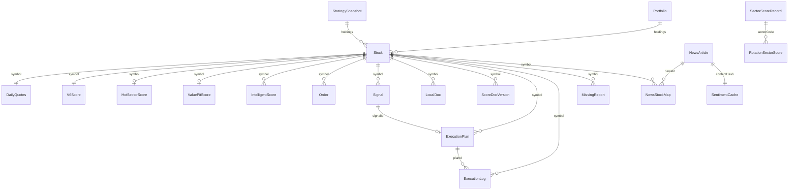

# V9 ?????????????????? (ER)

> **Status**: Current  
> **Version**: v1.1.0  
> **Last Updated**: 2026-06-30  
> **DB_VERSION**: 16???? `src/config/dbConfig.ts` ??????????????
>
> ???????? `src/data/types.ts` ?????????????? `src/data/db.ts` ???? 24 ?? IndexedDB ObjectStore ???????????? V9 ??????????????????????????????????????????????????????????

---

## 1. Store ????

| Store | ???? | ???? | ???? | ???????? | ???????? |
|-------|------|------|------|---------|---------|
| `stocks` | `symbol` | ?? | `by-status`, `by-group` | `Stock` | `stockpool`, `fetcher` |
| `daily_quotes` | `symbol` | ?? | - | `DailyQuotes` | `fetcher` |
| `v6_scores` | `symbol` | ?? | - | `V6Score` | `analyzer` |
| `intelligent_scores` | `id` | ?? | `by-symbol` | `IntelligentScore` | `analyzer` |
| `industry_scores` | `id` | ?? | `by-code` | `IndustryScore` | `analyzer` |
| `hot_sector_scores` | `symbol` | ?? | `by-calculated-at` | `HotSectorScore` | `analyzer` |
| `value_pit_scores` | `symbol` | ?? | `by-calculated-at` | `ValuePitScore` | `analyzer` |
| `rotation_scores` | `id` | ?? | `by-sector-date`(????), `by-sector`, `by-total`, `by-resonance` | `RotationSectorScore` | `rotation` |
| `sector_scores` | `id` | ?? | `by-sector`, `by-composite`, `by-is-core` | `SectorScoreRecord` | `sector` |
| `score_docs` | `docId` | ?? | `by-symbol`, `by-symbol-version`(????), `by-composite` | `ScoreDocVersion` | `analyzer` |
| `strategy_snapshots` | `id` | ?? | `by-version`(????), `by-date`, `by-timestamp` | `StrategySnapshot` | `tradinghub` |
| `local_docs` | `id` | ?? | `by-symbol`, `by-category`, `by-added-at` | `LocalDoc` | `system` |
| `news` | `id` | ?? | `by-source`, `by-category`, `by-publish-time`, `by-hash`(????) | `NewsArticle` | `news` |
| `news_stock_map` | `id` | ?? | `by-symbol`, `by-news` | `NewsStockMap` | `news` |
| `sentiment_cache` | `id` | ?? | `by-content-hash`(????), `by-analyzed-at` | `SentimentCache` | `news` |
| `news_bookmarks` | `id` | ?? | `by-bookmarked-at` | `NewsBookmark` | `news` |
| `orders` | `id` | ?? | - | `Order` | `tradinghub` |
| `signals` | `id` | ?? | - | `Signal` | `tradinghub`, `strategy` |
| `watchlists` | `id` | ?? | - | `Watchlist` | `user` |
| `research_logs` | `id` | ?? | - | `ResearchLog` | `system` |
| `execution_logs` | `id` | ?? | `by-plan`, `by-symbol`, `by-timestamp` | `ExecutionLog` | `execution` |
| `missing_reports` | `id` | ?? | `by-symbol`, `by-severity`, `by-detected-at` | `MissingReport` | `data-collector` |
| `executionPlans` | `id` | ?? | `by-signal`, `by-symbol`, `by-phase`, `by-created-at` | `ExecutionPlan` | `execution` |
| `portfolios` | `id` | ?? | `by-theme`, `by-updated-at` | `Portfolio` | `portfolio` |

---

## 2. ????????

| ???????? | ???? | ???????? | ???????? | ???? |
|---------|------|---------|---------|------|
| `Stock` (symbol) | 1:1 | `DailyQuotes` (symbol) | `symbol` | ???????????????????? K ?????? |
| `Stock` (symbol) | 1:1 | `V6Score` (symbol) | `symbol` | ???????????????????????????? |
| `Stock` (symbol) | 1:N | `IntelligentScore` (symbol) | `symbol` | ???????????????????????????? |
| `IndustryScore` (code) | 1:N | `Stock` (industryCode) | `industryCode` | ???????????????????? |
| `Stock` (symbol) | 1:1 | `HotSectorScore` (symbol) | `symbol` | ?????????????? |
| `Stock` (symbol) | 1:1 | `ValuePitScore` (symbol) | `symbol` | ?????????????? |
| `NewsArticle` (id) | N:M | `Stock` (symbol) | `news_stock_map.newsId` / `symbol` | ???????????????????? |
| `NewsArticle` (hash) | 1:1 | `SentimentCache` (contentHash) | `hash` / `contentHash` | ???????????? |
| `Stock` (symbol) | 1:N | `Order` (symbol) | `symbol` | ???????????? |
| `Stock` (symbol) | 1:N | `Signal` (symbol) | `symbol` | ???????????? |
| `SectorScoreRecord` (sectorCode) | 1:N | `RotationSectorScore` (sectorCode) | `sectorCode` | ???????????????????????? |
| `Stock` (symbol) | 1:N | `LocalDoc` (symbol) | `symbol` | ???????????????????????? |
| `Stock` (symbol) | 1:N | `ScoreDocVersion` (symbol) | `symbol` | ???????????????????????????? |
| `StrategySnapshot` | N:M | `Stock` / `Score` / `Signal` | `holdings.scores.symbols` | ?????????????? |
| `ExecutionPlan` (id) | 1:N | `ExecutionLog` (planId) | `planId` | ???????????????????????????? |
| `Signal` (id) | 1:N | `ExecutionPlan` (signalId) | `signalId` | ?????????????????????????? |
| `Stock` (symbol) | 1:N | `MissingReport` (symbol) | `symbol` | ???????????????????????????? |
| `Portfolio` (theme) | N:M | `Stock` (symbol) | `holdings.symbol` | ?????????????????????? |

---

## 3. ER ??

---

## 4. ????????????

`Stock` ?? V9 ????????????????????

- **1:1 ????**??`DailyQuotes`??`V6Score`??`HotSectorScore`??`ValuePitScore` ???? `symbol` ??????????????????????
- **1:N ????**??`IntelligentScore`??`Order`??`Signal`??`LocalDoc`??`ScoreDocVersion` ???? `symbol` ??????????????????????????????
- **N:M ????**??`NewsArticle` ???? `news_stock_map` ?? `Stock` ????????????????????????????????????????

---

## 5. ????????

- ???? Store ???????????? `src/config/dbConfig.ts`??`src/data/db.ts`??`src/data/types.ts` ????????
- ?????????????????????? `DB_VERSION`
- ???? Store ?????????????? TypeScript ????
