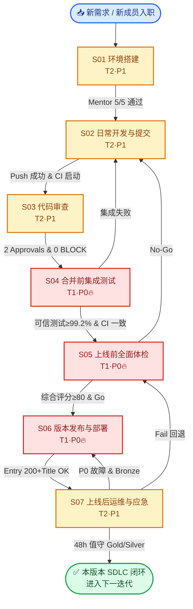

# SDLC 七阶段 SOP 体系 · 总览

> **📘 本目录性质**：FinSight V9 项目**首套按开发全生命周期（SDLC）连续 7 阶段组织**的标准操作 Procedure Suite（v1.0.0 · 基于 code_version 2.0.0-rc.1 / AGENTS.md v1.6.0）。替代之前零散分布在 guides/how-to/reports 多域的流程文档，**团队成员找"怎么做"第一步就来这里**。
>
> **🎯 核心目标**：让每一位成员（新 onboarding / 资深开发 / QA / DevOps / 架构师）**在正确的时间，用正确的姿势，执行正确的操作**，上线体检不再漏项、部署回滚不再拍脑袋。
>
> **🚦 规范等级**：7 篇 SOP 中 **S04 / S05 / S06 为 T1 P0 级强制**，S01 / S02 / S03 / S07 为 T2 P1 级强约束。详细等级见下方矩阵。

---

## 一、阶段流转图（时间线 7 步闭环）



---

## 二、7 篇 SOP 索引表（含核心 5 要素与典型使用者）

| # | SOP 标题与链接 | doc_id | 规范等级 | 核心内容 3 句话 | 典型使用者 | 单次耗时参考 |
|:-:|--------------|:-----:|:------:|---------------|----------|:-----------:|
| S01 | [开发环境搭建 SOP](./S01-dev-env-setup.md) | `V9-DOC-SOP-001` | T2 · 🟧 P1 | 9 步从零到可启动，跨平台双命令（Win + macOS/Linux）；Node 版本严格对齐 .nvmrc；**新成员 ≤ 60 分钟通过 Mentor 复核 5/5**。含 troubleshooting 缺口 1 补充（Node 版本误装 3 步回退）。 | 新 onboarding 成员、DevOps 换机重建 | **≤ 60 min** |
| S02 | [日常开发与提交 SOP](./S02-dev-workflow.md) | `V9-DOC-SOP-002` | T2 · 🟧 P1 | 7 型分支命名 + Git Worktree 并行 + Squash 三规则；**3 类合法提交方式**（Conventional 规范 / 速提 `-m` / SkAI 智能），**禁止 GUI/IDE 插件提交**（Husky scope-guard 可能漏拦截）；含 pre-commit 22 步 + pre-push 6 步速查表。补治理文档 gap-1（pre-commit 失败后部分暂存的 3 步回滚）。 | 全体开发、Committer | 无固定，按需使用 |
| S03 | [代码审查 SOP](./S03-code-review.md) | `V9-DOC-SOP-003` | T2 · 🟧 P1 | **PR 模板 8 字段清单**（比 FR ≥ 6 更进一步）；**三轮 55+ 项检查矩阵**：R1 快速审 25 项（同域）· R2 深度审 20 项（跨域）· R3 架构师复签 10 项（P0/High Risk）；含跨模块契约变更 3 步定位法，补 module-completion gap-2。 | Reviewer（主/跨/架）、PR Owner | **小 PR ≤ 30 min** |
| S04 | [合并前集成测试 SOP](./S04-pre-merge-integration.md) | `V9-DOC-SOP-004` | T1 · 🟥 P0🔥 | 14 步集成链路：gate:quick 7 子门禁详解 + 可信单元测试（排除 quarantine ≥99.2%）+ E2E 11 只冒烟 ≥ 98% + CI vs 本地双检 + Merge Dry-run 冲突预防。引用 how-to-use-audit-scripts 并**补充 2 条集成专项修复（Fix-7/8）**。 | QA、集成 Owner、CI 负责人 | **15–25 min** |
| S05 | [上线前全面体检 SOP](./S05-pre-launch-checklist.md) | `V9-DOC-SOP-005` | T1 · 🟥 P0🔥 | **24 步门禁**（P0 BLOCK 17 项 ≥ 10）；🟥 **独立真数章节**：禁止 MOCK、AkShare uvicorn 启动命令、**25+ 股票真数校验清单**（沪深港美 ETF 全覆盖）；**6 维度加权综合评分模板**（15+20+20+15+15+15 = 100%，≥ 90 GO / 80-89 Conditional / < 80 No-Go）。是整套 SOP Suite **最核心的一篇**。 | 发布经理、架构师、QA 负责人 | **30–60 min** |
| S06 | [版本发布与部署 SOP](./S06-release-deployment.md) | `V9-DOC-SOP-006` | T1 · 🟥 P0🔥 | SemVer 2.0 规则（RC/Beta/Alpha/HOTFIX 4 类豁免）；**单向同步三文件**（package.json→CHANGELOG→Git Tag + 反向防错校验禁止反序）；构建产物三校验（清单 + SRI 哈希 + Entry HTML 200+Title curl 命令）；**灰度 10%/正式 100%/回滚双方案 A+B** 三段命令；引用 DEPLOYMENT-CHECKLIST 并补充灰度观察 4 项。 | 发布经理、DevOps、架构师 | **20–40 min** |
| S07 | [上线后运维与应急 SOP](./S07-ops-incident-response.md) | `V9-DOC-SOP-007` | T2 · 🟧 P1 | 48h **值守表模板 3 岗 6 人**（架构师 OnCall + 前端值班 + 产品值班主备），8h 一轮班 12 轮巡检；**P0 故障 5 层上报矩阵**（发现时间→影响→临时→永久→复盘 5 Whys）；RCA 标准模板 7 章 + Preventive Actions 跟进表。补 troubleshooting gap-3（夜间值班 1 分钟 4 源日志定位法：Sentry/本地/IDB/CDN）。 | OnCall 架构师、前端/产品值班、客服 | 值守 48h；单 P0 15-120 min |

---

## 三、快速选择指南（Q&A）

| 你的情况（Where am I?） | 应该打开哪篇 SOP？ | 跳转锚点 |
|-----------------------|------------------|---------|
| 我今天第一天加入 V9 项目，还没 Clone 仓库 | S01 | [开发环境搭建](./S01-dev-env-setup.md) |
| 我在写代码，要 commit 但总被 Husky 拦住 | S02 §2.C 速查表 | [pre-commit 22 步速查](./S02-dev-workflow.md#2c--husky-门禁速查表) |
| 我是 Reviewer，被 @ 去审查一个大 PR，怕漏项 | S03 §2.B 矩阵 | [三轮 55+ 项检查矩阵](./S03-code-review.md#2b--三层次-review-检查矩阵合计-55-项) |
| PR 双签 Approvals 齐了，要 Merge 前最后测一遍 | S04 | [合并前集成测试](./S04-pre-merge-integration.md) |
| Release 分支已切，准备明天给 QA 出 rc 包 | S05 24 步体检 | [上线前全面体检](./S05-pre-launch-checklist.md) |
| 体检评分 ≥ 90 GO，要打 Tag 并部署上线 | S06 | [版本发布与部署](./S06-release-deployment.md) |
| 上线成功了，要排值班表 + 准备 P0 应急手册 | S07 | [运维与应急](./S07-ops-incident-response.md) |
| 线上崩溃了！半夜两点找不到日志在哪？ | S07 §4 Fix-3 gap-3 | [夜班 1 分钟 4 源日志定位法](./S07-ops-incident-response.md#四常见失败与修复top-5--含-troubleshooting-gap-3-补) |
| 找一篇介绍整套 SOP 的文档给团队培训用 | **本页（总览）** | ↑ [§一 流转图](#一阶段流转图时间线-7-步闭环) + [§二 索引表](#二7-篇-sop-索引表含核心-5-要素与典型使用者) |

---

## 四、版本兼容矩阵（SOP v1.0.0 / code_version 2.0.0-rc.1）

| SOP | 真相源文件 | 依赖版本号 | 大版本变更需重评审 3 处关键内容 |
|-----|----------|----------|------------------------------|
| S01 | .nvmrc · AGENTS.md §十六 | Node 22.x / Python 3.11 / Husky 5.x | Node 大版本（≥ 24）· venv 路径变动 · IDE 插件推荐列表增删 |
| S02 | AGENTS.md §七 22 步 · git-commit-governance.md v1.4+ | Conventional commit scopes 清单 | 22 步门禁增删 · 新增 Scope · SkAI 提交流程变更 |
| S03 | module-completion-standard.md · 09-quality-gates.md | — | 模块验收清单改版 · Quality gates 阈值变化 · PR 模板字段增删 |
| S04 | package.json gate:quick 定义 · testing-strategy.md | Quarantine list 版本 | gate:quick 子命令变化 · 可信测试阈值 · quarantine 机制 |
| S05 | AGENTS.md v1.6.0 §七 · 上线前全面校验报告 v2.0.0 | True data 25 股票清单版本 | 24 步门禁命令 · 真数 25 股票清单调整 · 6 维度评分权重变动 |
| S06 | DEPLOYMENT-CHECKLIST v1.0.0 · package.json build 命令 | BytePlus Edge Pages CLI v1.x | 部署平台迁移（非 Edge Pages）· SemVer 规则升级 · 回滚方案新增 |
| S07 | troubleshooting.md v1.2 · APM 平台接入 | Sentry SDK 版本 | 监控平台迁移（非 Sentry）· P0 矩阵阈值 · 值守 3 岗职责调整 |

---

## 五、常见问题 FAQ

### Q1：我只改 1 行 typo（docs/ 里），也要完整跑 S05 24 步？
A：HOTFIX 豁免规则（见 S06 §2.A HOTFIX 条）允许跳过 S05 真数测试等非相关门禁，但**仍需 3 签审批 + 24h 内打 PATCH Tag**。小改动可以 HOTFIX 而不是大循环。

### Q2：P1 强约束的 SOP 不遵守会怎样？
A：T2 P1 级 SOP 不遵守：**PR Review 时作为 Request Changes 打回**；累计 3 次以上违反触发月度工程质量通报。T1 P0（S04/S05/S06）违反 = 发布取消或回滚 + 强制 RCA。

### Q3：为什么 S03 PR 模板有 8 字段？S03 §2.A 写的是 8（≥ 6），最少要填几个？
A：按 FR-7 ≥ 6 字段为最低合规。实际推荐 8 字段全填；**Screenshots 非 UI PR 允许 N/A；其余 7 字段是硬要求**。少字段 PR 自动打回。

### Q4：哪里看这套 SOP Suite 的更新记录？
A：每篇 SOP 的 Frontmatter `change_log` 字段；以及 [AGENTS.md](../../../AGENTS.md) 中每次升级时 "SOP Suite 兼容性" 子段（Task 10 补充后生效）。全局大版本更新会在本总览页的 change_log 追加。

### Q5：我想新增 SOP 怎么办（例如 S08 数据建模 SOP / S09 合规审计 SOP）？
A：
1. Fork 仓 → 按本 SOP 的「8 字段 Frontmatter + 五段式结构（前置 / 步骤 / 通过标准 / 失败修复 / 证据归档）」起草
2. Frontmatter 分配新 doc_id（V9-DOC-SOP-008…），在 related_docs 中建立本总览页 `V9-DOC-SOP-000` 引用
3. 发起 PR，Tag 架构师 Team review；通过后进入 S04 → S05 §Docs 专项 → S06 Docs 小版本
4. 本总览页 §二 / §四 / 流转图同步更新（保持闭环）

---

## 六、双向引用说明（文档治理约束）

本总览页 **V9-DOC-SOP-000** 与 7 篇正文 SOP 建立 **Frontmatter ↔ Frontmatter** 的双向关联：

```
V9-DOC-SOP-000 (本总览页) related_docs: [SOP-001 ~ SOP-007] ✓
   ↓
V9-DOC-SOP-001 referenced_by: [V9-DOC-SOP-002]  ✓
V9-DOC-SOP-002 referenced_by: [V9-DOC-SOP-003, V9-DOC-SOP-004]  ✓
V9-DOC-SOP-003 referenced_by: [V9-DOC-SOP-004]  ✓
V9-DOC-SOP-004 referenced_by: [V9-DOC-SOP-005]  ✓
V9-DOC-SOP-005 referenced_by: [V9-DOC-SOP-006]  ✓
V9-DOC-SOP-006 referenced_by: [V9-DOC-SOP-007]  ✓
V9-DOC-SOP-007 referenced_by: [] ✓  (运维是终态，无后续阶段引用)
```

> 以上链路在 Task 13 自检验证中执行 `audit:doc-id-reverse` + 交叉断言核对，确保无引用孤岛。

---

## 七、如何贡献改进

- 🐛 发现错别字 / 过期命令 → **直接 docs PR**（S03 §2.A 8 字段，标签 `kind: docs`）
- 💡 想新增第 8 篇 SOP（如 S08 数据建模、S09 合规审计）→ 参考 FAQ Q5 流程
- 📝 想反馈结构改进（如希望每篇补视频 Demo）→ Issue Label：`area: sops-suite`

> SOP Suite 承诺每季度大版本 Review 一次：同步 code_version + AGENTS.md 契约变化 + 阈值调整；保持 V 形版本兼容性（V9 SOP v1.x 对 V9 code 2.x 有效；V10 发布时 SOP Suite 升级到 v2.x）。
