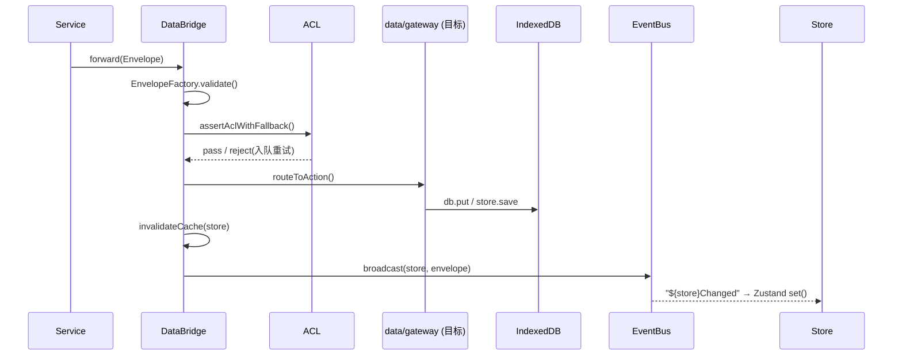
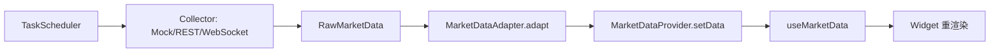
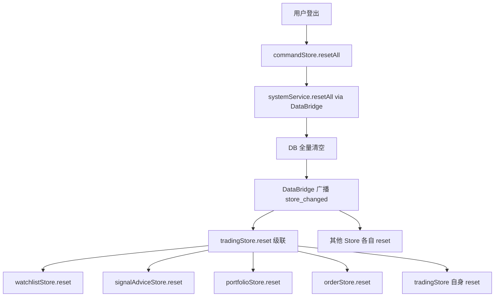

# 02 · 整体架构设计思路（Overall Architecture）

> 本文回答"**系统怎么搭、模块怎么连、未来怎么扩**"。权威基线：`AGENTS.md`（分层契约）、`../../archive/historical-2026-08-16/batch8/system-architecture.md（已归档）`、`docs/explanation/architecture.md`、`../../archive/historical-2026-08-16/batch7/docs/reference/gateway-write-permission-spec.md`、`../../archive/historical-2026-08-16/batch8/adr-001-pure-frontend-architecture.md`。
> ⚠️ 见 `README.md` 文档漂移提示：Gateway 网关当前为**目标架构**，DataBridge 仍直连 `db`。

---

## 1. 架构总览（L5 → L1 五层视图）

```
L5 表现层   pages / components / portal / cockpit
L4 应用层   apps（React.lazy 三级加载链中间层）
L3 引擎层   services / agents / core / 数据流(dataflow)
L2 数据层   data / db（IndexedDB）
L1 基础设施 src/lib / config / core
```

五大业务舱（Cabin）映射：

| 舱 | 目录 | 职责 |
|----|------|------|
| 输入舱 | `input` | 采集任务、七维配置 |
| 分析舱 | `analysis` | 热门板块/行业评分/智能评分/多因子筛选/回测 |
| 交易舱 | `trading` | 持仓/组合/风控/策略快照/交易流（可选插件） |
| 输出舱 | `output` | 仪表盘/研报/复盘向导 |
| 总控舱 | `command` | MCP 看板/智能体看板/系统健康/能力展示 |

渲染链路：`main.tsx → App.tsx → portal/PortalShell.tsx → apps/*/XxxApp（lazy）→ pages/*`

---

## 2. 分层与依赖规则（禁止跨层调用）

`AGENTS.md` §一 定义 `src/` 下 **23 个目录**的分层与依赖方向。核心约束：

| 层 | 可依赖 | 禁止依赖 |
|----|--------|----------|
| `pages/components` | `store` / `services` | 直连 `db` / `dataLayer` |
| `store` | `services` / `core` | 直连 `db` |
| `services` | `core` / `data` / `lib`（基础设施） | 直连 `db`（写必须经 DataBridge） |
| `core` | — | `pages/components/apps/lib` 业务模块 |
| `lib` | `core` / `config` | `services/store/pages/components` |
| `config/constants/types` | 零依赖 | 任何运行时模块 |
| `workers` | `core/lib/config/data/types/constants` | `store/pages/components/apps` |

**关键写约束**：`services` 所有写入必须封装为 `StandardEnvelope` 并经 `DataBridge.forward()`，最终由 `data/gateway/`（目标）执行。

验证：`npm run audit:layers`（目标 0 violations）。

---

## 3. 核心运行时基础设施（src/core）

| 模块 | 职责 |
|------|------|
| `databridge.ts` | 唯一切面入口：校验信封 → ACL 鉴权 → 审计日志 → 路由 → 广播变更事件 |
| `envelope.ts` | 统一消息信封 `{ meta, payload }`，meta 含 `source/target/action/traceId` |
| `acl.ts` | 基于 `ACL_MATRIX` 的 module→store→operation 鉴权（"最后一公里"深度防御） |
| `memoryCache.ts` | 内存缓存（默认 TTL 10s、LRU 200 条、`performance.now()` 时间戳） |
| `eventBus.ts` | 跨模块事件总线；写后 `emit("${store}Changed")`，订阅方自动刷新 |

---

## 4. 数据流（Data Flow）

### 4.1 写路径（采集 → 存储）


### 4.2 读 / 响应路径
- Store 订阅 EventBus 频道 → `set()` 更新 Zustand → 组件 `useStore()` 重渲染。
- 或直接经 `dataBridge.query()` / `dataLayer` 查询。

### 4.3 驾驶舱采集管道


**核心原则**：统一数据入口（写库必经 DataBridge）；事件驱动刷新（写库后广播 `${store}${CHANGED_SUFFIX}`，订阅 Store 自动更新并触发视图重渲染）。

### 4.4 状态重置流（Reset Flow）

登出/切换账户/模块卸载场景的状态清除遵循**级联 reset 模式**：



**级联规则**：Facade Store（`tradingStore`）的 `reset()` 先级联子 Store，再 reset 自身。DB 驱动的池 Store（`intentionPoolStore`/`positionPoolStore`/`researchPoolStore`）不需要 Store 层 reset，由 DataBridge 订阅自动 refresh。详见 `../../archive/historical-2026-08-16/batch7/docs/explanation/state-management.md（已归档）` §5。

---

## 5. 五舱与驾驶舱（Cockpit）

- 驾驶舱基于 **React-Grid-Layout** 实现可拖拽/可缩放 Widget；所有数据收敛到 `MarketData` 接口，经 `MarketDataProvider` 注入。
- 五大核心 Widget：A 投资画像/分析中心、B 股票池管理监控、C KAI 选股综合评分、D AI 大模型智能对比、E 个股/市场深度分析聊天。
- 当前已注册 **33 个 Widget**；新增 Widget 见 `03-ui-components.md` §3 的"三处注册"。

---

## 6. 扩展能力（分布式 / 任务部署可扩展性）

当前为**纯前端、无服务端**架构（ADR-001），但有意识地把扩展能力放在以下维度：

| 扩展维度 | 机制 | 文件 |
|----------|------|------|
| **多实例一致性** | 跨 Tab 广播（`withBroadcast` 封装 `eventBus.emit`，主动同步 `${store}Changed`） | `src/lib/withBroadcast.ts` |
| **算力横向扩展** | Web Worker 计算池（≤4 Worker），重计算移出主线程，失败自动回退主线程 | `src/services/workers/v6ScoreTaskScheduler.ts` + `v6ScoreWorker.ts` |
| **任务调度/部署** | Agent 运行时 + 任务队列（`agentRuntime`/`taskQueue`/`agentHealthMonitor`），订阅 `AGENT_*` 事件 | `src/agents/` |
| **能力横向扩展** | MCP 协议接入无限第三方工具/数据（15 个 Server，双端 ACL 校验） | `src/mcp/` |
| **AI 记忆/检索** | 倒排索引 `public/ai-memory-index.json`，`queryMemory()` 关键词检索 | `scripts/build-ai-memory-index.ts` + `src/services/system/aiMemoryService.ts` |

### 6.1 关于"分布式任务部署"的诚实说明
- **现状边界**：所有数据在单一浏览器 IndexedDB 内，无服务端、无跨机调度。所谓"分布式"目前体现为**客户端多实例（跨 Tab）+ Worker 并行 + MCP 远程能力调用**三层。
- **未来路径**：当规模 > 1 万用户且需集中数据管理时（ADR-001 回滚条件），在 V10 评估引入服务端；届时 Gateway 网关（`dataGateway.execute()` 单一写入口）即是为该演进预留的收口点——当前先把写权限逻辑收敛到 `DataBridge` + `ACL_MATRIX`，降低未来迁移成本。

---

## 7. 质量门禁（Quality Gates）

| 门禁 | 命令 | 作用 |
|------|------|------|
| 分层调用 | `audit:layers` | 目录分层合规 |
| 原子层级 | `audit:atomic` | 组件跨层 import 禁令 |
| 颜色硬编码 | `lint:colors` | 强制设计令牌 |
| 令牌扫描 | `audit:tokens` | 无令牌硬编码违规 |
| 文档同步 | `audit:docs` | 触发→更新映射一致 |
| JSDoc | `audit:jsdoc` | 公共实体必须有 JSDoc |
| 复杂度 | `audit:complexity` | 嵌套/链式/重复 if 债务只减不增 |
| 硬编码 | `audit:hardcode` | 硬编码 URL/颜色基线 |
| 合流 | `gate:dev` / `gate:quick` | 串联多项门禁 |

---

## 附：架构图可视化
- 源文件：`docs/explanation/architecture/architecture-diagrams.html`（分层图/数据流图/舱室地图）。
- 本文 Mermaid 图需在支持 Mermaid 的查看器（GitHub、VS Code Mermaid 插件、Typora）中渲染。
