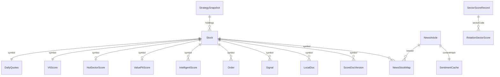
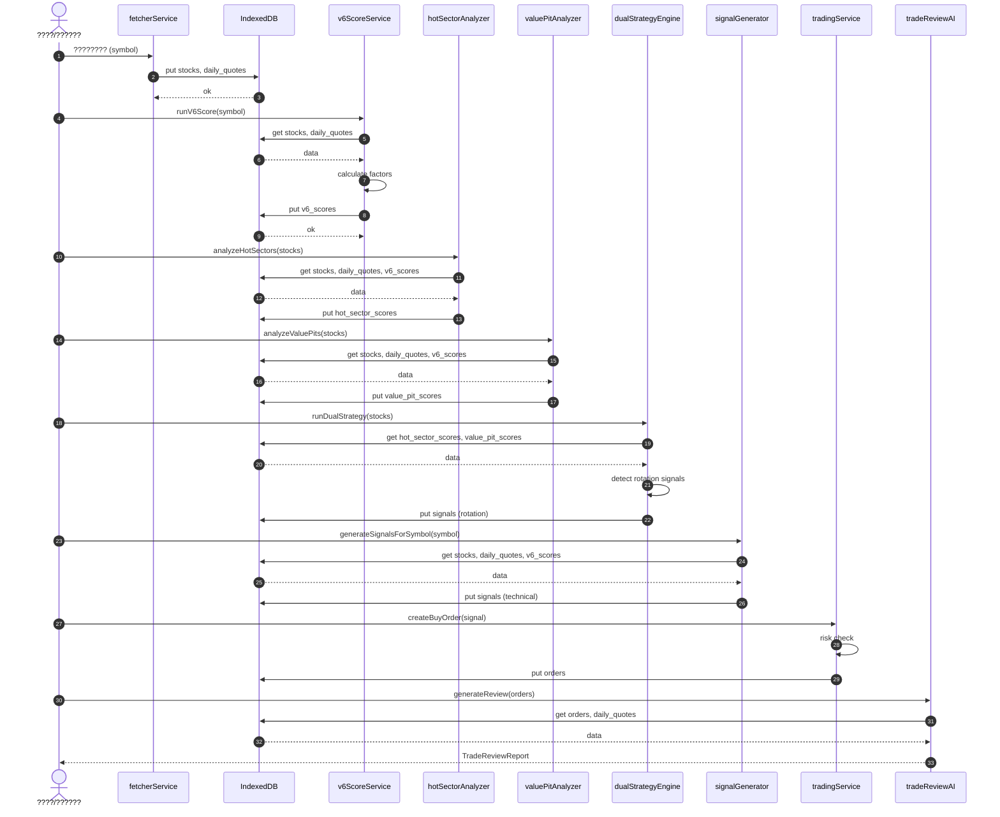

# V9 ????????????????????????????????

> **For agentic workers:** REQUIRED SUB-SKILL: Use superpowers:subagent-driven-development (recommended) or superpowers:executing-plans to implement this plan task-by-task. Steps use checkbox (`- [ ]`) syntax for tracking.

**Goal:** ???? V9 IndexedDB ??????????????????????????????????????????????????????????????????????????????????????????????????????????????????????????????

**Architecture:** ?? `src/data/types.ts` ????????????????????`src/data/db.ts` ?? 20 ?? ObjectStore ??????????????`src/data/dataLayer.ts` ?? store ????????????????`src/core/databridge.ts` ?? `src/core/dataflow/dataflowEngine.ts` ???????????????????? ER ????????????????????????????????????????????????????????????

**Tech Stack:** TypeScript, IndexedDB, DataBridge, DataFlowEngine, Vitest, Mermaid

---

## ????????

| ???? | ???? | ???? |
|------|------|------|
| `./2026-06-29-data-relationship-blueprint.md` | ?????????? | ???????????????????????????????? |
| `../explanation/v9-data-relationship-er.md` | ???? | 20 ?? Store ?????????????????????? |
| `./v9-data-timeline.md` | ???? | ???????????????????????????????????? |
| `docs/blueprints/v9-pipeline-sequence.mmd` | ???? | ???????? Mermaid ?????? |
| `src/blueprints/` | ???? | ???????????????????????????? |
| `scripts/other/validate-data-blueprint.ts` | ???? | ?????????? Store ???????????????????????? |

---

### Task 1: ???? V9 ?????????????????? (ER)

**Files:**
- Create: `../explanation/v9-data-relationship-er.md`
- Reference: `src/data/types.ts`, `src/data/db.ts`, `./v9-indexeddb-store-schema.md`, `./v9-????????????.md`

- [ ] **Step 1: ???????? 20 ?? Store ????????/????**

```markdown
## Store ????

| Store | ???? | ???? | ???????? |
|-------|------|------|---------|
| stocks | symbol | by-status, by-group | Stock |
| daily_quotes | symbol | - | DailyQuotes |
| v6_scores | symbol | - | V6Score |
| intelligent_scores | id(auto) | by-symbol | IntelligentScore |
| industry_scores | id(auto) | by-code | IndustryScore |
| hot_sector_scores | symbol | by-calculated-at | HotSectorScore |
| value_pit_scores | symbol | by-calculated-at | ValuePitScore |
| rotation_scores | id | by-sector-date(unique), by-sector, by-total, by-resonance | RotationSectorScore |
| sector_scores | id | by-sector, by-composite, by-is-core | SectorScoreRecord |
| score_docs | docId | by-symbol, by-symbol-version(unique), by-composite | ScoreDocVersion |
| strategy_snapshots | id | by-version(unique), by-date, by-timestamp | StrategySnapshot |
| local_docs | id | by-symbol, by-category, by-added-at | LocalDoc |
| news | id | by-source, by-category, by-publish-time, by-hash(unique) | NewsArticle |
| news_stock_map | id | by-symbol, by-news | NewsStockMap |
| sentiment_cache | id | by-content-hash(unique), by-analyzed-at | SentimentCache |
| news_bookmarks | id | by-bookmarked-at | NewsBookmark |
| orders | id | - | Order |
| signals | id | - | Signal |
| watchlists | id | - | Watchlist |
| research_logs | id(auto) | - | ResearchLog |
```

- [ ] **Step 2: ?????????? 1:1 / 1:N / N:M ????**

```markdown
## ????????

| ???????? | ???? | ???????? | ???????? | ???? |
|---------|------|---------|---------|------|
| Stock (symbol) | 1:1 | DailyQuotes (symbol) | symbol | ???????????????????? K ?????? |
| Stock (symbol) | 1:1 | V6Score (symbol) | symbol | ???????????????????????????? |
| Stock (symbol) | 1:N | IntelligentScore (symbol) | symbol | ???????????????????????????? |
| Stock (symbol) | 1:N | IndustryScore (code) | industryCode | ???????????????????? |
| Stock (symbol) | 1:1 | HotSectorScore (symbol) | symbol | ?????????????? |
| Stock (symbol) | 1:1 | ValuePitScore (symbol) | symbol | ?????????????? |
| NewsArticle (id) | N:M | Stock (symbol) | news_stock_map.newsId / .symbol | ???????????????????? |
| NewsArticle (id) | 1:1 | SentimentCache (contentHash) | hash / contentHash | ???????????? |
| Order (symbol) | N:M | Stock (symbol) | symbol | ???????????? |
| Signal (symbol) | N:M | Stock (symbol) | symbol | ???????????? |
| SectorScoreRecord (sectorCode) | 1:N | RotationSectorScore (sectorCode) | sectorCode | ???????????????????????? |
| LocalDoc (symbol) | 1:N | Stock (symbol) | symbol | ???????????????????????? |
| ScoreDocVersion (symbol) | 1:N | Stock (symbol) | symbol | ???????????????????????????? |
| StrategySnapshot | N:M | Stock/Score/Signal | holdings.scores.symbols | ?????????????? |
```

- [ ] **Step 3: ???? ER Mermaid ??**

```markdown

```

- [ ] **Step 4: Commit**

```bash
git add docs/blueprints/v9-data-relationship-er.md
git commit -m "docs(blueprint): add V9 data relationship ER diagram"
```

---

### Task 2: ??????????????????????????????

**Files:**
- Create: `./v9-data-timeline.md`
- Reference: `src/services/scoring/v6ScoreService.ts`, `src/services/trading/dualStrategyEngine.ts`, `src/services/trading/signalGenerator.ts`, `src/services/data-collector/TaskScheduler.ts`, `src/core/dataflow/dataflowEngine.ts`

- [ ] **Step 1: ????????????????????????????**

```markdown
## ??????????????

| ???? | ???????? | ???? | ???? | ???????????? | ???????? |
|------|---------|------|------|-------------|---------|
| P1 ???? | ????/????/???? | ???? API / ???????? | stocks, daily_quotes | ingestedAt, updatedAt | fetcherService, TaskScheduler |
| P2 ???? | ?????????? | RawMarketData | MarketData (??????) | - | MarketDataAdapter |
| P3 ???? | ????????/???????? | stocks + daily_quotes | v6_scores | calculatedAt | v6ScoreService |
| P4 ???? | ?????????? | v6_scores + daily_quotes | hot_sector_scores, value_pit_scores | calculatedAt | hotSectorAnalyzer, valuePitAnalyzer |
| P5 ???? | ??????????/???? | value_pit_scores + sector ???? | rotation_scores | scoreDate, createdAt | rotationScoreService |
| P6 ???? | ?????????? | stocks + daily_quotes + scores | signals | createdAt | signalGenerator |
| P7 ???? | ????/???????? | stocks + signals | orders | createdAt | tradingService |
| P8 ???? | ??????/???? | orders + daily_quotes | trade review report | generatedAt | tradeReviewAI |
| P9 ???? | ????/???? | ?????????? | news + sentiment_cache + news_stock_map | publishTime, fetchTime, analyzedAt | newsService |
| P10 ???????? | ???????? | stocks + local_docs | intelligent_scores | scoredAt | intelligentScoreService |
| P11 ???????? | ???????? | sector ???? | industry_scores | scoredAt | industryScoreService |
```

- [ ] **Step 2: ?????????????????????? freshness**

```markdown
## ????????????

| Store | ?????? | ???????? | ?????????????? | ???????? |
|-------|--------|---------|---------------|---------|
| stocks | fetcher / ???? | ???? 1 ?? | 1 ?????? | ???????????????????? |
| daily_quotes | fetcher | ???? 1 ?? / ???? 15min | 1 ?????? | v6_scores, signals, ???????? |
| v6_scores | ???????? | daily_quotes ?????? | ?? daily_quotes ???? | hot_sector_scores, value_pit_scores |
| hot_sector_scores | ???????? | v6_scores ?????? | ?? v6_scores ???? | dualStrategyEngine, signals |
| value_pit_scores | ???????? | v6_scores ?????? | ?? v6_scores ???? | dualStrategyEngine, signals |
| rotation_scores | ???????? | ???? 1 ?? | 1 ?????? | ???????? |
| signals | ???????? | ???????? / 5min | 5 ???? | tradingService, UI |
| orders | ???? | ???? | ???? | ?????????? |
| news | ?????? | 15min / ???? | 30min | ?????????????? |
| sentiment_cache | ?????????? | ?????????????? | ???????????????????? | news |
```

- [ ] **Step 3: ??????????????????**

```markdown
## ??????????????

1. **????????????????????**??`v6_scores.calculatedAt >= daily_quotes.updatedAt`
2. **???????????????????? V6 ????**??`hot_sector_scores.calculatedAt >= v6_scores.calculatedAt`
3. **????????????????????????**??`signals.createdAt >= daily_quotes.updatedAt`
4. **???????????????????? stock.price**??`orders.createdAt >= stock.updatedAt`??????????????
5. **??????????????????????**??`tradeReviewReport.generatedAt >= max(orders.createdAt)`
6. **????????????????????????????????**??`sentiment_cache.analyzedAt >= news.publishTime`
```

- [ ] **Step 4: Commit**

```bash
git add docs/blueprints/v9-data-timeline.md
git commit -m "docs(blueprint): add V9 data timeline and freshness rules"
```

---

### Task 3: ??????????????????

**Files:**
- Create: `docs/blueprints/v9-pipeline-sequence.mmd`
- Reference: `./v9-????????????.md` ?? 3 ??

- [ ] **Step 1: ???????????? ?? ???? ?? ???? ?? ???? ?? ???? ?? ????????????????**



- [ ] **Step 2: Commit**

```bash
git add docs/blueprints/v9-pipeline-sequence.mmd
git commit -m "docs(blueprint): add V9 pipeline sequence diagram"
```

---

### Task 4: ??????????????????????????

**Files:**
- Create: `src/blueprints/`
- Modify: `package.json` ????????????????????????
- Reference: `src/data/types.ts`, `src/data/db.ts`

- [ ] **Step 1: ???? Store ??????????????**

```typescript
import { describe, it, expect } from 'vitest'
import { STORE_NAME } from '@/config/dbConfig'

describe('V9 data relationship blueprint', () => {
  it('should have exactly 20 stores defined in dbConfig', () => {
    const stores = Object.values(STORE_NAME)
    expect(stores).toHaveLength(20)
    expect(new Set(stores).size).toBe(20)
  })

  it('should map core entities to expected stores', () => {
    const entityStoreMap: Record<string, string> = {
      Stock: STORE_NAME.stocks,
      DailyQuotes: STORE_NAME.dailyQuotes,
      V6Score: STORE_NAME.v6Scores,
      IntelligentScore: STORE_NAME.intelligentScores,
      IndustryScore: STORE_NAME.industryScores,
      HotSectorScore: STORE_NAME.hotSectorScores,
      ValuePitScore: STORE_NAME.valuePitScores,
      RotationSectorScore: STORE_NAME.rotationScores,
      SectorScoreRecord: STORE_NAME.sectorScores,
      ScoreDocVersion: STORE_NAME.scoreDocs,
      StrategySnapshot: STORE_NAME.strategySnapshots,
      LocalDoc: STORE_NAME.localDocs,
      NewsArticle: STORE_NAME.news,
      NewsStockMap: STORE_NAME.newsStockMap,
      SentimentCache: STORE_NAME.sentimentCache,
      Order: STORE_NAME.orders,
      Signal: STORE_NAME.signals,
      Watchlist: STORE_NAME.watchlists,
      ResearchLog: STORE_NAME.researchLogs,
    }

    for (const [entity, store] of Object.entries(entityStoreMap)) {
      expect(store, `Entity ${entity} must map to a defined store`).toBeDefined()
    }
  })

  it('should enforce Stock as the central 1:N hub', () => {
    const dependentStores = [
      STORE_NAME.dailyQuotes,
      STORE_NAME.v6Scores,
      STORE_NAME.intelligentScores,
      STORE_NAME.hotSectorScores,
      STORE_NAME.valuePitScores,
      STORE_NAME.orders,
      STORE_NAME.signals,
      STORE_NAME.localDocs,
      STORE_NAME.scoreDocs,
      STORE_NAME.newsStockMap,
    ]
    expect(dependentStores.length).toBeGreaterThanOrEqual(10)
  })
})
```

- [ ] **Step 2: ????????????????????**

```typescript
import { describe, it, expect } from 'vitest'
import type { DailyQuotes, Order, Signal, Stock, V6Score } from '@/data/types'

describe('V9 data timeline rules', () => {
  it('v6 score must not be older than its daily quotes input', () => {
    const stock: Stock = { symbol: '600519', name: '????', dataVersion: 1, researchStatus: 'candidate', source: 'manual' }
    const quotes: DailyQuotes = {
      symbol: '600519',
      latest: { date: '2026-06-29', open: 1600, high: 1620, low: 1590, close: 1610, volume: 1000, amount: 1_600_000 },
      history: [],
      period: 'daily',
      adjust: 'qfq',
      updatedAt: 1_000_000,
    }
    const score: V6Score = {
      symbol: '600519',
      score: 4.2,
      factors: {},
      algorithmVersion: 'v9-auto',
      calculatedAt: 1_000_001,
      dataVersion: stock.dataVersion,
    }
    expect(score.calculatedAt).toBeGreaterThanOrEqual(quotes.updatedAt)
  })

  it('signal must be newer than daily quotes when snapshot exists', () => {
    const quotesUpdatedAt = 1_000_000
    const signal: Signal = {
      id: 's1',
      symbol: '600519',
      direction: 'buy',
      type: 'buy_dip',
      confidence: 0.6,
      rationale: 'test',
      snapshot: {},
      createdAt: 1_000_001,
    }
    expect(signal.createdAt).toBeGreaterThanOrEqual(quotesUpdatedAt)
  })

  it('order must reference a symbol', () => {
    const order: Order = {
      id: 'o1',
      symbol: '600519',
      direction: 'buy',
      quantity: 100,
      price: 1600,
      amount: 160_000,
      status: 'filled',
      accountType: 'paper',
      createdAt: Date.now(),
    }
    expect(order.symbol).toMatch(/^\d{6}$/)
  })
})
```

- [ ] **Step 3: ????????????????**

```bash
npx vitest run src/blueprints/__tests__/dataRelationship.test.ts
```

Expected: PASS (3 suites, 5+ tests)

- [ ] **Step 4: Commit**

```bash
git add src/blueprints/__tests__/dataRelationship.test.ts
git commit -m "test(blueprint): add data relationship and timeline validation tests"
```

---

### Task 5: ??????????????????????

**Files:**
- Create: `scripts/other/validate-data-blueprint.ts`
- Reference: `src/config/dbConfig.ts`, `src/data/types.ts`

- [ ] **Step 1: ???? TS ????????**

```typescript
#!/usr/bin/env tsx
/**
 * ???? src/config/dbConfig.ts ?? src/data/types.ts??
 * ???? Store ????????????????????????????????????????????
 */
import * as fs from 'node:fs'
import * as path from 'node:path'

const ROOT = process.cwd()
const DB_CONFIG_PATH = path.join(ROOT, 'src', 'config', 'dbConfig.ts')
const TYPES_PATH = path.join(ROOT, 'src', 'data', 'types.ts')

function extractStoreNames(content: string): string[] {
  const match = content.match(/export const STORE_NAME = \{[\s\S]*?\} as const/)
  if (!match) throw new Error('STORE_NAME not found')
  const keys = match[0].match(/\w+:/g) ?? []
  return keys.map((k) => k.replace(':', ''))
}

function extractInterfaceNames(content: string): string[] {
  const matches = content.match(/export interface (\w+)/g) ?? []
  return matches.map((m) => m.replace('export interface ', ''))
}

function main() {
  const dbConfig = fs.readFileSync(DB_CONFIG_PATH, 'utf-8')
  const types = fs.readFileSync(TYPES_PATH, 'utf-8')

  const storeNames = extractStoreNames(dbConfig)
  const interfaces = extractInterfaceNames(types)

  const expectedStores = 20
  if (storeNames.length !== expectedStores) {
    throw new Error(`Store count mismatch: expected ${expectedStores}, got ${storeNames.length}`)
  }

  const requiredInterfaces = [
    'Stock',
    'DailyQuotes',
    'V6Score',
    'IntelligentScore',
    'IndustryScore',
    'HotSectorScore',
    'ValuePitScore',
    'RotationSectorScore',
    'SectorScoreRecord',
    'ScoreDocVersion',
    'StrategySnapshot',
    'LocalDoc',
    'NewsArticle',
    'NewsStockMap',
    'SentimentCache',
    'Order',
    'Signal',
    'Watchlist',
    'ResearchLog',
  ]

  const missing = requiredInterfaces.filter((i) => !interfaces.includes(i))
  if (missing.length > 0) {
    throw new Error(`Missing required interfaces: ${missing.join(', ')}`)
  }

  console.log('[validate-data-blueprint] ? Blueprint consistency check passed')
  console.log(`  Stores: ${storeNames.length}`)
  console.log(`  Interfaces: ${interfaces.length}`)
}

main()
```

- [ ] **Step 2: ?? package.json ????????**

Modify `package.json`:

```json
{
  "scripts": {
    "validate:blueprint": "tsx scripts/validate-data-blueprint.ts"
  }
}
```

- [ ] **Step 3: ????????**

```bash
npm run validate:blueprint
```

Expected output:

```
[validate-data-blueprint] ? Blueprint consistency check passed
  Stores: 20
  Interfaces: 54
```

- [ ] **Step 4: Commit**

```bash
git add scripts/validate-data-blueprint.ts package.json
git commit -m "feat(blueprint): add automated blueprint consistency scanner"
```

---

### Task 6: ??????????????????????

**Files:**
- Modify: `.github/workflows/ci.yml` ?????? CI ???????????????????????????????????? Step 1??
- Modify: `./08-implementation-plan.md`

- [ ] **Step 1: ?? CI ?????????????????????? CI ??????**

```yaml
- name: Validate data blueprint
  run: npm run validate:blueprint
```

- [ ] **Step 2: ????????????????????????**

?? `./08-implementation-plan.md` ??????????

```markdown
## ??????????????????????

- ????????????`../explanation/v9-data-relationship-er.md`
- ??????????????`./v9-data-timeline.md`
- ????????????????`docs/blueprints/v9-pipeline-sequence.mmd`
- ????????????`npm run validate:blueprint`
- ??????????`npx vitest run src/blueprints/__tests__/dataRelationship.test.ts`
```

- [ ] **Step 3: Commit**

```bash
git add docs/08-implementation-plan.md
git add .github/workflows/ci.yml  # ???????? CI ??????
git commit -m "docs(blueprint): integrate blueprint into dev workflow and CI"
```

---

## Self-Review

**1. Spec coverage:**
- ??????????????/???????? Task 2 ?????? P1/P9/P10/P11 ????
- ?????????????????????????????????? Task 1 ER ???? + Task 2 ???? P3/P4/P10/P11 ????
- ???????? ?? Task 2 ???? P4/P5/P6 ????
- ?????????????????????????????????????????? Task 1 ?????? + Task 2 ???? P4 ????
- ???????????? ?? Task 2 ???? P3??L8 ??????????????
- ???????????????? ?? Task 2 ???? P8 ????

**2. Placeholder scan:**
- ?? "TBD"/"TODO"
- ?? "add appropriate error handling" ??????????
- ??????????????

**3. Type consistency:**
- `STORE_NAME` ?????? `src/config/dbConfig.ts` ????
- ?????????? `src/data/types.ts` ????
- ???????? `calculatedAt`, `updatedAt`, `createdAt`, `scoredAt`, `generatedAt` ??????????

**4. Known gaps discovered during planning (resolved in execution):**
- ~~`news_bookmarks` Store ???? `STORE_NAME` ?????????? `src/data/types.ts` ???????????? `NewsBookmark` TypeScript ????~~ ?? ?????? `src/store/analysisNewsStore.ts` ?? `NewsBookmarkRecord` ?? `src/data/types.ts` ?? `NewsBookmark`??
- ~~`./v9-????????????.md` ???? `DB_VERSION = 15`???? `src/config/dbConfig.ts` ???????? `DB_VERSION = 14`~~ ?? ???????????? DB_VERSION = 14??
- ?????????? `.github/workflows/ci.yml`??Task 6 ?? CI ?????????????????? CI ?????????????????????????? `./08-implementation-plan.md`??

---

## Execution Handoff

**Plan complete and saved to `./2026-06-29-data-relationship-blueprint.md`. Two execution options:**

**1. Subagent-Driven (recommended)** - I dispatch a fresh subagent per task, review between tasks, fast iteration

**2. Inline Execution** - Execute tasks in this session using executing-plans, batch execution with checkpoints

**Which approach?**
