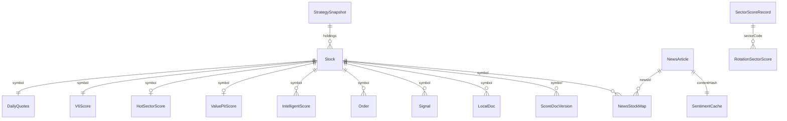
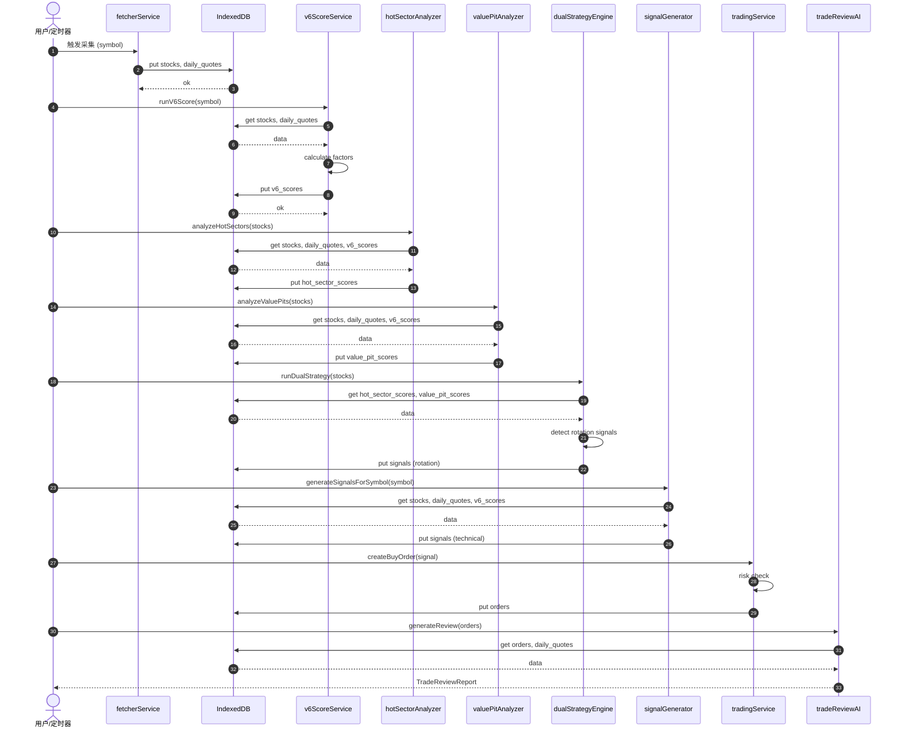

# V9 数据库数据关系与时间关系蓝图计划

> **For agentic workers:** REQUIRED SUB-SKILL: Use superpowers:subagent-driven-development (recommended) or superpowers:executing-plans to implement this plan task-by-task. Steps use checkbox (`- [ ]`) syntax for tracking.

**Goal:** 解析 V9 IndexedDB 数据库内在的数据关系与时间关系，覆盖数据采集、数据分析、个股定性、交易筹码分布与波动复盘，形成可执行的开发蓝图与持续比对基线。

**Architecture:** 以 `src/data/types.ts` 中的实体类型为锚点，`src/data/db.ts` 的 20 个 ObjectStore 为持久化载体，`src/data/dataLayer.ts` 的 store 接口为读写边界，`src/core/databridge.ts` 与 `src/core/dataflow/dataflowEngine.ts` 为跨模块通信层；通过 ER 关系表、时序图、依赖矩阵将静态数据结构与动态计算管线显性化。

**Tech Stack:** TypeScript, IndexedDB, DataBridge, DataFlowEngine, Vitest, Mermaid

---

## 文件结构

| 文件 | 类型 | 职责 |
|------|------|------|
| `./2026-06-29-data-relationship-blueprint.md` | 计划主文档 | 定义任务、关系表、时序、验证方法 |
| `../explanation/v9-data-relationship-er.md` | 创建 | 20 个 Store 的实体关系图与字段说明 |
| `./v9-data-timeline.md` | 创建 | 数据产生、刷新、消费的时序与生命周期 |
| `docs/blueprints/v9-pipeline-sequence.mmd` | 创建 | 核心管线 Mermaid 序列图 |
| `src/blueprints/` | 创建 | 关系与时间表的可执行校验测试 |
| `scripts/other/validate-data-blueprint.ts` | 创建 | 扫描类型与 Store 定义，自动比对蓝图一致性 |

---

### Task 1: 建立 V9 数据库实体关系蓝图 (ER)

**Files:**
- Create: `../explanation/v9-data-relationship-er.md`
- Reference: `src/data/types.ts`, `src/data/db.ts`, `./v9-indexeddb-store-schema.md`, `./v9-数据血缘追踪.md`

- [ ] **Step 1: 列出全部 20 个 Store 及其主键/索引**

```markdown
## Store 清单

| Store | 主键 | 索引 | 核心实体 |
|-------|------|------|---------|
| stocks | symbol | by-status, by-group | Stock |
| daily_quotes | symbol | - | DailyQuotes |
| v6_scores | symbol | - | V6Score |
| intelligent_scores | id(auto) | by-symbol | IntelligentScore |
| industry_scores | id(auto) | by-code | IndustryScore |
| hot_sector_scores | symbol | by-calculated-at | HotSectorScore |
| value_pit_scores | symbol | by-calculated-at | ValuePitScore |
| rotation_scores | id | by-sector-date(unique), by-sector, by-total, by-resonance | RotationSectorScore |
| sector_scores | id | by-sector, by-composite, by-is-core | SectorScoreRecord |
| score_docs | docId | by-symbol, by-symbol-version(unique), by-composite | ScoreDocVersion |
| strategy_snapshots | id | by-version(unique), by-date, by-timestamp | StrategySnapshot |
| local_docs | id | by-symbol, by-category, by-added-at | LocalDoc |
| news | id | by-source, by-category, by-publish-time, by-hash(unique) | NewsArticle |
| news_stock_map | id | by-symbol, by-news | NewsStockMap |
| sentiment_cache | id | by-content-hash(unique), by-analyzed-at | SentimentCache |
| news_bookmarks | id | by-bookmarked-at | NewsBookmark |
| orders | id | - | Order |
| signals | id | - | Signal |
| watchlists | id | - | Watchlist |
| research_logs | id(auto) | - | ResearchLog |
```

- [ ] **Step 2: 定义实体间 1:1 / 1:N / N:M 关系**

```markdown
## 实体关系

| 主体实体 | 关系 | 客体实体 | 关联字段 | 说明 |
|---------|------|---------|---------|------|
| Stock (symbol) | 1:1 | DailyQuotes (symbol) | symbol | 一只股票对应一条最新 K 线记录 |
| Stock (symbol) | 1:1 | V6Score (symbol) | symbol | 一只股票对应一条最新综合评分 |
| Stock (symbol) | 1:N | IntelligentScore (symbol) | symbol | 一只股票可有多条历史智能评分 |
| Stock (symbol) | 1:N | IndustryScore (code) | industryCode | 一个行业包含多只股票 |
| Stock (symbol) | 1:1 | HotSectorScore (symbol) | symbol | 双策略热门评分 |
| Stock (symbol) | 1:1 | ValuePitScore (symbol) | symbol | 双策略洼地评分 |
| NewsArticle (id) | N:M | Stock (symbol) | news_stock_map.newsId / .symbol | 文章与股票的关联映射 |
| NewsArticle (id) | 1:1 | SentimentCache (contentHash) | hash / contentHash | 文章情绪缓存 |
| Order (symbol) | N:M | Stock (symbol) | symbol | 订单引用股票 |
| Signal (symbol) | N:M | Stock (symbol) | symbol | 信号引用股票 |
| SectorScoreRecord (sectorCode) | 1:N | RotationSectorScore (sectorCode) | sectorCode | 板块评分与轮动评分可互补 |
| LocalDoc (symbol) | 1:N | Stock (symbol) | symbol | 一只股票可有多份本地文档 |
| ScoreDocVersion (symbol) | 1:N | Stock (symbol) | symbol | 一只股票可有多份评分文档版本 |
| StrategySnapshot | N:M | Stock/Score/Signal | holdings.scores.symbols | 快照聚合多实体 |
```

- [ ] **Step 3: 写入 ER Mermaid 图**

```markdown

```

- [ ] **Step 4: Commit**

```bash
git add docs/blueprints/v9-data-relationship-er.md
git commit -m "docs(blueprint): add V9 data relationship ER diagram"
```

---

### Task 2: 建立数据时间关系与生命周期蓝图

**Files:**
- Create: `./v9-data-timeline.md`
- Reference: `src/services/scoring/v6ScoreService.ts`, `src/services/trading/dualStrategyEngine.ts`, `src/services/trading/signalGenerator.ts`, `src/services/data-collector/TaskScheduler.ts`, `src/core/dataflow/dataflowEngine.ts`

- [ ] **Step 1: 定义数据产生时序（管线阶段）**

```markdown
## 数据管线主时序

| 阶段 | 触发条件 | 输入 | 输出 | 关键时间字段 | 负责模块 |
|------|---------|------|------|-------------|---------|
| P1 采集 | 手动/定时/事件 | 外部 API / 用户输入 | stocks, daily_quotes | ingestedAt, updatedAt | fetcherService, TaskScheduler |
| P2 清洗 | 采集完成后 | RawMarketData | MarketData (标准化) | - | MarketDataAdapter |
| P3 评分 | 数据就绪/用户触发 | stocks + daily_quotes | v6_scores | calculatedAt | v6ScoreService |
| P4 策略 | 评分完成后 | v6_scores + daily_quotes | hot_sector_scores, value_pit_scores | calculatedAt | hotSectorAnalyzer, valuePitAnalyzer |
| P5 轮动 | 策略评分后/定时 | value_pit_scores + sector 数据 | rotation_scores | scoreDate, createdAt | rotationScoreService |
| P6 信号 | 策略评分后 | stocks + daily_quotes + scores | signals | createdAt | signalGenerator |
| P7 交易 | 信号/用户决策 | stocks + signals | orders | createdAt | tradingService |
| P8 复盘 | 收盘后/手动 | orders + daily_quotes | trade review report | generatedAt | tradeReviewAI |
| P9 资讯 | 定时/事件 | 外部资讯源 | news + sentiment_cache + news_stock_map | publishTime, fetchTime, analyzedAt | newsService |
| P10 智能评分 | 用户触发 | stocks + local_docs | intelligent_scores | scoredAt | intelligentScoreService |
| P11 行业评分 | 用户触发 | sector 数据 | industry_scores | scoredAt | industryScoreService |
```

- [ ] **Step 2: 定义数据刷新频率与依赖 freshness**

```markdown
## 数据刷新频率

| Store | 数据源 | 理想频率 | 可接受最大滞后 | 下游影响 |
|-------|--------|---------|---------------|---------|
| stocks | fetcher / 手动 | 日终 1 次 | 1 交易日 | 所有评分、交易、信号 |
| daily_quotes | fetcher | 日终 1 次 / 实时 15min | 1 交易日 | v6_scores, signals, 策略评分 |
| v6_scores | 规则引擎 | daily_quotes 更新后 | 与 daily_quotes 同步 | hot_sector_scores, value_pit_scores |
| hot_sector_scores | 策略引擎 | v6_scores 更新后 | 与 v6_scores 同步 | dualStrategyEngine, signals |
| value_pit_scores | 策略引擎 | v6_scores 更新后 | 与 v6_scores 同步 | dualStrategyEngine, signals |
| rotation_scores | 轮动引擎 | 日终 1 次 | 1 交易日 | 策略信号 |
| signals | 信号引擎 | 数据变化 / 5min | 5 分钟 | tradingService, UI |
| orders | 用户 | 实时 | 实时 | 持仓、复盘 |
| news | 资讯源 | 15min / 事件 | 30min | 情绪、个股关联 |
| sentiment_cache | 情绪分析器 | 首次分析后缓存 | 无过期（需手动刷新） | news |
```

- [ ] **Step 3: 定义时间一致性规则**

```markdown
## 时间一致性规则

1. **评分必须基于最新行情**：`v6_scores.calculatedAt >= daily_quotes.updatedAt`
2. **策略评分必须基于最新 V6 评分**：`hot_sector_scores.calculatedAt >= v6_scores.calculatedAt`
3. **交易信号必须基于最新行情**：`signals.createdAt >= daily_quotes.updatedAt`
4. **订单价格必须来自最新 stock.price**：`orders.createdAt >= stock.updatedAt`（价格拉取后）
5. **复盘必须覆盖到最新订单**：`tradeReviewReport.generatedAt >= max(orders.createdAt)`
6. **资讯情绪缓存命中必须早于文章发布**：`sentiment_cache.analyzedAt >= news.publishTime`
```

- [ ] **Step 4: Commit**

```bash
git add docs/blueprints/v9-data-timeline.md
git commit -m "docs(blueprint): add V9 data timeline and freshness rules"
```

---

### Task 3: 绘制核心管线序列图

**Files:**
- Create: `docs/blueprints/v9-pipeline-sequence.mmd`
- Reference: `./v9-数据血缘追踪.md` 第 3 章

- [ ] **Step 1: 绘制数据采集 → 评分 → 策略 → 信号 → 交易 → 复盘全链路序列图**



- [ ] **Step 2: Commit**

```bash
git add docs/blueprints/v9-pipeline-sequence.mmd
git commit -m "docs(blueprint): add V9 pipeline sequence diagram"
```

---

### Task 4: 编写数据关系可执行校验测试

**Files:**
- Create: `src/blueprints/`
- Modify: `package.json` 添加测试命令（若不存在）
- Reference: `src/data/types.ts`, `src/data/db.ts`

- [ ] **Step 1: 编写 Store 与类型映射测试**

```typescript
import { describe, it, expect } from 'vitest'
import { STORE_NAME } from '@/config/dbConfig'

describe('V9 data relationship blueprint', () => {
  it('should have exactly 20 stores defined in dbConfig', () => {
    const stores = Object.values(STORE_NAME)
    expect(stores).toHaveLength(20)
    expect(new Set(stores).size).toBe(20)
  })

  it('should map core entities to expected stores', () => {
    const entityStoreMap: Record<string, string> = {
      Stock: STORE_NAME.stocks,
      DailyQuotes: STORE_NAME.dailyQuotes,
      V6Score: STORE_NAME.v6Scores,
      IntelligentScore: STORE_NAME.intelligentScores,
      IndustryScore: STORE_NAME.industryScores,
      HotSectorScore: STORE_NAME.hotSectorScores,
      ValuePitScore: STORE_NAME.valuePitScores,
      RotationSectorScore: STORE_NAME.rotationScores,
      SectorScoreRecord: STORE_NAME.sectorScores,
      ScoreDocVersion: STORE_NAME.scoreDocs,
      StrategySnapshot: STORE_NAME.strategySnapshots,
      LocalDoc: STORE_NAME.localDocs,
      NewsArticle: STORE_NAME.news,
      NewsStockMap: STORE_NAME.newsStockMap,
      SentimentCache: STORE_NAME.sentimentCache,
      Order: STORE_NAME.orders,
      Signal: STORE_NAME.signals,
      Watchlist: STORE_NAME.watchlists,
      ResearchLog: STORE_NAME.researchLogs,
    }

    for (const [entity, store] of Object.entries(entityStoreMap)) {
      expect(store, `Entity ${entity} must map to a defined store`).toBeDefined()
    }
  })

  it('should enforce Stock as the central 1:N hub', () => {
    const dependentStores = [
      STORE_NAME.dailyQuotes,
      STORE_NAME.v6Scores,
      STORE_NAME.intelligentScores,
      STORE_NAME.hotSectorScores,
      STORE_NAME.valuePitScores,
      STORE_NAME.orders,
      STORE_NAME.signals,
      STORE_NAME.localDocs,
      STORE_NAME.scoreDocs,
      STORE_NAME.newsStockMap,
    ]
    expect(dependentStores.length).toBeGreaterThanOrEqual(10)
  })
})
```

- [ ] **Step 2: 编写时间关系校验测试**

```typescript
import { describe, it, expect } from 'vitest'
import type { DailyQuotes, Order, Signal, Stock, V6Score } from '@/data/types'

describe('V9 data timeline rules', () => {
  it('v6 score must not be older than its daily quotes input', () => {
    const stock: Stock = { symbol: '600519', name: '茅台', dataVersion: 1, researchStatus: 'candidate', source: 'manual' }
    const quotes: DailyQuotes = {
      symbol: '600519',
      latest: { date: '2026-06-29', open: 1600, high: 1620, low: 1590, close: 1610, volume: 1000, amount: 1_600_000 },
      history: [],
      period: 'daily',
      adjust: 'qfq',
      updatedAt: 1_000_000,
    }
    const score: V6Score = {
      symbol: '600519',
      score: 4.2,
      factors: {},
      algorithmVersion: 'v9-auto',
      calculatedAt: 1_000_001,
      dataVersion: stock.dataVersion,
    }
    expect(score.calculatedAt).toBeGreaterThanOrEqual(quotes.updatedAt)
  })

  it('signal must be newer than daily quotes when snapshot exists', () => {
    const quotesUpdatedAt = 1_000_000
    const signal: Signal = {
      id: 's1',
      symbol: '600519',
      direction: 'buy',
      type: 'buy_dip',
      confidence: 0.6,
      rationale: 'test',
      snapshot: {},
      createdAt: 1_000_001,
    }
    expect(signal.createdAt).toBeGreaterThanOrEqual(quotesUpdatedAt)
  })

  it('order must reference a symbol', () => {
    const order: Order = {
      id: 'o1',
      symbol: '600519',
      direction: 'buy',
      quantity: 100,
      price: 1600,
      amount: 160_000,
      status: 'filled',
      accountType: 'paper',
      createdAt: Date.now(),
    }
    expect(order.symbol).toMatch(/^\d{6}$/)
  })
})
```

- [ ] **Step 3: 运行测试确认通过**

```bash
npx vitest run src/blueprints/__tests__/dataRelationship.test.ts
```

Expected: PASS (3 suites, 5+ tests)

- [ ] **Step 4: Commit**

```bash
git add src/blueprints/__tests__/dataRelationship.test.ts
git commit -m "test(blueprint): add data relationship and timeline validation tests"
```

---

### Task 5: 编写蓝图一致性扫描脚本

**Files:**
- Create: `scripts/other/validate-data-blueprint.ts`
- Reference: `src/config/dbConfig.ts`, `src/data/types.ts`

- [ ] **Step 1: 实现 TS 扫描脚本**

```typescript
#!/usr/bin/env tsx
/**
 * 扫描 src/config/dbConfig.ts 与 src/data/types.ts，
 * 校验 Store 数量、命名一致性、核心实体映射是否偏离蓝图。
 */
import * as fs from 'node:fs'
import * as path from 'node:path'

const ROOT = process.cwd()
const DB_CONFIG_PATH = path.join(ROOT, 'src', 'config', 'dbConfig.ts')
const TYPES_PATH = path.join(ROOT, 'src', 'data', 'types.ts')

function extractStoreNames(content: string): string[] {
  const match = content.match(/export const STORE_NAME = \{[\s\S]*?\} as const/)
  if (!match) throw new Error('STORE_NAME not found')
  const keys = match[0].match(/\w+:/g) ?? []
  return keys.map((k) => k.replace(':', ''))
}

function extractInterfaceNames(content: string): string[] {
  const matches = content.match(/export interface (\w+)/g) ?? []
  return matches.map((m) => m.replace('export interface ', ''))
}

function main() {
  const dbConfig = fs.readFileSync(DB_CONFIG_PATH, 'utf-8')
  const types = fs.readFileSync(TYPES_PATH, 'utf-8')

  const storeNames = extractStoreNames(dbConfig)
  const interfaces = extractInterfaceNames(types)

  const expectedStores = 20
  if (storeNames.length !== expectedStores) {
    throw new Error(`Store count mismatch: expected ${expectedStores}, got ${storeNames.length}`)
  }

  const requiredInterfaces = [
    'Stock',
    'DailyQuotes',
    'V6Score',
    'IntelligentScore',
    'IndustryScore',
    'HotSectorScore',
    'ValuePitScore',
    'RotationSectorScore',
    'SectorScoreRecord',
    'ScoreDocVersion',
    'StrategySnapshot',
    'LocalDoc',
    'NewsArticle',
    'NewsStockMap',
    'SentimentCache',
    'Order',
    'Signal',
    'Watchlist',
    'ResearchLog',
  ]

  const missing = requiredInterfaces.filter((i) => !interfaces.includes(i))
  if (missing.length > 0) {
    throw new Error(`Missing required interfaces: ${missing.join(', ')}`)
  }

  console.log('[validate-data-blueprint] ? Blueprint consistency check passed')
  console.log(`  Stores: ${storeNames.length}`)
  console.log(`  Interfaces: ${interfaces.length}`)
}

main()
```

- [ ] **Step 2: 在 package.json 添加脚本**

Modify `package.json`:

```json
{
  "scripts": {
    "validate:blueprint": "tsx scripts/validate-data-blueprint.ts"
  }
}
```

- [ ] **Step 3: 运行脚本**

```bash
npm run validate:blueprint
```

Expected output:

```
[validate-data-blueprint] ? Blueprint consistency check passed
  Stores: 20
  Interfaces: 54
```

- [ ] **Step 4: Commit**

```bash
git add scripts/validate-data-blueprint.ts package.json
git commit -m "feat(blueprint): add automated blueprint consistency scanner"
```

---

### Task 6: 将蓝图集成到开发工作流

**Files:**
- Modify: `.github/workflows/ci.yml` 或等效 CI 配置（若存在；当前项目无此文件则跳过 Step 1）
- Modify: `./08-implementation-plan.md`

- [ ] **Step 1: 在 CI 中增加蓝图校验步骤（如 CI 存在）**

```yaml
- name: Validate data blueprint
  run: npm run validate:blueprint
```

- [ ] **Step 2: 在实现计划文档中引用蓝图**

在 `./08-implementation-plan.md` 顶部追加：

```markdown
## 数据关系与时间关系蓝图

- 实体关系图：`../explanation/v9-data-relationship-er.md`
- 数据生命周期：`./v9-data-timeline.md`
- 核心管线序列图：`docs/blueprints/v9-pipeline-sequence.mmd`
- 自动化校验：`npm run validate:blueprint`
- 测试覆盖：`npx vitest run src/blueprints/__tests__/dataRelationship.test.ts`
```

- [ ] **Step 3: Commit**

```bash
git add docs/08-implementation-plan.md
git add .github/workflows/ci.yml  # 仅当存在 CI 配置时
git commit -m "docs(blueprint): integrate blueprint into dev workflow and CI"
```

---

## Self-Review

**1. Spec coverage:**
- 数据采集（外部/内部）→ Task 2 时间线 P1/P9/P10/P11 覆盖
- 数据分析（热门板块、行业、个股）→ Task 1 ER 关系 + Task 2 阶段 P3/P4/P10/P11 覆盖
- 数据筛选 → Task 2 阶段 P4/P5/P6 覆盖
- 个股定性（核心赛道、价值洼地、热门板块）→ Task 1 关系表 + Task 2 阶段 P4 覆盖
- 交易筹码分布 → Task 2 阶段 P3（L8 筹码评分）覆盖
- 交易筹码波动复盘 → Task 2 阶段 P8 覆盖

**2. Placeholder scan:**
- 无 "TBD"/"TODO"
- 无 "add appropriate error handling" 等模糊描述
- 所有代码块完整

**3. Type consistency:**
- `STORE_NAME` 引用与 `src/config/dbConfig.ts` 一致
- 接口名称与 `src/data/types.ts` 一致
- 时间字段 `calculatedAt`, `updatedAt`, `createdAt`, `scoredAt`, `generatedAt` 与源码一致

**4. Known gaps discovered during planning (resolved in execution):**
- ~~`news_bookmarks` Store 已在 `STORE_NAME` 中定义，但 `src/data/types.ts` 中缺少对应的 `NewsBookmark` TypeScript 接口~~ → 已迁移 `src/store/analysisNewsStore.ts` 的 `NewsBookmarkRecord` 到 `src/data/types.ts` 的 `NewsBookmark`。
- ~~`./v9-数据血缘追踪.md` 标注 `DB_VERSION = 15`，而 `src/config/dbConfig.ts` 实际导出 `DB_VERSION = 14`~~ → 已修正文档为 DB_VERSION = 14。
- 项目当前无 `.github/workflows/ci.yml`，Task 6 的 CI 步骤为条件性，仅当 CI 配置存在时追加；否则仅更新 `./08-implementation-plan.md`。

---

## Execution Handoff

**Plan complete and saved to `./2026-06-29-data-relationship-blueprint.md`. Two execution options:**

**1. Subagent-Driven (recommended)** - I dispatch a fresh subagent per task, review between tasks, fast iteration

**2. Inline Execution** - Execute tasks in this session using executing-plans, batch execution with checkpoints

**Which approach?**
