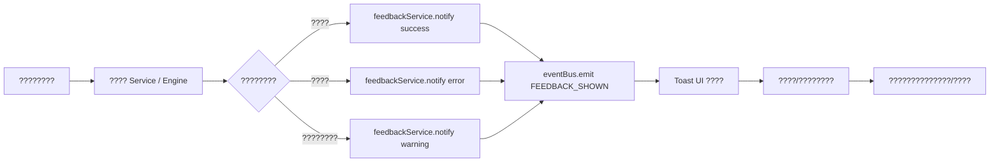

# V9 ????????????????

> **????????**??`./v9-system-blueprint.md` ??5.3 ????????????????7.2 UI/UX ????????????10 ?????? D18??????????????????????
> **????????**??`./04-ui-ux-specs.md`??Toast ????????????`./widget-error-handling.md`??????????????????????????????

---

## 1. ??????????

?????????? V9 ?????????????????????????????????? Toast ?????????????????????????? `FeedbackService`???????????????????????? `EventBus` ???????????????????????????????? Widget ???????????????? `chart-integration.md` ?? `widget-error-handling.md`????

---

## 2. Toast ????????

### 2.1 ??????????????????

| ??????variant?? | ???? | ???????????? | ???????? |
|---|---|---|---|
| `success` | ???????? | 3000 ms | ?????????????????????????????? |
| `error` | ???????? | 8000 ms | API ?????????????????????????? |
| `warning` | ????/?????? | 5000 ms | ???????????????????????? |
| `info` | ???????? | 4000 ms | ???????????????????????????? |

> ?????????????????? `src/components/atoms/Toast.tsx` ?? `src/hooks/useToast.tsx`??

### 2.2 ????????????????

```ts
// src/constants/feedback.constants.ts
export const TOAST_DURATION: Record<ToastVariant, number> = {
  success: 3000,
  error: 8000,
  warning: 5000,
  info: 4000,
}

export const TOAST_DEDUPLICATION_WINDOW_MS = 2000
```

- ???? `title` + `variant` ?? 2 ??????????????????????????????????????????
- `error` ?? Toast ??????????????????????????????????`duration: 0` ????????????

---

## 3. FeedbackService ????????

`FeedbackService` ??????????L4????????????L3?????????????????????????????????????????????? Toast Context??

```ts
// src/services/feedback/feedbackService.ts
import type { ToastVariant } from '@/hooks/useToast'

export type FeedbackScope = 'global' | 'widget' | 'form' | 'route'

export interface FeedbackItem {
  id: string
  scope: FeedbackScope
  variant: ToastVariant
  title: string
  description?: string
  duration?: number
  action?: {
    label: string
    onClick: () => void
  }
  metadata?: {
    traceId?: string
    moduleId?: string
    timestamp: number
  }
}

export interface FeedbackService {
  notify(item: Omit<FeedbackItem, 'id' | 'metadata'>): void
  notifyAsync<T>(
    promise: Promise<T>,
    messages: {
      loading: string
      success: string
      error: string
    },
  ): Promise<T>
  dismiss(id: string): void
  dismissByScope(scope: FeedbackScope): void
  getHistory(): FeedbackItem[]
}

export const feedbackService: FeedbackService = {
  notify: (item) => { /* ???? EventBus ???? */ },
  notifyAsync: async (promise, messages) => { /* ???????? loading/success/error */ },
  dismiss: (id) => { /* ... */ },
  dismissByScope: (scope) => { /* ... */ },
  getHistory: () => { /* ???????? 50 ?? */ },
}
```

---

## 4. ??????????????????



### 4.1 ????????????

```ts
// ??????????????
import { feedbackService } from '@/services/feedback/feedbackService'

async function handleImport(files: File[]) {
  await feedbackService.notifyAsync(
    batchImportService.import(files),
    {
      loading: '??????????????????',
      success: `???????? ${files.length} ??????`,
      error: '????????????????????????',
    },
  )
}
```

---

## 5. ?? EventBus ??????????

### 5.1 ????????????

| ?????? | ???????? | ?????? |
|--------|----------|--------|
| `feedback:notify` | `FeedbackService.notify()` ?????? | `ToastProvider`???????????? |
| `feedback:dismiss` | ?????????????????? | `ToastProvider` |
| `feedback:scopeCleared` | ?? scope ???????? | `ToastProvider` |
| `feedback:historyUpdated` | ???????????? | ?????????????????? |

### 5.2 ????????

```ts
// src/services/feedback/feedbackService.ts
import { eventBus } from '@/lib/eventBus'
import { getLogger } from '@/lib/logger'

const logger = getLogger()

export const feedbackService: FeedbackService = {
  notify: (item) => {
    const id = Math.random().toString(36).slice(2)
    const fullItem: FeedbackItem = {
      ...item,
      id,
      metadata: {
        traceId: item.traceId ?? crypto.randomUUID(),
        moduleId: item.scope,
        timestamp: Date.now(),
      },
    }
    logger.info('[FeedbackService] notify', { item: fullItem })
    eventBus.emit('feedback:notify', fullItem)
  },
  // ...
}
```

```tsx
// src/hooks/useToast.tsx????????????
import { eventBus } from '@/lib/eventBus'

useEffect(() => {
  const unsubscribe = eventBus.on('feedback:notify', (payload) => {
    const item = payload as FeedbackItem
    toast({
      title: item.title,
      description: item.description,
      variant: item.variant,
      duration: item.duration ?? TOAST_DURATION[item.variant],
    })
  })
  return unsubscribe
}, [toast])
```

---

## 6. ????????????????

Widget ???????????????????????????????????????? Toast?????????? `feedbackService.notify()` ???? `error` ???????? `ToastProvider` ?????????????? `./widget-error-handling.md` ??4.2??

---

## 7. ????????

- [ ] `feedbackService.notifyAsync` ????????????????????????????????????????????????
- [ ] `eventBus` ?? `feedback:*` ??????????????????????
- [ ] ????????????????/????/????/????/?? scope ??????
- [ ] `audit:hardcode` ???????????? Toast ??????

---

## 8. ????????

- `./v9-system-blueprint.md` ??5.3????7.2??D18
- `./04-ui-ux-specs.md` ??4.6 ????????
- `./chart-integration.md` ??5.2????????????????????
- `./widget-error-handling.md` ??4.2??????????????????????
