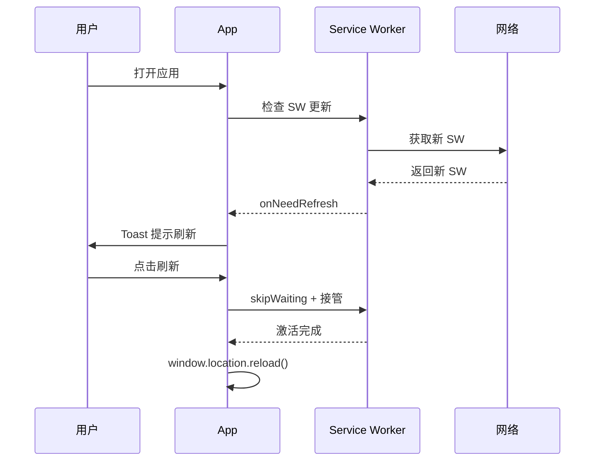

---
title: V9 PWA 离线化实施指南
version: v0.9.0-doc-sync-batch2
last_review: 2026-06-27
status: draft
change_log:
  - date: 2026-06-27
    author: Documentation Governor
    desc: 首次定义 Service Worker 注册策略、缓存清单、更新机制与 Lighthouse 测试标准
tier: important
---

# V9 PWA 离线化实施指南

> **对应蓝图**：`./v9-system-blueprint.md` §1 系统定位（离线需求）、§8 Phase 3（PWA manifest + service worker）、§9 质量门禁 11（PWA 离线验证）、§10 偏差 D18/D19 相关质量加固。
> **依赖文档**：`./03-architecture-standards.md` §3.10.1（离线目标）、`./06-routing-specs.md`（HashRouter 与静态托管）。

---

## 1. 目标与范围

本文档规定 V9 作为纯前端 PWA 的离线化实施细节，包括 Service Worker 注册策略、核心资源缓存清单、应用更新与版本管理机制，以及 Lighthouse 离线测试标准。不覆盖图表性能与操作反馈闭环（见 `chart-integration.md`、`feedback-loop-spec.md`）。

---

## 2. Service Worker 注册策略

### 2.1 选型

| 方案 | 工具 | 说明 |
|---|---|---|
| 推荐 | `vite-plugin-pwa` + Workbox | 与 Vite 集成，自动生成 manifest 与 SW，支持 precache/runtime cache |
| 备选 | 手写 `public/service-worker.js` | 仅用于特殊定制场景，维护成本高 |

### 2.2 注册入口

```ts
// src/main.tsx
import { registerSW } from 'virtual:pwa-register'

const updateSW = registerSW({
  immediate: true,
  onNeedRefresh() {
    // 触发反馈服务提示用户刷新
    eventBus.emit('pwa:update-available')
  },
  onOfflineReady() {
    eventBus.emit('pwa:offline-ready')
  },
})
```

### 2.3 更新提示 UX

当检测到新版时，通过 `feedbackService.notify()` 提示用户刷新：

```ts
import { feedbackService } from '@/services/feedback/feedbackService'

eventBus.on('pwa:update-available', () => {
  feedbackService.notify({
    scope: 'global',
    variant: 'info',
    title: '发现新版本',
    description: '点击刷新以获取最新功能与修复。',
    duration: 0,
    action: {
      label: '立即刷新',
      onClick: () => updateSW(true),
    },
  })
})
```

> `feedbackService` 规范见 `./feedback-loop-spec.md` §3。

---

## 3. 离线缓存清单

### 3.1 Precache（构建时缓存）

| 资源类型 | 模式 | 说明 |
|---|---|---|
| `index.html` | CacheFirst | 应用入口 |
| `/*.js`, `/*.css` | CacheFirst | Vite 构建产物 |
| `/assets/*` | CacheFirst | 字体、图标、图片 |
| `manifest.webmanifest` | CacheFirst | PWA 清单 |

### 3.2 Runtime Cache（运行时缓存）

| 数据源 | 路由/Store | 策略 | TTL |
|---|---|---|---|
| AKShare API | `/api/akshare/*` | NetworkFirst / StaleWhileRevalidate | 5 min |
| LLM API | `/api/llm/*` | NetworkOnly（离线不可用） | — |
| IndexedDB | `daily_quotes`, `v6_scores`, `news` | 已由 IndexedDB 持久化 | 长期 |
| 数据流 SSE | `/stream/*` | NetworkOnly | — |

### 3.3 vite-plugin-pwa 配置示例

```ts
// vite.config.ts
import { VitePWA } from 'vite-plugin-pwa'

export default {
  plugins: [
    VitePWA({
      registerType: 'prompt',
      workbox: {
        globPatterns: ['**/*.{js,css,html,ico,png,svg,woff2}'],
        runtimeCaching: [
          {
            urlPattern: /^https?:\/\/.*\/api\/akshare\/.*/i,
            handler: 'NetworkFirst',
            options: {
              cacheName: 'akshare-cache',
              expiration: { maxEntries: 200, maxAgeSeconds: 300 },
            },
          },
        ],
      },
      manifest: {
        name: 'V9 智能投研复盘系统',
        short_name: 'V9投研',
        theme_color: '#10b981',
        background_color: '#0f172a',
        display: 'standalone',
        start_url: '/',
        icons: [
          { src: '/icon-192.png', sizes: '192x192', type: 'image/png' },
          { src: '/icon-512.png', sizes: '512x512', type: 'image/png' },
        ],
      },
    }),
  ],
}
```

---

## 4. 更新策略与版本管理

### 4.1 版本号来源

- 应用版本：`package.json` 中的 `version`。
- 构建版本：Vite 注入 `import.meta.env.VITE_APP_VERSION`。
- SW 版本：由 `vite-plugin-pwa` 根据构建 hash 自动生成。

### 4.2 更新流程



### 4.3 数据兼容性

- IndexedDB 版本升级策略与 PWA 缓存版本解耦。
- 当 `DB_VERSION` 升级时，SW precache 不应清除旧 IndexedDB 数据。
- 离线启动时，若 IndexedDB 版本低于应用要求，应提示用户联网完成迁移。

---

## 5. Lighthouse 离线测试标准

### 5.1 测试环境

- Chrome DevTools → Lighthouse → PWA / Best Practices。
- 或使用 `npx playwright test tests/pwa-offline.spec.ts`（Phase 3 建立）。

### 5.2 门禁指标

| 指标 | 目标 | 说明 |
|---|---|---|
| PWA 可安装性 | 100 | manifest、icons、service worker 注册完整 |
| 离线可用性 | 通过 | `start_url` 在断网后可加载 |
| 启动性能 | ≥ 80 | FCP ≤ 1.8s，LCP ≤ 2.5s（3G 慢网） |
| 最佳实践 | ≥ 90 | HTTPS、 viewport、无过时 API |

### 5.3 离线测试用例

```ts
// tests/pwa-offline.spec.ts（规划）
import { test, expect } from '@playwright/test'

test('离线后可进入首页与驾驶舱', async ({ page, context }) => {
  await page.goto('/')
  await context.setOffline(true)
  await page.reload()
  await expect(page.locator('text=首页')).toBeVisible()
  await page.goto('/#/cockpit')
  await expect(page.locator('text=驾驶舱')).toBeVisible()
})
```

---

## 6. 验收标准

- [ ] `manifest.webmanifest` 生成并包含所有必填字段。
- [ ] Service Worker 注册成功，`pwa:offline-ready` 事件触发。
- [ ] 断网后首页 `/` 与驾驶舱 `/cockpit` 可加载。
- [ ] 检测到新版时弹出刷新提示。
- [ ] Lighthouse PWA 审计全部通过。

---

## 7. 相关链接

- `./v9-system-blueprint.md` §1、§8 Phase 3、§9、D18/D19
- `./03-architecture-standards.md` §3.10.1
- `./06-routing-specs.md` §1（HashRouter 说明）
- `./feedback-loop-spec.md` §5.3（pwa:* 事件通过 EventBus 触发 Toast）
