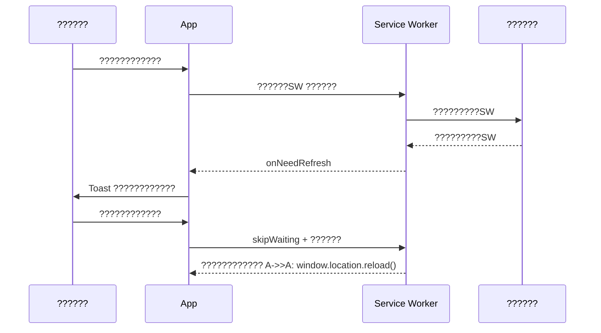

# V9 PWA ?????????????????????
> **????????????**???`./v9-system-blueprint.md` ??1 ??????????????????????????????????? Phase 3???PWA manifest + service worker???????? ???????????? 11???PWA ????????????????????0 ?????? D18/D19 ?????????????????????> **????????????**???`./03-architecture-standards.md` ??3.10.1?????????????????????`./06-routing-specs.md`???HashRouter ?????????????????????
---

## 1. ???????????????
???????????????V9 ???????????????PWA ?????????????????????????????????Service Worker ????????????????????????????????????????????????????????????????????????????????????Lighthouse ?????????????????????????????????????????????????????????????????????`chart-integration.md`???`feedback-loop-spec.md`??????
---

## 2. Service Worker ????????????

### 2.1 ??????

| ?????? | ?????? | ?????? |
|---|---|---|
| ?????? | `vite-plugin-pwa` + Workbox | ???Vite ?????????????????????manifest ???SW?????????precache/runtime cache |
| ??????| ?????? `public/service-worker.js` | ?????????????????????????????????????????????|

### 2.2 ????????????

```ts
// src/main.tsx
import { registerSW } from 'virtual:pwa-register'

const updateSW = registerSW({
  immediate: true,
  onNeedRefresh() {
    // ????????????????????????????????????
    eventBus.emit('pwa:update-available')
  },
  onOfflineReady() {
    eventBus.emit('pwa:offline-ready')
  },
})
```

### 2.3 ???????????? UX

?????????????????????????????? `feedbackService.notify()` ?????????????????????
```ts
import { feedbackService } from '@/services/feedback/feedbackService'

eventBus.on('pwa:update-available', () => {
  feedbackService.notify({
    scope: 'global',
    variant: 'info',
    title: '???????????????,
    description: '?????????????????????????????????????????????,
    duration: 0,
    action: {
      label: '????????????',
      onClick: () => updateSW(true),
    },
  })
})
```

> `feedbackService` ?????????`./feedback-loop-spec.md` ??3???
---

## 3. ??????????????????

### 3.1 Precache?????????????????????
| ???????????? | ?????? | ?????? |
|---|---|---|
| `index.html` | CacheFirst | ???????????? |
| `/*.js`, `/*.css` | CacheFirst | Vite ???????????? |
| `/assets/*` | CacheFirst | ????????????????????????|
| `manifest.webmanifest` | CacheFirst | PWA ?????? |

### 3.2 Runtime Cache?????????????????????
| ?????????| ??????/Store | ?????? | TTL |
|---|---|---|---|
| AKShare API | `/api/akshare/*` | NetworkFirst / StaleWhileRevalidate | 5 min |
| LLM API | `/api/llm/*` | NetworkOnly?????????????????????| ???|
| IndexedDB | `daily_quotes`, `v6_scores`, `news` | ?????? IndexedDB ?????????| ?????? |
| ?????????SSE | `/stream/*` | NetworkOnly | ???|

### 3.3 vite-plugin-pwa ????????????

```ts
// vite.config.ts
import { VitePWA } from 'vite-plugin-pwa'

export default {
  plugins: [
    VitePWA({
      registerType: 'prompt',
      workbox: {
        globPatterns: ['**/*.{js,css,html,ico,png,svg,woff2}'],
        runtimeCaching: [
          {
            urlPattern: /^https?:\/\/.*\/api\/akshare\/.*/i,
            handler: 'NetworkFirst',
            options: {
              cacheName: 'akshare-cache',
              expiration: { maxEntries: 200, maxAgeSeconds: 300 },
            },
          },
        ],
      },
      manifest: {
        name: 'V9 ????????????????????????',
        short_name: 'V9??????',
        theme_color: '#10b981',
        background_color: '#0f172a',
        display: 'standalone',
        start_url: '/',
        icons: [
          { src: '/icon-192.png', sizes: '192x192', type: 'image/png' },
          { src: '/icon-512.png', sizes: '512x512', type: 'image/png' },
        ],
      },
    }),
  ],
}
```

---

## 4. ???????????????????????????
### 4.1 ???????????????
- ???????????????`package.json` ?????? `version`???- ???????????????Vite ?????? `import.meta.env.VITE_APP_VERSION`???- SW ???????????? `vite-plugin-pwa` ???????????? hash ???????????????
### 4.2 ????????????



### 4.3 ???????????????
- IndexedDB ?????????????????????PWA ?????????????????????- ???`DB_VERSION` ????????????SW precache ???????????????IndexedDB ?????????- ?????????????????????IndexedDB ???????????????????????????????????????????????????????????????
---

## 5. Lighthouse ??????????????????

### 5.1 ????????????

- Chrome DevTools ???Lighthouse ???PWA / Best Practices???- ?????????`npx playwright test tests/pwa-offline.spec.ts`???Phase 3 ????????????
### 5.2 ????????????

| ?????? | ?????? | ?????? |
|---|---|---|
| PWA ????????????| 100 | manifest???icons???service worker ???????????? |
| ???????????????| ?????? | `start_url` ?????????????????????|
| ???????????? | ???80 | FCP ???1.8s???LCP ???2.5s???G ?????????|
| ????????????| ???90 | HTTPS???viewport???????????? API |

### 5.3 ??????????????????

```ts
// tests/pwa-offline.spec.ts????????????
import { test, expect } from '@playwright/test'

test('????????????????????????????????????', async ({ page, context }) => {
  await page.goto('/')
  await context.setOffline(true)
  await page.reload()
  await expect(page.locator('text=??????')).toBeVisible()
  await page.goto('/#/cockpit')
  await expect(page.locator('text=?????????)).toBeVisible()
})
```

---

## 6. ????????????

- [ ] `manifest.webmanifest` ????????????????????????????????????- [ ] Service Worker ???????????????`pwa:offline-ready` ???????????????- [ ] ???????????????`/` ???????????? `/cockpit` ????????????- [ ] ???????????????????????????????????????- [ ] Lighthouse PWA ?????????????????????
---

## 7. ????????????

- `./v9-system-blueprint.md` ??1????? Phase 3????????D18/D19
- `./03-architecture-standards.md` ??3.10.1
- `./06-routing-specs.md` ??1???HashRouter ?????????- `./feedback-loop-spec.md` ??5.3???pwa:* ???????????? EventBus ?????? Toast???