# V9 PWA 离线化�施指�
> **对应�图**：`./v9-system-blueprint.md` §1 系统定�（离线需求）�� Phase 3（PWA manifest + service worker）�� 质�门� 11（PWA 离线验�）��0 �差 D18/D19 相关质�加固�> **�赖文档**：`./03-architecture-standards.md` §3.10.1（离线目标）�`./06-routing-specs.md`（HashRouter ���托管）�
---

## 1. 目标�范�
本文档规�V9 作为纯��PWA 的离线化�施细节，包�Service Worker 注册策略�核心资�缓存清��应用更新�版本管�机制，以�Lighthouse 离线测试标准。�覆盖图表性能��作�馈闭�（�`chart-integration.md`�`feedback-loop-spec.md`）�
---

## 2. Service Worker 注册策略

### 2.1 选�

| 方案 | 工具 | 说� |
|---|---|---|
| �� | `vite-plugin-pwa` + Workbox | �Vite 集�，自动生�manifest �SW，支�precache/runtime cache |
| 备�| 手写 `public/service-worker.js` | 仅用�特殊定制场景，维护�本�|

### 2.2 注册入�

```ts
// src/main.tsx
import { registerSW } from 'virtual:pwa-register'

const updateSW = registerSW({
  immediate: true,
  onNeedRefresh() {
    // 触��馈�务�示用户刷新
    eventBus.emit('pwa:update-available')
  },
  onOfflineReady() {
    eventBus.emit('pwa:offline-ready')
  },
})
```

### 2.3 更新�示 UX

当检测到新版时，通过 `feedbackService.notify()` �示用户刷新�
```ts
import { feedbackService } from '@/services/feedback/feedbackService'

eventBus.on('pwa:update-available', () => {
  feedbackService.notify({
    scope: 'global',
    variant: 'info',
    title: '��新版�,
    description: '点击刷新以��最新功能�修��,
    duration: 0,
    action: {
      label: '立�刷新',
      onClick: () => updateSW(true),
    },
  })
})
```

> `feedbackService` 规范�`./feedback-loop-spec.md` §3�
---

## 3. 离线缓存清�

### 3.1 Precache（�建时缓存�
| 资�类� | 模� | 说� |
|---|---|---|
| `index.html` | CacheFirst | 应用入� |
| `/*.js`, `/*.css` | CacheFirst | Vite �建产物 |
| `/assets/*` | CacheFirst | 字体�图标�图�|
| `manifest.webmanifest` | CacheFirst | PWA 清� |

### 3.2 Runtime Cache（�行时缓存�
| 数��| 路由/Store | 策略 | TTL |
|---|---|---|---|
| AKShare API | `/api/akshare/*` | NetworkFirst / StaleWhileRevalidate | 5 min |
| LLM API | `/api/llm/*` | NetworkOnly（离线��用�| �|
| IndexedDB | `daily_quotes`, `v6_scores`, `news` | 已由 IndexedDB �久�| 长期 |
| 数��SSE | `/stream/*` | NetworkOnly | �|

### 3.3 vite-plugin-pwa �置示例

```ts
// vite.config.ts
import { VitePWA } from 'vite-plugin-pwa'

export default {
  plugins: [
    VitePWA({
      registerType: 'prompt',
      workbox: {
        globPatterns: ['**/*.{js,css,html,ico,png,svg,woff2}'],
        runtimeCaching: [
          {
            urlPattern: /^https?:\/\/.*\/api\/akshare\/.*/i,
            handler: 'NetworkFirst',
            options: {
              cacheName: 'akshare-cache',
              expiration: { maxEntries: 200, maxAgeSeconds: 300 },
            },
          },
        ],
      },
      manifest: {
        name: 'V9 智能投研�盘系统',
        short_name: 'V9投研',
        theme_color: '#10b981',
        background_color: '#0f172a',
        display: 'standalone',
        start_url: '/',
        icons: [
          { src: '/icon-192.png', sizes: '192x192', type: 'image/png' },
          { src: '/icon-512.png', sizes: '512x512', type: 'image/png' },
        ],
      },
    }),
  ],
}
```

---

## 4. 更新策略�版本管�
### 4.1 版本���
- 应用版本：`package.json` 中的 `version`�- �建版本：Vite 注入 `import.meta.env.VITE_APP_VERSION`�- SW 版本：由 `vite-plugin-pwa` 根��建 hash 自动生��
### 4.2 更新�程

```mermaid
sequenceDiagram
    participant U as 用户
    participant A as App
    participant S as Service Worker
    participant N as 网络

    U->>A: 打开应用
    A->>S: 检�SW 更新
    S->>N: ���SW
    N-->>S: 返��SW
    S-->>A: onNeedRefresh
    A->>U: Toast �示刷新
    U->>A: 点击刷新
    A->>S: skipWaiting + �管
    S-->>A: 激活完�    A->>A: window.location.reload()
```



### 4.3 数�兼容�
- IndexedDB 版本�级策略�PWA 缓存版本解耦�- �`DB_VERSION` �级时，SW precache �应清除�IndexedDB 数��- 离线�动时，�IndexedDB 版本��应用�求，应�示用户�网完��移�
---

## 5. Lighthouse 离线测试标准

### 5.1 测试�境

- Chrome DevTools �Lighthouse �PWA / Best Practices�- 或使�`npx playwright test tests/pwa-offline.spec.ts`（Phase 3 建立）�
### 5.2 门�指标

| 指标 | 目标 | 说� |
|---|---|---|
| PWA �安装�| 100 | manifest�icons�service worker 注册完整 |
| 离线�用�| 通过 | `start_url` 在断网��加�|
| �动性能 | �80 | FCP �1.8s，LCP �2.5s�G 慢网�|
| 最佳��| �90 | HTTPS�viewport�无过时 API |

### 5.3 离线测试用例

```ts
// tests/pwa-offline.spec.ts（规划）
import { test, expect } from '@playwright/test'

test('离线��进入首页�驾驶舱', async ({ page, context }) => {
  await page.goto('/')
  await context.setOffline(true)
  await page.reload()
  await expect(page.locator('text=首页')).toBeVisible()
  await page.goto('/#/cockpit')
  await expect(page.locator('text=驾驶�)).toBeVisible()
})
```

---

## 6. 验收标准

- [ ] `manifest.webmanifest` 生�并包�所有必填字段�- [ ] Service Worker 注册�功，`pwa:offline-ready` 事件触��- [ ] 断网�首�`/` �驾驶舱 `/cockpit` �加载�- [ ] 检测到新版时弹出刷新�示�- [ ] Lighthouse PWA 审计全部通过�
---

## 7. 相关链�

- `./v9-system-blueprint.md` §1�� Phase 3���D18/D19
- `./03-architecture-standards.md` §3.10.1
- `./06-routing-specs.md` §1（HashRouter 说��- `./feedback-loop-spec.md` §5.3（pwa:* 事件通过 EventBus 触� Toast�