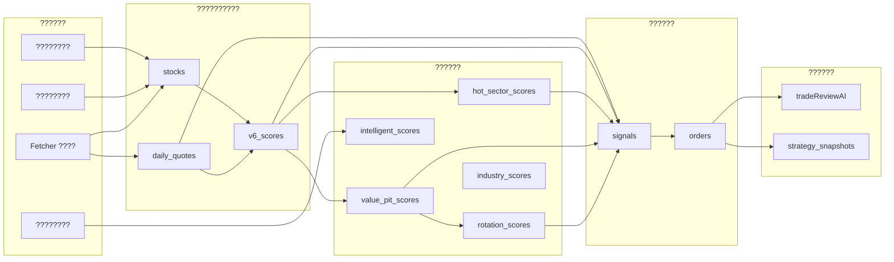

# V9 ??????????????????????????

> **Status**: Current  
> **Version**: v1.1.0  
> **Last Updated**: 2026-06-30  
> **DB_VERSION**: 16???? `src/config/dbConfig.ts` ????????????
>
> ?????????? V9 ???????????????????????????????????????????? Store ?????? freshness ??????????????????????????????????????????????????????

---

## 1. ??????????????

?????????????????????????? 15 ????????????

| ???? | ???????? | ???? | ???? Store | ???????????? | ???????? |
|------|---------|------|-----------|-------------|---------|
| **P1 ????** | ???? / ???? / ???? | ???? API / ???????? | `stocks`, `daily_quotes` | `ingestedAt`, `updatedAt` | `fetcherService`, `TaskScheduler` |
| **P2 ????** | ?????????? | `RawMarketData` | ?????? `MarketData` | - | `MarketDataAdapter` |
| **P3 V6 ????** | ???????? / ???????? | `stocks` + `daily_quotes` | `v6_scores` | `calculatedAt` | `v6ScoreService` |
| **P4 ??????????** | P3 ?????? | `stocks` + `daily_quotes` + `v6_scores` | `hot_sector_scores`, `value_pit_scores` | `calculatedAt` | `hotSectorAnalyzer`, `valuePitAnalyzer` |
| **P5 ????????** | P4 ?? / ???????? | `value_pit_scores` + sector ???? | `rotation_scores` | `scoreDate`, `createdAt` | `rotationScoreService` |
| **P6 ????????** | P4 ?? / ???????? | `stocks` + `daily_quotes` + scores | `signals` | `createdAt` | `signalGenerator`, `dualStrategyEngine` |
| **P7 ????????** | ???? / ???????? | `stocks` + `signals` | `orders` | `createdAt` | `tradingService` |
| **P8 ????????** | ?????? / ???? | `orders` + `daily_quotes` | `TradeReviewReport`?????????????? | `generatedAt` | `tradeReviewAI` |
| **P9 ????????** | ???? / ???? | ?????????? | `news`, `sentiment_cache`, `news_stock_map` | `publishTime`, `fetchTime`, `analyzedAt` | `newsService` |
| **P10 ????????** | ???????? | `stocks` + `local_docs` | `intelligent_scores` | `scoredAt` | `intelligentScoreService` |
| **P11 ????????** | ???????? | sector ???? | `industry_scores` | `scoredAt` | `industryScoreService` |
| **P12 ????????????** | v15??????/?????????? | ???????????? | `missing_reports` | `detectedAt` | `data-collector`???????? |
| **P13 ????????** | v16???????????? | `signals` + `stocks` | `executionPlans` | `createdAt` | `execution`??`executionPlanService`?? |
| **P14 ??????????????** | v16???????????? | `executionPlans` + `orders` | `portfolios` | `updatedAt` | `portfolio`??`portfolioService`?? |
| **P15 ????????** | v15??????????/???????? | `executionPlans` + `orders` | `execution_logs` | `timestamp` | `execution`??`executionLogService`?? |

---

## 2. ????????

---

## 3. ?????????????? Freshness ????

### 3.1 ????????

| Store | ?????? | ???????? | ?????????????? | ???????? |
|-------|--------|---------|---------------|---------|
| `stocks` | fetcher / ???? | ???? 1 ?? | 1 ?????? | ???????????????????? |
| `daily_quotes` | fetcher | ???? 1 ?? / ???? 15min | 1 ?????? | `v6_scores`, `signals`, ???????? |
| `v6_scores` | ???????? | `daily_quotes` ?????? | ?? `daily_quotes` ???? | `hot_sector_scores`, `value_pit_scores` |
| `hot_sector_scores` | ???????? | `v6_scores` ?????? | ?? `v6_scores` ???? | `dualStrategyEngine`, `signals` |
| `value_pit_scores` | ???????? | `v6_scores` ?????? | ?? `v6_scores` ???? | `dualStrategyEngine`, `signals` |
| `rotation_scores` | ???????? | ???? 1 ?? | 1 ?????? | ???????? |
| `signals` | ???????? | ???????? / 5min | 5 ???? | `tradingService`, UI |
| `orders` | ???? | ???? | ???? | ?????????? |
| `news` | ?????? | 15min / ???? | 30min | ?????????????? |
| `sentiment_cache` | ?????????? | ?????????????? | ???????????????????? | `news` |
| `missing_reports` | data-collector ???? | ????/?????????????? | ???? | ???????? UI |
| `executionPlans` | execution | ?????????? | ???? | `signals` |
| `portfolios` | portfolio | ?????????? / ???????? | ???? | ???????????????? |
| `execution_logs` | execution | ????/?????????? | ???? | ?????????? |

### 3.2 ??????????????

?????????????????????????? freshness ????????????????????????????????????????????????????????????

| # | ???? | ???????? | ?????????? |
|---|------|---------|-----------|
| 1 | V6 ???????????????????? | `v6_scores.calculatedAt >= daily_quotes.updatedAt` | ? `v6ScoreService.runV6Score` ???? `checkV6ScoreFreshness` |
| 2 | ???????????????????? V6 ???? | `hot_sector_scores.calculatedAt >= v6_scores.calculatedAt` | ? `hotSectorAnalyzer.analyzeBySymbol` ???? `checkStrategyScoreFreshness` |
| 2 | ???????????????????? V6 ???? | `value_pit_scores.calculatedAt >= v6_scores.calculatedAt` | ? `valuePitAnalyzer.analyzeBySymbol` ???? `checkStrategyScoreFreshness` |
| 3 | ???????????????????????? | `signals.createdAt >= daily_quotes.updatedAt` | ? `signalGenerator.generateSignalsForSymbol` ???? `checkSignalFreshness` |
| 4 | ?????????????????? `stock.price` | `orders.createdAt >= stock.updatedAt`?????????????? | ? `tradingService.createOrderWithRiskCheck` ???? `checkOrderPriceFreshness` |
| 5 | ?????????????????????? | `tradeReviewReport.generatedAt >= max(orders.createdAt)` | ? `tradeReviewAI.generateReview` / `generateReviewAsync` ???? `checkReviewFreshness` |
| 6 | ???????????????????????????????????? | `sentiment_cache.analyzedAt >= news.publishTime` | ? `newsService.saveNewsArticle` ???? `checkSentimentCacheFreshness` |

> **????**??????????????????????????????????`dataFreshnessGuard` ?????????????? `warn` ?????????? `valid: false`??????????????????????????????????????????????????????????????????????????????????????

---

## 4. ??????????????

?????????????????????????????????????????????? V9 ?????????? Store ??????

| ???????? | ???? Store | ???????? | ?????? |
|---------|-----------|---------|--------|
| ???????? | `sector_scores` / `industry_scores` | `isCore === true` ???????????????????????????????????? | ?????????????????? |
| ???????? | `value_pit_scores` | `action === 'immediate'` ?? `'probe'`????????/?????????????? | `dualStrategyEngine`, `signals` |
| ???????? | `hot_sector_scores` | `action === 'immediate'`??????/????/?????????????? | `dualStrategyEngine`, `signals` |

---

## 5. ??????????????????????

### 5.1 ????????????

?????????????? V6 ???? L8 ?????????????? `v6_scores.factors`???????????????? `chip_scores` Store????

???????????? `daily_quotes.history`??

- **SCD**????????????????????????20 ???????? + ??????????
- **PCH**?????????????????????? 20 ????????????????
- **MATRIX**??????-??????????????????????????
- **RSI**??**CCS**??**DIV**??**CSR** ??????????

### 5.2 ????????????

??????????

1. `orders` ????????????????????????
2. `daily_quotes` ?????????????? K ??????
3. `tradeReviewAI` ??????????????L8????????????????????????????
4. ??????????????????????????????????????????????????

---

## 6. ??????????????????

| ???? | ???? | ???????? |
|------|------|---------|
| `daily_quotes` ???? | V6 ?????????????????????? | ???? `qualityWarning`?????????????????????????????? |
| `v6_scores` ???? | ?????????????????? | ??????????????UI ???????????????? |
| `orders` ?? `daily_quotes` ???????? | ?????????????? | ?????????????????????????????????????? |
| `news` ???? | ?????????????????????? | ???? `hash` ?????????????????????? |

---

## 7. ????????

- ???????????????????????????????????? freshness ????
- ???????????????????????????????????? `docs/blueprints/v9-pipeline-sequence.mmd`
- ?????? `TaskScheduler` ?????????????????????? 3 ??????
