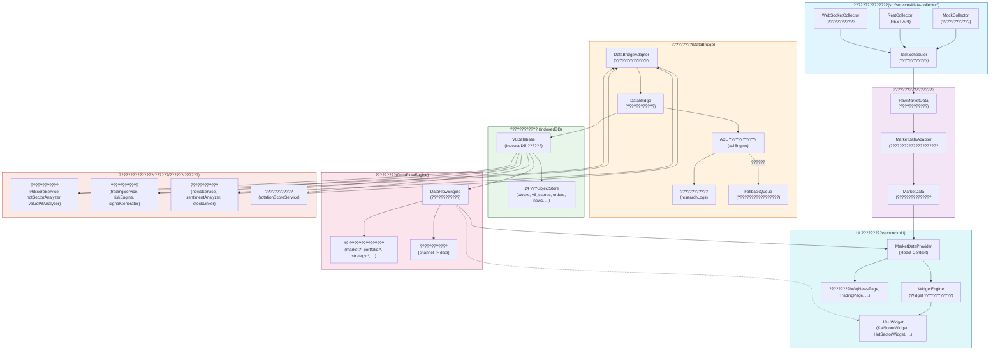
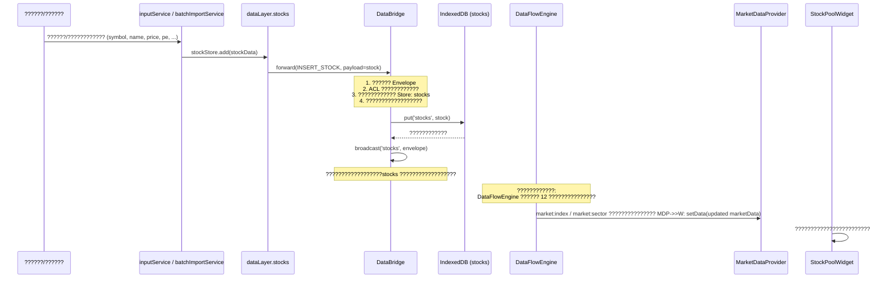
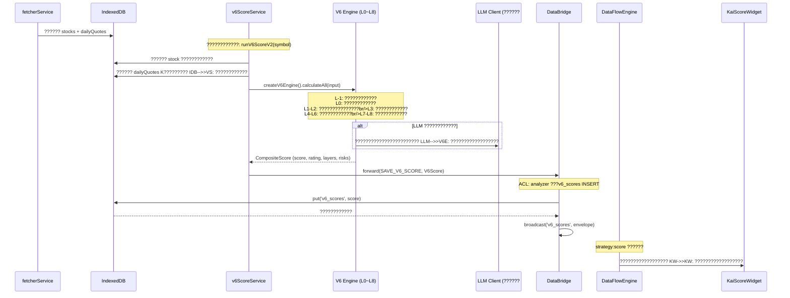
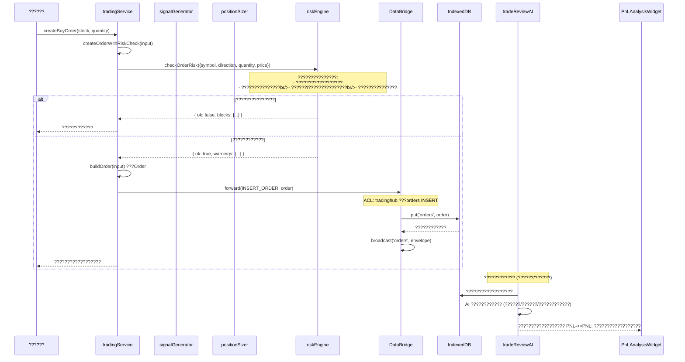
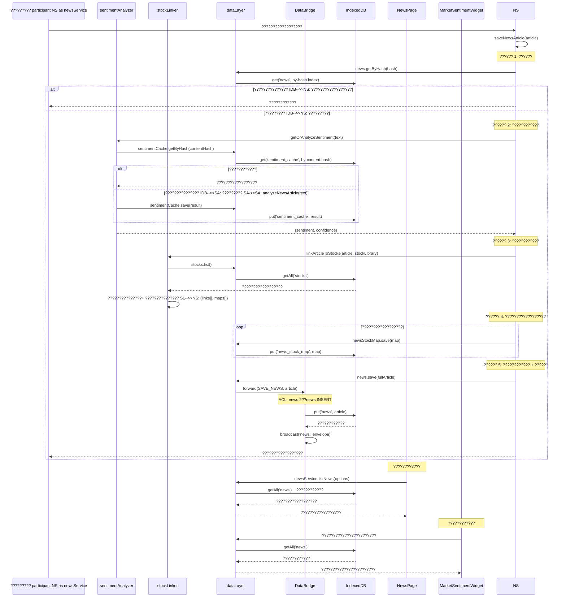

# V9 ???????????????????????????????????????

> **????????????**: v1.2
> **????????????**: 2026-07-02
> **????????????**: 2026-06-28
> **????????????**: V9 ??????????????????????????????????????????
> **??????????????????**: DB_VERSION = 16?????? `src/config/dbConfig.ts` ??????????????????

---

## ??????

1. [??????????????????](#1-??????????????????)
2. [???????????????](#2-???????????????)
3. [??????????????????](#3-??????????????????)
4. [????????????????????????](#4-????????????????????????)
5. [??????](#5-??????)

---

## 1. ??????????????????

### 1.1 ??????????????????

V9 ??????????????????????????????????????????????????????????????????????????????????????????????????????????????????????????????????????????????????????????????????



### 1.2 ????????????????????????

| ?????? | ???????????? | ???????????? | ???????????? |
|------|---------|---------|---------|
| **???????????????* | MockCollector / RestCollector / WebSocketCollector / TaskScheduler | ?????????????????????????????????????????????????????????????????????| `src/services/data-collector/` |
| **??????????????????** | MarketDataAdapter | ?????????????????? RawMarketData ?????????????????????MarketData ?????? | `src/services/data-collector/MarketDataAdapter.ts` |
| **?????????* | DataBridge / DataBridgeAdapter / ACL Engine | ???????????????????????????????????????????????????????????????| `src/core/databridge.ts`, `../../src/showcase/index.ts` |
| **????????????** | V6Database (IndexedDB) | 24 ???ObjectStore ???????????????????????? | `src/data/db.ts` |
| **?????????* | DataFlowEngine | ???????????????????????????????????????????????????SSE/???????????????| `src/core/dataflow/dataflowEngine.ts` |
| **???????????????* | v6ScoreService / tradingService / newsService / rotationScoreService | ????????????????????????????????????????????? | `src/services/scoring/`, `src/services/trading/`, `src/services/news/` |
| **UI ?????????* | MarketDataProvider / WidgetEngine / ???Widget | React Context ???????????????Widget ???????????? | `src/cockpit/` |

---

## 2. ???????????????

????????????????????????????????????????????????????????????????????????????????????
### 2.1 ?????????????????? (Stock)

| ?????? | ?????? |
|------|------|
| **????????????** | `Stock` (symbol, name, price, pe, pb, roe, marketCap, sector, researchStatus, group, ...) |
| **??????** | ???????????? / ???????????? / Fetcher ???????????? |
| **?????????* | `inputService` (??????), `batchImportService` (??????), `fetcherService` (API) |
| **????????????** | `dataLayer.stocks.add()` ???`sendWriteEnvelope('insertStock')` ???`dataBridge.forward()` ???ACL ?????? ???`db.put('stocks')` |
| **Store** | `stocks` (keyPath: `symbol`, ??????: `by-status`, `by-group`) |
| **?????????* | `v6ScoreService` (????????????), `tradingService` (????????????), `newsService` (????????????), `hotSectorAnalyzer`, `valuePitAnalyzer`, `StockPoolWidget`, `WatchlistWidget` |

### 2.2 K???????????????(DailyQuotes)

| ?????? | ?????? |
|------|------|
| **????????????** | `DailyQuotes` (symbol, latest, history[]) |
| **??????** | Fetcher ???????????? / ???????????? |
| **?????????* | `fetcherService`, `MockCollector` |
| **????????????** | `fetcherService` ???`dataBridge.forward(SAVE_DAILY_QUOTES)` ???ACL ?????? ???`db.put('daily_quotes')` |
| **Store** | `dailyQuotes` (keyPath: `symbol`) |
| **?????????* | `v6ScoreService` (??????/??????/???????????????, `hotSectorAnalyzer` (??????????????????, `valuePitAnalyzer` (??????????????????), `rotationScoreService` (??????????????????) |

### 2.3 V6 ???????????? (V6Score)

| ?????? | ?????? |
|------|------|
| **????????????** | `V6Score` (symbol, score, factors, algorithmVersion, calculatedAt, dataVersion, qualityWarning?) |
| **??????** | ?????????????????? + LLM ?????????????????? |
| **????????????** | `v6ScoreService.runV6Score()` / `runV6ScoreV2()` (L-1~L8 ????????????) |
| **????????????** | ?????? `stocks` + `dailyQuotes` ????????????????????? 9 ?????? ???LLM ?????????????????? ??????????????? ???`dataBridge.forward(SAVE_V6_SCORE)` ???`db.put('v6_scores')` |
| **Store** | `v6Scores` (keyPath: `symbol`) |
| **?????????* | `hotSectorAnalyzer` (??????????????????), `valuePitAnalyzer` (??????????????????), `KaiScoreWidget`, `StockPoolWidget`, `tradingService` (????????????) |

### 2.4 ?????????????????? (HotSectorScore)

| ?????? | ?????? |
|------|------|
| **????????????** | `HotSectorScore` (symbol, name, score, dimensions{momentum,sentiment,technical,valuation,marketEnv}, action, calculatedAt) |
| **??????** | ???????????????- ?????????????????????????????? |
| **????????????** | `hotSectorAnalyzer.analyzeHotSectors()` |
| **????????????** | ?????? `stocks` + `dailyQuotes` + `v6Scores` ??????????????????????????????/???????????????????????? ?????? action ???`dataLayer.hotSectorScores.save()` ???`db.put('hot_sector_scores')` |
| **Store** | `hotSectorScores` (keyPath: `symbol`, ??????: `by-calculated-at`) |
| **?????????* | `HotSectorWidget`, `tradingService` (????????????), `dualStrategyEngine` |

### 2.5 ??????????????????(ValuePitScore)

| ?????? | ?????? |
|------|------|
| **????????????** | `ValuePitScore` (symbol, name, score, dimensions{catalyst,valuation,chip,rotation,liquidity}, rotationSignal, action, calculatedAt) |
| **??????** | ???????????????- ??????????????????????????????|
| **????????????** | `valuePitAnalyzer.analyzeValuePits()` |
| **????????????** | ?????? `stocks` + `dailyQuotes` + `v6Scores` ????????????????????????????????????/??????/????????????????????? action ???`dataLayer.valuePitScores.save()` ???`db.put('value_pit_scores')` |
| **Store** | `valuePitScores` (keyPath: `symbol`, ??????: `by-calculated-at`) |
| **?????????* | `ValuePitWidget`, `tradingService` (????????????), `dualStrategyEngine` |

### 2.6 ???????????? (Order)

| ?????? | ?????? |
|------|------|
| **????????????** | `Order` (id, symbol, direction, quantity, price, amount, status, accountType, createdAt, planStopLoss?, planTakeProfit?, ...) |
| **??????** | ???????????? / ?????????????????? |
| **??????** | `tradingService.createBuyOrder()` / `createSellOrder()` |
| **????????????** | ???????????? ??????????????? ??????????????? (`riskEngine.checkOrderRisk`) ??????????????? ???`dataBridge.forward(INSERT_ORDER)` ???ACL ?????? ???`db.put('orders')` |
| **Store** | `orders` (keyPath: `id`) |
| **?????????* | `tradingService` (????????????), `tradeReviewAI` (AI??????), `PnLAnalysisWidget`, `PortfolioOverviewWidget`, `AITradeReviewWidget` |

### 2.7 ???????????? (Signal)

| ?????? | ?????? |
|------|------|
| **????????????** | `Signal` (id, symbol, direction, confidence, reason, source, createdAt) |
| **??????** | ???????????????/ ???????????? |
| **??????** | `signalGenerator.generateSignalsForSymbol()`, `tradingService.scanWatchingSignals()` |
| **????????????** | ?????? `stocks` + `v6Scores` + ????????????????????????????????????????????????????????????`dataBridge.forward(INSERT_SIGNAL)` ???ACL ?????? ???`db.put('signals')` |
| **Store** | `signals` (keyPath: `id`) |
| **?????????* | `SignalMonitorWidget`, `tradingService` (????????????), `positionSizer` (????????????) |

### 2.8 ???????????? (NewsArticle)

| ?????? | ?????? |
|------|------|
| **????????????** | `NewsArticle` (id, title, content, url, source, category, publishTime, fetchTime, sentiment, sentimentConfidence, relatedStocks[], keywords, hash) |
| **??????** | ?????? API / ???????????? / ???????????? |
| **??????** | `newsService.saveNewsArticle()` / `saveNewsArticles()` |
| **????????????** | ???????????? ??????????????? ??????????????? (`sentimentAnalyzer`) ??????????????? (`stockLinker`) ????????????????????? ???`dataLayer.news.save()` ???`dataBridge.forward(SAVE_NEWS)` ???`db.put('news')` |
| **Store** | `news` (keyPath: `id`, ??????: `by-source`, `by-category`, `by-publish-time`, `by-hash`) |
| **?????????* | `NewsPage`, `MarketSentimentWidget` (????????????), `newsService.getNewsBySymbol()`, `StockChatWidget` |

### 2.9 ?????????????????? (SentimentCache)

| ?????? | ?????? |
|------|------|
| **????????????** | `SentimentCache` (id, contentHash, sentiment, confidence, analyzedAt, model?) |
| **??????** | ???????????????????????????|
| **????????????** | `sentimentAnalyzer.analyzeNewsArticle()` / `getOrAnalyzeSentiment()` |
| **????????????** | ???????????? ??????????????? (by-content-hash) ????????????????????????????????????????????? ??????????????? ??????????????? |
| **Store** | `sentimentCache` (keyPath: `id`, ??????: `by-content-hash`, `by-analyzed-at`) |
| **?????????* | `newsService` (??????????????????), ????????????????????????????????? |

### 2.10 ??????-???????????? (NewsStockMap)

| ?????? | ?????? |
|------|------|
| **????????????** | `NewsStockMap` (id, newsId, symbol, relevanceScore, matchType) |
| **??????** | ???????????????????????????|
| **????????????** | `stockLinker.linkArticleToStocks()` |
| **????????????** | ????????????+?????? ??????????????????????????? ????????????????????? ???`dataLayer.newsStockMap.save()` ???`db.put('news_stock_map')` |
| **Store** | `newsStockMap` (keyPath: `id`, ??????: `by-symbol`, `by-news`) |
| **?????????* | `newsService.getNewsBySymbol()`, `NewsPage` (??????????????? |

### 2.11 ?????????????????? (RotationSectorScore)

| ?????? | ?????? |
|------|------|
| **????????????** | `RotationSectorScore` (id, sectorCode, sectorName, scoreDate, subScores, f1~f5, total, resonance, signal, alert, decline, poolStocks?, analysisReport?, modelUsed?) |
| **??????** | ?????????????????????????????????????????????|
| **????????????** | `rotationScoreService.saveRotationScore()`, `rotationCalculator` |
| **????????????** | ???????????????????????? ??????????????????????????????????????????????????? ???`dataBridge.forward(SAVE_ROTATION_SCORES)` ???`db.put('rotation_scores')` |
| **Store** | `rotationScores` (keyPath: `id`, ??????: `by-sector-date`(??????), `by-sector`, `by-total`, `by-resonance`) |
| **?????????* | `rotationScoreService.getRotationScores()`, ????????????, `SectorHeatmapWidget` |

### 2.12 ???????????? (SectorScoreRecord)

| ?????? | ?????? |
|------|------|
| **????????????** | `SectorScoreRecord` (id, sectorCode, sectorName, composite, dimensions[], isCore, keyStocks[], recommendation, ...) |
| **??????** | ???????????? / SKILL ?????? |
| **??????** | `sectorScoreService` |
| **????????????** | ???????????? ???????????????????????????????????????`dataBridge.forward(SAVE_SECTOR_SCORES)` ???`db.put('sector_scores')` |
| **Store** | `sectorScores` (keyPath: `id`, ??????: `by-sector`, `by-composite`, `by-is-core`) |
| **?????????* | `SectorHeatmapWidget`, ????????????, `rotationScoreService` (????????????) |

### 2.13 ???????????? (IntelligentScore)

| ?????? | ?????? |
|------|------|
| **????????????** | `IntelligentScore` (id?, symbol, overallScore, dimensionScores[], summary, basis, missingFields, sourceSnapshot, configSnapshot, modelResponse, scoredAt) |
| **??????** | LLM ????????????????????????SKILL???|
| **??????** | `intelligentScoreService` |
| **????????????** | ?????????????????? + ???????????? ???LLM ?????? ???`dataBridge.forward(SAVE_INTELLIGENT_SCORES)` ???`db.put('intelligent_scores')` |
| **Store** | `intelligentScores` (keyPath: `id` autoIncrement, ??????: `by-symbol`) |
| **?????????* | ??????????????? `KaiScoreWidget` (??????????????????) |

### 2.14 ???????????? (IndustryScore)

| ?????? | ?????? |
|------|------|
| **????????????** | `IndustryScore` (id?, code, name, overallScore, dimensionScores[], summary, basis, sectorSnapshot, configSnapshot, modelResponse, scoredAt) |
| **??????** | LLM ????????????????????????SKILL???|
| **??????** | `industryScoreService` |
| **????????????** | ???????????? ???LLM ?????? ???`dataBridge.forward(SAVE_INDUSTRY_SCORES)` ???`db.put('industry_scores')` |
| **Store** | `industryScores` (keyPath: `id` autoIncrement, ??????: `by-code`) |
| **?????????* | ??????????????? ??????????????????|

### 2.15 ???????????? (ScoreDocVersion)

| ?????? | ?????? |
|------|------|
| **????????????** | `ScoreDocVersion` (docId, symbol, version, composite, dimensions[], content, createdAt) |
| **??????** | ?????????????????????|
| **??????** | `scoreDocService` |
| **????????????** | ???????????? ??????????????? ?????????????????????`dataBridge.forward(SAVE_SCORE_DOCS)` ???`db.put('score_docs')` |
| **Store** | `scoreDocs` (keyPath: `docId`, ??????: `by-symbol`, `by-symbol-version`(??????), `by-composite`) |
| **?????????* | ????????????????????? ?????????????????? |

### 2.16 ???????????? (StrategySnapshot)

| ?????? | ?????? |
|------|------|
| **????????????** | `StrategySnapshot` (id, version, date, timestamp, holdings, scores, signals, performance) |
| **??????** | ?????????????????????|
| **??????** | `strategySnapshotService` |
| **????????????** | ???????????? ?????????/??????????????????`dataBridge.forward(SAVE_STRATEGY_SNAPSHOTS)` ???`db.put('strategy_snapshots')` |
| **Store** | `strategySnapshots` (keyPath: `id`, ??????: `by-version`(??????), `by-date`, `by-timestamp`) |
| **?????????* | ????????????, ????????????, `dualStrategyEngine` |

### 2.17 ???????????????(LocalDoc)

| ?????? | ?????? |
|------|------|
| **????????????** | `LocalDoc` (id, symbol, title, content, category, source, addedAt) |
| **??????** | ???????????? / ?????????????????????|
| **??????** | `localDocService` |
| **????????????** | ???????????? ????????? ????????? ???`dataBridge.forward(SAVE_LOCAL_DOCS)` ???`db.put('local_docs')` |
| **Store** | `localDocs` (keyPath: `id`, ??????: `by-symbol`, `by-category`, `by-added-at`) |
| **?????????* | `intelligentScoreService` (????????????), ?????????????????? |

### 2.18 ????????? (Watchlist)

| ?????? | ?????? |
|------|------|
| **????????????** | `Watchlist` (id, name, items[], createdAt, updatedAt) |
| **??????** | ???????????? |
| **??????** | `stockpoolService` |
| **????????????** | ???????????? ???`dataBridge.forward()` ???ACL ?????? ???`db.put('watchlists')` |
| **Store** | `watchlists` (keyPath: `id`) |
| **?????????* | `WatchlistWidget`, `tradingService` (??????????????? |

### 2.19 ???????????? (ResearchLog)

| ?????? | ?????? |
|------|------|
| **????????????** | `ResearchLog` (id, action, module, symbol?, detail, timestamp) |
| **??????** | DataBridge ?????????????????? |
| **??????** | DataBridge ?????? `writeAuditLog()` |
| **????????????** | DataBridge.forward() ???ACL ?????? ??????????????????????????? ???`db.put('research_logs')` |
| **Store** | `researchLogs` (keyPath: `id` autoIncrement) |
| **?????????* | ????????????, ????????????, ?????????????????? |

### 2.20 ???????????? (NewsBookmark)

| ?????? | ?????? |
|------|------|
| **????????????** | `NewsBookmark` (id, newsId, bookmarkedAt, note?) |
| **??????** | ?????????????????? |
| **??????** | `newsService` |
| **????????????** | ?????????????????? ???`dataBridge.forward(NEWS_ARTICLE_BOOKMARKED)` ???`db.put('news_bookmarks')` |
| **Store** | `newsBookmarks` (keyPath: `id`, ??????: `by-bookmarked-at`) |
| **?????????* | `NewsPage` (??????????????? |

---

## 3. ??????????????????

### 3.1 ?????????????????????????????????????????? ???UI?????????


**???????????????*

1. **??????**: `inputService.addStock()` / `batchImportService.importStocks()`
2. **??????**: `dataLayer.stocks.add()` ???`sendWriteEnvelope('insertStock')` ???`dataBridge.forward()`
3. **??????**: Envelope ???????????? ???ACL ????????????(`stockpool` ?????? ???`stocks` Store INSERT)
4. **??????**: `db.put('stocks', stock)` (keyPath: `symbol`)
5. **??????**: DataBridge ???????????????`broadcast(targetStore, envelope)`
6. **??????**: MarketDataProvider ?????????????????? ???Widget ?????? `useMarketData()` ????????????

### 3.2 ???????????????????????????????????? ????????? ????????? ????????????


**???????????????*

1. **??????**: ?????????????????? / ??????????????????
2. **????????????**: ???`stocks` + `dailyQuotes` ??????????????????
3. **????????????**: V6 v2.0 ?????????1 ??????????????????????????????????????????LLM ????????????4. **??????**: ?????? `dataBridge.forward(SAVE_V6_SCORE)` ?????????5. **??????**: `analyzer` ?????????`v6_scores` ???INSERT/UPDATE ??????
6. **????????????**: HotSectorAnalyzer / ValuePitAnalyzer ???????????????????????????KaiScoreWidget ??????

### 3.3 ???????????????????????????????????? ????????? ????????????


**???????????????*

1. **??????**: `tradingService.createBuyOrder()` / `createSellOrder()`
2. **??????**: `riskEngine.checkOrderRisk()` ????????????????????????????????????
3. **??????**: `buildOrder()` ???????????? Order ??????
4. **??????**: `dataBridge.forward(INSERT_ORDER)` ???ACL ?????? ???IndexedDB
5. **??????**: `tradinghub` ?????????`orders` ???INSERT/UPDATE/DELETE ??????
6. **??????**: ???????????????AI?????????????????????Widget ?????? `orders` Store ??????

### 3.4 ???????????????????????????????????? ????????? ????????????


**???????????????*

1. **??????**: ?????????????????? (`by-hash` ??????) ??????????????????
2. **????????????**: `sentimentAnalyzer` ?????????????????????????????????3. **????????????**: `stockLinker` ?????????????????????????????????????????? `news_stock_map` ??????
4. **????????????**: ?????????????????? ??????????????? ???DataBridge ??????
5. **??????**: `news` ?????????`news`/`newsStockMap`/`sentimentCache` ?????????????????????6. **????????????**: NewsPage ???????????????MarketSentimentWidget ?????????????????????????????????
### 3.5 ???????????????????????????????????? ????????? ????????????
```mermaid
sequenceDiagram
    participant FS as fetcherService
    participant IDB as IndexedDB
    participant RS as rotationScoreService
    participant RC as rotationCalculator
    participant RSG as rotationSignalGrader
    participant DB as DataBridge
    participant DFE as DataFlowEngine
    participant SH as SectorHeatmapWidget
    participant DS as dualStrategyEngine

    FS->>IDB: ??????????????????/??????/????????????    
    Note over RS: ??????????????????
    RS->>IDB: ???????????????????????? (??????300 vs ????????????)
    RS->>IDB: ?????????????????? + ????????????
    
    RS->>RS: getCurrentMarketStyle()
    Note over RS: ?????? growth / value / balanced
    
    RS->>RS: filterByMarketStyle(sectors, style)
    
    loop ????????????
        RS->>RC: calculateRotationScore(input)
        Note over RC: ???????????????<br/>F1 ?????????(F1A~F1E)<br/>F2 ?????????(F2A~F2D)<br/>F3 ????????? (F3A~F3C)<br/>F4 ???????? (F4A~F4B)<br/>F5 ?????? (F5A~F5B)
        
        RC->>RC: calculateResonance(subScores)
        RC->>RSG: getSignalGrade(total, resonance)
        RSG-->>RC: signal + alert + decline
        RC-->>RS: RotationSectorScore
    end
    
    RS->>DB: forward(SAVE_ROTATION_SCORES, score)
    Note over DB: ACL: rotation ???rotation_scores INSERT
    DB->>IDB: put('rotation_scores', score)
    IDB-->>DB: ????????????
    DB->>DB: broadcast('rotation_scores', envelope)
    
    Note over DFE: strategy:signal ??????
    DFE->>SH: ????????????????????????    SH->>SH: ???????????????    
    Note over DS: ??????????????????
    DS->>IDB: ??????????????????
    DS->>DS: ?????????????????????```

**???????????????*

1. **????????????**: ??????????????????????????????growth/value/balanced????????????????????????????????????
2. **????????????**: `rotationCalculator` ???????????????+ ???????????????+ ????????????
3. **??????**: `saveRotationScoreViaDataBridge()` ???`dataBridge.forward(SAVE_ROTATION_SCORES)`
4. **??????**: `rotation` ?????????`rotationScores` ?????????CRUD ??????
5. **??????**: `by-sector-date` ??????????????????????????????????????????????????????6. **??????**: ??????????????????????????????SectorHeatmapWidget ???????????????
---

## 4. ????????????????????????

### 4.1 ???????????? DataFlow ????????????

V9 ????????????**????????????**??????????????????????????????
#### 4.1.1 DataBridge ???????????????Store ??????

```
????????????:
  dataBridge.forward(envelope)
    ????????? Envelope ??????
    ???ACL ????????????
    ???routeToDB() ?????? IndexedDB
    ???broadcast(targetStore, envelope)  ??????????????????```

- **????????????**: ?????? `forward()` ???????????????????????????- **????????????**: ???Store ???????????????????????? `stocks`, `v6_scores`, `orders`, `news`???- **????????????**: `dataBridge.subscribe(channel, callback)`
- **????????????**: ????????????????????????????????????

#### 4.1.2 DataFlowEngine ???????????????????????????

```
????????????:
  dataFlowEngine.publish(channel, data)
    ??????????????? cache?????? persist=true???    ???eventBus.emit('DATAFLOW_PACKET_PUBLISHED')
    ???_distribute(packet)  ????????????????????????    ????????????????????? queueMicrotask ????????????
```

- **????????????**: ???????????? `publish()` ???`registerRefresh()` ????????????
- **????????????**: 12 ??????????????????`market:index`, `portfolio:summary`, `strategy:score` ??????
- **????????????**: `dataFlowEngine.subscribe(channel, callback)`
- **????????????**: Widget ????????????????????????

### 4.2 ???????????????????????????
```mermaid
flowchart LR
    subgraph PUB["?????????]
        A1["dataBridge.forward()<br/>?????? + ??????"]
        A2["dataFlowEngine.publish()<br/>???????????????"]
    end
    
    subgraph SUB["?????????]
        B1["dataBridge.subscribe()<br/>Store ?????????]
        B2["dataFlowEngine.subscribe()<br/>???????????????]
        B3["useMarketData()<br/>React Hook"]
    end
    
    A1 --> B1
    A2 --> B2
    B2 --> B3
    
    style PUB fill:#fff3e0,stroke:#e65100
    style SUB fill:#e0f7fa,stroke:#006064
```

**???????????????*

| ?????? | ???????????? | ?????????????????????????????? | ???????????? | ???????????? |
|------|---------|---------------------|---------|---------|
| DataBridge ?????? | `dataBridge.subscribe(channel, cb)` | ???| ???????????? | ???|
| DataFlowEngine | `dataFlowEngine.subscribe(channel, cb)` | **???*???????????????????????? queueMicrotask ??????????????? | queueMicrotask ???????????? | ???????????????(>16ms) |
| MarketDataProvider | `useMarketData()` Hook | ??????Context ???????????? | React setState ?????????| loading/error ??????|

### 4.3 ??????????????????

#### 4.3.1 DataFlowEngine ????????????

```typescript
// ????????????
private cache = new Map<string, { data: unknown; timestamp: number; seq: number }>()

// ????????????
- ????????? channel ??????
- ????????? { data, timestamp, seq }
- ????????? ?????????????????????publish ?????????- ??????????????? ???ChannelMeta.persist ??????
  - persist = true: ????????????????????????????????????????????????????????????  - persist = false: ?????????????????????????????????agent:logs???```

#### 4.3.2 IndexedDB ???????????????
| Store | ???????????? | ???????????? |
|-------|---------|---------|
| `stocks` | ???????????????| ????????????/?????????????????????|
| `dailyQuotes` | ???????????????| Fetcher ???????????????????????? |
| `v6Scores` | ???????????????| ?????????????????? symbol ?????? |
| `hotSectorScores` | ???????????????| ?????????????????? symbol ?????? |
| `valuePitScores` | ???????????????| ?????????????????? symbol ?????? |
| `rotationScores` | ????????????????????? | ????????????????????????by-sector-date ???????????????|
| `sentimentCache` | ?????????????????????| ?????????????????????????????????????????????|
| `news` | ???????????????| ?????????????????????????????? |

#### 4.3.3 ??????????????????

1. **???????????????*: DataBridge ???????????????????????????????????????????????????????????????
2. **????????????**: DataFlowEngine `registerRefresh()` ???interval ?????????????????????3. **????????????**: Widget ???????????? ???`refreshWidget(instanceId)` ???????????????????????????
4. **????????????**: Widget ????????????WidgetEngine ?????? `unmountInstance()` ???TaskScheduler ???????????????????????? ??????????????????
---

## 5. ??????

### 5.1 ????????????????????????????????????

?????????????????????????????????????????????????????????R=??? W=?????????
| ???????????? (Store) | fetcher | stockpool | analyzer | rotation | sector | news | tradinghub | trading | strategy | system | user |
|-----------------|:-------:|:---------:|:--------:|:--------:|:------:|:----:|:----------:|:-------:|:--------:|:------:|:----:|
| **stocks** | RW | RW | R | R | R | R | R | R | R | RW | RW |
| **dailyQuotes** | RW | - | R | R | - | - | - | - | R | RW | - |
| **v6Scores** | - | R | RW | - | - | - | R | - | R | RW | R |
| **intelligentScores** | - | - | RW | - | - | - | - | - | - | RW | - |
| **industryScores** | - | - | RW | - | - | - | - | - | - | RW | - |
| **rotationScores** | - | - | - | RW | - | - | - | - | R | RW | - |
| **sectorScores** | - | - | - | - | RW | - | - | - | - | RW | - |
| **hotSectorScores** | - | - | RW | - | - | - | RW | - | RW | RW | - |
| **valuePitScores** | - | - | RW | - | - | - | RW | - | RW | RW | - |
| **scoreDocs** | - | - | RW | - | - | - | - | - | - | RW | - |
| **strategySnapshots** | - | - | - | - | - | - | RW | R | - | RW | - |
| **orders** | - | - | - | - | - | - | RW | RW | - | RW | RW |
| **signals** | - | - | - | - | - | - | RW | RW | - | RW | - |
| **watchlists** | - | RW | - | - | - | - | - | - | - | RW | - |
| **news** | - | - | - | - | - | RW | - | - | - | RW | - |
| **newsStockMap** | - | - | - | - | - | RW | - | - | - | RW | - |
| **sentimentCache** | - | - | - | - | - | RW | - | - | - | RW | - |
| **newsBookmarks** | - | - | - | - | - | RW | - | - | - | RW | - |
| **localDocs** | - | - | R | - | - | - | - | - | - | RW | - |
| **researchLogs** | - | - | - | - | - | - | - | - | - | RW | - |

### 5.2 ??????????????????ACL Matrix???
?????? `src/config/dbConfig.ts` ?????? `ACL_MATRIX`???
| ?????? ID | ?????? Store | ?????? Store | ???????????? |
|---------|-----------|-----------|---------|
| **fetcher** | - | stocks, dailyQuotes | INSERT, UPDATE |
| **stockpool** | stocks, v6Scores | stocks | INSERT, UPDATE, DELETE |
| **analyzer** | stocks, v6Scores, intelligentScores, industryScores, scoreDocs, hotSectorScores, valuePitScores | v6Scores, intelligentScores, industryScores, scoreDocs, hotSectorScores, valuePitScores | SELECT, INSERT, UPDATE |
| **rotation** | stocks, rotationScores, dailyQuotes | rotationScores | SELECT, INSERT, UPDATE, DELETE |
| **sector** | stocks, sectorScores | sectorScores | SELECT, INSERT, UPDATE, DELETE |
| **news** | stocks, news, newsStockMap, sentimentCache, newsBookmarks | news, newsStockMap, sentimentCache, newsBookmarks | SELECT, INSERT, UPDATE, DELETE |
| **tradinghub** | stocks, v6Scores, orders, signals, strategySnapshots, hotSectorScores, valuePitScores | orders, signals, strategySnapshots, hotSectorScores, valuePitScores | INSERT, UPDATE, DELETE |
| **trading** | stocks, orders, signals, strategySnapshots | orders, signals | SELECT, INSERT, UPDATE |
| **strategy** | stocks, v6Scores, dailyQuotes, hotSectorScores, valuePitScores, rotationScores, signals | hotSectorScores, valuePitScores | SELECT, INSERT, UPDATE |
| **system** | ?????? (24??? | ?????? (24??? | ?????? |
| **user** | stocks, v6Scores, orders | stocks, orders | INSERT, UPDATE, DELETE |

### 5.3 DataFlow ????????????

| ?????????| ?????? | ???????????? | ?????????| ?????????|
|--------|------|---------|--------|--------|
| `market:index` | ???????????????????????? | 5000ms | ???| high |
| `market:sector` | ?????????????????? | 10000ms | ???| high |
| `market:fundflow` | ?????????????????? | 15000ms | ???| normal |
| `market:emotion` | ?????????????????? | 30000ms | ???| low |
| `portfolio:summary` | ?????????????????????????????? | 0 | ???| high |
| `portfolio:holding` | ???????????? | 30000ms | ???| normal |
| `portfolio:risk` | ?????????????????? | 60000ms | ???| high |
| `strategy:signal` | ?????????????????????????????? | 0 | ???| high |
| `strategy:score` | ???????????? | 60000ms | ???| normal |
| `agent:status` | Agent??????| 10000ms | ???| normal |
| `agent:logs` | Agent???????????????????????? | 0 | ???| low |
| `system:health` | ???????????? | 30000ms | ???| low |

> ??????`refreshInterval = 0` ??????????????????????????????????????????????????????
### 5.4 ??????????????????

| ?????? | ?????????????????? |
|------|-------------|
| DataBridge ?????? | `src/core/databridge.ts` |
| DataBridge ?????????| `../../src/showcase/index.ts` |
| DataFlowEngine | `src/core/dataflow/dataflowEngine.ts` |
| DataFlow ?????? | `src/core/dataflow/dataflowTypes.ts` |
| IndexedDB ?????? | `src/data/db.ts` |
| ???????????????| `src/data/dataLayer.ts` |
| ?????????????????? | `src/data/types.ts` |
| DB ?????????ACL | `src/config/dbConfig.ts` |
| ???????????????| `src/services/data-collector/TaskScheduler.ts` |
| ?????????????????????| `src/services/data-collector/MarketDataAdapter.ts` |
| ???????????????| `src/services/data-collector/collectors/BaseCollector.ts` |
| V6 ???????????? | `src/services/scoring/v6ScoreService.ts` |
| ?????????????????? | `src/services/scoring/hotSectorAnalyzer.ts` |
| ??????????????????| `src/services/scoring/valuePitAnalyzer.ts` |
| ?????????????????? | `src/services/analysis/rotationScoreService.ts` |
| ???????????? | `src/services/trading/tradingService.ts` |
| ???????????? | `src/services/trading/riskEngine.ts` |
| ???????????????| `src/services/trading/signalGenerator.ts` |
| ???????????? | `src/services/news/newsService.ts` |
| ???????????????| `src/services/news/sentimentAnalyzer.ts` |
| ???????????????| `src/services/news/stockLinker.ts` |
| ???????????? Provider | `src/cockpit/providers/MarketDataProvider.tsx` |
| Widget ?????? | `src/cockpit/core/widgetEngine.ts` |
| Cockpit ?????? | `src/cockpit/CockpitShell.tsx` |

---

> **????????????** ??????????????????V9 DB_VERSION 16 ???????????????????????????????????????24 ???IndexedDB Store???v15 ?????? execution_logs / missing_reports???v16 ?????? executionPlans / portfolios?????? 12 ???DataFlow ?????????