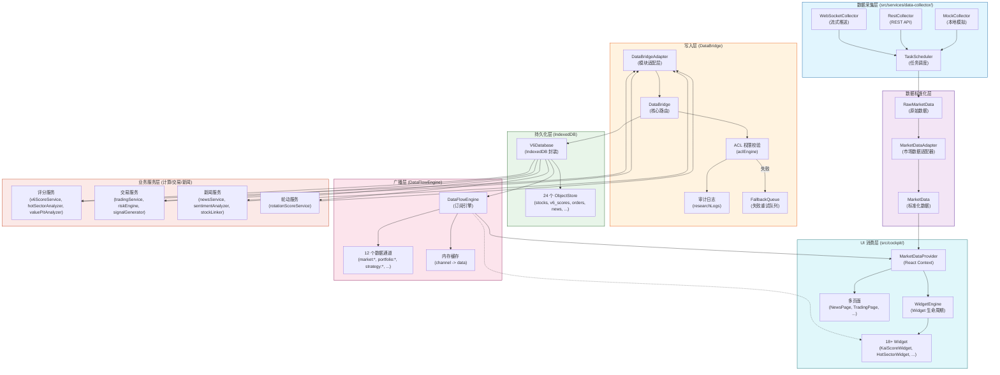
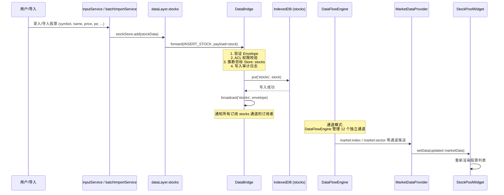
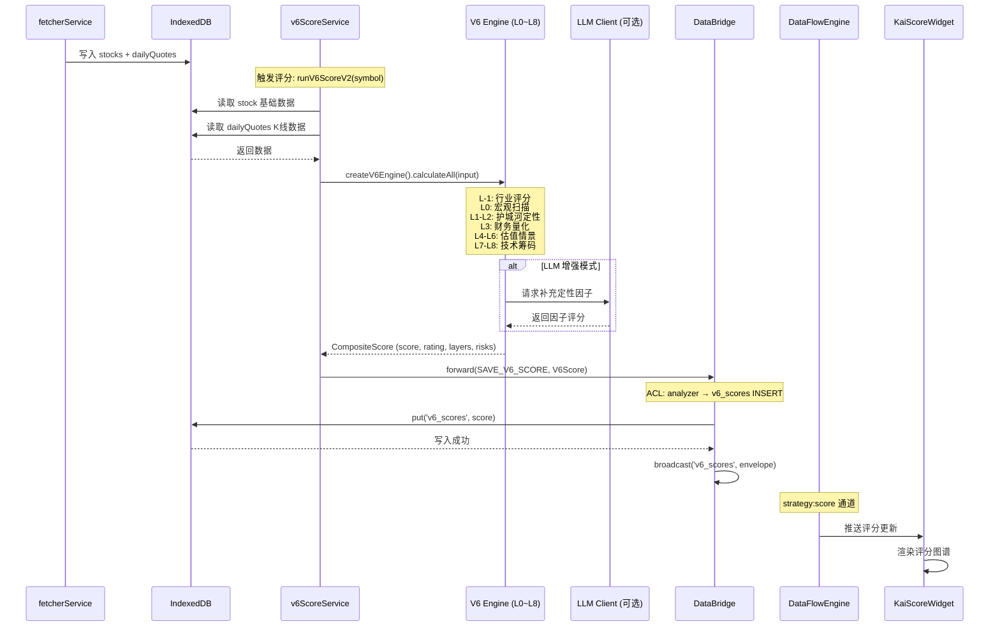
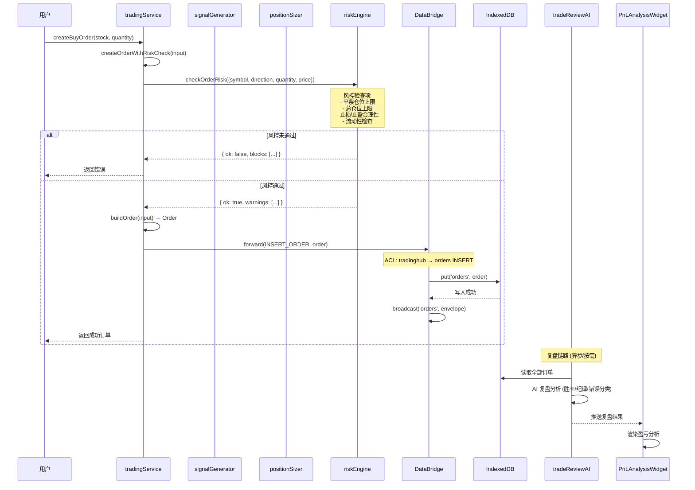
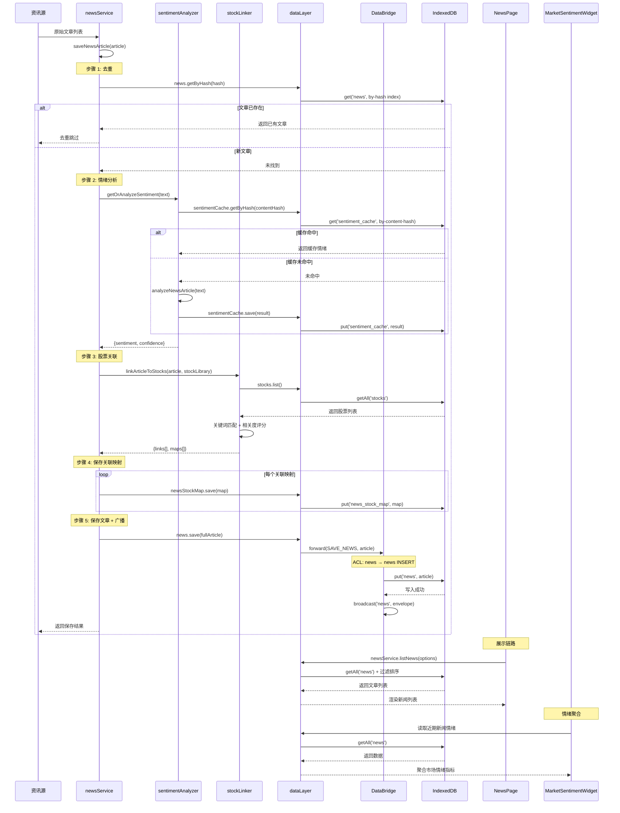
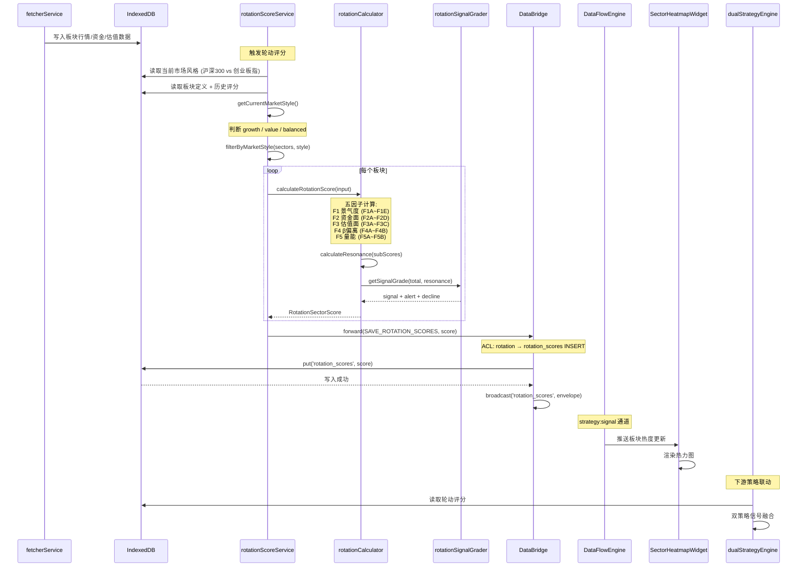
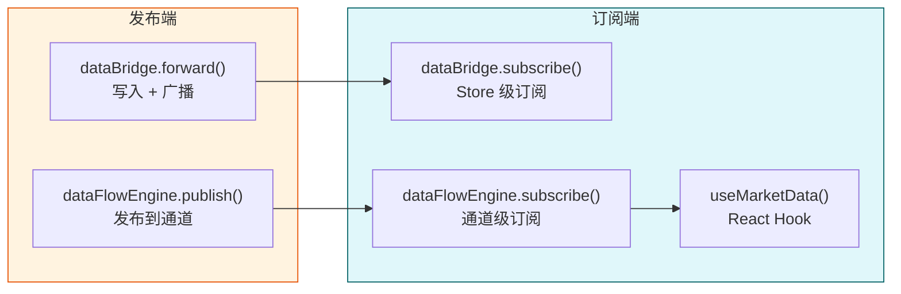

# V9 数据血缘追踪与数据流全景图

> **文档版本**: v1.2
> **更新日期**: 2026-07-02
> **创建日期**: 2026-06-28
> **适用范围**: V9 智能投研复盘系统全栈数据链路
> **数据模型版本**: DB_VERSION = 16（与 `src/config/dbConfig.ts` 导出值一致）

---

## 目录

1. [数据流全景图](#1-数据流全景图)
2. [数据血缘表](#2-数据血缘表)
3. [关键数据链路](#3-关键数据链路)
4. [数据变更传播路径](#4-数据变更传播路径)
5. [附录](#5-附录)

---

## 1. 数据流全景图

### 1.1 整体架构总览

V9 系统采用纯前端架构，数据在浏览器内完成从采集、标准化、持久化到订阅消费的完整生命周期。核心数据流转路径如下：



### 1.2 数据流转分层详解

| 层级 | 核心模块 | 主要职责 | 关键文件 |
|------|---------|---------|---------|
| **数据采集层** | MockCollector / RestCollector / WebSocketCollector / TaskScheduler | 按配置定时采集原始市场数据，支持三种数据源模式 | `src/services/data-collector/` |
| **数据标准化层** | MarketDataAdapter | 将不同来源的 RawMarketData 统一映射为标准 MarketData 接口 | `src/services/data-collector/MarketDataAdapter.ts` |
| **写入层** | DataBridge / DataBridgeAdapter / ACL Engine | 统一写入入口，权限校验，审计日志，失败重试 | `src/core/databridge.ts`, `../../src/showcase/index.ts` |
| **持久化层** | V6Database (IndexedDB) | 24 个 ObjectStore 存储各类业务数据 | `src/data/db.ts` |
| **广播层** | DataFlowEngine | 基于通道的发布订阅模式，内存缓存，SSE/轮询双模式 | `src/core/dataflow/dataflowEngine.ts` |
| **业务服务层** | v6ScoreService / tradingService / newsService / rotationScoreService | 各类业务计算、风控、情绪分析等 | `src/services/scoring/`, `src/services/trading/`, `src/services/news/` |
| **UI 消费层** | MarketDataProvider / WidgetEngine / 各 Widget | React Context 注入数据，Widget 订阅渲染 | `src/cockpit/` |

---

## 2. 数据血缘表

按数据实体分组，追踪每条数据从来源到最终消费的完整路径。

### 2.1 股票基础数据 (Stock)

| 维度 | 详情 |
|------|------|
| **数据实体** | `Stock` (symbol, name, price, pe, pb, roe, marketCap, sector, researchStatus, group, ...) |
| **来源** | 手动录入 / 批量导入 / Fetcher 数据采集 |
| **采集器** | `inputService` (手动), `batchImportService` (批量), `fetcherService` (API) |
| **处理节点** | `dataLayer.stocks.add()` → `sendWriteEnvelope('insertStock')` → `dataBridge.forward()` → ACL 校验 → `db.put('stocks')` |
| **Store** | `stocks` (keyPath: `symbol`, 索引: `by-status`, `by-group`) |
| **消费方** | `v6ScoreService` (评分输入), `tradingService` (交易标的), `newsService` (股票关联), `hotSectorAnalyzer`, `valuePitAnalyzer`, `StockPoolWidget`, `WatchlistWidget` |

### 2.2 K线行情数据 (DailyQuotes)

| 维度 | 详情 |
|------|------|
| **数据实体** | `DailyQuotes` (symbol, latest, history[]) |
| **来源** | Fetcher 行情接口 / 模拟数据 |
| **采集器** | `fetcherService`, `MockCollector` |
| **处理节点** | `fetcherService` → `dataBridge.forward(SAVE_DAILY_QUOTES)` → ACL 校验 → `db.put('daily_quotes')` |
| **Store** | `dailyQuotes` (keyPath: `symbol`) |
| **消费方** | `v6ScoreService` (动量/波动/流动性因子), `hotSectorAnalyzer` (技术突破维度), `valuePitAnalyzer` (轮动位置维度), `rotationScoreService` (市场风格判断) |

### 2.3 V6 评分数据 (V6Score)

| 维度 | 详情 |
|------|------|
| **数据实体** | `V6Score` (symbol, score, factors, algorithmVersion, calculatedAt, dataVersion, qualityWarning?) |
| **来源** | 规则引擎计算 + LLM 增强（可选） |
| **计算引擎** | `v6ScoreService.runV6Score()` / `runV6ScoreV2()` (L-1~L8 漏斗模型) |
| **处理节点** | 读取 `stocks` + `dailyQuotes` → 规则引擎计算 9 因子 → LLM 补充缺失因子 → 合成总分 → `dataBridge.forward(SAVE_V6_SCORE)` → `db.put('v6_scores')` |
| **Store** | `v6Scores` (keyPath: `symbol`) |
| **消费方** | `hotSectorAnalyzer` (输入前置过滤), `valuePitAnalyzer` (输入前置过滤), `KaiScoreWidget`, `StockPoolWidget`, `tradingService` (信号生成) |

### 2.4 热门板块评分 (HotSectorScore)

| 维度 | 详情 |
|------|------|
| **数据实体** | `HotSectorScore` (symbol, name, score, dimensions{momentum,sentiment,technical,valuation,marketEnv}, action, calculatedAt) |
| **来源** | 双策略体系 - 热门板块策略五维评分 |
| **计算引擎** | `hotSectorAnalyzer.analyzeHotSectors()` |
| **处理节点** | 读取 `stocks` + `dailyQuotes` + `v6Scores` → 五维评分（动量/情绪/技术/估值/大盘）→ 合成 action → `dataLayer.hotSectorScores.save()` → `db.put('hot_sector_scores')` |
| **Store** | `hotSectorScores` (keyPath: `symbol`, 索引: `by-calculated-at`) |
| **消费方** | `HotSectorWidget`, `tradingService` (信号生成), `dualStrategyEngine` |

### 2.5 价值洼地评分 (ValuePitScore)

| 维度 | 详情 |
|------|------|
| **数据实体** | `ValuePitScore` (symbol, name, score, dimensions{catalyst,valuation,chip,rotation,liquidity}, rotationSignal, action, calculatedAt) |
| **来源** | 双策略体系 - 价值洼地策略五维评分 |
| **计算引擎** | `valuePitAnalyzer.analyzeValuePits()` |
| **处理节点** | 读取 `stocks` + `dailyQuotes` + `v6Scores` → 五维评分（催化/估值/筹码/轮动/流动性）→ 合成 action → `dataLayer.valuePitScores.save()` → `db.put('value_pit_scores')` |
| **Store** | `valuePitScores` (keyPath: `symbol`, 索引: `by-calculated-at`) |
| **消费方** | `ValuePitWidget`, `tradingService` (信号生成), `dualStrategyEngine` |

### 2.6 交易订单 (Order)

| 维度 | 详情 |
|------|------|
| **数据实体** | `Order` (id, symbol, direction, quantity, price, amount, status, accountType, createdAt, planStopLoss?, planTakeProfit?, ...) |
| **来源** | 用户下单 / 策略自动下单 |
| **服务** | `tradingService.createBuyOrder()` / `createSellOrder()` |
| **处理节点** | 信号生成 → 仓位计算 → 风控校验 (`riskEngine.checkOrderRisk`) → 构建订单 → `dataBridge.forward(INSERT_ORDER)` → ACL 校验 → `db.put('orders')` |
| **Store** | `orders` (keyPath: `id`) |
| **消费方** | `tradingService` (持仓计算), `tradeReviewAI` (AI复盘), `PnLAnalysisWidget`, `PortfolioOverviewWidget`, `AITradeReviewWidget` |

### 2.7 交易信号 (Signal)

| 维度 | 详情 |
|------|------|
| **数据实体** | `Signal` (id, symbol, direction, confidence, reason, source, createdAt) |
| **来源** | 信号生成器 / 策略引擎 |
| **服务** | `signalGenerator.generateSignalsForSymbol()`, `tradingService.scanWatchingSignals()` |
| **处理节点** | 读取 `stocks` + `v6Scores` + 技术指标 → 生成多维度信号 → 选取最强信号 → `dataBridge.forward(INSERT_SIGNAL)` → ACL 校验 → `db.put('signals')` |
| **Store** | `signals` (keyPath: `id`) |
| **消费方** | `SignalMonitorWidget`, `tradingService` (交易建议), `positionSizer` (仓位计算) |

### 2.8 资讯文章 (NewsArticle)

| 维度 | 详情 |
|------|------|
| **数据实体** | `NewsArticle` (id, title, content, url, source, category, publishTime, fetchTime, sentiment, sentimentConfidence, relatedStocks[], keywords, hash) |
| **来源** | 资讯 API / 手动导入 / 模拟数据 |
| **服务** | `newsService.saveNewsArticle()` / `saveNewsArticles()` |
| **处理节点** | 原始文章 → 哈希去重 → 情绪分析 (`sentimentAnalyzer`) → 股票关联 (`stockLinker`) → 保存关联映射 → `dataLayer.news.save()` → `dataBridge.forward(SAVE_NEWS)` → `db.put('news')` |
| **Store** | `news` (keyPath: `id`, 索引: `by-source`, `by-category`, `by-publish-time`, `by-hash`) |
| **消费方** | `NewsPage`, `MarketSentimentWidget` (情绪聚合), `newsService.getNewsBySymbol()`, `StockChatWidget` |

### 2.9 情绪分析缓存 (SentimentCache)

| 维度 | 详情 |
|------|------|
| **数据实体** | `SentimentCache` (id, contentHash, sentiment, confidence, analyzedAt, model?) |
| **来源** | 情绪分析器计算结果 |
| **计算引擎** | `sentimentAnalyzer.analyzeNewsArticle()` / `getOrAnalyzeSentiment()` |
| **处理节点** | 文本输入 → 查找缓存 (by-content-hash) → 命中则直接返回 → 未命中则分析 → 写入缓存 → 返回结果 |
| **Store** | `sentimentCache` (keyPath: `id`, 索引: `by-content-hash`, `by-analyzed-at`) |
| **消费方** | `newsService` (文章情绪标注), 其他需要情绪分析的模块 |

### 2.10 股票-资讯关联 (NewsStockMap)

| 维度 | 详情 |
|------|------|
| **数据实体** | `NewsStockMap` (id, newsId, symbol, relevanceScore, matchType) |
| **来源** | 股票关联器自动匹配 |
| **计算引擎** | `stockLinker.linkArticleToStocks()` |
| **处理节点** | 文章标题+内容 → 关键词匹配股票库 → 生成关联映射 → `dataLayer.newsStockMap.save()` → `db.put('news_stock_map')` |
| **Store** | `newsStockMap` (keyPath: `id`, 索引: `by-symbol`, `by-news`) |
| **消费方** | `newsService.getNewsBySymbol()`, `NewsPage` (按股票筛选) |

### 2.11 板块轮动评分 (RotationSectorScore)

| 维度 | 详情 |
|------|------|
| **数据实体** | `RotationSectorScore` (id, sectorCode, sectorName, scoreDate, subScores, f1~f5, total, resonance, signal, alert, decline, poolStocks?, analysisReport?, modelUsed?) |
| **来源** | 板块轮动量化引擎（五因子模型） |
| **计算引擎** | `rotationScoreService.saveRotationScore()`, `rotationCalculator` |
| **处理节点** | 子分数输入 → 验证 → 五因子合成 → 共振度计算 → 信号分级 → `dataBridge.forward(SAVE_ROTATION_SCORES)` → `db.put('rotation_scores')` |
| **Store** | `rotationScores` (keyPath: `id`, 索引: `by-sector-date`(唯一), `by-sector`, `by-total`, `by-resonance`) |
| **消费方** | `rotationScoreService.getRotationScores()`, 策略引擎, `SectorHeatmapWidget` |

### 2.12 板块评分 (SectorScoreRecord)

| 维度 | 详情 |
|------|------|
| **数据实体** | `SectorScoreRecord` (id, sectorCode, sectorName, composite, dimensions[], isCore, keyStocks[], recommendation, ...) |
| **来源** | 行业分析 / SKILL 评分 |
| **服务** | `sectorScoreService` |
| **处理节点** | 行业数据 → 多维度评分 → 合成综合分 → `dataBridge.forward(SAVE_SECTOR_SCORES)` → `db.put('sector_scores')` |
| **Store** | `sectorScores` (keyPath: `id`, 索引: `by-sector`, `by-composite`, `by-is-core`) |
| **消费方** | `SectorHeatmapWidget`, 选股策略, `rotationScoreService` (兜底数据) |

### 2.13 智能评分 (IntelligentScore)

| 维度 | 详情 |
|------|------|
| **数据实体** | `IntelligentScore` (id?, symbol, overallScore, dimensionScores[], summary, basis, missingFields, sourceSnapshot, configSnapshot, modelResponse, scoredAt) |
| **来源** | LLM 驱动的智能评分（SKILL） |
| **服务** | `intelligentScoreService` |
| **处理节点** | 读取股票数据 + 本地文档 → LLM 评分 → `dataBridge.forward(SAVE_INTELLIGENT_SCORES)` → `db.put('intelligent_scores')` |
| **Store** | `intelligentScores` (keyPath: `id` autoIncrement, 索引: `by-symbol`) |
| **消费方** | 个股分析页, `KaiScoreWidget` (数据来源之一) |

### 2.14 行业评分 (IndustryScore)

| 维度 | 详情 |
|------|------|
| **数据实体** | `IndustryScore` (id?, code, name, overallScore, dimensionScores[], summary, basis, sectorSnapshot, configSnapshot, modelResponse, scoredAt) |
| **来源** | LLM 驱动的行业评分（SKILL） |
| **服务** | `industryScoreService` |
| **处理节点** | 行业数据 → LLM 评分 → `dataBridge.forward(SAVE_INDUSTRY_SCORES)` → `db.put('industry_scores')` |
| **Store** | `industryScores` (keyPath: `id` autoIncrement, 索引: `by-code`) |
| **消费方** | 行业分析页, 板块轮动参考 |

### 2.15 评分文档 (ScoreDocVersion)

| 维度 | 详情 |
|------|------|
| **数据实体** | `ScoreDocVersion` (docId, symbol, version, composite, dimensions[], content, createdAt) |
| **来源** | 评分文档生成器 |
| **服务** | `scoreDocService` |
| **处理节点** | 评分结果 → 生成文档 → 版本化存储 → `dataBridge.forward(SAVE_SCORE_DOCS)` → `db.put('score_docs')` |
| **Store** | `scoreDocs` (keyPath: `docId`, 索引: `by-symbol`, `by-symbol-version`(唯一), `by-composite`) |
| **消费方** | 个股深度分析页, 文档对比功能 |

### 2.16 策略快照 (StrategySnapshot)

| 维度 | 详情 |
|------|------|
| **数据实体** | `StrategySnapshot` (id, version, date, timestamp, holdings, scores, signals, performance) |
| **来源** | 策略运行时快照 |
| **服务** | `strategySnapshotService` |
| **处理节点** | 策略运行 → 定时/触发式快照 → `dataBridge.forward(SAVE_STRATEGY_SNAPSHOTS)` → `db.put('strategy_snapshots')` |
| **Store** | `strategySnapshots` (keyPath: `id`, 索引: `by-version`(唯一), `by-date`, `by-timestamp`) |
| **消费方** | 策略回测, 复盘分析, `dualStrategyEngine` |

### 2.17 本地知识库 (LocalDoc)

| 维度 | 详情 |
|------|------|
| **数据实体** | `LocalDoc` (id, symbol, title, content, category, source, addedAt) |
| **来源** | 用户上传 / 导入的研究资料 |
| **服务** | `localDocService` |
| **处理节点** | 文档上传 → 解析 → 分类 → `dataBridge.forward(SAVE_LOCAL_DOCS)` → `db.put('local_docs')` |
| **Store** | `localDocs` (keyPath: `id`, 索引: `by-symbol`, `by-category`, `by-added-at`) |
| **消费方** | `intelligentScoreService` (评分输入), 研究笔记功能 |

### 2.18 自选股 (Watchlist)

| 维度 | 详情 |
|------|------|
| **数据实体** | `Watchlist` (id, name, items[], createdAt, updatedAt) |
| **来源** | 用户创建 |
| **服务** | `stockpoolService` |
| **处理节点** | 用户操作 → `dataBridge.forward()` → ACL 校验 → `db.put('watchlists')` |
| **Store** | `watchlists` (keyPath: `id`) |
| **消费方** | `WatchlistWidget`, `tradingService` (观察池扫描) |

### 2.19 研究日志 (ResearchLog)

| 维度 | 详情 |
|------|------|
| **数据实体** | `ResearchLog` (id, action, module, symbol?, detail, timestamp) |
| **来源** | DataBridge 审计自动生成 |
| **服务** | DataBridge 内部 `writeAuditLog()` |
| **处理节点** | DataBridge.forward() → ACL 通过 → 异步写入审计日志 → `db.put('research_logs')` |
| **Store** | `researchLogs` (keyPath: `id` autoIncrement) |
| **消费方** | 审计追溯, 操作历史, 系统健康监控 |

### 2.20 资讯收藏 (NewsBookmark)

| 维度 | 详情 |
|------|------|
| **数据实体** | `NewsBookmark` (id, newsId, bookmarkedAt, note?) |
| **来源** | 用户收藏操作 |
| **服务** | `newsService` |
| **处理节点** | 用户点击收藏 → `dataBridge.forward(NEWS_ARTICLE_BOOKMARKED)` → `db.put('news_bookmarks')` |
| **Store** | `newsBookmarks` (keyPath: `id`, 索引: `by-bookmarked-at`) |
| **消费方** | `NewsPage` (收藏夹视图) |

---

## 3. 关键数据链路

### 3.1 股票基础数据链路（行情 → 存储 → UI展示）



**链路要点：**

1. **入口**: `inputService.addStock()` / `batchImportService.importStocks()`
2. **写入**: `dataLayer.stocks.add()` → `sendWriteEnvelope('insertStock')` → `dataBridge.forward()`
3. **校验**: Envelope 格式验证 → ACL 权限检查 (`stockpool` 模块 → `stocks` Store INSERT)
4. **存储**: `db.put('stocks', stock)` (keyPath: `symbol`)
5. **广播**: DataBridge 写入完成后 `broadcast(targetStore, envelope)`
6. **消费**: MarketDataProvider 订阅相关通道 → Widget 通过 `useMarketData()` 获取数据

### 3.2 评分数据链路（采集 → 计算 → 存储 → 订阅 → 展示）



**链路要点：**

1. **触发**: 用户主动触发 / 策略定时触发
2. **数据输入**: 从 `stocks` + `dailyQuotes` 读取基础数据
3. **计算引擎**: V6 v2.0 引擎（11 层漏斗模型），规则引擎为主，LLM 可选增强
4. **写入**: 通过 `dataBridge.forward(SAVE_V6_SCORE)` 持久化
5. **权限**: `analyzer` 模块对 `v6_scores` 有 INSERT/UPDATE 权限
6. **下游消费**: HotSectorAnalyzer / ValuePitAnalyzer 作为前置过滤输入，KaiScoreWidget 展示

### 3.3 交易订单链路（下单 → 风控 → 存储 → 复盘）



**链路要点：**

1. **入口**: `tradingService.createBuyOrder()` / `createSellOrder()`
2. **风控**: `riskEngine.checkOrderRisk()` 检查仓位、止损、流动性等
3. **构建**: `buildOrder()` 生成标准 Order 对象
4. **写入**: `dataBridge.forward(INSERT_ORDER)` → ACL 校验 → IndexedDB
5. **权限**: `tradinghub` 模块对 `orders` 有 INSERT/UPDATE/DELETE 权限
6. **下游**: 持仓计算、AI复盘、盈亏分析 Widget 均从 `orders` Store 读取

### 3.4 新闻情绪链路（采集 → 分析 → 存储 → 展示）



**链路要点：**

1. **去重**: 基于内容哈希 (`by-hash` 索引) 防止重复存储
2. **情绪分析**: `sentimentAnalyzer` 支持缓存，避免重复计算
3. **股票关联**: `stockLinker` 通过关键词匹配关联股票，生成 `news_stock_map` 映射
4. **写入顺序**: 先存关联映射 → 再存文章 → DataBridge 广播
5. **权限**: `news` 模块对 `news`/`newsStockMap`/`sentimentCache` 有完整读写权限
6. **下游消费**: NewsPage 列表展示、MarketSentimentWidget 情绪聚合、个股新闻查询

### 3.5 板块轮动链路（采集 → 策略 → 信号 → 展示）



**链路要点：**

1. **前置过滤**: 市场风格周期过滤器（growth/value/balanced），优先匹配当前风格板块
2. **计算引擎**: `rotationCalculator` 五因子合成 + 共振度计算 + 信号分级
3. **写入**: `saveRotationScoreViaDataBridge()` → `dataBridge.forward(SAVE_ROTATION_SCORES)`
4. **权限**: `rotation` 模块对 `rotationScores` 有完整 CRUD 权限
5. **索引**: `by-sector-date` 唯一索引确保同一板块同日只有一条记录
6. **下游**: 双策略引擎信号融合、SectorHeatmapWidget 热力图展示

---

## 4. 数据变更传播路径

### 4.1 写入触发 DataFlow 通知机制

V9 系统存在**两套并行**的数据变更通知机制：

#### 4.1.1 DataBridge 广播机制（Store 级）

```
写入流程:
  dataBridge.forward(envelope)
    → 验证 Envelope 格式
    → ACL 权限校验
    → routeToDB() 写入 IndexedDB
    → broadcast(targetStore, envelope)  ← 通知订阅者
```

- **触发时机**: 每次 `forward()` 成功写入后立即广播
- **广播频道**: 以 Store 名称为频道名（如 `stocks`, `v6_scores`, `orders`, `news`）
- **订阅方式**: `dataBridge.subscribe(channel, callback)`
- **适用场景**: 业务模块间的实时数据同步

#### 4.1.2 DataFlowEngine 发布订阅（通道级）

```
发布流程:
  dataFlowEngine.publish(channel, data)
    → 更新内存 cache（若 persist=true）
    → eventBus.emit('DATAFLOW_PACKET_PUBLISHED')
    → _distribute(packet)  ← 通知所有订阅者
    → 每个回调通过 queueMicrotask 异步执行
```

- **触发时机**: 主动调用 `publish()` 或 `registerRefresh()` 定时触发
- **广播频道**: 12 个业务通道（`market:index`, `portfolio:summary`, `strategy:score` 等）
- **订阅方式**: `dataFlowEngine.subscribe(channel, callback)`
- **适用场景**: Widget 层的实时数据刷新

### 4.2 订阅者接收更新流程



**接收细节：**

| 机制 | 订阅接口 | 首次订阅是否返回缓存 | 分发方式 | 性能监控 |
|------|---------|---------------------|---------|---------|
| DataBridge 广播 | `dataBridge.subscribe(channel, cb)` | 否 | 同步回调 | 无 |
| DataFlowEngine | `dataFlowEngine.subscribe(channel, cb)` | **是**（如有缓存，通过 queueMicrotask 异步投递） | queueMicrotask 异步分发 | 慢订阅警告 (>16ms) |
| MarketDataProvider | `useMarketData()` Hook | 是（Context 初始值） | React setState 重渲染 | loading/error 状态 |

### 4.3 缓存失效机制

#### 4.3.1 DataFlowEngine 内存缓存

```typescript
// 缓存结构
private cache = new Map<string, { data: unknown; timestamp: number; seq: number }>()

// 缓存策略
- 存储键: channel 名称
- 存储值: { data, timestamp, seq }
- 有效期: 永久（直到新的 publish 覆盖）
- 持久化控制: 由 ChannelMeta.persist 决定
  - persist = true: 发布时更新缓存，新订阅者立即收到缓存数据
  - persist = false: 不缓存，仅实时推送（如 agent:logs）
```

#### 4.3.2 IndexedDB 持久化缓存

| Store | 缓存策略 | 失效触发 |
|-------|---------|---------|
| `stocks` | 全量持久化 | 用户更新/删除时直接覆盖 |
| `dailyQuotes` | 全量持久化 | Fetcher 新数据写入时覆盖 |
| `v6Scores` | 全量持久化 | 重新评分时按 symbol 覆盖 |
| `hotSectorScores` | 全量持久化 | 重新计算时按 symbol 覆盖 |
| `valuePitScores` | 全量持久化 | 重新计算时按 symbol 覆盖 |
| `rotationScores` | 按板块+日期存储 | 同板块同日覆盖（by-sector-date 唯一索引） |
| `sentimentCache` | 按内容哈希缓存 | 缓存永久有效，哈希相同直接复用 |
| `news` | 按哈希去重 | 相同哈希文章跳过写入 |

#### 4.3.3 缓存失效场景

1. **写入即失效**: DataBridge 写入成功后广播，订阅者收到通知后应重新读取
2. **定时刷新**: DataFlowEngine `registerRefresh()` 按 interval 定时拉取新数据
3. **手动刷新**: Widget 重试按钮 → `refreshWidget(instanceId)` → 重新执行采集任务
4. **组件卸载**: Widget 卸载时，WidgetEngine 调用 `unmountInstance()` → TaskScheduler 停止对应采集任务 → 清理定时器

---

## 5. 附录

### 5.1 数据实体与模块的映射矩阵

表中标识各模块对各数据实体的操作权限（R=读, W=写）。

| 数据实体 (Store) | fetcher | stockpool | analyzer | rotation | sector | news | tradinghub | trading | strategy | system | user |
|-----------------|:-------:|:---------:|:--------:|:--------:|:------:|:----:|:----------:|:-------:|:--------:|:------:|:----:|
| **stocks** | RW | RW | R | R | R | R | R | R | R | RW | RW |
| **dailyQuotes** | RW | - | R | R | - | - | - | - | R | RW | - |
| **v6Scores** | - | R | RW | - | - | - | R | - | R | RW | R |
| **intelligentScores** | - | - | RW | - | - | - | - | - | - | RW | - |
| **industryScores** | - | - | RW | - | - | - | - | - | - | RW | - |
| **rotationScores** | - | - | - | RW | - | - | - | - | R | RW | - |
| **sectorScores** | - | - | - | - | RW | - | - | - | - | RW | - |
| **hotSectorScores** | - | - | RW | - | - | - | RW | - | RW | RW | - |
| **valuePitScores** | - | - | RW | - | - | - | RW | - | RW | RW | - |
| **scoreDocs** | - | - | RW | - | - | - | - | - | - | RW | - |
| **strategySnapshots** | - | - | - | - | - | - | RW | R | - | RW | - |
| **orders** | - | - | - | - | - | - | RW | RW | - | RW | RW |
| **signals** | - | - | - | - | - | - | RW | RW | - | RW | - |
| **watchlists** | - | RW | - | - | - | - | - | - | - | RW | - |
| **news** | - | - | - | - | - | RW | - | - | - | RW | - |
| **newsStockMap** | - | - | - | - | - | RW | - | - | - | RW | - |
| **sentimentCache** | - | - | - | - | - | RW | - | - | - | RW | - |
| **newsBookmarks** | - | - | - | - | - | RW | - | - | - | RW | - |
| **localDocs** | - | - | R | - | - | - | - | - | - | RW | - |
| **researchLogs** | - | - | - | - | - | - | - | - | - | RW | - |

### 5.2 读写权限表（ACL Matrix）

基于 `src/config/dbConfig.ts` 中的 `ACL_MATRIX`：

| 模块 ID | 可读 Store | 可写 Store | 允许操作 |
|---------|-----------|-----------|---------|
| **fetcher** | - | stocks, dailyQuotes | INSERT, UPDATE |
| **stockpool** | stocks, v6Scores | stocks | INSERT, UPDATE, DELETE |
| **analyzer** | stocks, v6Scores, intelligentScores, industryScores, scoreDocs, hotSectorScores, valuePitScores | v6Scores, intelligentScores, industryScores, scoreDocs, hotSectorScores, valuePitScores | SELECT, INSERT, UPDATE |
| **rotation** | stocks, rotationScores, dailyQuotes | rotationScores | SELECT, INSERT, UPDATE, DELETE |
| **sector** | stocks, sectorScores | sectorScores | SELECT, INSERT, UPDATE, DELETE |
| **news** | stocks, news, newsStockMap, sentimentCache, newsBookmarks | news, newsStockMap, sentimentCache, newsBookmarks | SELECT, INSERT, UPDATE, DELETE |
| **tradinghub** | stocks, v6Scores, orders, signals, strategySnapshots, hotSectorScores, valuePitScores | orders, signals, strategySnapshots, hotSectorScores, valuePitScores | INSERT, UPDATE, DELETE |
| **trading** | stocks, orders, signals, strategySnapshots | orders, signals | SELECT, INSERT, UPDATE |
| **strategy** | stocks, v6Scores, dailyQuotes, hotSectorScores, valuePitScores, rotationScores, signals | hotSectorScores, valuePitScores | SELECT, INSERT, UPDATE |
| **system** | 全部 (24个) | 全部 (24个) | 全部 |
| **user** | stocks, v6Scores, orders | stocks, orders | INSERT, UPDATE, DELETE |

### 5.3 DataFlow 通道清单

| 通道名 | 描述 | 刷新间隔 | 持久化 | 优先级 |
|--------|------|---------|--------|--------|
| `market:index` | 大盘指数实时数据 | 5000ms | 是 | high |
| `market:sector` | 板块涨跌排行 | 10000ms | 是 | high |
| `market:fundflow` | 资金流向统计 | 15000ms | 是 | normal |
| `market:emotion` | 市场情绪指标 | 30000ms | 否 | low |
| `portfolio:summary` | 持仓总览（事件驱动） | 0 | 是 | high |
| `portfolio:holding` | 持仓明细 | 30000ms | 是 | normal |
| `portfolio:risk` | 持仓风险监控 | 60000ms | 是 | high |
| `strategy:signal` | 买卖信号（事件驱动） | 0 | 否 | high |
| `strategy:score` | 股票评分 | 60000ms | 是 | normal |
| `agent:status` | Agent状态 | 10000ms | 否 | normal |
| `agent:logs` | Agent日志（事件驱动） | 0 | 否 | low |
| `system:health` | 系统健康 | 30000ms | 否 | low |

> 注：`refreshInterval = 0` 表示事件驱动模式，不启动轮询定时器。

### 5.4 关键文件索引

| 模块 | 核心文件路径 |
|------|-------------|
| DataBridge 核心 | `src/core/databridge.ts` |
| DataBridge 适配层 | `../../src/showcase/index.ts` |
| DataFlowEngine | `src/core/dataflow/dataflowEngine.ts` |
| DataFlow 类型 | `src/core/dataflow/dataflowTypes.ts` |
| IndexedDB 封装 | `src/data/db.ts` |
| 数据访问层 | `src/data/dataLayer.ts` |
| 数据类型定义 | `src/data/types.ts` |
| DB 配置与 ACL | `src/config/dbConfig.ts` |
| 任务调度器 | `src/services/data-collector/TaskScheduler.ts` |
| 市场数据适配器 | `src/services/data-collector/MarketDataAdapter.ts` |
| 采集器基类 | `src/services/data-collector/collectors/BaseCollector.ts` |
| V6 评分服务 | `src/services/scoring/v6ScoreService.ts` |
| 热门板块分析 | `src/services/scoring/hotSectorAnalyzer.ts` |
| 价值洼地分析 | `src/services/scoring/valuePitAnalyzer.ts` |
| 板块轮动服务 | `src/services/analysis/rotationScoreService.ts` |
| 交易服务 | `src/services/trading/tradingService.ts` |
| 风控引擎 | `src/services/trading/riskEngine.ts` |
| 信号生成器 | `src/services/trading/signalGenerator.ts` |
| 新闻服务 | `src/services/news/newsService.ts` |
| 情绪分析器 | `src/services/news/sentimentAnalyzer.ts` |
| 股票关联器 | `src/services/news/stockLinker.ts` |
| 市场数据 Provider | `src/cockpit/providers/MarketDataProvider.tsx` |
| Widget 引擎 | `src/cockpit/core/widgetEngine.ts` |
| Cockpit 外壳 | `src/cockpit/CockpitShell.tsx` |

---

> **文档结束** — 本文档基于 V9 DB_VERSION 16 架构生成，数据链路追踪覆盖 24 个 IndexedDB Store（v15 新增 execution_logs / missing_reports；v16 新增 executionPlans / portfolios）和 12 个 DataFlow 通道。
