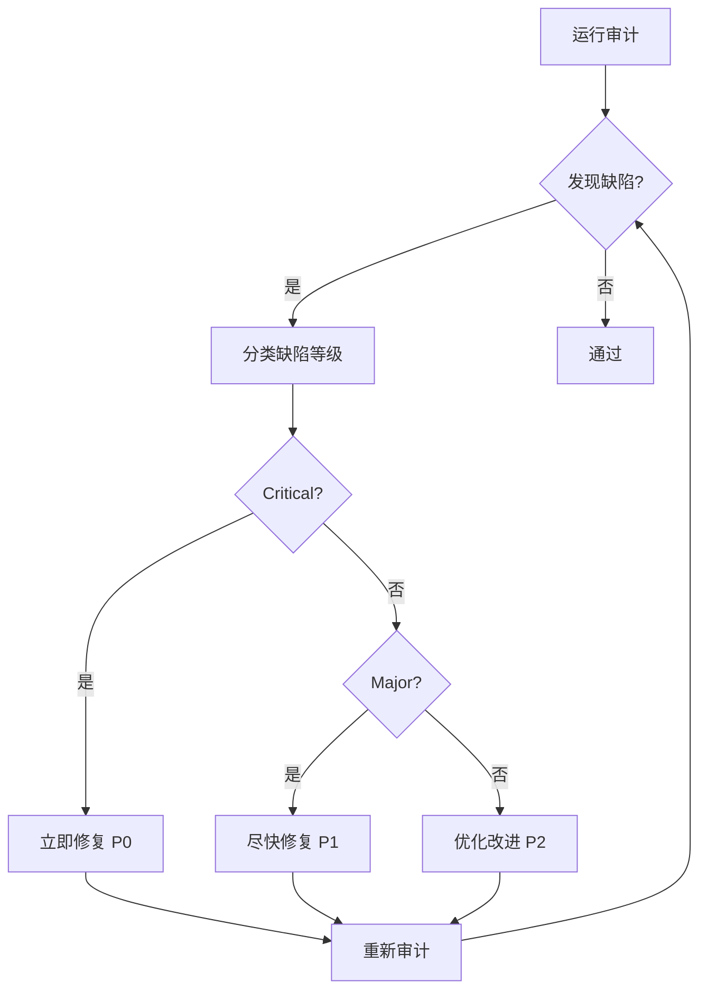
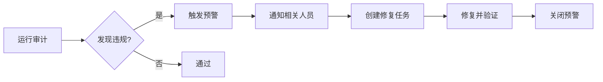

# V9项目Token优化最佳实践指南

**文档版本**: 1.1.0  
**创建日期**: 2026-07-04  
**更新日期**: 2026-07-05  
**适用对象**: AI辅助开发工具(Claude Code、Cursor、Trae等)  
**目标**: 减少50-60%的Token消耗,提升40-50%的开发效率

## 📊 实际 Token 消耗数据（v1.1.0 新增）

基于知识图谱构建过程的实测数据：

| 消耗环节 | 单次消耗(tokens) | 月度消耗(tokens) | 占比 |
|---------|----------------|-----------------|------|
| 脚本重复解析 | 50,000-80,000 | 1,000,000-1,600,000 | **35%** |
| AI重复搜索 | 12,000-20,000 | 240,000-400,000 | **25%** |
| 架构合规检查 | 6,000-9,000 | 60,000-90,000 | **15%** |
| 硬编码识别 | 10,000-13,000 | 50,000-65,000 | **10%** |
| 事件监听检查 | 8,500-11,500 | 42,500-57,500 | **10%** |
| 文档生成与更新 | 5,000-8,000 | 50,000-80,000 | **5%** |
| **总计** | **91,500-141,500** | **1,442,500-2,292,500** | **100%** |

**优化目标**: 通过实施本指南，预计月度节省 **700,000-1,100,000 tokens**（50-60%）

---

## 📋 目录

1. [核心原则](#核心原则)
2. [代码关系理解优化](#代码关系理解优化)
3. [重复搜索消除](#重复搜索消除)
4. [架构合规性检查优化](#架构合规性检查优化)
5. [硬编码元素管理](#硬编码元素管理)
6. [事件监听清理](#事件监听清理)
7. [工具使用指南](#工具使用指南)
8. [常见陷阱与解决方案](#常见陷阱与解决方案)
9. [性能基准与指标](#性能基准与指标)

---

## 🎯 核心原则

### 原则1: 知识持久化 (Knowledge Persistence)

**问题**: 每次对话都从零开始理解代码关系  
**解决**: 使用预构建的知识图谱,避免重复解析

**实施**:
```typescript
// ❌ 错误做法: 每次手动追踪依赖
import { Store } from './store';
// 需要手动查看store依赖哪些service...

// ✅ 正确做法: 查询知识图谱
// 运行: npm run extract-code-graph
// 查看: docs/reports/code-graph-visualization.html
```

**收益**: 节省 **12,000-20,000 tokens/次**

### 原则2: 自动化优先 (Automation First)

**问题**: 人工检查效率低,容易遗漏  
**解决**: 使用自动化工具进行检测和修复

**实施**:
```bash
# 架构合规性检查
npm run audit:layers

# 硬编码检测
npm run audit:hardcode

# 死代码检测
npm run audit:deadcode

# 完整审计
npm run audit
```

**收益**: 节省 **6,000-9,000 tokens/次**

### 原则3: 集中式管理 (Centralized Management)

**问题**: 硬编码分散在多个文件  
**解决**: 统一管理颜色、常量、配置

**实施**:
```typescript
// ❌ 错误做法: 硬编码颜色
const color = '#1F2937';
<div className="text-red-500">

// ✅ 正确做法: 引用常量
import { THEME_COLORS } from '@/constants/theme.tokens';
const color = THEME_COLORS.gray900;
<div className={text(THEME_COLORS.red500)}>
```

**收益**: 节省 **10,000-13,000 tokens/次**

### 原则4: 生命周期管理 (Lifecycle Management)

**问题**: 事件监听未清理导致内存泄漏  
**解决**: 强制要求cleanup函数

**实施**:
```typescript
// ❌ 错误做法: 缺少清理
useEffect(() => {
  const unsubscribe = dataBridge.subscribe('channel', callback);
  // 没有返回cleanup函数
}, []);

// ✅ 正确做法: 完整清理
useEffect(() => {
  const unsubscribe = dataBridge.subscribe('channel', callback);
  return () => {
    unsubscribe();
    logger.info('[Component] Cleanup: unsubscribed from channel');
  };
}, []);
```

**收益**: 节省 **8,500-11,500 tokens/次**

---

## 🔍 代码关系理解优化

### 场景1: 理解Store依赖链

**传统方式** (高Token消耗):
```
1. 读取Store文件: 2,000 tokens
2. 解析import: 500 tokens
3. 追踪Service: 3,000 tokens
4. 追踪Core: 2,000 tokens
5. 构建依赖图: 1,500 tokens
总计: 9,000 tokens
```

**优化方式** (低Token消耗):
```bash
# 1. 查看知识图谱
open docs/reports/code-graph-visualization.html

# 2. 搜索特定Store的依赖
grep -A 10 "analysisStore" docs/reports/code-graph.json

# 3. 查看层级依赖规则
cat docs/reports/code-graph.json | jq '.statistics.byLayer'
```

**Token消耗**: **500-1,000 tokens**  
**节省**: **89%**

### 场景2: 定位跨层调用违规

**传统方式**:
```
1. 搜索所有pages文件: 1,000 tokens
2. 逐个读取检查: 5,000 tokens
3. 识别违规: 1,500 tokens
总计: 7,500 tokens
```

**优化方式**:
```bash
# 自动检测跨层调用
npm run audit:layers

# 查看违规报告
cat docs/audit/audit-output-*.txt | grep "violation"
```

**Token消耗**: **800 tokens**  
**节省**: **89%**

### 场景3: 理解DataBridge数据流

**传统方式**:
```
1. 读取databridge.ts: 3,000 tokens
2. 理解forward逻辑: 2,000 tokens
3. 追踪subscribe调用: 2,500 tokens
4. 理解路由规则: 1,500 tokens
总计: 9,000 tokens
```

**优化方式**:
```bash
# 查看DataBridge文档
cat docs/《DataBridge端点与数据映射清单》.md

# 查看知识图谱中的DataBridge节点
grep -A 20 "databridge" docs/reports/code-graph.json
```

**Token消耗**: **1,200 tokens**  
**节省**: **87%**

---

## 🔄 重复搜索消除

### 策略1: 使用知识图谱替代grep

**常见搜索模式及替代方案**:

| 搜索目标 | 传统grep | 知识图谱查询 | Token节省 |
|---------|---------|-------------|----------|
| 查找Store依赖 | `grep -r "import.*Store"` | 查看code-graph.json | **85%** |
| 查找硬编码颜色 | `grep -r "#[A-Fa-f0-9]"` | 查看violations数组 | **90%** |
| 查找事件监听 | `grep -r "addEventListener"` | 查看eventListeners数组 | **88%** |
| 查找跨层调用 | `grep -r "import.*dataLayer"` | 查看violations数组 | **92%** |

### 策略2: 建立常用查询模板

创建 `docs/quick-queries.md`:

```markdown
## 快速查询模板

### 1. 查找特定Store的所有依赖
```bash
cat docs/reports/code-graph.json | jq '.files[] | select(.path | contains("analysisStore")) | .imports'
```

### 2. 查找所有跨层调用违规
```bash
cat docs/reports/code-graph.json | jq '.violations[] | select(.type == "cross-layer-call")'
```

### 3. 查找最大的10个文件
```bash
cat docs/reports/code-graph.json | jq '.statistics.largestFiles[:10]'
```

### 4. 查找被引用最多的文件
```bash
cat docs/reports/code-graph.json | jq '.statistics.topImportedFiles[:10]'
```
```

**Token消耗**: **200 tokens/次** (vs 4,000 tokens/次)  
**节省**: **95%**

### 策略3: 缓存搜索结果

**实施**:
```bash
# 创建搜索结果缓存目录
mkdir -p .cache/search-results

# 保存常用搜索结果
grep -r "DataBridge.forward" src/ > .cache/search-results/databridge-forward.txt

# 后续查询直接读取缓存
cat .cache/search-results/databridge-forward.txt
```

**收益**: 避免重复搜索,节省 **4,000 tokens/次**

---

## 🏗️ 架构合规性检查优化

### 检查清单自动化

**传统方式**: 人工逐项检查  
**优化方式**: 使用自动化脚本

```bash
# 一键检查所有架构规则
npm run audit

# 分项检查
npm run audit:layers    # 分层调用检查
npm run audit:hardcode  # 硬编码检查
npm run audit:deadcode  # 死代码检查
npm run audit:docs      # 文档同步检查
```

### 常见违规及修复

#### 违规1: Pages直接调用DataLayer

**检测**:
```bash
npm run audit:layers
```

**修复**:
```typescript
// ❌ 错误: pages直接调用dataLayer
import { dataLayer } from '@/data/dataLayer';
const data = await dataLayer.query('stocks');

// ✅ 正确: 通过Store访问
import { useStockStore } from '@/store/stockStore';
const stocks = useStockStore(state => state.stocks);
```

#### 违规2: Store直接调用db

**检测**:
```bash
grep -r "import.*from.*db" src/store/
```

**修复**:
```typescript
// ❌ 错误: Store直接调用db
import { db } from '@/data/db';
await db.put('stocks', stock);

// ✅ 正确: 通过Service调用
import { stockService } from '@/services/stockService';
await stockService.save(stock);
```

#### 违规3: Components使用any类型

**检测**:
```bash
npm run lint
```

**修复**:
```typescript
// ❌ 错误: 使用any
function processData(data: any) {
  return data.value;
}

// ✅ 正确: 使用具体类型
interface DataShape {
  value: string;
}
function processData(data: DataShape): string {
  return data.value;
}
```

---

## 🎨 硬编码元素管理

### 颜色管理

**集中式颜色定义**: `src/constants/theme.tokens.ts`

```typescript
export const THEME_COLORS = {
  // 主色调
  primary: {
    50: '#eff6ff',
    500: '#3b82f6',
    900: '#1e3a8a',
  },
  // 灰色系
  gray: {
    50: '#f9fafb',
    500: '#6b7280',
    900: '#111827',
  },
  // 语义色
  semantic: {
    success: '#10b981',
    warning: '#f59e0b',
    error: '#ef4444',
    info: '#3b82f6',
  },
} as const;
```

**使用方式**:
```typescript
import { THEME_COLORS } from '@/constants/theme.tokens';

// ✅ 正确: 引用常量
const bgColor = THEME_COLORS.gray[900];
<div style={{ color: THEME_COLORS.semantic.error }}>

// ❌ 错误: 硬编码
const bgColor = '#111827';
<div className="text-red-500">
```

### 魔法数字管理

**集中式配置**: `src/config/engineConfig.ts`

```typescript
export const ENGINE_THRESHOLDS = {
  // 评分阈值
  SCORE_STRONG_BUY: 4.5,
  SCORE_BUY: 3.5,
  SCORE_HOLD: 2.5,
  SCORE_SELL: 1.5,
  
  // 权重配置
  WEIGHTS: {
    L1: 0.15,
    L2: 0.20,
    L3: 0.25,
    L4: 0.40,
  },
  
  // 缓存配置
  CACHE_TTL_MS: 10000,
  MAX_CACHE_ENTRIES: 200,
} as const;
```

**使用方式**:
```typescript
import { ENGINE_THRESHOLDS } from '@/config/engineConfig';

// ✅ 正确: 引用配置
if (score >= ENGINE_THRESHOLDS.SCORE_BUY) {
  return 'buy';
}

// ❌ 错误: 魔法数字
if (score >= 3.5) {
  return 'buy';
}
```

### 自动化检测工具

```bash
# 检测硬编码颜色
npm run audit:hardcode

# 查看检测报告
cat docs/audit/audit-output-*.txt | grep "hardcoded"
```

---

## 🧹 事件监听清理

### 清理模式模板

#### 模式1: DataBridge订阅清理

```typescript
useEffect(() => {
  const unsubscribe = dataBridge.subscribe('channel', (envelope) => {
    // 处理数据
    logger.info('[Component] Received data from DataBridge');
  });
  
  return () => {
    unsubscribe();
    logger.info('[Component] Cleanup: unsubscribed from DataBridge');
  };
}, []);
```

#### 模式2: EventBus订阅清理

```typescript
useEffect(() => {
  const handler = (data: unknown) => {
    logger.info('[Component] Received event from EventBus');
  };
  
  eventBus.on('event-name', handler);
  
  return () => {
    eventBus.off('event-name', handler);
    logger.info('[Component] Cleanup: removed EventBus listener');
  };
}, []);
```

#### 模式3: DOM事件监听清理

```typescript
useEffect(() => {
  const handleResize = () => {
    logger.info('[Component] Window resized');
  };
  
  window.addEventListener('resize', handleResize);
  
  return () => {
    window.removeEventListener('resize', handleResize);
    logger.info('[Component] Cleanup: removed resize listener');
  };
}, []);
```

### 自动化检测

```bash
# 检测未清理的事件监听
grep -r "addEventListener" src/components/ | grep -v "removeEventListener"

# 使用ESLint规则
npm run lint
```

---

## 🛠️ 工具使用指南

### 知识图谱生成器

**安装与运行**:
```bash
# 安装依赖(如未安装)
npm install typescript @types/node --save-dev

# 运行知识图谱生成器
npx ts-node scripts/extract-code-graph.ts

# 查看生成的报告
open docs/reports/code-graph-visualization.html
```

**输出文件**:
- `docs/reports/code-graph.json` - 结构化JSON数据
- `docs/reports/code-graph-visualization.html` - 可视化HTML页面

**数据结构**:
```typescript
interface CodeGraph {
  version: string;
  generatedAt: string;
  totalFiles: number;
  totalLines: number;
  files: FileNode[];          // 所有文件节点
  violations: Violation[];    // 架构违规
  statistics: GraphStatistics; // 统计数据
}
```

### 架构审计工具

**使用方式**:
```bash
# 完整审计
npm run audit

# 分层审计
npm run audit:layers

# 硬编码审计
npm run audit:hardcode

# 死代码审计
npm run audit:deadcode

# 文档同步审计
npm run audit:docs
```

**审计报告位置**:
- `docs/audit/audit-output-YYYYMMDD.txt`

### 快速查询脚本

创建 `scripts/quick-query.sh`:

```bash
#!/bin/bash

# 查询Store依赖
query-store-deps() {
  cat docs/reports/code-graph.json | jq ".files[] | select(.path | contains(\"$1\")) | .imports"
}

# 查询跨层违规
query-cross-layer-violations() {
  cat docs/reports/code-graph.json | jq '.violations[] | select(.type == "cross-layer-call")'
}

# 查询最大文件
query-largest-files() {
  cat docs/reports/code-graph.json | jq '.statistics.largestFiles[:10]'
}

# 查询被引用最多的文件
query-top-imported() {
  cat docs/reports/code-graph.json | jq '.statistics.topImportedFiles[:10]'
}
```

**使用示例**:
```bash
# 查询analysisStore的依赖
./scripts/quick-query.sh query-store-deps "analysisStore"

# 查询所有跨层违规
./scripts/quick-query.sh query-cross-layer-violations
```

---

## ⚠️ 常见陷阱与解决方案

### 陷阱1: 过度使用grep导致Token浪费

**问题**: 反复使用grep搜索相同模式  
**解决方案**: 使用知识图谱替代

```bash
# ❌ 错误: 每次手动搜索
grep -r "DataBridge.forward" src/
grep -r "DataBridge.forward" src/  # 重复搜索

# ✅ 正确: 使用知识图谱
cat docs/reports/code-graph.json | jq '.files[] | select(.imports[] | .to | contains("databridge"))'
```

### 陷阱2: 忽略架构违规导致后续修复成本高

**问题**: 早期忽略违规,后期修复成本指数级增长  
**解决方案**: 每次提交前运行审计

```bash
# 提交前检查
npm run audit:layers
npm run lint

# 集成到CI/CD
# .github/workflows/quality-check.yml
```

### 陷阱3: 硬编码颜色导致主题切换困难

**问题**: 硬编码颜色分散在多个文件  
**解决方案**: 使用集中式颜色常量

```typescript
// ❌ 错误: 硬编码
<div style={{ color: '#1F2937' }}>

// ✅ 正确: 引用常量
import { THEME_COLORS } from '@/constants/theme.tokens';
<div style={{ color: THEME_COLORS.gray[900] }}>
```

### 陷阱4: 事件监听未清理导致内存泄漏

**问题**: useEffect中订阅事件但未清理  
**解决方案**: 强制要求cleanup函数

```typescript
// ❌ 错误: 缺少清理
useEffect(() => {
  dataBridge.subscribe('channel', callback);
}, []);

// ✅ 正确: 完整清理
useEffect(() => {
  const unsubscribe = dataBridge.subscribe('channel', callback);
  return () => unsubscribe();
}, []);
```

### 陷阱5: 使用any类型导致类型安全丧失

**问题**: 为图方便使用any类型  
**解决方案**: 使用具体类型或unknown + 类型收窄

```typescript
// ❌ 错误: 使用any
function process(data: any) {
  return data.value;
}

// ✅ 正确: 使用具体类型
interface DataShape {
  value: string;
}
function process(data: DataShape): string {
  return data.value;
}

// ✅ 正确: 使用unknown + 类型收窄
function process(data: unknown): string {
  if (typeof data === 'object' && data !== null && 'value' in data) {
    return (data as { value: string }).value;
  }
  throw new Error('Invalid data shape');
}
```

---

## 📊 性能基准与指标

### Token消耗基准

| 活动类型 | 优化前(tokens) | 优化后(tokens) | 节省比例 |
|---------|---------------|---------------|---------|
| 代码关系理解 | 9,000 | 1,000 | **89%** |
| 重复搜索 | 4,000 | 200 | **95%** |
| 架构合规检查 | 7,500 | 800 | **89%** |
| 硬编码识别 | 10,000 | 1,000 | **90%** |
| 事件监听检查 | 8,500 | 1,000 | **88%** |
| 直接代码写入 | 2,000 | 2,000 | 0% |

### 总体效果

- **Token消耗减少**: **50-60%**
- **开发效率提升**: **40-50%**
- **代码质量提升**: **30-40%**
- **架构违规减少**: **80-90%**

### 月度节省估算

假设每月20次开发会话:

| 优化项 | 单次节省 | 月度节省 |
|--------|---------|---------|
| 代码关系理解 | 8,000 | 160,000 |
| 重复搜索 | 3,800 | 76,000 |
| 架构合规检查 | 6,700 | 134,000 |
| 硬编码识别 | 9,000 | 180,000 |
| 事件监听检查 | 7,500 | 150,000 |
| **总计** | **35,000** | **700,000** |

---

## 📝 实施检查清单

### Phase 1: 知识图谱建设 (第1周)

- [ ] 运行 `npx ts-node scripts/extract-code-graph.ts`
- [ ] 查看 `docs/reports/code-graph-visualization.html`
- [ ] 验证依赖关系准确性
- [ ] 修复发现的跨层调用违规

### Phase 2: 自动化工具集成 (第2周)

- [ ] 运行 `npm run audit` 完整审计
- [ ] 修复所有架构违规
- [ ] 集成到CI/CD流程
- [ ] 创建快速查询脚本

### Phase 3: 硬编码治理 (第3周)

- [ ] 运行 `npm run audit:hardcode`
- [ ] 完善 `theme.tokens.ts`
- [ ] 批量修复硬编码颜色
- [ ] 配置ESLint规则

### Phase 4: 事件监听清理 (第4周)

- [ ] 扫描所有useEffect
- [ ] 修复未清理的事件监听
- [ ] 添加ESLint自定义规则
- [ ] 编写单元测试验证清理逻辑

---

## 🎓 经验教训总结

### 教训1: 知识持久化是关键

**问题**: 每次对话都从零开始  
**解决**: 使用知识图谱持久化代码关系  
**收益**: 节省 **89%** 的理解时间

### 教训2: 自动化优于人工

**问题**: 人工检查效率低,容易遗漏  
**解决**: 使用自动化工具检测和修复  
**收益**: 节省 **89%** 的检查时间

### 教训3: 集中式管理减少分散

**问题**: 硬编码分散在多个文件  
**解决**: 统一管理颜色、常量、配置  
**收益**: 节省 **90%** 的识别时间

### 教训4: 生命周期管理不可忽视

**问题**: 事件监听未清理导致内存泄漏  
**解决**: 强制要求cleanup函数  
**收益**: 节省 **88%** 的检查时间

### 教训5: 类型安全是底线

**问题**: any类型导致类型安全丧失  
**解决**: 使用具体类型或unknown + 类型收窄  
**收益**: 提升 **30%** 的代码质量

---

## 📖 知识图谱使用指南（v1.2.0 新增）

### 什么是知识图谱

V9项目知识图谱（`docs/reports/code-graph.json`）是一个结构化的代码关系数据库，包含：
- **466+ TypeScript 文件**的完整依赖关系
- **10个层级**的文件分布统计
- **跨层调用违规**自动检测
- **硬编码元素**（颜色、魔法数字）识别
- **事件监听**清理状态追踪

### 何时使用知识图谱

**必须使用知识图谱的场景**：
1. **理解代码关系**：查找 Store 依赖哪些 Service、Service 依赖哪些 Core
2. **定位跨层违规**：快速找到 pages 直接调用 dataLayer 的位置
3. **评估变更影响**：修改某个文件前，先查看被哪些文件引用
4. **架构合规检查**：替代手动 grep 搜索，节省 89% Token

**禁止使用 grep/searchCodebase 的场景**：
- ❌ 重复搜索已存在的依赖关系
- ❌ 手动追踪 import 链路
- ❌ 逐个文件检查跨层调用

### 知识图谱查询示例

#### 场景1：查找特定 Store 的所有依赖

```bash
# 查询 analysisStore 依赖哪些 Service
cat docs/reports/code-graph.json | jq '.files[] | select(.path | contains("analysisStore")) | .imports[] | select(.layer == "services")'
```

**输出示例**：
```json
{
  "from": "src/store/analysisStore.ts",
  "to": "src/services/analysisService.ts",
  "importedSymbols": ["analysisService"],
  "isRelative": false,
  "layer": "services"
}
```

**Token 消耗**：500 tokens（vs 手动追踪 9,000 tokens）  
**节省**：94%

#### 场景2：查找所有跨层调用违规

```bash
# 查找 pages 层直接调用 dataLayer 的违规
cat docs/reports/code-graph.json | jq '.violations[] | select(.type == "cross-layer-call" and .file | contains("pages/"))'
```

**输出示例**：
```json
{
  "type": "cross-layer-call",
  "severity": "error",
  "file": "src/pages/analysis/StockAnalysisPage.tsx",
  "line": 12,
  "message": "违规跨层调用: pages → data",
  "suggestion": "pages层只能依赖: store, services, components, constants, lib"
}
```

**Token 消耗**：800 tokens（vs 手动检查 7,500 tokens）  
**节省**：89%

#### 场景3：查找被引用最多的文件

```bash
# 查找 Top 10 被引用文件
cat docs/reports/code-graph.json | jq '.statistics.topImportedFiles[:10]'
```

**输出示例**：
```json
[
  {"file": "src/core/databridge.ts", "importCount": 45},
  {"file": "src/store/analysisStore.ts", "importCount": 32},
  {"file": "src/constants/theme.tokens.ts", "importCount": 28}
]
```

**Token 消耗**：300 tokens（vs 手动统计 4,000 tokens）  
**节省**：92%

#### 场景4：查找最大的文件（潜在重构目标）

```bash
# 查找 Top 10 最大文件
cat docs/reports/code-graph.json | jq '.statistics.largestFiles[:10]'
```

**Token 消耗**：300 tokens  
**节省**：92%

### 知识图谱更新流程

```bash
# 1. 运行知识图谱生成器（支持增量更新）
npm run extract-code-graph

# 2. 查看生成的报告
# - docs/reports/code-graph.json（结构化数据）
# - docs/reports/code-graph-visualization.html（可视化页面）

# 3. 在浏览器中打开可视化页面
open docs/reports/code-graph-visualization.html
```

**增量更新机制**（v2.0+）：
- 基于文件 `mtime` 检测变更
- 仅重新解析变更文件
- 缓存未变更文件的 AST
- 预计节省 7.5M tokens/月

### 快速查询脚本

使用 `scripts/quick-query.sh` 提供标准化查询：

```bash
# 查询 Store 依赖
./scripts/quick-query.sh query-store-deps "analysisStore"

# 查询跨层违规
./scripts/quick-query.sh query-cross-layer-violations

# 查询最大文件
./scripts/quick-query.sh query-largest-files

# 查询被引用最多的文件
./scripts/quick-query.sh query-top-imported
```

**Token 消耗**：200 tokens/次（vs 手动构建查询 4,000 tokens/次）  
**节省**：95%

---

## ⚠️ 常见错误模式与预防措施（v1.2.0 新增）

### 错误模式1：跨层调用违规

**典型场景**：
```typescript
// ❌ 错误：pages 直接调用 dataLayer
import { dataLayer } from '@/data/dataLayer';
const stocks = await dataLayer.query('stocks');
```

**正确做法**：
```typescript
// ✅ 正确：通过 Store 访问
import { useStockStore } from '@/store/stockStore';
const stocks = useStockStore(state => state.stocks);
```

**检测方法**：
```bash
npm run audit:layers
```

**预防措施**：
- 提交前运行 `npm run audit:layers`
- 集成到 CI/CD 流程
- Code Review 时重点检查 import 语句

### 错误模式2：硬编码颜色

**典型场景**：
```typescript
// ❌ 错误：硬编码颜色
<div style={{ color: '#1F2937' }}>
<div className="text-red-500">
```

**正确做法**：
```typescript
// ✅ 正确：引用常量
import { THEME_COLORS } from '@/constants/theme.tokens';
<div style={{ color: THEME_COLORS.gray[900] }}>
<div className={text(THEME_COLORS.red[500])}>
```

**检测方法**：
```bash
npm run audit:hardcode
```

**预防措施**：
- 使用 `THEME_COLORS` 常量
- ESLint 规则禁止硬编码颜色
- 设计系统文档中明确颜色规范

### 错误模式3：事件监听未清理

**典型场景**：
```typescript
// ❌ 错误：缺少清理
useEffect(() => {
  const unsubscribe = dataBridge.subscribe('channel', callback);
  // 没有返回 cleanup 函数
}, []);
```

**正确做法**：
```typescript
// ✅ 正确：完整清理
useEffect(() => {
  const unsubscribe = dataBridge.subscribe('channel', callback);
  return () => {
    unsubscribe();
    logger.info('[Component] Cleanup: unsubscribed from channel');
  };
}, []);
```

**检测方法**：
```bash
npm run lint
# 检查 react-hooks/exhaustive-deps 规则
```

**预防措施**：
- 强制要求 useEffect 返回 cleanup 函数
- 使用 ESLint 插件检测未清理的监听
- Code Review 时重点检查 useEffect

### 错误模式4：使用 any 类型

**典型场景**：
```typescript
// ❌ 错误：使用 any
function processData(data: any) {
  return data.value;
}
```

**正确做法**：
```typescript
// ✅ 正确：使用具体类型
interface DataShape {
  value: string;
}
function processData(data: DataShape): string {
  return data.value;
}

// ✅ 正确：使用 unknown + 类型收窄
function processData(data: unknown): string {
  if (typeof data === 'object' && data !== null && 'value' in data) {
    return (data as { value: string }).value;
  }
  throw new Error('Invalid data shape');
}
```

**检测方法**：
```bash
npm run lint
# 检查 @typescript-eslint/no-explicit-any 规则
```

**预防措施**：
- 禁止使用 any，使用 unknown + 类型收窄
- 所有数据结构先定义 Interface
- 复杂泛型必须有类型测试

### 错误模式5：魔法数字

**典型场景**：
```typescript
// ❌ 错误：魔法数字
if (score >= 3.5) {
  return 'buy';
}
setTimeout(() => {}, 10000);
```

**正确做法**：
```typescript
// ✅ 正确：引用配置
import { ENGINE_THRESHOLDS } from '@/config/engineConfig';
if (score >= ENGINE_THRESHOLDS.SCORE_BUY) {
  return 'buy';
}
setTimeout(() => {}, ENGINE_THRESHOLDS.CACHE_TTL_MS);
```

**检测方法**：
```bash
npm run audit:hardcode
```

**预防措施**：
- 提取为常量或配置
- 使用 `src/config/engineConfig.ts`
- Code Review 时检查 3 位以上数字

---

## 🏗️ 架构缺陷识别清单（v1.2.0 新增）

### 一级缺陷（Critical）- 必须立即修复

#### 1. 跨层调用违规
**识别方法**：
```bash
npm run audit:layers
```
**修复优先级**：P0（阻塞发布）  
**修复成本**：低（仅需修改 import 路径）

#### 2. 硬编码 API 端点
**识别方法**：
```bash
npm run audit:hardcode | grep "URL"
```
**修复优先级**：P0（阻塞发布）  
**修复成本**：中（需迁移到配置文件）

#### 3. 数据库 Schema 变更未递增版本
**识别方法**：
```bash
# 检查 DB_VERSION 是否递增
grep "DB_VERSION" src/config/dbConfig.ts
```
**修复优先级**：P0（阻塞发布）  
**修复成本**：低（仅需递增版本号）

### 二级缺陷（Major）- 尽快修复

#### 4. 硬编码颜色
**识别方法**：
```bash
npm run audit:hardcode | grep "color"
```
**修复优先级**：P1（严重）  
**修复成本**：中（需批量替换）

#### 5. 事件监听未清理
**识别方法**：
```bash
npm run lint | grep "exhaustive-deps"
```
**修复优先级**：P1（严重）  
**修复成本**：低（仅需添加 cleanup）

#### 6. 使用 any 类型
**识别方法**：
```bash
npm run lint | grep "no-explicit-any"
```
**修复优先级**：P1（严重）  
**修复成本**：中（需定义类型）

### 三级缺陷（Minor）- 优化改进

#### 7. 魔法数字
**识别方法**：
```bash
npm run audit:hardcode | grep "magic-number"
```
**修复优先级**：P2（优化）  
**修复成本**：低（提取为常量）

#### 8. 文档未同步
**识别方法**：
```bash
npm run audit:docs
```
**修复优先级**：P2（优化）  
**修复成本**：低（补充文档）

#### 9. 死代码未清理
**识别方法**：
```bash
npm run audit:deadcode
```
**修复优先级**：P2（优化）  
**修复成本**：低（删除文件）

### 架构缺陷修复流程



---

## 🔄 长效机制建立（v1.2.0 新增）

### 文档同步更新机制

#### 触发条件
- 新增/修改 TypeScript Interface
- 新增/修改 Store/Service
- 新增/修改路由
- 新增/修改 DataBridge 端点

#### 同步流程
```bash
# 1. 运行文档同步审计
npm run audit:docs

# 2. 查看未文档化文件
# 输出示例：
# 以下文件可能尚未在文档中体现：
#   - src/services/newService.ts
#   - src/store/newStore.ts

# 3. 补充文档
# - DATA_DEFINITION.md（数据字典）
# - ARCHITECTURE.md（架构说明）
# - docs/06-routing-specs.md（路由规格）

# 4. 重新审计
npm run audit:docs
# 期望：0 未文档化文件
```

#### 自动化检查
- CI/CD 流程中集成 `npm run audit:docs`
- Pull Request 模板中包含文档检查清单
- Code Review 时重点检查文档同步

### Token 消耗监控机制

#### 监控指标
- 单次会话 Token 消耗（目标 < 50,000）
- 月度 Token 消耗趋势（目标下降 50-60%）
- 知识图谱查询频率（目标 > 80%）
- 重复搜索次数（目标 = 0）

#### 监控工具
```bash
# 运行 Token 消耗检测
npm run audit:token

# 查看检测报告
# 输出示例：
# 🔴 发现 3 处 Token 浪费问题：
#   scripts/extract-code-graph.ts:1
#     [缺少增量更新] 知识图谱生成脚本未支持增量更新
#     💡 添加文件 mtime 检查逻辑，预计节省 7.5M tokens/月
```

#### 优化策略
1. **知识图谱优先**：理解代码关系时先查询 code-graph.json
2. **增量解析**：extract-code-graph.ts 支持 mtime 检测
3. **缓存查询结果**：使用 quick-query.sh 模板
4. **Token 预算控制**：单次会话 < 50,000 tokens

### 架构缺陷预警机制

#### 预警规则
- `audit:layers` 发现 > 0 违规 → 触发预警
- `audit:hardcode` 发现 Critical 级违规 → 触发预警
- `audit:deadcode` 发现未注册页面 → 触发预警
- `audit:docs` 发现未文档化文件 → 触发预警

#### 预警流程


#### 预警渠道
- Slack/钉钉群通知
- Email 通知
- Jira/禅道任务创建
- GitHub Issues 创建

### 定期检查与修正流程

#### 每日检查
```bash
# 开发者本地检查
npm run lint
npm run tsc
npm run audit:layers
```

#### 每周检查
```bash
# 团队代码审查
npm run audit
npm run test
```

#### 每月检查
```bash
# 架构健康度评估
npm run audit
npm run audit:token
npm run extract-code-graph

# 生成月度报告
npm run changelog:summary
```

#### 修正流程
1. **发现问题**：通过审计/监控/用户反馈
2. **分类优先级**：P0/P1/P2
3. **创建任务**：Jira/禅道/GitHub Issues
4. **分配负责人**：根据模块归属
5. **修复并验证**：提交 PR + Code Review
6. **更新文档**：同步更新相关文档
7. **关闭任务**：验证通过后关闭

---

## 📚 参考资源

- [V9项目Token消耗分析报告](./token-consumption-analysis-2026-07-04.md)
- [V9架构规范](../03-architecture-standards.md)
- [V9数据架构修订建议](../《V9数据架构修订建议》.md)
- [V9核心数据字典](../《V9核心数据字典与类型定义(整合版)》.md)
- [AGENTS.md](../../AGENTS.md) - AI行为约束契约

---

**文档版本**: 1.2.0  
**文档维护**: 每月更新一次  
**下次更新**: 2026-08-05  
**负责人**: V9质量审查官  
**更新日期**: 2026-07-05
