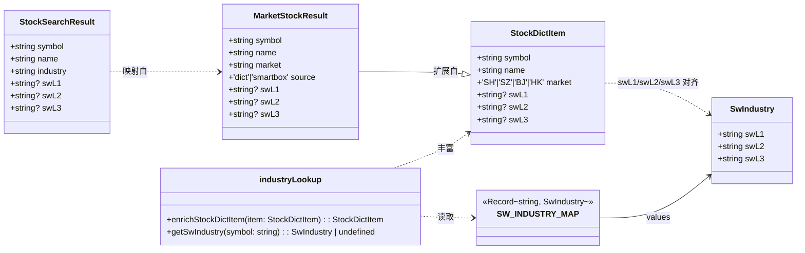
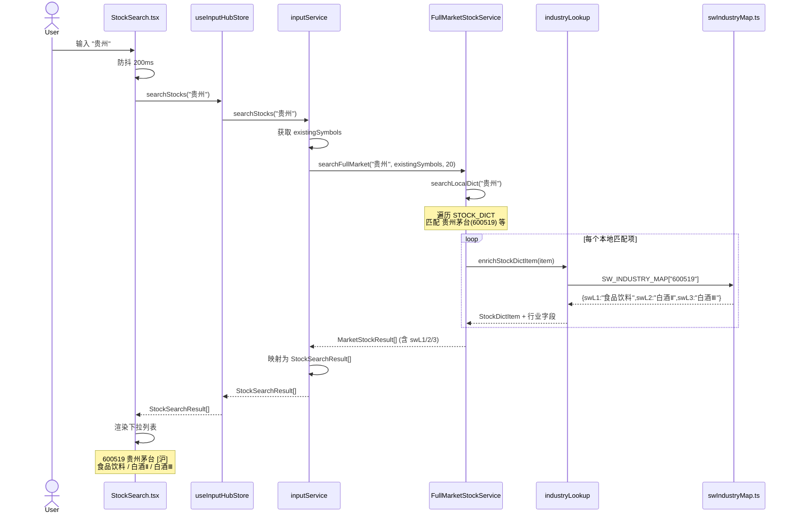
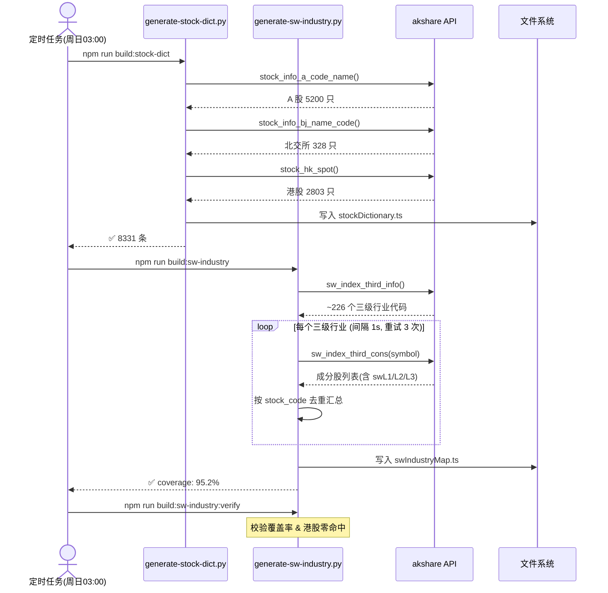
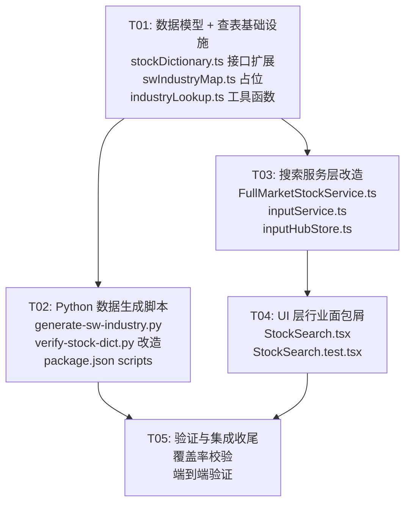

covers_code:
  - src/services/stock/swIndustryMap.ts
  - src/services/stock/industryLookup.ts
  - src/services/stock/stockDictionary.ts
  - src/services/input/inputService.ts
  - src/components/organisms/input/StockSearch.test.tsx
  - src/store/inputHubStore.ts


# 申万宏源 3 级行业分类 — 系统设计文档

> **项目**：FinSightV9 | **架构师**：Bob | **日期**：2025-07

---

## Part A：系统设计

### 1. 实现方案

#### 1.1 核心挑战

| 挑战 | 分析 |
|------|------|
| **数据量** | ~5000 只 A 股，每只挂 3 个行业字段 → 字典文件增加 ~360KB |
| **耦合控制** | 行业数据与基础字典耦合太紧会导致单文件过大、更新不便 |
| **港股兼容** | 港股无申万行业分类，需优雅处理 `undefined`（不污染 UI） |
| **搜索性能** | 行业表查表不能拖慢现有 `<1ms` 本地搜索 |
| **akshare API 稳定性** | `sw_index_third_cons(symbol)` 需逐只遍历 ~226 个三级行业，接口可能超时/限流 |

#### 1.2 架构策略：**增量改造 + 关注点分离**

```
┌─────────────────────────────────────────────────┐
│  stockDictionary.ts（不变）                        │
│  ┌───────────────────────────────────────────┐   │
│  │ StockDictItem { symbol, name, market,      │   │
│  │   swL1?, swL2?, swL3? }  ← 类型扩展       │   │
│  │ CHUNK_0..CHUNK_N (不变)                    │   │
│  └───────────────────────────────────────────┘   │
└─────────────────────────────────────────────────┘
         │                              │
         │ 类型定义                      │ 数据源（独立文件）
         ▼                              ▼
┌─────────────────────┐    ┌──────────────────────────┐
│ industryLookup.ts    │◄───│ swIndustryMap.ts（新增）  │
│ enrichStockDictItem()│    │ SW_INDUSTRY_MAP:          │
│ getIndustry()        │    │   Record<symbol,          │
└─────────┬───────────┘    │     {swL1,swL2,swL3}>     │
          │                └──────────────────────────┘
          ▼                         ▲
┌─────────────────────┐             │ 生成
│ FullMarketStockSvc  │             │
│ searchLocalDict()   │    ┌───────┴──────────────┐
│   → enrich with     │    │ generate-stock-dict  │
│     industry data   │    │   .py（改造）         │
└─────────┬───────────┘    │ + fetch_sw_industry()│
          │                └──────────────────────┘
          ▼
┌─────────────────────┐
│ inputService.ts      │
│ StockSearchResult    │
│   + swL1/swL2/swL3  │
└─────────┬───────────┘
          ▼
┌─────────────────────┐
│ StockSearch.tsx      │
│ 市场标签 + 行业面包屑 │
└─────────────────────┘
```

**关键决策**：
- `swIndustryMap.ts` 与 `stockDictionary.ts` **物理分离**（P1），两文件独立生成，避免字典文件膨胀
- `StockDictItem` 类型上扩展可选字段（P0），但运行时通过 `enrichStockDictItem()` 按需合并
- 港股不在 `SW_INDUSTRY_MAP` 中出现，`enrichStockDictItem()` 对未命中返回 `undefined`
- 搜索性能：`SW_INDUSTRY_MAP` 为 `Record<string, ...>`，O(1) 查表，不影响搜索速度

#### 1.3 框架选型

| 层面 | 选型 | 理由 |
|------|------|------|
| 数据抓取 | `akshare`（已有依赖） | `sw_index_third_info()` + `sw_index_third_cons()` 提供完整申万行业分类 |
| 重试机制 | `tenacity`（新增） | Python 重试库，比手写 while 循环更可靠 |
| 进度条 | `tqdm`（新增） | 226+ 次网络请求需要进度反馈 |
| 前端查表 | 原生 `Record` / `Map` | 无额外依赖，类型安全，O(1) 查询 |

---

### 2. 文件列表

#### 2.1 新增文件

| # | 路径 | 用途 |
|---|------|------|
| 1 | `src/services/stock/swIndustryMap.ts` | 申万行业映射表（自动生成），导出 `SW_INDUSTRY_MAP: Record<string, SwIndustry>` |
| 2 | `src/services/stock/industryLookup.ts` | 行业查表工具函数：`enrichStockDictItem()` / `getSwIndustry()` |
| 3 | `scripts/generate-sw-industry.py` | **新脚本**：独立生成 `swIndustryMap.ts`（从 akshare 抓取申万行业分类） |

#### 2.2 修改文件

| # | 路径 | 变更点 |
|---|------|--------|
| 4 | `src/services/stock/stockDictionary.ts` | `StockDictItem` 接口新增 `swL1?/swL2?/swL3?` |
| 5 | `src/services/stock/FullMarketStockService.ts` | `MarketStockResult` 新增行业字段；`searchLocalDict()` 调用 `enrichStockDictItem()` |
| 6 | `src/services/input/inputService.ts` | `StockSearchResult` 新增 `swL1?/swL2?/swL3?`；`searchStocks()` 传递行业数据 |
| 7 | `src/components/organisms/input/StockSearch.tsx` | 下拉项渲染行业面包屑（12px 灰色小字） |
| 8 | `src/components/organisms/input/StockSearch.test.tsx` | 测试数据扩展行业字段，新增行业面包屑渲染断言 |
| 9 | `scripts/verify-stock-dict.py` | 新增申万覆盖率校验（A 股命中率、港股零命中断言） |
| 10 | `package.json` | 新增 `build:sw-industry` / `build:sw-industry:verify` 脚本 |

---

### 3. 数据结构和接口

#### 3.1 类图



#### 3.2 接口变更详情

```typescript
// === stockDictionary.ts ===
// 变更：接口新增 3 个可选字段
export interface StockDictItem {
  symbol: string
  name: string
  market: 'SH' | 'SZ' | 'BJ' | 'HK'
  swL1?: string  // NEW：申万一级行业（如"食品饮料"）
  swL2?: string  // NEW：申万二级行业（如"白酒Ⅱ"）
  swL3?: string  // NEW：申万三级行业（如"白酒Ⅲ"）
}

// === swIndustryMap.ts（新文件，自动生成）===
export interface SwIndustry {
  swL1: string
  swL2: string
  swL3: string
}
export const SW_INDUSTRY_MAP: Record<string, SwIndustry> = { /* ... */ }

// === industryLookup.ts（新文件）===
export function getSwIndustry(symbol: string): SwIndustry | undefined
export function enrichStockDictItem(item: StockDictItem): StockDictItem

// === FullMarketStockService.ts ===
export interface MarketStockResult {
  symbol: string
  name: string
  market: string
  source: 'dict' | 'smartbox'
  swL1?: string  // NEW
  swL2?: string  // NEW
  swL3?: string  // NEW
}

// === inputService.ts ===
export interface StockSearchResult {
  symbol: string
  name: string
  industry: string     // 保持不变：继续存 market 代码（SH/SZ/HK/BJ）
  swL1?: string        // NEW
  swL2?: string        // NEW
  swL3?: string        // NEW
}
```

---

### 4. 程序调用流程

#### 4.1 搜索并展示行业（核心流程）



#### 4.2 数据生成流程（Python 脚本）



---

### 5. 待明确事项（对 PRD 待确认问题的建议）

| # | 问题 | 建议答案 | 理由 |
|---|------|----------|------|
| 1 | 港股后续是否用恒生行业分类？ | **本期不做**。`swL1/2/3` 对 HK 统一 `undefined`，UI 安全回退。预留扩展点：将来可新增 `hsiL1/2/3` 字段 | 最小变更原则，港股 2803 只的恒生分类是独立需求 |
| 2 | P2-1 行业筛选：关键词匹配 or 级联面板？ | **关键词匹配**。在现有搜索框内输入"白酒"，匹配到搜索词的股票结果中附带行业信息即满足需求；级联面板是独立组件，改动量大 | 关键词匹配只需在 `searchLocalDict` 中新增行业字段匹配分支，改动 ~10 行 |
| 3 | 未覆盖 A 股留空还是标记"未分类"？ | **留空（`undefined`）**。`undefined` 语义更准确（未获取≠已确认无分类），UI 不回退显示空即可 | 与港股 `undefined` 处理一致，代码统一 |
| 4 | 行业关键词搜索是否影响现有排序？ | **不影响**。行业匹配结果追加到现有排序末尾（优先级低于名称模糊包含），不加权重排 | 以代码/名称搜索为主，行业为辅 |
| 5 | 字典增加 ~360KB 是否可接受？ | **可接受**，且通过独立文件 `swIndustryMap.ts` 解耦后，主字典 `stockDictionary.ts` 不变 | 独立文件可单独缓存、按需懒加载 |

---

## Part B：任务分解

### 6. 所需依赖包

#### 6.1 Python 依赖（新增）

```
- akshare>=1.15.0         已有依赖，用于 sw_index_third_info / sw_index_third_cons
- tenacity>=8.0.0         新增：HTTP 重试库（指数退避，最多 3 次）
- tqdm>=4.66.0            新增：终端进度条（遍历 226 个行业时展示进度）
```

> 安装命令：`pip install tenacity tqdm`（akshare 已有）

#### 6.2 Node.js 依赖

无新增。前端仅使用原生 `Record` 查表。

---

### 7. 任务列表（按依赖顺序）

#### T01 — 数据模型扩展 + 查表基础设施

- **Task ID**：T01
- **Source Files**：
  - `src/services/stock/stockDictionary.ts`（修改：`StockDictItem` 接口新增 `swL1?/swL2?/swL3?`）
  - `src/services/stock/swIndustryMap.ts`（**新增**：`SwIndustry` 接口 + `SW_INDUSTRY_MAP` 占位导出，初始为空 Record）
  - `src/services/stock/industryLookup.ts`（**新增**：`getSwIndustry()` / `enrichStockDictItem()` 工具函数）
- **Dependencies**：无
- **Priority**：P0

#### T02 — Python 数据生成脚本

- **Task ID**：T02
- **Source Files**：
  - `scripts/generate-sw-industry.py`（**新增**：从 akshare 抓取申万行业分类，生成 `swIndustryMap.ts`）
  - `scripts/verify-stock-dict.py`（修改：新增申万覆盖率校验）
  - `package.json`（修改：新增 `build:sw-industry` / `build:sw-industry:verify` npm scripts）
- **Dependencies**：T01（需 `swIndustryMap.ts` 的类型接口已定义，保证生成的目标格式一致）
- **Priority**：P0

#### T03 — 搜索服务层改造

- **Task ID**：T03
- **Source Files**：
  - `src/services/stock/FullMarketStockService.ts`（修改：`MarketStockResult` 新增 `swL1?/swL2?/swL3?`；`searchLocalDict()` 内调用 `enrichStockDictItem()`）
  - `src/services/input/inputService.ts`（修改：`StockSearchResult` 新增 `swL1?/swL2?/swL3?`；`searchStocks()` 传递行业字段）
  - `src/store/inputHubStore.ts`（修改：`searchStocks` 返回类型已通过 inputService 变更自动传播，无额外改动；确认类型兼容）
- **Dependencies**：T01（依赖 `enrichStockDictItem` 和扩展后的 `StockDictItem` 类型）
- **Priority**：P0

#### T04 — UI 层：搜索下拉展示行业面包屑

- **Task ID**：T04
- **Source Files**：
  - `src/components/organisms/input/StockSearch.tsx`（修改：每个下拉选项新增行业面包屑行，12px 灰色小字，`swL1 / swL2 / swL3` 用 `/` 分隔；未命中时不显示）
  - `src/components/organisms/input/StockSearch.test.tsx`（修改：mock 数据扩展 `swL1/swL2/swL3` 字段；新增行业面包屑渲染断言；新增港股 undefined 回退断言）
- **Dependencies**：T03（依赖 `StockSearchResult` 已含行业字段）
- **Priority**：P0

#### T05 — 验证、覆盖率与集成收尾

- **Task ID**：T05
- **Source Files**：
  - `scripts/verify-stock-dict.py`（修改：新增 A 股申万覆盖率统计，断言覆盖率 ≥ 90%；断言港股行业字段全部为空）
  - `scripts/generate-sw-industry.py`（完善：补充覆盖率统计输出、异常处理、日志）
  - `package.json`（验证所有新 scripts 可正常执行）
  - `src/services/stock/swIndustryMap.ts`（确认自动生成后的最终版本正确）
- **Dependencies**：T02, T04（等脚本和 UI 都完成后做端到端验证）
- **Priority**：P1

---

### 8. 共享知识

#### 8.1 字段命名规范

```
swL1  → 申万一级行业（如"食品饮料"、"银行"、"医药生物"）
swL2  → 申万二级行业（如"白酒Ⅱ"、"股份制银行Ⅱ"、"中药Ⅱ"）
swL3  → 申万三级行业（如"白酒Ⅲ"、"股份制银行Ⅲ"、"中药Ⅲ"）
```
- 所有字段使用 `sw` 前缀以区分未来可能的其他分类体系（如恒生 `hsi`）
- 均为 `string | undefined`，`undefined` 表示无数据（港股）/ 未覆盖

#### 8.2 回退约定

- **港股**：`swL1/swL2/swL3` 始终为 `undefined`，不在 `SW_INDUSTRY_MAP` 中出现
- **未覆盖 A 股**：同样为 `undefined`
- **UI 回退**：行业字段全 `undefined` → 不渲染行业面包屑行（不等同于显示"未分类"）
- **Smartbox API 回退结果**：`swL1/swL2/swL3` 为 `undefined`（API 不返回行业分类）

#### 8.3 数据生成约定

- `swIndustryMap.ts` 由 `scripts/generate-sw-industry.py` **独立生成**，不与 `stockDictionary.ts` 耦合
- 更新频率：与 `stockDictionary.ts` 同步（每周日 03:00）
- 执行顺序：先 `build:stock-dict`，后 `build:sw-industry`
- 两次执行之间无依赖（可并行，但建议串行避免 akshare 限流）

#### 8.4 类型传播路径

```
StockDictItem.swL1/2/3 → enrichStockDictItem() → MarketStockResult.swL1/2/3 → StockSearchResult.swL1/2/3 → StockSearch 渲染
```
所有中间类型同步新增 `swL1?/swL2?/swL3?`，避免类型断裂。

#### 8.5 API 限流保护

- `sw_index_third_cons(symbol)` 调用间隔 ≥ 1s
- 单次调用失败重试 3 次（指数退避：1s → 2s → 4s）
- 3 次均失败 → 记录 warning 日志，跳过该行业，继续下一个
- 总耗时预估：226 × 1s ≈ 4 分钟（含重试 buffer 约 6-8 分钟）

---

### 9. 任务依赖图



---

## 附录：设计评审检查清单

- [x] 所有新增字段使用可选类型（`?`），向后兼容
- [x] 港股 `undefined` 回退路径完整（数据层 → 服务层 → UI 层）
- [x] 搜索性能不受影响（`Record` O(1) 查表）
- [x] Python 脚本独立可执行，不破坏现有 `build:stock-dict` 流程
- [x] 测试文件同步更新
- [x] 门禁（12 道）兼容：仅修改现有层内文件，不引入跨层依赖
